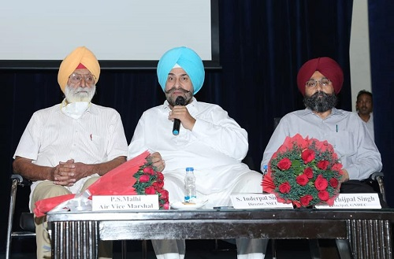
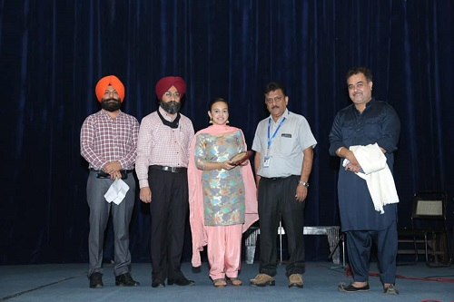

# Department of Applied Science  

## Message from HoD's Desk

Department of Applied Science is a multidisciplinary department and it is functioning with a team of dedicated faculty members who have been actively engaged in imparting quality teaching of the courses in basic science and humanities for graduating engineering students. The core courses offered being Physics, Chemistry, Mathematics, English and Principles of Engineering Economics and Management. Apart from these undergraduate courses, the department is also pursuing research activities in the above-mentioned disciplines. Currently the department is having research scholars in various subjects. The department of Science & Humanities welcomes committed minds to join hands to build a strong dynamic and wholesome department. It is an endeavor of this department so that students find application of science to everyday life, moral and social understanding. At present subjects like Chemistry, English, Mathematics, Physics,Principles of Engineering Economics and Management etc. are engaged by the department.
 

Dr. Harpreet Kaur Grewal

HOD, Applied Science Department
## Department at a Glimpse

 

 This department was established in the year 1957, whose role is to deliver excellent quality education in the field of Applied Sciences for the future technocrats of all engineering streams. The department also endeavours to inculcate the scientific temper and the spirit of inquest in students. It inspires the students to realize and therefore apply the physical laws to the growth and development of their fields of study. We intensely think that an educational programme should be able to stimulate the development of a balanced and harmonious personality of the students. Hence, the educational program of GNDEC has been customised -to suit such necessities.
 

### AIM

The Department of Applied Sciences targets to provide a robust foundation in the basic science subjects of Engineering Mathematics, Physics, Chemistry and Professional English. We emerge as an International level Institute in producing and propagating knowledge, and providing students an exceptional learning experience in the discipline of science and technology that will best serve the world and advancement of mankind.

### MISSION

The task of the Applied Sciences Department is to succeed, sustain and foster unsurpassed excellence in technical education. We chase continuous progress of infrastructure and boost state-of-the art capacities to offer our students a technologically up-to-date and knowledgeably stimulating environment of learning and guarantee high quality content by qualified faculty members who establishes the marks of excellence in their every endeavour.

### VISION

 Applied Sciences Department envisages as an academic staff developer for the Technical Education. We impart high levels of discipline in students and endeavour to set international standards, preparing our students technologically superior, who as a result shall contribute to the progression of society and mankind.

### FACILITIES & LABORATORIES

#### Infrastructure

Nearly every topic taught during lectures has a related laboratory experiment. All Laboratories are completely equipped to conduct the practical and experiments as per the syllabus of the I.K. Gujral Punjab Technical University. The department pays huge attention to its laboratories & equipment and obtains modern equipments whenever essential. The labs provide abundant practical experience and facilitate the students with applications of their theoretical learning.

#### Chemistry Laboratory

#### Physics Laboratory

#### Communication Skills Laboratory

## Glimpses of Induction Program for B.Tech 1st Year Students

Two week Student Induction Program was organised in GNDEC for B.Tech 1st year students of 2021 batch. The  incharge of this event was Dr. K S Maan from Deptt of IT and Dr. Amanpreet Kaur Sodhi from deptt of Applied Science. The Event started on 19 Oct 2021. Retd Air vice marshal PS Malhi (an alumni) Mr. Gurbhajan Gill famous punjabi poet, Dr. S B Singh Retd. Principal, Director NSET, Principal Dr. Sehijpal singh graced the inaugration.  During this program an industrial visit was organised for different branches. Alumni interaction took place where students talked to the alumni about different doubts in their mind. Mr. Nagi gave them exposure of caligraphy writing. S. Janmeja Singh Johl an environmentalist made them realise their responsibility towards the environment. Detailed information about academic and extracurricular activities was given by concerned Deans and incharges. A college tour was given to the students. Mr sudhir dua a motivational speaker talked about,
how to customise the employability skills. The students were entertained by the famous singer inderjit nikku and music Director Tejwant kittu's team on the concluding day. Dr. Sehijpal singh principal blessed the students and wished them all the best for their future.  

## Faculty Achievements  
- **Dr. D.S.Pathania** authored a book chapter entitled "*Interactions due to inclined loads in a microstretch thermoelestic medium with mass diffusion*", published by an International Publishing House, UK.
- **Karan Bhalla** qualified 12 Weeks NPTEL Course “Organic Chemistry in Biology and Drug Development” with % and 3 Credits along with Elite and equivalent to 1.5 FDP through SWAYAM Platform from IIT Guwahati in 2021 session.
- **Puneet Narang** delivered expert lecture on "Empathetic communication vis-a-vis adoption of Learner Centred Approach", in AICTE sponsored FDP on "Innovative Pedagogical Methodologies and Tools for Effective learning in Engineering Education", organised by Department of Business Administration, GNDEC, Ludhiana
- **Karan Bhalla** received Certificate of Excellence for excellent Performance in Novel Exploration in Research Writing organized by Chemistry Dept., PSNA College of Engineering and Technology, Dindigul.
- **Sukhminder Singh** topped 4 Weeks Course on "PARTIAL DIFFERENTIAL EQUATIONS FOR ENGINEERS: SOLUTION BY  SEPARATION OF VARIABLES" With a Consolidated Score of 91% (JAN-FEB 2021) organized by SWAYAM-NPTEL.
- **Karan Bhalla** topped 8 Weeks NPTEL Course “Metals in Biology” with 91% and
2 Credits along with Elite and Gold Medal equivalent to 1 FDP through SWAYAM Platform from IIT Bombay in 2021 session.
- **Sukhminder Singh** topped 12 Weeks course on "Ordinary and Partial Differential equations and applications" with a consolidated score of 86% (Jan-April 2021) organised by SWAYAM-NPTEL.
- **Karan Bhalla** topped 4 Weeks NPTEL Course “Bioinorganic Chemistry” with 96% and 1 Credits along with Elite and Gold Medal equivalent to 0.5 FDP through SWAYAM Platform from IIT Kanpur in 2021 session.
- **Sukhminder Singh** topped 8 Weeks course on "Numerical methods" with a consolidated score of 88% (Aug-Oct 2021) organised by SWAYAM-NPTEL.
- **Rajbir Kaur** completed NPTEL online certificate course on Engineering Mathematics-I, organised by IIT Kharagpur, July 2020-December 2020.
- **Karan Bhalla** received Certificate of Appreciation from Institute of Science & Technology for Advanced Studies and Research (ISTAR), Indira Gandhi National Open University (IGNOU), SRM Institute of Science and Technology, Chennai, National Youth Council of India and Regional Coordinating Institute (RCI), Odisha in association with Unnat Bharat Abhiyan.
- **Rajbir Kaur** completed NPTEL online certificate course on Laplace Transform, organised by Institute of Mathematical Sciences, Chennai, July 2020- December 2020.
- **Karan Bhalla** received Certificate of Merit and Gold Medal from Gyansampada-A Knowledge Quest 2020 from Hulahul Foundation, Mumbai.
- **Karan Bhalla** received Certificate of Merit from NIT Rourkela in association with Unnat Bharat Abhiyan, RCI Odisha and Genesys.

## Publications/Paper Presentation

- **Dr. D.S. Pathania** published Research paper on “Replenish model of deteriorating items with price dependent demand and complete backlogging in two storage facilities under the effect of inflation,” Malaya .J. of Mathematik,vol9,1, 2021,26-32 ISSN 2319-3686(UGC Approved)
- **Dr. Amanpreet Kaur Sodhi** published Research paper Effect of Integrating industrial and agricultural wastes on concrete performance with and without microbial activity is published in SCI journal - "Environmental science and pollution Research
- **Karan Bhalla** published Research Paper titled “Heterocyclyl linked phenyl containing Thiazolidinediones and its Cyclic analogs as potential novel Antidiabetic agents” published in Journal Further Science, India.
- **Dr. D.S. Pathania** published a research paper “Thermal creep stress analysis of functionally graded spherical shell under internal and external Pressure” Structural integrity and life (Scopus) G.Verma,Vol, 20, No.3,2021
- **Karan Bhalla** delivered Research Paper Oral Presentation entitled “Synthesis and Characterization of Imidazolium Monomeric Surfactants and to study the effects of additives on their properties” on 24th and 25th June 2021 at International Conference on Modern Functional Materials organized by Sri Sai Ram Engineering College, Chennai and Abstract accepted in Proceedings of Conference
- **Dr. D.S.Pathania** presented a paper Laser pulse in microstretch thermoelastic medium having thermomechanicak medium, in microstretch thermoelastic medium having thermo mechanical interaction Int. Conference at Taj institute of higher education Afghanistan on 19/8/2021.
- **Dr. Gagandeep Kaur** presented Paper titled “Intuitionistic L-Fuzzy Essential and Closed submodules in online  7th IFSCOM2021 in Turkey, may 25-29,2021.
- **Dr. D.S.Pathania** presented a paper under aerodynamic coupling a problem of slender beam 27th international conference, Recent Advances in Solid Mechanics and Seismology of international academy of physical sciences (CONIAPSXXVII) Oct 26-28 2021, Kurukshetra University, Kurukshetra)

## Events Attended (FDPs/STTPs/Conferences/STCs/SDTs/Workshops/PDTP/EDP/Webinars/E-Talks/Seminars etc.)  

| Sr. No. | Name of Faculty     | Name of Event                                                                                                                   | Duration          | Date(s)                         | Organizing Institute                                                                                                                |
|:--------|:--------------------|:--------------------------------------------------------------------------------------------------------------------------------|:------------------|:--------------------------------|:------------------------------------------------------------------------------------------------------------------------------------|
| 1       | Dr. D.S.Pathania     | STP on "ICT initiative in technical education”                                                                                  | 1 Week            | 8-13 Feb 2021             | GNDEC Ludhiana                                                                                                                         |
| 2       | Dr. D.S.Pathania    | Workshop on recent trends in research methodology                                                                         | 1 Week            | 11 Oct to 15 Oct 2021                | Krishanagiri, Tamilnadu, India                                                                                                         |
| 3       | Dr. D.S.Pathania    | 6th INTERNATIONAL CONGRESS ON INNOVATIVE SCIENTIFIC APPROACHES                                                                         | 1 Day            | 19 Dec 2021               | ZIRRAT (TURKEY)                                                                                 |
| 4       | Dr. D.S.Pathania    | International conference (RAFAS2021)                                                                                    | 2 Days    | June 25-26, 2021                  | Lovely Professional university, Punjab                                                                                                          |
| 5       | Dr. D.S.Pathania    | 27th international conference, Recent Advances in Solid Mechanics and Seismology of international academy of physical sciences (CONIAPSXXVII)                                                                           | 3 Days | Oct 26-28 2021                  | Kurukshetra university, Kurukshetra                                                                                                                  |
| 6       | Dr. Gagandeep Kaur    | E-Workshop on Advance Review Techniques with Special Emphasis on Quality Publications                                                                                      | 7 Days             | July 5-11 ,2021                    | PCTE, Ludhiana in association for Research and Advanced Studies                                                                                       |
| 7       | Karan Bhalla    | AICTE Training and Learning (ATAL) Academy Online FDP on “Waste Technology”                                                                                   | 5 Days             | 18th to 22nd January 2021       | National Institute of Technology, Durgapur                                                                                                           |
| 8       | Karan Bhalla    | AICTE Training and Learning (ATAL) Academy Online FDP on “Energy Storage”                                                       | 5 Days            | 1st to 5th February 2021    | Gandhi Institute of Engineering and Management                                                                                                  |
| 9       | Karan Bhalla       | AICTE Training and Learning (ATAL) Academy Online FDP on “Alternate fuels”                                                                                                          | 5 Days             | 12th to 16th June 2021                    | Gyan Ganga Institute of Technology and Sciences                                                                                                   |
| 10      | Karan Bhalla       | AICTE Training and Learning (ATAL) Academy Online FDP on “Quantum Computing”                                                                          | 5 Days           | 21st to 25th June 2021           | Government College of Engineering, Sengipatti, Thanjavur                                                                                                            |
| 11      | Karan Bhalla      | AICTE Training and Learning (ATAL) Academy Online FDP on “Drug Engineering”                                         | 1 Week             | 28th June to 2nd July 2021                  | Delhi Institute of Pharmaceutical Sciences and Research, New Delhi                                                                                                                   |
| 12      | Karan Bhalla       | STC on “Journey from Semiconductor Physics to Smart Devices to Intelligent Automation”                                                                          | 5 Days             | 1st to 5th May 2021                  | NIT, Srinagar and Semiconductor Society of India                                                                                                        |
| 13      | Karan Bhalla       | TEQIP-III Sponsored FDP on “ICT Initiatives in Technical Education”                                                                                      | 1 Week             | 8th to 13th February 2021    | SWAYAM-NPTEL Local Chapter, GNDEC, Ludhiana                                                                                                   |
| 14      | Karan Bhalla       | National FDP on “Research Methodology”                                                                                       | 1 Week             | 26th April to 1st May 2021         | Amar Sewa Mandal’s Kamla Nehru Mahavidyalaya, Nagpur                                                                                 |
| 15      | Karan Bhalla       | National FDP on “E-Contents and ICT Tools for Innovative Teaching & Learning”                                                                                                      | 1 Week           | 1st to 7th May 2021   | Roorkee College of Management & Computer Applications, Roorkee                                                                                                          |
| 16      | Karan Bhalla       | FDP on “Accelerating Innovations in Material Science- Surface Characterization”                                                                                                           | 5 Days             | 18th to 22nd May 2021          | Dept. of Chemistry, BMS Institute of Technology & Management, Bengaluru                                                                                                 |
| 17      | Karan Bhalla       | AICTE Sponsored FDP on “Design of Nanoelectronics and Nanophotonic Devices using Advanced Software Tools”                                                                         | 14 Days            | 10th May to 22nd May 2021                | ECE Dept., GITA Autonomous College, Odisha                                                                                         |
| 18      | Karan Bhalla       | FDP on “Materials for Energy and Biomedical Applications”            |  1 Week  | 31st May to 4th June 2021   |   GMR Institute of Technology, Rajam                                                                                                      |
| 19      | Karan Bhalla       | FDP on “Nanomaterials- Technologies for Energy & Sensor Applications”                                                                                                | 1 Week          | 7th to 11th June 2021                | Chemistry Division, GMR Institute of Technology, Andhra Pradesh                                                                                                                         |
| 20      | Karan Bhalla       | National FDP on “ICT Tools for Effective Teaching Learning”                                                                    | 3 Days             | 8th to 10th June 2021           | IQAC, Kamla Nehru Mahavidyalaya, Nagpur                                                                                                          |
| 21      | Karan Bhalla       | FDP on “Advance Thermal Energy System”                                                                                                  | 5 Days             | 21st to 25th June 2021      | ME Dept., Bharath Institute of Higher Education and Research                                                                                                       |
| 22      | Karan Bhalla       | FDP on “Outcome Based Education”                                                                                                  | 1 Week             | 21st to 25th June 2021   | ECE and CSE Dept., Kallam Haranadhareddy Institute of Technology, AP in collaboration with Computer Society of India, Vijayawada Chapter                                                                                               |
| 23      | Karan Bhalla       | FDP on “Digital Tools for Active Teaching Evaluation and Research”                                                                                              | 3 Days             | 28th to 30th June 2021    | Dept. of Chemistry, Sri GVG Visalakshi College, TamilNadu                                                                                         |
| 24      | Karan Bhalla       | International FDP on “Emerging Trends in Science & Technology”                                                                        | 5 Days            | 1st to 6th July 2021                | Easwari Engineering College, Ramapuram                                                                                                                     |
| 25      | Karan Bhalla       | FDP on “Modern Industrial Technology in Mechanical Engineering”                                                                                   | 1 Week     | 2nd to 8th July 2021          | Aditya Engineering College, AP                                                                                                                   |
| 26      | Karan Bhalla       | FDP on “Novel Nanomaterials-based Flexible and Wearable Devices for Healthcare Applications”                                                                          | 5 Days    | 5th to 9th July 2021               | Centre for Healthcare Advancement, Innovation and Research, Vellore Institute of Technology, Chennai                                                                                                                  |
| 27      | Karan Bhalla       | International FDP on “Research Methodologies- Application of Statistical Tools for Decision Making”                                                                                                | 1 Day    | 12th July 2021            | PG  and Research Dept., Marudhar Kesari Jain College, Vaniyambadi                                                                                                                |
| 28      | Karan Bhalla       | International FDP on “Recent Trends in Power Electronics, Controllers and Power Systems”                           | 5 days            | 19th to 23rd July 2021          | GMR Institute of Technology, Rajam                                                                                    |
| 29      | Karan Bhalla      | FDP on “Cyber Security in Digital Era”                                                    | 1 Week            | 23rd to 27th August 2021          | Dept. of CSE, Baba Ghulam Shah Badshah University, Jammu & Kashmir                                         |
| 30      | Karan Bhalla    | FDP on “Innovations in Energy and Applied Chemistry”                                                              | One Week          |23rd to 28th August 2021        | Dept. of Chemistry, Nehru Institute of Technology, Coimbatore                                                                                                        |
| 31      | Karan Bhalla    | FDP on “Recent Trends in Nanotechnology & Signal Processing”                                                                                         | 1 Week            | 23rd to 29th August 2021  | Dept. of ECE, GMR Institute of Technology, AP                                                                                                              |
| 32      | Karan Bhalla    | FDP on “Advances in ANALYTICAL Techniques”                                                                                       | 6 Days          | 30th August to 6th September 2021       | Dept. of Chemistry, SRM Institute of Science & Technology, Chennai                                                                                                      |
| 33      | Karan Bhalla    | FDP on “Emerging Research Trends in Applied Science & Technology”                                                                         | 6 Days            | 21st to 27th September 2021                | Dept. of Science and Humanities & Centre for Material Research, Nehru Institute of Technology, Coimbatore                                                                                                     |
| 34      | Karan Bhalla    | AICTE Sponsored Quality Improvement Programme (QIP) STC on “5 R’s for Sustainable Waste Plastics Management : Fundamentals and Technical Advance”                                                                  | 5 Days            | 22nd to 26th February 2021     | Dept. of Chemical Engg. and Biotechnology, IIT Roorkee                                                            |
| 35      | Karan Bhalla    | AICTE sponsored STTP on “Emerging Trends in Nanomaterials for Electronic and Optoelectronic Devices (Series-I: Fabrication and Characterization of Nanoelectronic Devices)”                                            | 6 Days             | 10th to 15th May 2021    | ECE Dept., Swarnandhra College of Engg. and Technology, Kakinada                                                       |
| 36      | Karan Bhalla    | AICTE sponsored STTP on “Machine Learning on Recent Trends and Applications Phase - I”                                                                                      | 6 Days             | 10th to 15th May 2021      | ECE Dept., Srinivasa Ramanujan Institute of Technology, Andhra Pradesh                                                                                                            |
| 37      | Karan Bhalla    | AICTE sponsored STTP on “Emerging Trends in Nanomaterials for Electronic and Optoelectronic Devices (Series-II: Fabrication and Characterization of Nanoelectronic Devices)”                                                                       | 1 Week             | 17th to 22nd May 2021                   | ECE Dept., Swarnandhra College of Engg. and Technology, Kakinada                                                                                                      |
| 38      | Karan Bhalla    | AICTE sponsored STTP on “Machine Learning on Recent Trends and Applications Phase - II”                                                                                  | 1 Week             | 24th to 29th May 2021                    | ECE Dept., Srinivasa Ramanujan Institute of Technology, Andhra Pradesh                                                                                                                          |
| 39      | Karan Bhalla    | AICTE sponsored STTP on “Enhancing Emotional Intelligence in Academicians to Connect with Next Generation Students”                                                                                                        | 1 Week             | 24th to 29th May 2021               | Jagannath International Management School, New Delhi                                                                                                                              |
| 40      | Karan Bhalla    | AICTE sponsored STTP on “Machine Learning on Recent Trends and Applications Phase - III”                     | 1 Week             | 7th to 12th June 2021   | ECE Dept.,Srinivasa Ramanujan Institute of Technology, Andhra Pradesh                                                          |
| 41      | Karan Bhalla    | AICTE sponsored STTP on “Machine Learning on Recent Trends and Applications Phase - IV”                                                                                                           | 1 Week             | 21st to 26th June 2021  | IPR Cell, ECE Dept., Srinivasa Ramanujan Institute of Technology, Andhra Pradesh                                                                                                            |
| 42      | Karan Bhalla    | Workshop on “Science & Technology of Emerging Materials (eStem-21)”                                                                                        | 3 Days           | 19th to 21st April 2021     |  organized by Chettinad College of Engg. & Technology, Tamil Nadu|
| 43      | Karan Bhalla    | GASS National Research Workshop on “How to Write and Publish”                                                                                               | 2 days            | 6th and 7th May 2021              | Truba Group of Institutes affiliated to Barkatullah University in collaboration with Global Association of Social Sciences                                                                                                  |
| 44      | Karan Bhalla    | Workshop on “Intellectual Property Rights and Patent Filing System in India”                                                                                          | 1 Day            |11th June 2021         | Rajiv Gandhi Proudyogiki Vishwavidyalaya, Bhopal                                          |
| 45      | Karan Bhalla    | Workshop on “Robotics and Medical Automation”                                                                                                 | 1 Day            | 18th June 2021  | Dept. of Mechatronics, Bharath Institute of Higher Education and Research, Chennai  |
| 46      | Karan Bhalla    | Workshop on “Academic Research: Multiple Perspectives”                                          | 1 Day           | 30th June 2021       | Vellore Institute of Technology, Chennai                                                                                                               |
| 47      | Karan Bhalla    |  National Workshop on “Chemistry Orientation for UG and PG Students”                                                                                                      | 3 Days           | 16th to 18th July 2021            | Association of Chemistry, Govt. General Degree College, Singur in association with Rani Rashmoni Green University                                                  |
| 48      | Karan Bhalla    | Workshop on “Scanning Electron Microscopy”                                                                     | 1 Day           | 16th July 2021 | Centre for Healthcare Advancement, Innovation and Research, Vellore Institute of Technology, Chennai                                                                       |
| 49      | Karan Bhalla    | International Workshop on “Emerging Trends in field of Science & Technology”                                                                         | 2 Weeks            | 16th to 28th August 2021               | Dept. of Physics, Sathyabama Institute of Science & Technology, Chennai                                                       |
| 50      | Karan Bhalla    | Workshop on “How to Conduct Student Induction Program (SIP)”                                                                                                                 | 1 Day           | 20th September 2021          | All India Council for Technical Education                  |
| 51      | Karan Bhalla      | Workshop on “NAAC Recent Updates and best practices”                                                                                   | 1 Day           | 6th Oct 2021    | National Education Empowerment Teacher’s Initiative(NEETI), MasterSoft                                                                                                                    |
| 52      | Karan Bhalla      | National Conference on “Advances in Physical Science and Materials”                                                                                                          | 1 Day             | 11th May 2021  | PG Dept. of Physics, DAV College, Dasuya, Punjab                                                                                                                     |
| 53      | Karan Bhalla      | 2- 2nd Indo-Korean Virtual Conference on “Development of Advanced Materials for Future Technologies”                                                                             | 2 Days            | 14th and 15th May 2021  | KAIST, Daejeon, South Korea & Vellore Institute of Technology, Chennai, India                                                                                                       |
| 54      | Karan Bhalla      | International Conference on “Smart Materials: Applications to Devices – 2021”                                                                                      | 2 Days             | 17th and 18th May 2021                   | Dept. of Physics, Kamla Nehru Mahavidyalaya, Nagpur                                                                                                   |
| 55      | Karan Bhalla      | International Conference on “Modern Functional Materials”                                                                            | 2 Days            | 24th and 25th June 2021| Sri Sai Ram Engineering College, Chennai                                                                     |
| 56      | Karan Bhalla      | International E-Conference on “Recent Advances in Chemical, Physical and Biological Sciences”                                                                               | 2 Days             | 29th and 30th June 2021  | Dept. of Chemistry, Nabira Mahavidyalaya, Katol and Association of Chemistry Teachers (ACT), C/o Homi Bhabha Centre for Science  Education (TIFR), Mumbai                                                                                            |
| 57      | Karan Bhalla      | National Conference on “Innovation in Science and Technology”                                                                                                    | 2 Days             | 8th and 9th July 2021  | Sri Venkateswara College of Engineering and Technology, Andhra Pradesh                                                                                                                      |
| 58      | Karan Bhalla      | National Virtual Conference on “Recent Trends in Energy Materials”                                                                            | 2 Days             | 14th and 15th July 2021      | Dept. of Physics, Arumugam Pillai Seethai Ammal College, Tamil Nadu                                                                                                   |
| 59      | Karan Bhalla      | AICTE Sponsored 2nd International Conference on “Energy, Environment and Advanced Materials for Sustainable Future”                                                                         | 2 Days            | 15th and 16th July 2021   | Dept. of Physics and Chemistry, Kongu Engineering College, Erode                                                                                                                |
| 60      | Karan Bhalla    | International Conference on “Current Trends in Material Science & Technology”                                                                         | 1 Day            | 26th July 2021      | Dept. of Science & Humanities, Nehru Institute of Technology, Coimbatore                                                                                                                 |
| 61      | Karan Bhalla    | International Conference on “Multifuctional Advanced Materials”                                                                                      | 2 Days             | 9th and 10th August 2021                  | Dept. of Chemistry, JVM Degree College, Mumbai in collaboration with Association of Chemistry Teachers                                                                                                     |
| 62      | Karan Bhalla    | International Conference on “Management of Coastal Ecosystem in Climate Change era”                                                                                                          | 1 Day             | 21st September 2021      | Dept. of Soil Science & Agricultural Chemistry, Annamalai University, Tamil Nadu                                                                                                                |
| 63      | Karan Bhalla    | International Conference on “Instigating Research in Materials, Energy and Environment(ICIRMEE)”                                                                                    | 2 Days    | 6th and 7th Oct 2021        | Dept. of Chemistry, Eastwari Engineering College, Chennai                                                                                        |
| 64      | Karan Bhalla    | Indo-National Conference on “Recent Advances in Materials Science (NVCRAMS)”                                    | 2 Days            | 7th and 8th Oct 2021 | Dept. of Physics and Chemistry, St. Peter’s Institute of Higher Education and Research, Chennai                                 |
| 65      | Karan Bhalla      | National Seminar on “Classroom-based Action Research”                                                                                              | 2 Days             | 28th and 29th April 2021     | Madura Kamraj University, Madurai                                                                                                     |
| 66      | Karan Bhalla      | National Seminar on “Application of Energy Storage Devices”                                                                                               | 1 Day             | 29th April 2021  | Chemistry Dept., K.S.Rangaswamy College of Technology, Tiruchengode                                                                                                  |
| 67      | Karan Bhalla      | Seminar on “Energy Materials”                                                                                                        | 1 Day           | 4th June 2021                | Centre for Excellence for Energy Research, Centre for Nanoscience and Nanotechnology, Sathyabama Institute of Science & Technology, Chennai                                                                                                          |
| 68      | Karan Bhalla      | National Seminar on “Strengthening Ethics and Values for Sustainable Growth”                                                                                                               | 2 Days            | 17th and 18th August 2021     | Madurai Kamaraj University, Madurai                                                                                                         |
| 69      | Karan Bhalla      | International Seminar on “Frontiers of Advances in Chemistry”                                                                                          | 1 Day             | 28th August 2021      | Dept. of Chemistry, SNS College of Technology, Coimbatore                                                                                            |
| 70      | Karan Bhalla      | Professional Development Training Program on “UGC Norms and Revised Guidelines for Promotion under Career Advancement Scheme (CAS)”                                                                                          | 1 Day            | 12th June 2021     | IQAC, NTVS College of Law, Institute of Legal Education Research, Nandurbar                                                                                                                    |
| 71      | Karan Bhalla      | Entrepreneurship Development Programme                                                                                           | 5 Days            | 28th June to 2nd July 2021                 | Dr.S.Gopalaraju Government College, Anekal in association with Club Inspiring Millions and IQAC                                              |
| 72      | Karan Bhalla      | International Level Training on “Importance and Demand of Cybersecurity”                                                                                             | 1 Day             | 18th July 2021                   | Team 2020 Helpers Organization, West Bengal                                                                                                      |
| 73      | Karan Bhalla      | National E-Awareness Programme on “Wild Life Conservation in India: The Changing Paradigm”                                                                                    | 7 Days             | 2nd to 8th October 2021    | Biotechnology Dept., Govt. Girls P.G.College, Ujjain, M.P                                                                        |
| 74      | Karan Bhalla      | E-Talk on “Nanotechnology – Smart Materials: Research: Commercialization”                                                                                             | 1 Day            | 30th April 2021        | ME Dept., Maharaja Agrasen Institute of Technology, Solan                                                                                                     |
| 75      | Karan Bhalla      | E-Talk on “Towards Environmental Applications from 2D Materials”                                                                        | 1 Day            | 26th May 2021  | Maharaja Agrasen University, Solan                                                                                                                     |
| 76      | Karan  Bhalla        | International Virtual Tech Talk on “Renewable Energy: Next Alternative Source”                                                                                                     | 1 Day           | 15th May 2021               | Renewable Energy Society of India                                                                                                                     |
| 77      | Karan Bhalla        | Online Lecture on “Revisiting the Laws of Thermodynamics”                                                                                      | 1 Day             | 3rd July 2021                          | Indian Association of Physics Teachers, Regional Council (Delhi & Haryana)                                                                                                                    |
| 78      | Karan Bhalla        | Online Lecture on “Hidden Symmetry in Planetary Motion”                | 1 day             | 10th July 2021      | Indian Association of Physics Teachers, Regional Council (Delhi & Haryana)                                                                                                                 |
| 79      | Karan Bhalla        | E-Talk on “Advanced Functional Nanomaterials for Air Pollution Control”                                                            | 1 Day            | 17th July 2021  | Maharaja Agrasen University, Solan                                                                                              |
| 80      | Karan Bhalla        | Memorial Lecture Series on “Basics of Crystallography”                                                                | 1 Day            | 15th July 2021  | KSK Academy and Aaivalayam (A-DIRAC), Coimbatore                                                                                                         |
| 81      | Karan Bhalla        | Online Lecture on “The Mass of Small Things”                                                                                         | 1 Day           | 24th July 2021  | Indian Association of Physics Teachers, Regional Council (Delhi & Haryana)                                                                                                                   |
| 82      | Karan Bhalla        | E-Talk on “Nanotechnology verus nanowaste and their interaction with environment: Global framework and sustainable development”                                                                                        | 1 Day             | 16th August 2021   | Maharaja Agrasen University, Solan, H.P                                                                                    |
| 83      | Karan Bhalla        | E-Talk on “Indium Selenide: A promising 2D material for future Nanotechnology”                                                                                        | 1 Day            | 14th September 2021  | Maharaja Agrasen University, Solan, H.P                                                                     |
| 84      | Karan Bhalla        | International Virtual Tech Talk on “Hydrogen and Fuel Cells: India’s Mission & Economy”                                                                        | 1 Day            | 8th Oct 2021   | Renewable Energy Society of India                                                                                                          |
| 85      | Karan Bhalla        | National Webinar on “Impact of Chemical Science on Environment"                                                                      | 1 Day            | 22nd April 2021  | PG Dept of Chemistry, Gujranwala Guru Nanak Khalsa College, Ludhiana                                                                                                                      |
| 86      | Karan Bhalla        | Webinar on “How Nanoscience and Technology Inspired from Nature and Transforming the World”                                                                                 | 1 Day            | 28th April 2021  |  Dept. of Nautical Science, AMET Deemed to be University                                                                                                                         |
| 87      | Karan Bhalla        | Webinar on “Engineering One Dimensional Nanorod Arrays for Photocatalytic Application”                                                                                    | 1 Day            | 28th April 2021   | Aaivaler Materials Society, Coimbatore                                                                                                                |
| 88      | Karan Bhalla       | International Webinar on “Future Career in Mehatronics and Robotics Engineering”                                                            | 1 Day             | 10th May 2021      | ME Dept., Bharath Institute of Science & Technology                                                                                                                     |
| 89      | Karan Bhalla       | Webinar on “Automotive Suspension Systems”                                                                                                     | 1 Day          | 14th May 2021       | Arasu Engineering College, Tamil Nadu                                                                                                                         |
| 90      | Karan Bhalla       | Webinar on “Nanoscience and Technology: Basics, Applications and Opportunities”                                                                                   | 1 Day          | 20th May 2021                    | Centre of Nanoscience and Genomics, Karunya Institute of Technology and Sciences, Coimbatore                                                                                                                         |
| 91      | Karan Bhalla       | Webinar on “Emerging Facets of Materials Science”                                                                                      | 1 day             | 29th May 2021                      | Dept. of Physics and Chemistry, School of Technology, Pandit Deendayal Energy University, Gandhinagar                                                                                                                     |
| 92      | Karan Bhalla       | Webinar on “Principals and IQAC Coordinators Meet”                                                                          | 2 Days             | 28th amd 29th May 2021                     | MasterSoft ERP Solutions Pvt. Ltd., Nagpur                                                                                                            |
| 93      | Karan Bhalla       | Webinar on “Impact of Climate Change”                                                                   | 1 Day             | 5th June 2021   | Dept. of Chemistry, SRM Institute of Science and Technology, Chennai                                                                                                       |
| 94      | Karan Bhalla  | Webinar on “Recent Trends in Applications of Raman Spectroscopy”                                                                                                          | 1 Day             | 7th June 2021 | PG Dept. of Chemistry, St. Antony’s College of Arts & Science for Women, Dindigul                                                                                                                     |
| 95      | Karan Bhalla  | Webinar on “Cyber Crimes and Cyber Laws”                                                                              | 1 Day             | 8th June 2021  | Institute of Excellence in Management Science, Hubli in association with Vivekanand Institute of Management, Kalaburgi                                                                                                          |
| 96      | Karan Bhalla  | National Webinar on “Environment and Sustainable Development”                                                                                               | 1 Day            | 24th June, 2021    | Center for Environmental Education and Ecological development (CEEED), India, World Environment organization (WEO) & Prakruthi – Environmental Club of Lakireddy Bali Reddy College of Engineering, Mylavaram                                                                                                                          |
| 97      | Karan Bhalla         | Webinar on “ "HAMARA TEJAS"- India's own 4th Gen Fighter”                                                                             | 1 Day            | 24th June 2021   | Department of Electronics and Communication Engineering at Dr. Ambedkar Institute of Technology, Bengaluru                                                                                                                   |
| 98      | Karan Bhalla         | International Webinar on “Nanostructures for Applications Fabricated via the Electrospinning Technique”                                                                                      | 1 Day             | 24th June 2021                    | Dept. of Physics, St. Mary’s College, Thoothukudi                                                                                                                     |
| 99      | Karan Bhalla        | Webinar on “Diversity and Inclusion – An Epitome of Unity” | 1-day             | 25th June 2021   | NITT-OSA and NITT-SPIE Student Chapters, Dept. of Physics, NIT, Tiruchirappalli                                                                                                                      |
| 100     | Karan Bhalla         |  Webinar on “Approaching the Research Topic Critically”                                               | 1 Day             | 29th June 2021                 | Vellore Institute of Technology, Chennai                                                                                            |
| 101     | Karan Bhalla         | Webinar on “Renewable(Solar) Energy- Future for Entrepreneurs”                                                                                      | 1 Day             | 9th July 2021                  | Centurion University and FICCI FLO Bhubaneswar Chapter                                                                                |
| 102     | Karan Bhalla         | Webinar on “Innovation for Success”                                                      | 1 Day            | 10th July 2021          | SRM Institute of Science and Technology, Chennai                                                                             |
| 103     | Karan Bhalla         | Webinar on “Drug Delivery”                                                                           | 1 Day            | 16th July 2021  | Research and PG Dept. of Chemistry, Jamal Mohamed College, Tamilnadu                                                                                      |
| 104     | Karan Bhalla         | National Webinar on “Recent Advances in Chemistry”                                                                               | 1 Day             | 26th July 2021   | Dept. of Chemistry, Govt. GNA PG College, Bhatapara                                                                                                          |
| 105     | Karan Bhalla         | Webinar on “New Generation of Space Telescopes- Opportunities Unlimited”                                                               | 1 Day            | 28th July 2021| Dept. of Physics, St. Xavier’s College, Tamil Nadu                                                                               |
| 106     | Karan Bhalla         | Webinar on “Nanomaterials in the Service of Mankind”                                                    | 1 Day            | 30th July 2021          | Dept. of Science & Humanities, GH Raisoni Institute of Engg. & Technology, Nagpur                                                                                   |
| 107     | Karan Bhalla         | National Webinar on “Emerging Trends and research perspective of Artificial Intelligence in Electrical Engineering”                                                                       | 1 Day            |  12th August 2021      | Nehru Institute of Engineering and Technology, Chennai                                                                                                                 |
| 108     | Karan Bhalla         | National Webinar on “Green Audit and Environment Audit for Educational Institution”                                                            | 1 Day            | 19th August 2021  | Nehru Institute of Engineering and Technology, Chennai                                                                                     |
| 109     | Karan Bhalla         | Webinar on “Role of Chemistry in Nuclear Energy”                                                    | 1 Day           | 21st August 2021           | Dept. of Chemistry, Kumaraguru College of Technology, Coimbatore                 |
| 110     | Karan Bhalla | National Webinar on “3 D Bioprinting – A Chemist’s Perspective”                 | 1 Day           | 25th August 2021   | Punjab Association Anna Adarsh College for Women, Chennai                                                                         |
| 111     | Karan Bhalla | National Webinar on “Data Analytics”                                                            | 1 Day             | 28th August 2021      | Dept. of ECE, Gopal Krishna College of Engg. and Technology, Odisha                                                                                                                     |
| 112     | Karan Bhalla | National Webinar on “Application of Cognitive Approach in Teaching and Mentoring”                                                                       | 1 Day             | 28th August 2021    | IQAC, St. Charles College of Education, Madurai                                                                                                              |
| 113     | Karan Bhalla | Webinar on “Drafting Impactful Research Articles, Project Proposals & Patents”                                                                              | 1 Day           | 4th September 2021 | IQAC, IIC in association with Dept. of Physics and Chemistry, Ramco Institute of Technology, Chennai                                                                                                                |
| 114     | Karan Bhalla | Webinar on “Cu composites for Aerospace Electronics Packaging”                                                                      | 1 Day           | 6th Oct 2021    | Dept. of Chemistry, Kumaraguru College of Technology, Coimbatore                                                                                   |
| 115     | Karan Bhalla     | International Webinar on “Gagarin to Gaganyaan (G2G)”                                            | 1 day             | 15th Oct 2021  | TEAM 2020 HELPERS, Non Profitable Organisation, West Bengal, India                                                                      |
| 116     | Dr. Rajvir Kaur     | Executive member in TEQIP III sponsored FDP on “ICT Initiatives in Technical Education”                                            | 1 Week             | 8-13 February, 2021  | SWAYAM-NPTEL Local Chapter, Guru Nanak Dev Engineering College, Ludhiana                                                        |
| 117     | Dr. Rajvir Kaur     | 20 hours self -paced TEQIP III sponsored course on “Efficient, Trackable and sustainable Workflow”                                            | 1 Week             | 30-12-2020 to 05-01-2021  |     Examination branch with association of Department of Civil Engineering & Computer Science and Engineering at Guru Nanak Dev Engineering College, Ludhiana                                            |
| 118     | Mandeep Kaur     | TEQIP III sponsored FDP on “ICT Initiatives in Technical Education”                                            | 1 Week             | 8-13 February, 2021  | SWAYAM-NPTEL Local Chapter, Guru Nanak Dev Engineering College, Ludhiana                                                        
| 119     | Pragya Goyal     | TEQIP III sponsored FDP on “ICT Initiatives in Technical Education”                                            | 1 Week             | 8-13 February, 2021  | SWAYAM-NPTEL Local Chapter, Guru Nanak Dev Engineering College, Ludhiana                                                        |
| 120     | Amandeep Singh Bal     | TEQIP III sponsored FDP on “ICT Initiatives in Technical Education”                                            | 1 Week             | 8-13 February, 2021  | SWAYAM-NPTEL Local Chapter, Guru Nanak Dev Engineering College, Ludhiana                                                        |

## Student Corner

Actively participated Students of B.Tech 1st year during Induction Program was awarded token of Appreciation by Respected Principal Sir of GNDEC, Ludhiana Dr. Sehijpal Singh and other faculty members.

