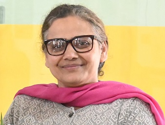

# Department of Applied Science  

## Message from HoD's Desk

Department of Applied Science is a multidisciplinary department and it is functioning with a team of dedicated faculty members who have been actively engaged in imparting quality teaching of the courses in basic science and humanities for graduating engineering students. The core courses offered being Physics, Chemistry, Mathematics, English and Principles of Engineering Economics and Management. Apart from these undergraduate courses, various other research activities are also going in these disciplines. Currently the department is having research scholars in various subjects. Committed minds are always welcome to join hands to build a strong dynamic and wholesome department. It is an endeavor of this department, so that students find applications of science to everyday life, moral and social understanding. 
 

*Dr. Harpreet Kaur Grewal*

HOD, Applied Science Department
# Department at a Glimpse

 

 This department was established in the year 1957, whose role is to deliver excellent quality education in the subject of Applied Sciences and humanities for the future technocrats of all engineering streams. The department also endeavours to inculcate the scientific temper and the spirit of inquest in students. It inspires the students to realize and therefore apply the physical laws to the growth and development of their fields of study. We intensely think that an educational programme should be able to stimulate the development of a balanced and harmonious personality of the students. Hence, the educational program of GNDEC has been customised -to suit such necessities.
 
 # Departmental Activities
 | Name of the Activity | Date |Faculty coordinator|CLUB|
 |----------------------| ----|--------------------|--------- |
 Caption writing Competition|19th January,2022|Pf. Nisha|English Club|
 |Article Writing Competition|23rd January 2022|Pf. Jasmine Kaur|N/A|
 |Slogan Writing Competition|26th January,2022|Pf. Nisha|English Club|
 |Extempore|26 January 2022| Pf.Jasmine Kaur|N/A|
 |Group Discussion|27th January|Pf. Nisha|English Club|
 |Power-Point presentation competition|28th January 2022|Pf. Jasmine Kaur|N/A|
 |Caption Writing|29 January 2022|Pf. Jasmine Kaur|N/A|
 |Science event on "Science in our daily life"| 29th January, 2022|Dr. Rajvir Kaur|Causmic Club|
 |E-Certificate design|14th February,2022|Dr. Randhir Singh|Causmic Club|
 |Science Slogan Writing Contest|28th February,2022|Pf.Jasmine Kaur|N/A|
 |Assumptions advantage|2-3 march,2022|Dr. Randhir Singh|Causmic Club|
 |Mach Auto Visit|14th March|Dr. Rajvir Kaur|N/A|
 |Declamation Contest|28th March,2022|Pf. Jasmine Kaur|N/A|
 |Pronounciation Contest|17th May|Pf. Manjot kaur|English Club|
 |Fund raising event for stray animals |27th July,2022|Dr. Rajvir Kaur|Live wire Club|
 |Article Writing Contest-1|22nd October, 2022|Pf. Jasmine Kaur|N/A| 
 |Economics article writing contest|23rd october,2022|Pf.Jasmine kaur|N/A|
 |Red Mic Grren Mic|30th November,2022|Dr. Rajvir Kaur|Live Wire club|
 |Fast and curious|8th december,2022|Dr. randhir Singh & Dr. rajvir Kaur|Causmic Club|
 |Power Point Presentation|13th December 2022|Pf. Nisha and Pf. Jasmine kaur|English Club|
 |Caption Contest|28th February,2023|Pf Nisha & Pf. Jasmine Kaur|English Club|
 |Declamation Competition|28th February,2023|Pf Nisha & Pf. Jasmine kaur|English Club|
 |Poster Making Competition|28th February,2023|Dr. Rajvir Kaur|Causmic Club|

 ## Snipetts of Departmental activities  
 
 
 

 ## GNE's APEX 2022
 The event GNE’S APEX 2022 was part of 66th Foundation Day celebrations of ‘Guru Nanak Dev Engineering College, Ludhiana’. The event was organised by Department of Applied Sciences was solely managed by students of B. Tech. 1st year (Batch 2021-2025). In this event, students from 21 schools of the state participated in activities like ‘Graffiti, Reel Formation, Colourful Expression, Poetry Composition & Recitation, Mime, G.K. Quiz, Sufi Singing, Young Entrepreneurs, Technovation. In addition to these activities, APEX Fair and Science in Motion were other attractions of the event.

## Teej Festival organised on 9th August,2022.
GNDEC, Dept.of Applied Sciences in collaboration with English Club celebrated Teej festival on 9th August,2022 with great cultural andaesthetic gaiety and amidst all rituals and traditional favour.
Speaking on the ocassion, HOD, Dept. of Applied Sciences, Dr. Harpreet Kaur Grewal acquainted one and all with the lasting effect of punjabi culture.
Dr. Sandeep kaur Gill, Asst. Professor of Mathematics was crowned as "Teej Queen" on this occassion Teej delicacy 'Kheer Pua' was also distributed among the gathering. The function ended with a vote of thanks proposed by HOD.

# Induction Programme 2022
 GENCO-RAW, an orientation program for the newly admitted students of Guru Nanak Dev Engineering College, Ludhiana, was organised by Dr. Amanpreet Kaur Sodhi. It was a 10 day programme which commenced on 19th September,2022.
 * It aimed at an open interaction between students and the speakers. A panel of 3 speakers, Mr. Jaswant Singh, Mr. Janmeja Singh Johal and Mr. Manjit Singh, formed by the proud alumni of the college, conducted the qna session, TABLE TALK. The topic for the same was “Ajj daa vidyaarthi”. Discussion around the topics like brain drain, careers, social life and academic life were conducted, and students got to learn a lot from the experienced guests. It ended on a very positive note with the floral honor of the guests.
 * Dr. Jaswant Singh and Dr. Kulwinder Singh Maan gave a detailed description of the Cultural Committee and 90.8 FM. Radio Community Respectively.
 * There was an interactive session by Shiksha Ratan, Dr. Jaswinder  Singh on physics and mathematics pillars of society. The event followed with Mr Davinder Singh Nagi, Calligraphy Artist's interactive session about the importance of Punjabi Language.
 * On the last day of Induction Programme Pf. Jasmine kaur and Pf Nisha organised a quiz activity on Quantitative aptitude for the B.tech first year students.It ended on a very positive note with the floral honor of the guests.
 ## Snippets Of the Induction Programme
 
 

 # Extension Lectures and workshops, SDP's organised
 * Pf. Jasmine Kaur organised an extension lecture on the topic "Ukraine- Russia war and its imapct on Indian economy". Pf. Gurmeet Singh was the resource person.

 
  

 * Pf Sukhjovan Singh gill conducted workshop on LaTEx software in May 2022 for staff and students of the college.

 * To celebrate 75th Azadi ka Amrit Mahautsav , an
initiative of the Government of India to
commemorate 75 years of progressive India.

* Department of Applied Sciences organised a Public
Speaking Workshop to boost confidence & enhance
public speaking skills of b.tech first year students on
23 May,2022 at 2:30pm in TCC seminar hall. 21
students from different branches participated in
this workshop. Students were divided into 3 groups.
According to the rules of this workshop, they had to
talk about any topic for at least 3 minutes in any
language in the first round. In the second round
they had to speak about the same topic in English
language. They were judged by judges and
observers on the basis of their speaking skills, body language.

 
 * SDP for non-teaching staff was organised from 24th August,2022- 30st August, 2022. It was based on communication skills, life skills and quantitative aptitude. The Programme was Coordinated by Dr. Randhir Singh.

 

 * Dr. Rajvir Kaur Conducted One day event on Extension Lecture on “Role of Nutrition in The Mental Well-being of Students” by Dr. Harshinder Kaur (Eminent Social Worker & Role Model) under the Aegies of AICTE-SPICES organized by Causmic Club, Department of Applied Sciences, Guru Nanak Dev Engineering College, Ludhiana on 20th September, 2022.
 * The event entitiled "Workshop on English Grammar", was organised by the English Club (Department of Applied Sciences) from Dec. 5, 2022 to Dec. 9 2022. It was conducted by Pf. Manjot Kaur and Pf. Harpreet Kaur under, the supervision of Dr. Harpreet Kaur Grewal (HOD of Applied Sciences) and Pf. Puneet Narang, wherein, Pf. Harpreet Kaur led the group in the morning from 10 A.M to 12:30 P.M in TCC Hall, and Pf. Manjot Kaur took the evening session from 3:00 P.M to 4:30 P.M in English lab.

 

 # Teacher's Day Celebration
 Teacher's Day is dedicated to Dr. Sarvepalli Radhakrishnan-second President of India. A celebration conducted at our depafrtment by our students on 5th September,2022. The coordinator of the event was Pf. Nisha , Dr. Gagandeep Kaur Lottey, Dr. Rajvir Kaur and Pf. Jasmine Kaur. We decided that, the responsibility of teaching is taken up the students as an appreciation for their teachers.

# GNE'S ACME 2023
Causmic Club at Guru Nanak Dev Engineering College Ludhiana organised Intercollege multi- event competition on 14/03/2023.  The Event was Coordinated by Dr. Randhir Singh and Co-Coordinated by Pf. Nisha and Pf. Jasmine Kaur Students of various colleges from and around the city participated in these competitive events. Dr Sehijpal Singh, Principal GNDEC Ludhiana extended warm welcome to all participants and other esteemed guests. Mr Deepak Sharma Chanarthal was the chief guest of the day. He motivated students to feel proud of their mother tongue and asked them to promote Punjabi language along with learning other languages. He inspired them to always stay focused on their goals and to participate in such competitive events to learn leadership and team spirit qualities, which are must to excel in every field of life. Mr. Inderpal Singh, Director NSET, was also present on the occasion. He addressed the audience and stressed on the holistic growth of the students.
## **Snippets of The ACME**

 
 

 # Students' Achievements
 ## Topper Of B.Tech First Year 2022
 Sangam Arora of CSE, URN: 2104181, CRN: 2115127 was the Topper of first year. He scored 9.9 sgpa in first semester and 9.57 in second semester.
 

 * Sangam Arora of CSE Won third prize in Inter- College competition which was organised by MCM DAV College, Chandigarh on 10th February, 2022. The topic of PPT was Budget 2022. The students were required to upload the file on google form in which they had to upload only 10 slides. It was a national level competition, in which students from different parts of the country participated.
  

  * Punjabi University Patiala organised an inter college Scienece Quiz on 27th February,2022 in which a team of 3 students of CSE i.e. Gurdev Singh, Raghavjit and Ekuspreet Singh won Third Prize.
  
  
 

 
 
 * Khalsa College of Engineering and Technology conducted Tech Urja on 12th May, 2022 in which Pratham scored third Prize in electronic poster making, Harsimran Singh scored first prize in Project Display, Aryan Garg scored first prize in preparation of mocktails, Sidhh Chhabra scored first position in Tech reels, Saksham Kohli scored first position in Quizpedia, Shikha scored third position in Rangoli competition, Somya Aggarwal scored first position in Towel Art, Ranbir Singh Scored first position in chit chat with biz ideas, Raghavjit scored first position in Quizpedia. 

 
 
 >

 * An Inter College Science Competition was held at GGN Khalsa College, Civil lines on 14th October, 2022 in which first prize was bagged by Nitin of Mechanical in Sudoko, second prize was bagged by Rudraksh of mechanical in working model. Students won second prize in Rangoli competition and third prize in poster presentation.
 

 * Guru Nanak Khalsa College for Womem, Gujarkhan Campus, Model Town, Ludhiana organised an inter college multiple competitions on 11th March 2023. Ekuspreet Singh of CSE secured first position in declamation. First position was also secured by Gursimran kaur of CSe in file decoration.
 Inderpreet Singh from CSE bagged second Prize in Logo designing. Simarpreet, Sukhman and Tavleen of CSE bagged Third Prize in Ad-Mad Show. Gursharan Kaur of CSE bagged third prize in pot painting. Vanshika verma and Somya Aggarwal bagged third prize in puzzle of cyber security. 
 
 

 * Navkirat Singh of CSE won first prize in Problem Solving Competition at Thapar Maths Competition which was held on 26th March, 2023.
 

 # Events Attented (FDP's//STCs/SDTs/Conferences/Workshops/webinars etc.)
 |Sr.no|Name of Faculty|Name of Event|Duration|Date(s)|Organising Institute|Online/offline mode|
 | ------ | ------ |------- |------ |-------|-------|------|
 |1|Dr. D.S Pathania|ISPEC 10th INTERNATIONAL CONFERENCE ON AGRICULTURE, ANIMAL SCIENCES AND RURAL DEVELOPMENT (2022)ANKARA TURKEY|One Day|18/7/22|Institute of Ankara Turkey|Online|
 |2|Dr. D.S Pathania|Innovation technologies and engineering|Two days|2-4/2022|Ege University Izmir Turkey|Online|
 |3|Dr. D.S Pathania|9th International scientific researches conference|3 days|9-11/2022|Institute of Adana Turkey|Online|
 |4|Dr. D.S Pathania|National seminar on advanced functional materials|Two days|24-25/2022|DRDO Delhi|Online|
 |5|Dr. D.S Pathania|One week International webinar on special function|5 days|21-25/2022|University Of Kerela|Online|
 |6|Dr. D.S Pathania| National conference on creating future path in 75th year Independence|5 days|18/4/22-22/4/22|NITTTR|Online|
 |7|Dr. Amanpreet Kaur Sodhi|FDP on“Technology Enabled Teaching-Learning”|One week|16/01/2023 to 20/01/2023|GNDEC, Ludhiana|Offline|
 |8|Pf. Puneet Narang|International Multidisciplinary Conference on Innovative Solutions For Future(IMDC-2022)|One day|30th october,2022|GHG Khalsa College Gurusar Sadhar, Ludhiana|offline|
 |9|Pf. Puneet Narang|STTP on "Technology enabled Teaching-Learning"|One Week|16/01/2023 to 20/01/2023|NITTTR|Offine|
 |9|Pf. Puneet Narang|10th International Conference on Advancements in Engineering and Technology(ICAET-2022)|Two days|November 11-12, 2022|Bhai Gurdas Institute of Management and Technology|Online|
 |10|Pf. Rajbir Kaur|Workshop on Hands-on Training: Decision Making Methods & Research Writing Tools|5 days|8th August 2022 to 12th August 2022|Centre for Multi Faceted Learning, GNDEC, Ludhiana|Offline|
 |11|Pf. Rajbir Kaur|Conference on Novel Progressions in Science and Technology 2022| Two days|28 Novemeber to 29 November,2022|St. Bade's College, Shimla|Offline|
 |12|Pf.Sukhminder Singh|National Seminar on Advanced Functional Materials|Two days|24-25 Feb 2022|Maharaja Agarsen Institute of Technology, New Delhi|Online|
 |13|Pf.Sukhminder Singh|Short term course on free software and resources for technical education through ICT|5 days|21-25 March 2022|National institute of Technical Teachers Training and Research, Chandigarh|Offline|
 |14|Pf.Sukhminder Singh|NPTEL-AICTE Online Course on Mathematical Methods in Physics 1| 3 months| February to April, 2022| IISER Bhopal| Online|
 |15|Pf.Sukhminder Singh| Online Course on  Engineering Mathematics-II| 4 months|Jan-April 2022|IIT Kharagpur|Online| 
 |16|Pf.Sukhminder Singh|NPTEL-AICTE Online Course on Differential Equations for Engineers| 4 months| July to October,2022|IIT Madras| Online|
 |17|Pf. Sukhminder Singh|NPTEL-AICTE online course/FDP on Matrix Analysis with Applications|3 months|July-September,2022|IIT Madras|Online|
 |18|Pf. Karan Bhalla| NPTEL Course on Fundamentals of Protein Chemistry| 12 weeks| July- October,2022| IIT Bombay| Online |
 |19|Pf. Karan Bhalla| NPTEL Course on  Advanced Transition Medal Chemistry| 12 weeks| July-October,2022| IIT Bombay| Online|
 |20|Pf. Karan Bhalla| NPTEL Course on Medals Mediated Synthesis-I| 12 weeks| July-September,2022| IIT Bombay| Online|
 |21|Pf. Karan Bhalla| NPTEL Course on Stereochemistry| 8 weeks| July-September| IIT Kharagpur| Online|
 |22|Pf. Karan Bhalla| NPTEL Course on Transition Medal Organometallics in Catalysis and Biology| 12 weeks| January-April,2022| IIT Kharagpur| Online|
 |23|Pf.Karan Bhalla| NPTEL Course on Co-ordination Chemistry (Chemistry of Transition Elements)| 12 weeks| January-April,2022| IIT Kharagpur| Online|
 |24|Pf.Karan Bhalla| NPTEL Course on Reactive Intermediates Carbene and Nitrene|4 weeks| January-February,2022| IIT Kharagpur| Online|
 |25|Pf.Karan Bhalla| FDP on Green Chemistry for Sustainable Development| 6 days| 16 May to 21 May,2022|SRM Institute of Science & Technology, Chennai| Online|
 |26|Pf.Karan Bhalla| FDP on Free Software and Resources for Technical Education through ICT| 5 Days| 21 March to 25 March,2022| NITTTR, Chandigarh| Offline|
 |27|Pf. Karan Bhalla|International Conference on“Contemporary Trends in Multi disciplinary Re-search: Sustainability, Challenges and Strategies"|One day|1st December 2022|RIMT University, Mandi- Gobindgarh|Offline|
|28|Pf.Mandeep Kaur|FDP on Advanced Transition Metal Chemistry|3 months|JULY-OCT 2022|NPTEL –AICTE|Online|
|29|Dr. Rajvir Kaur| NIPAM, IP awareness/training program under National Intellectual Property Awareness Mission|One Day|March 15, 2022|GNDEC, Ludhiana|Offline|
|30|Dr. Rajvir Kaur|Workshop on “Designing and Modelling of IoT, AI & ML Systems” |5 days|1st August -5th August, 2022|AICTE, ATAL Academy|Online|
|31|Dr. Rajvir Kaur|Seminar on“Implementation of National Education Policy (NEP-2020) in Technical Education & Technical Terminology in Punjabi” |2 days|10th March-11th March,2023|Guru Nanak Dev University, Amritsar|Offline|
|32|Dr. Gagandeep Kaur Lottey|Workshop on Hands-On Training:Decision Making Methods and Research Writing Tools|One week|8th August 2022-12th August 2022|GNDEC,Ludhiana|Offline|
|33|Pf. Nisha Masson|Seminar on“Implementation of National Education Policy (NEP-2020) in Technical Education & Technical Terminology in Punjabi”|2 days|10th March-11th March,2023|Guru Nanak dev University, Amritsar|Offline|
|34|Pf. Jasmine Kaur|Seminar on“Implementation of National Education Policy (NEP-2020) in Technical Education & Technical Terminology in Punjabi”|2 days|10th march-11th march,2023|Guru Nanak Dev University, Amritsar|Offline|
|35|Pf. Amarjot Kaur|Seminar on“Implementation of National Education Policy (NEP-2020) in Technical Education & Technical Terminology in Punjabi”|2 days|10th march-11th march,2023|Guru Nanak Dev University, Amritsar|Offline|

# Faculty Achievements
## Dr. D.S Pathania
* Under his Sukhvindr Singh Submitted his P.hd in 2023.
## Pf. Karan Bhalla
* Pf. Karan Bhalla got certificate of appreciation from NPTEL as Discipline Star, Motivated Learner and Beliver in the year 2002 for different courses in Year 2022.
* He recieved a gold medal and was a topper in "reactive Intermediates Carbene and Nitrene" course. He is a Siver medallist in "co-ordination Chemistry (Chemistry of Transition Elements)" course and in "Transition Metal Organometallics inCataysis and Biology" course in year 2022.
* Elite category in "Stereochemistry and Metal Mediated Synthesis-I course.
* He recieved a  silver medal and topper in Advanced Transition Metal Chemistry Course and Fundamentals of Protien Chemistry Course in year 2022.
## Pf. Sukhminder Singh
* Pf. Sukhminder Singh recieved Certificate of Appreciation from NPTEL for completing 60 weeks of learning in Mathematics discipline along with fulfilling rest of conditions and declared as NPTEL Discipline Star of Year 2022.
* He recieved a silver medal in online course "Mathematical methods in physics 1" and "Matrix Analysis with Applications" in year 2022.
* He recieved a gold medal in online course "Engineering Mathematics II" in year 2022.
* He was a Topper in online Course "Differential Equations for Engineers." in Year 2022.
## Dr. Rajvir Kaur
* Delivered Expert Talk on ‘Lab Management’ in STC titled “Skill Development Program for Non-Teaching Staff: Attaining SDGs through Skill Enhancement and Training” under the aegis of IQAC, organized by Department of Applied Sciences and Department of Business Administration, Guru Nanak Dev Engineering College, Ludhiana on 29th August 2022
* Bronze medalist (Women faculty Relay race) during the 61st Annual Athletic Meet held at Guru Nanak Dev Engineering College, Ludhiana on March 8-9, 2022.
## Pf. Jasmine Kaur
* Received an appreciation certifiacte by Government of India for successfully completing the National quiz on Financial Sector in the Year 2022.
* Received an appreciation certificate from Government of India for participating in "Himachal Me Parytan" in the year 2022.
# Publications
# Dr. D.S Pathania
 Published a research paper "Intrusion Detection System Using Data Mining”, World journal of Engg research
and technology”3,8,ISSN,No2454-695X IF,5.924 ,2022(Scopus)
* Published a research paper" A hybrid approach for intrusion detection system using artificial neural network",Vol4,issue1
2023,J of Mathematical problem, equations and statistics.(scopus) 
* Published a research paper Thermal stress distribution on a tube made of natural rubber,vol 13 issue2 2022
structural integrity and life (Scopus)
* Published a research paper Evaluation of thermal stresses in transversely isotropic piezoelectric disc
with rotation and internal pressure, structural integrity and life 2022(Scopus)
* Published”Propagation of SH-waves in two layered piezoelectric/fiber- reinforced composite plate”
(Scopus), 2022 IOP Publishing Morressier Berlin
* Published a research paper- Thermal and mechanical interactions in fractional order microstretch
thermoelastic half space,”J of mathematical problems, equations and statistics ISSN 2709-9393,V-3
pp25-30 (2022)
# Dr. Amanpreet Kaur Sodhi
* Published a Research paper- Partial replacement of cement with induction furnance dust for enhancing concrete properties with and without aspergillus niger fungus: a green building approach”in SCI Journal “ Environmental Science and Pollution Research” ISSN (Online): 1614-7499 DOI: 10.1007/s11356-022-21097-x

## Pf. Puneet Narang
* Published a paper, "An Analysis  ofTeachers’Perspectives on
Students’ Gains
and Challenges
in English
Medium
Classrooms in International
Multi Disciplinary
Conference on
Innovative
Solutions For
Future(IMDC-2022) organised by GHG Khalsa College Gurusar Sadhar, Ludhiana.
* Published a paper, "Implementation
of Multilingual
Approach To
Education"-A
Review in 10 th International
Conference on
Advancements in
Engineering and
Technology(ICAE
T-2022) organised by Bhai Gurdas Institute of Engineering and Technology.
# Dr. Rajvir Kaur
Kaur N., Rattan M., Gill S.S, Kaur G., Walia G.K., Kaur R. (2022) Marine predators
algorithm for performance optimization of nanoscale FinFET, Materials Today:
Proceedings. 66(8) (2022) 3529-3533. https://doi.org/10.1016/j.matpr.2022.06.404
# Pf. Manjot Kaur
* Pf. Manjot Kaur authored a book chapter entitled "Feminist Reverberation of Euripides' Medea: A Doll's House" in Gender Perspectives in Literary Context: Critical Responses, published by Read Tree International. 
 

