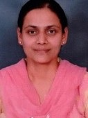
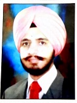

# Department of Applied Science  

## Message from HoD's Desk

Department of Applied Science is a multidisciplinary department and it is functioning with a team of dedicated faculty members who have been actively engaged in imparting quality teaching of the courses in basic science and humanities for graduating engineering students. The core courses offered being Physics, Chemistry, Mathematics, English and Principles of Engineering Economics and Management. Apart from these undergraduate courses, the department is also pursuing research activities in the above-mentioned disciplines. Currently the department is having research scholars in various subjects. The department of Science & Humanities welcomes committed minds to join hands to build a strong dynamic and wholesome department. It is an endeavor of this department so that students find application of science to everyday life, moral and social understanding. At present subjects like Chemistry, English, Mathematics, Physics,Principles of Engineering Economics and Management etc. are engaged by the department.
 

Dr. Harpreet Kaur Grewal

HOD, Applied Science Department
## Department at a Glimpse

 

 This department was established in the year 1957, whose role is to deliver excellent quality education in the field of Applied Sciences for the future technocrats of all engineering streams. The department also endeavours to inculcate the scientific temper and the spirit of inquest in students. It inspires the students to realize and therefore apply the physical laws to the growth and development of their fields of study. We intensely think that an educational programme should be able to stimulate the development of a balanced and harmonious personality of the students. Hence, the educational program of GNDEC has been customised -to suit such necessities.
 

### AIM

The Department of Applied Sciences targets to provide a robust foundation in the basic science subjects of Engineering Mathematics, Physics, Chemistry and Professional English. We emerge as an International level Institute in producing and propagating knowledge, and providing students an exceptional learning experience in the discipline of science and technology that will best serve the world and advancement of mankind.

### MISSION

The task of the Applied Sciences Department is to succeed, sustain and foster unsurpassed excellence in technical education. We chase continuous progress of infrastructure and boost state-of-the art capacities to offer our students a technologically up-to-date and knowledgeably stimulating environment of learning and guarantee high quality content by qualified faculty members who establishes the marks of excellence in their every endeavour.

### VISION

 Applied Sciences Department envisages as an academic staff developer for the Technical Education. We impart high levels of discipline in students and endeavour to set international standards, preparing our students technologically superior, who as a result shall contribute to the progression of society and mankind.

### FACILITIES & LABORATORIES

#### Infrastructure

Nearly every topic taught during lectures has a related laboratory experiment. All Laboratories are completely equipped to conduct the practical and experiments as per the syllabus of the I.K. Gujral Punjab Technical University. The department pays huge attention to its laboratories & equipment and obtains modern equipments whenever essential. The labs provide abundant practical experience and facilitate the students with applications of their theoretical learning.

## Faculty Achievements  

### Mathematics

**Dr. D.S. Pathania**

- Chairman BOS Mathematics, College IKGPTU, Jalandhar
- Chairman BOS(Applied Science)
- Member of Academic Council, GNDEC, Ludhiana
- Published 15 research papers in Scopus and UGC approved journals
- Attended 8 Short Term Courses
- Guided one candidate leading to Ph.D course
- Authored a book chapter entitled "*Interactions due to inclined loads in a microstretch thermoelestic medium with mass diffusion*", published by an International Publishing House, UK.
- Published “Replenish model of deteriorating items with price dependent demand and complete backlogging in two storage facilities under the effect of inflation,” Malaya .J. of Mathematik,vol9,1, 2021,26-32 ISSN 2319-3686(UGC Approved)
- Published a research paper “Thermal creep stress analysis of functionally graded spherical shell under internal and external Pressure” Structural integrity and life (Scopus) G.Verma,Vol, 20, No.3,2021
- Attended a week STP on "ICT initiative in technical education” from 8-13 Feb 2021 at GNDEC Ludhiana.
- Attended one week workshop on recent trends in research methodology from 11 oct to 15 oct 2021 at krishanagiri,Tamilnadu,India(online)
- Presented a paper Laser pulse in microstretch thermoelastic medium having thermomechanicak medium, in microstretch thermoelastic medium having thermo mechanical interaction Int. Conference at Taj institute of higher education Afghanistan on 19/8/2021.
- Presented a paper under aerodynamic coupling a problem of slender beam 27th international conference, Recent Advances in Solid Mechanics and Seismology of international academy of physical sciences (CONIAPSXXVII) Oct 26-28 2021, Kurukshetra University, Kurukshetra)
- Attended 6th INTERNATIONAL CONGRESS ON INNOVATIVE SCIENTIFIC APPROACHES,19Dec2021, ZIRRAT (TURKEY)
- Chaired a technical session in an international conference (RAFAS2021) online at lovely Professional university, Punjab June 25-, Punjab June 25-26, 2021
- Chaired a technical  session  in the 27th international conference, Recent Advances in Solid Mechanics and Seismology of international academy of physical sciences (CONIAPSXXVII) Oct 26-28 2021,Kurukshetra university, Kurukshetra)

**Pragya Goyal**

- Webinar on  “ *Importance of Management Principles*” Conducted by the ECE  Department, KCG College of Technology, Chennai .
- Short term online course on " *Nanotechnology for electronic and photonic devices*" of duration one week conducted by PEC, Chandigarh.
- TEQIP III sponsored webinar on "*Women Safety, Rights and Gender Equality*” conducted by GNDEC, Ludhiana.
- Two Weeks AICTE sponsored FDP on "*Innovative Pedagogical Methodologies and tools for effective learning in Engineering Education*" Conducted by MBA department , GNDEC, Ludhiana
- TEQIP III sponsored FDP on *"ICT initiatives in Technical Education"* organised by Swayam-NPTEL Local Chapter, GNDEC, Ludhiana.

**Sukhminder Singh**

- Topped in Engineering Mathematics course conducted by NPTEL, 12 week course, September-December 2020, with a consolidated score of 90% and received Elite+Gold certificate.
- Successfully completed Laplace Transform course conducted by NPTEL (4 weeks course), September-October 2020, with a consolidated score of 75% and received Elite+Silver certificate.
- Topped 4 Weeks Course on "PARTIAL DIFFERENTIAL EQUATIONS FOR ENGINEERS: SOLUTION BY  SEPARATION OF VARIABLES" With a Consolidated Score of 91% (JAN-FEB 2021) organized by SWAYAM-NPTEL.
- Topped 12 Weeks course on "Ordinary and Partial Differential equations and applications" with a consolidated score of 86% (Jan-April 2021) organised by SWAYAM-NPTEL.
- Topped 8 Weeks course on "Numerical methods" with a consolidated score of 88% (Aug-Oct 2021) organised by SWAYAM-NPTEL.

**Rajbir Kaur**

 

- NPTEL online certificate course on Basic Linear Algebra, organised by IIT Bombay, February 2020-April 2020.
- NPTEL online certificate course on Engineering Mathematics-I, organised by IIT Kharagpur, July 2020-December 2020.
- NPTEL online certificate course on Laplace Transform, organised by Institute of Mathematical Sciences, Chennai, July 2020- December 2020.

**Dr Sandeep Kaur Gill**

 

- Published 8 Research papers in reputed UGC approved journals
- Presented research paper on "Classes of  - convergence Fourier series" International Conference on Mathematical Advances and Applications 2020 , REd Talks Daily International. (August 07-08, 2020).
- Presented 7 Research papers in different Conferences
- Attended TEQIP-III sponsored e-training Faculty Development Programme (FDP) on “Mathematics with MATLAB and Mathematica” at Department of Mathematics,  IIT Indore, November 23-28, 2020.
- Attended Workshop on “MATLAB and Differential Equations (MATDIFF2020) at Thapar Institute of Engineering and Technology, Patiala, Feb 15, 2020.
- Attended TEQIP Short Term Course on “Complex Analysis, Fourier Analysis and Special Functions”
- Attended Workshop on “Fuzzy Sets, Fuzzy Logic and its Applications in Big Data Analytics”

**Dr. Gagandeep Kaur**

- Presented and published 9 Research papers in different Journals and Conferences.
- Attended 7-Day E-Workshop on Advance Review Techniques with Special Emphasis on Quality Publications , July 5-11 ,2021 ,organised by PCTE, Ludhiana in association for Research and Advanced Studies.
- Presented Paper titled “Intuitionistic L-Fuzzy Essential and Closed submodules in online  7th IFSCOM2021 in Turkey, may 25-29,2021.
- Attended 3 different Workshops and 1 Faculty Development Program.

### Physics

**Dr. Randhir Singh**

 

- Attended "*Recent trends in image processing techniques*", organised by Dept of IT GNDEC Ludhiana, 30 Dec 2019 to 20 Jan 2020.
- Attended Professional development training programme conducted by IIM Raipur, 28 Jan 2020 to 1 Feb 2020.

### Chemistry  

**Dr. Amanpreet Kaur Sodhi**

- Research paper Effect of Integrating industrial and agricultural wastes on concrete performance with and without microbial activity is published in SCI journal - "Environmental science and pollution Research
- The 'Student Induction Program ' for btech first year students was organised and conducted in nov 2021
- Published 2 research articles in reputed international SCI indexed journals.
- Expert Lecture was delivered at ABVIET, Pragatinagar, Shimla  on 31st Oct 2019.
- Participated in Energy Conservation and Management (FDP),One Week (May 4 - 8, 2020 ), GNDEC Ludhiana.
- Chemistry as a profession: Career Prospective (Webinar), One Day 29 May 2020, Rayat-Bahra Group.
- Attended Methodology and data Interpretation of analytical Instrumentation Technique (FDP), One Week ( 15 June - 19 June 2020), Satyabhama Institute of Sc. and Tech. Tamil Nadu, India
- 3rd  International Conf. on Innovative Technologies for Clean and Sustainable Development - 2 Sessions chaired on Feb19 and Feb 20, 2020 respectively, NITTTR Chandigarh
- Research paper was presented  in 3rd International Conf. on Innovative Technologies for Clean and Sustainable Development, 19-21 Feb 2020, NITTR, Chandigarh
- Smart Materials and Nanotechnology (FDP), One Week ( 02-06 Dec 2019 ), Patiala University, Punjab
- Research Paper was presented and accepted for publication in SDIE-2020, held in GNDEC Ludhiana, October 2020, GNDEC, Ludhiana.
- Member of NAAC Team for Criteria 3.
- Reviewer of Research Papers for SDIE-2020, held in GNDEC Ludhiana
- Conduct Official at SDIE-2020, held in GNDEC Ludhiana.
- External Examiner for VIVA Exam held at PCTE on 18 Dec 2019 and GGI Khanna on 18th  June 2020.
- Committee member for Study Scheme Mapping.
- Reviewer of Research Papers for International Journal of Precision Technology.
- Member of Student Greivance Redressal Committe, Research and development Cell and Equal opportunity Cell.
- In-charge Internal Complaint/ Sexual Harassment Committee.
- In-charge Announcement Committee for Sports Day.

**Karan Bhalla**

- Completed Course work of PhD and obtained 9.80 SGPA with first RANK in University.
- Working as Reviewer of Research Paper (3) for Iranian Journal of Chemistry and Chemical Engineering.
- Working as Reviewer of Research Paper for The Hertz Journal of Engineering
- Received Certificate of Excellence for excellent Performance in Novel Exploration in Research Writing organized by Chemistry Dept., PSNA College of Engineering and Technology, Dindigul.
- Research Paper titled “Heterocyclyl linked phenyl containing Thiazolidinediones and its Cyclic analogs as potential novel Antidiabetic agents” published in Journal Further Science, India.
- Delivered Research Paper Oral Presentation entitled “Synthesis and Characterization of Imidazolium Monomeric Surfactants and to study the effects of additives on their properties” on 24th and 25th June 2021 at International Conference on Modern Functional Materials organized by Sri Sai Ram Engineering College, Chennai and Abstract accepted in Proceedings of Conference
- Qualified 12 Weeks NPTEL Course “Organic Chemistry in Biology and Drug Development” with % and 3 Credits along with Elite and equivalent to 1.5 FDP through SWAYAM Platform from IIT Guwahati.
- Qualified 8 Weeks NPTEL Course “Metals in Biology” with 91% and Top position,
2 Credits along with Elite and Gold Medal equivalent to 1 FDP through SWAYAM Platform from IIT Bombay.
- Qualified 4 Weeks NPTEL Course “Bioinorganic Chemistry” with 96% and Top position, 1 Credits along with Elite and Gold Medal equivalent to 0.5 FDP through SWAYAM Platform from IIT Kanpur.
- Qualified 4 Weeks NPTEL Course “Basics in Inorganic Chemistry” with 1 Credit along with Elite and Silver through SWAYAM Platform from IIT Bombay.
- Qualified 12 Weeks NPTEL Course “Reagents in Organic Synthesis” with 3 Credits along with Elite and equivalent to 1.5 FDP through SWAYAM Platform from IIT Guwahati
- Attended One week FDP and Qualified Training on “Moodle Learning Management
System” offered by Spoken Tutorials IIT BOMBAY from 27th April to 1st May 2020.
- Attended Training on “Python 3.4.3” organized by Acropolis Institute of Technology
and Research in association with Spoken Tutorials IIT BOMBAY.
- Attended Training on “OpenFOAM” organized by Galgotias University in association
with Spoken Tutorials IIT BOMBAY.
- Attended 5 Day FDP on “Scilab” from 15th to 19th June 2020 organized by St. Peter’s
Engineering College, Hyderabad in association with Spoken Tutorials IIT BOMBAY.
- Attended One week FDP on “Latex & Xfig” from 15th to 19th June 2020 organized by
Calcutta Institute of Technology, Howrah, W.B. in association with Spoken Tutorials
IIT BOMBAY.
- Attended One week FDP on “R” from 15th to 21st June 2020 organized by Chouksey
Engineering College, Bilaspur in association with Spoken Tutorials IIT BOMBAY.
- Attended One week FDP and Qualified Training on “LATEX” with “A” Grade from
15th to 21st June 2020 organized by Vinayakrao Patil Mahavidyalaya, Vaijapur,
Aurangabad.
- Attended One week FDP on “PHP-MySQL” from 17th to 22nd June 2020 organized by
J D College of Engineering and Management, Nagpur in association with Spoken
Tutorials IIT BOMBAY.
- Attended One week FDP and Qualified Training on “Moodle Learning Management
System” from 18th to 24th June 2020 organized by Bhopal Rao Pawar Government
Polytechnic, Dhamtari in association with Spoken Tutorials IIT BOMBAY.
- Attended One week FDP and Qualified Training on “R Language and RStudio” with
“B” Grade from 22nd June to 5th July 2020 organized by Cambridge Institute of
Technology, Bangalore in association with Pandit Madan Mohan National Mission on
Teachers and Teaching (PMMMNMTT) and Spoken Tutorials IIT BOMBAY.
- Attended One week FDP on “C & C++” from 27th June to 4th July 2020 organized by
Calcutta Institute of Technology, Howrah, W.B. in association with Spoken Tutorials
IIT BOMBAY.
- Attended One week FDP on “Latex” from 13th to 19th July 2020 organized by
Jamshedpur Women’s College in association with Pandit Madan Mohan National
Mission on Teachers and Teaching (PMMMNMTT) and Spoken Tutorials IIT BOMBAY.
- Attended One week FDP and Qualified Training on “Moodle Learning Management System” from 10th to 14th August 2020 organized by Sridevi Women’s Engineering College in association with Spoken Tutorials IIT BOMBAY
- Attended AICTE recognized FDP on “Entrepreneurship and Start-up Policies
2017” from 11th May to 15th May 2020 organized by NITTTR, Chandigarh
- Attended AICTE recognized FDP on “Life skills Development” from 18th May to 22nd May 2020 organized by NITTTR, Chandigarh.
- Attended AICTE recognized FDP on “Understanding Project Management Basics”
from 25th May to 29th May 2020 organized by NITTTR, Chandigarh.
- Attended AICTE recognized FDP on “Outcome Based Curriculum” from 1st to 5th
June 2020 organized by NITTTR, Chandigarh.
- Attended AICTE recognized FDP on “Waste Management” from 8th to 12th June
2020 organized by NITTTR, Chandigarh.
- Attended AICTE recognized FDP on “Nanoelectronic Devices and Circuits” from
17th to 21st August 2020 organized by NITTTR, Chandigarh.
- Attended AICTE recognized FDP on “Optical Fibres: Potentials and Applications”
from 21st to 25th September 2020 organized by NITTTR, Chandigarh.
- Attended AICTE recognized FDP on “Applied Physics for Engineers-I” from 12th to
16th October 2020 organized by NITTTR, Chandigarh
- Successfully completed AICTE Training and Learning (ATAL) Academy Online FDP on “Photonics” from 21st to 25th September 2020 at Department of Applied Science and Humanities, Institute of Engg. and Technology, Dr. Rammanohar Lohia Avadh University, Ayodhya.
- Successfully completed AICTE Training and Learning (ATAL) Academy Online FDP on “Chromatography Advancements in Instrumentation and Applications” from 12th to 16th October 2020 at Dr. D.Y.Patil Institute of Pharmaceutical Sciences and Research.
- Successfully completed AICTE Training and Learning (ATAL) Academy Online FDP on “Waste Technology” from 18th to 22nd January 2021 at National Institute of Technology, Durgapur.
- Successfully completed AICTE Training and Learning (ATAL) Academy Online FDP on “Energy Storage” from 1st to 5th February 2021 at Gandhi Institute of Engineering and Management.
- Successfully completed AICTE Training and Learning (ATAL) Academy Online FDP on “Alternate fuels” from 12th to 16th June 2021 at Gyan Ganga Institute of Technology and Sciences.
- Successfully completed AICTE Training and Learning (ATAL) Academy Online FDP on “Quantum Computing” from 21st to 25th June 2021 at Government College of Engineering, Sengipatti, Thanjavur.
- Successfully completed AICTE Training and Learning (ATAL) Academy Online FDP on “Drug Engineering” from 28th June to 2nd July 2021 at Delhi Institute of Pharmaceutical Sciences and Research, New Delhi
- Attended TEQIP-III sponsored 3 Day National Workshop on “Transforming Pedagogy in India” from 1st to 3rd August 2020 organized by NIT Jamshedpur.
- Attended One Week Workshop on “Intellectual Property Rights and Entrepreneurship Development” under TEQIP-III from 1st to 5th September 2020 organized by NIT, Silchar.
- Attended One Week Short Term Course on “Latest Development in Communication and Microwave Technologies” under TEQIP-III from 2nd to 6th September 2020 organized by NIT, Jalandhar.
- Attended One Week Short Term Course on “Intellectual Property Rights” under TEQIP-III from 7th to 11th September 2020 organized by NIT, Jalandhar.
- Attended One Week Short Term Course on “Chemistry for Engineering Applications” under TEQIP-III from 14th to 18th September 2020 organized by NIT, Jalandhar.
- Attended 5 Day FDP on “Universal Human Values for DEEKSHARAMBH (Student Induction Program) from 21st to 25th September 2020 organized by NIT, Patna.
- Attended One Week Short Term Course on “Current Trends in Condensed Matter Physics” under TEQIP-III from 25th to 29th September 2020 organized by NIT, Jalandhar.
- Attended One Week Short Term Course cum Workshop on “Manufacturing Technologies for tissue engineering and drug delivery systems” under TEQIP-III from 3rd to 7th October 2020 organized by NIT, Jalandhar.
- Attended One Week Short Term Course on “Advanced Energy Materials” under TEQIP-III from 12th to 16th October 2020 organized by NIT, Jalandhar.
- Attended Five Days STC on “Journey from Semiconductor Physics to Smart Devices to Intelligent Automation” from 1st to 5th May 2021 organized by NIT, Srinagar and Semiconductor Society of India.
- Attended One Week FDP on “Energy Conservation and Management” from 27thApril to 1st May 2020 organized by Electrical Engineering  Dept., GNDEC, Ludhiana.
- Attended 2 day FDP on “Trends in Technological Intelligence” from 31st May to  
1st June 2020 organized by IEI Student Chapter of ECE, BBDNIT, Lucknow in
association with The Institution of Engineers (India).
- Attended One Week National FDP on “Effective and Quality Research Writing” from 7th to 13th June 2020 organized by Patrican College of Arts and Science, Chennai in association with IQAC.
- Attended One Week FDP on “Effective Online Teaching Methods” from 8th to 14th June 2020 organized by Dr. N.G.P.Institute of Technology, Coimbatore.
- Attended 2 Days FDP on “Significance of Online Teaching Tools Post Covid-19” from 12th to 13th June 2020 organized by Andhra Loyola College.
- Attended 3 Day FDP on “Data Science with Python programming” from 12th June to 14th June 2020  organized by CSE Dept., Smt.Kasturbai Walchand Science College, Sangli.
- Attended One Week International FDP on “Recents Trends in Science and Technology” from 15th to 20th June 2020 organized by Suresh Gyan Vihar University, Rajasthan.
- Attended FDP on “E-Content Development” on 20th June 2020 organized by Dept. of CSE, Lovely Professional University, Punjab.
- Attended One Week FDP on “Advancements in Science and its Applications in Engineering” from 22nd to 26th June 2020 organized by Hyderabad Institute of Technology and Management.
- Attended FDP on “Clean and Sustainable Energy” from 25th to 28th June 2020 organized by Yogananda College of Engg.& Technology, Jammu & Kashmir in association with Institutions Innovation Council (IIC).
- Attended One week FDP on “Embracing the Creative side of Teaching and Learning Methods” 29th June to 3rd July 2020  organized by RMK College of Engg.& Technology, Tamil Nadu.
- Attended 3 Day online FDP on “Scientific communication for research paper and proposal writing” from 1st to 3rd July 2020 organized by Department of Information Technology, PSG  College of Technology, Tamil Nadu.
- Attended One Week National Level FDP on “Cyber Security” from 7th to 12th July 2020 organized by Dept. of MCA, Mahatma Gandhi Institute of Technology, Telangana in association with Supraja Technogies.
- Attended One week FDP on “Recent Advances in Biomedical Applications and Communication Networks”  from 13th to 18th July 2020 organized by Dept. of ECE, GMR Institute of Technology, AP.
- Attended Three Day FDP on “Sustainable Water Resource Management” from 14th to 16th July 2020 jointly organized by CE Dept. and IQAC, Karpaga Vinayaga College of Engg. and Technology, Maduranthagam.
- Attended Four Day International FDP on “DATA DRIVES” from 15th to 18th July 2020  organized by Department of Computer Applications, Bishop Academy of Professional Management, Bengaluru.
- Attended 5 Day International FDP on “Innovative Strategies in Emerging Technologies” from 20th to 24th July 2020 organized by Dept. of CSE, Rajapalayam Raju’s College, Tamil Nadu in association with IGL Hands on Private Limited, USA.
- Attended Three Day Online FDP on “Effective Teaching Pedagogy” from 20th to 22nd July 2020 organized by Inderprastha Engineering College, Ghaziabad.
- Attended Five Day National Online FDP on “Statistical Data Analysis using R-Software (SDAR-2020)” from 20th to 24th July 2020organized by Department of Mathematics, BS&H, QIS College of Engg. and Technology, Ongole, Andhra Pradesh.
- Attended Two Days Online FDP on “Medicinal Chemistry and Pharmaceutical Aspects : Present & Future” on 21st & 22nd July 2020 organized by K. L. E. Society’s Jagadguru Tontadarya College, Gadag, Karnataka in association with Royal Society of Chemistry (London, UK), Local Section Deccan (LSD), India.
- Attended National Faculty Enrichment Programme on “Digital Technology for Teaching of Life Sciences and Humanities” from 21st to 25th July 2020 organized by Dr.Ambedkar Govt. Arts College, Tamil Nadu in association with The Indian Science Congress Association (ISCA).
- Attended FDP on “Outcome Based Education” from 22nd to 24th July 2020 organized by Rai University, Gujarat in association with Internal Quality Assurance Cell (IQAC) and Inpods, India.
- Attended Three Day FDP on “Academic Tranformation with Secrets of Empowerment” from 23rd to 25th July 2020 organized by Rajiv Gandhi Institute of Technology, Mumbai.
- Attended Three Day TEQIP-III Sponsored FDP on “Applications of Mathematical Modelling in Science and Engineering” from 25th to 27th July 2020 organized by Rajasthan Technical University, Kota.
- Attended Five Day International FDP on “Research Orientations in Engineering with Effective Outcomes” from 26th to 30th July 2020 organized by KIET Group of Institutions, Lucknow.
- Attended Three Day FDP on “Conducting and Publishing Quality Research” from 27th to 29th July 2020 organized by G L Bajaj Institute of Management & Research, PGDM Institute, Greater Noida.
- Attended One Week FDP on “Nanoscience and Nanotechnology - Current Perspectives” from 27th July to 1st August 2020 organized by G H Raisoni College of Engg., Nagpur in association with The Institution of Engineers and Nagpur Local Centre.
- Attended One Week FDP on “Technologies with Social Relevance” from 27th July to 1st August 2020 organized by GMR Institute of Technology, Andhra Pradesh.
- Attended National Level FDP on “Intellectual Property Rights: A Road Map” on 30th July 2020 organized by Islamiah Women’s Arts and Science College, Tamil Nadu.
- Attended Two Day National Level FDP on “Fundamentals of SPSS and Data Analysis using SPSS” on 30th and 31st July 2020 organized by Tirumala Engineering College, Narsaraopet.
- Attended Two Day National Level FDP on “An Effective E-Content Development Tools” on 1st and 2nd August 2020 organized by IQAC of Hon. Balasaheb Jadhav Arts, Commerce and Science College, Maharashtra.
- Attended Three Day FDP on “Spectroscopic Techniques” under DBT Star College Scheme from 3rd to 5th August 2020 organized by Jamal Mohamed College, Tiruchirappalli.
- Attended Three Day FDP on “Envision the Excellence in Teaching Online” from 3rd to 5th August 2020 organized by Nirmala College for Women, Coimbatore.
- Attended One Week FDP on “Engineering Physics and Material Science” from 3rd to 7th August 2020 organized by Chaitanya Bharathi Institute of Technology, Telangana.
- Attended One Week FDP on “The Role of Material Science in Engineering: Applications Perspective” from 3rd to 7th August 2020 organized by Mahatma Gandhi Institute of Technology, Telangana.
- Attended FDP on “Creation of Effective E-Learning Content” on 6th August 2020 organized by Shastry Institute of Pharmacy, Jalgaon.
- Attended 14 Days FDP on “Material Science and Nanotechnology” from 3rd to 17th August 2020 organized by B.S.Abdur Rahman Crescent Institute of Science and Technology.
- Attended FDP on “Fixed Point Theory and its Applications” on 8th and 9th August 2020 organized by St. Joseph’s College of Engineering, Chennai.
- Attended One Week FDP on “E-Contents and ICT Tools for Innovative and Effective Teaching & Learning Process” from 8th to 14th August 2020 organized by Roorkee College of Management & Computer Applications, Roorkee.
- Attended One Week FDP on “Challenging role of Chemistry in Drug Design and Development” from 10th to 14th August 2020 organized by Dept. of Chemistry, K.S.Rangasamy College of Technology, Tiruchengode.
- Attended One Week FDP on “Green Energy for Sustainable Development Indian Centric Approach” from 10th to 14th August 2020 organized by Dept. of ME, Bheemanna Khandre Institute of Technology, Bhalki, School of Engg. Central Uni. Of Karnataka, Kalaburagi.
- Attended 5 Days FDP on “Performing Experiments on Virtual Labs” from 10th to 14th August 2020 organized by Baba Farid College of Engg. and Technology, Bathinda in collaboration with College of Engg., Pune.
- Attended One Week National FDP on “Computer Networks Simulation using NS2” from 10th to 14th August 2020 organized by Dept. of CSE, Mahatama Gandhi Institute of Technology, Telangana.
- Attended One Week FDP on “Open Source Tools for Research” from 10th to 15th August 2020 organized by Dept. of ECE, Priyadarshini Institute of Science & Technology for Women, Khammam, Telangana.
- Attended FDP on “Flipped Classroom” held on 15th August 2020 organized by Anjuman-I-Islam’s Kalsekar Technical Campus.
- Attended One Week FDP on “Advances in Water Resources Management and Sustainable Environment” from 17th to 21st August 2020 organized by Dept. of CE in association with IQAC-MSRIT sponsored by AICTE and Ramaiah Institute of Technology, Bengaluru.
- Attended National Level 6 Days FDP on “Imparting Soft Skills and Life Skills for Success” from 17th to 22nd August 2020 organized by PG Dept. of English under aegis of IQAC, Shanti Devi Arya Mahila College, Dinanagar, Punjab.
- Attended One Week FDP on “Research Article Writing and Online Academic Presentation” from 17th to 23rd August 2020 organized by Govt. Girls PG College, Ujjain, M.P. in association with IQAC and National Academy of Sciences, India.
- Attended FDP on “Online Teaching Tools” on 18th August 2020 organized by IQAC, Rajah Serfoji Government College, Tamil Nadu.
- Attended Two Days TEQIP-III Sponsored FDP on “Recent Advances in Renewable Energy Technologies for Sustainable Development” on 21st and 22nd August 2020 organized by Rajasthan Technical University, Kota and Jaipur Engg. College.
- Attended 7 Days FDP on “Contemporary Amelioration in Nano Structured Materials” from 21st to 27th August 2020 organized by Dept. of Science and Humanities, Jeppiaar Engg. College, Chennai.
- Attended One Week FDP on “Nano Hybrid Composite Materials Characterization & Applications” from 24th to 28th August 2020 organized by ME Dept., VNR Vignana Jyothi Institute of Engg. and Technology, Telangana.
- Attended Five Days FDP on “Future Energy Trends & its Impact” from 24th to 28th August 2020 organized by Dept. of ECE, SJB Institute of Technology, Bengaluru.
- Attended National FDP on “Bio-Learning with ML and Python” from 27th to 29th August 2020 organized by Dept. of BCA, Jain (Deemed to be University), Bengalore.
- Attended FDP on “Recent Trends in Physics” from 31st August to 2nd September 2020 organized by St. Joseph’s College of Engg., Chennai.
- Attended One Week FDP on “Material Synthesis and Characterization for Device Applications” from 31st August to 5th September 2020 organized by Dept. of Physics & Chemistry, NMIT, Bangalore.
- Attended 7 Days International Virtual FDP on “Smart Technologies for Drug Design, Energy and Environment” from 1st to 7th September 2020 organized by Dept. of Science and Humanities (Chemistry), Kumaraguru College of Technologies, Coimbatore.
- Attended 3 Days FDP on “Data Science” from 3rd to 5th September 2020 organized by Computer Engineering Department, Tapi Diploma Engg. College, Surat.
- Attended TEQIP-III Sponsored FDP on “Water, Energy and Environment” from 5th to 9th September 2020 organized by Chemical Engg. Dept., Veer Surendra Sai University of Technology, Odisha.
- Attended 3 Days FDP on “Nano-Materials and its Applications in Science and Technology” from 7th to 9th September 2020 organized by Rajasthan Technical University, Kota and Vivekananda Institute of Technology, Jaipur.
- Attended 5 Days FDP on “Recent Advances in Photonics Technology” from 7th to 11th September 2020 organized by ECE Dept., Vidyavardhaka College of Engg., Mysuru in association with IEEE Photonics Society, Prakash Bharathi.
- Attended 3 Days FDP on “Scientific Computational Techniques” from 12th to 14th September 2020 organized by Rajasthan Technical University, Kota and Vivekananda Institute of Technology, Jaipur.
- Attended World’s Largest One Week Hands On FDP on “Artificial Intelligence using Python” from 14th to 19th September 2020 organized by CSE & IT Dept., Vignan Institute of Technology and Science in association with Brainovision Solutions India Pvt.Ltd & National Youth Council of India.
- Attended One Week FDP on “Online Teaching Aids for Teaching Profession” from 14th to 19th September 2020 organized by Sardar Patel Mahavidyalaya, Chandrapur.
- Attended 3 Days FDP on “Machine Learning and its Applications” from 15th to 17th September 2020 organized by Rajasthan Technical University, Kota and Vivekananda Institute of Technology, Jaipur.
- Attended TEQIP-III Sponsored FDP on “Recent Advances on Nanotechnology, Catalysis & Bio-Chemical Engineering” from 16th to 20th September 2020 organized by Chemical Engg. Dept., Veer Surendra Sai University of Technology, Odisha.
- Attended 5 Days FDP on “Issues & Challenges in Grid Integration with Renewable Energy Sources” from 21st to 25th September 2020 organized by Rajasthan Technical University, Kota and Vivekananda Institute of Technology, Jaipur.
- Attended TEQIP-III Sponsored One Week FDP on “Efficacy of Digital Pedagogy for Effective Online Teaching Learning” from 8th to 15th October 2020 under Twinning Activity organized by BVB’s Sardar Patel College of Engg., Mumbai.
- Attended 5 Days FDP on “Blended Learning - The New Normal” from 12th to 16th October 2020 organized by Anurag University, Hyderabad.
- Attended 3 Days FDP on “Condensed Matter Physics” under DBT Star College Scheme from 19th to 21st October 2020 organized by PG and Research Dept. of Physics, Jamal Mohamed College, Tiruchirappalli.
- Attended 5 Days FDP on “Emerging Research Trends in Computer Science and Engineering” from 19th to 23rd October 2020 organized by CSE Dept., GMR Institute of Technology, Andhra Pradesh.
- Attended 2 Weeks AICTE Sponsored FDP under AQIS on “Innovative Pedagogical Methodologies and Tools for Effective Learning in Engineering Education” from 26th October to 7th November 2020 organized by MBA Dept. Guru Nanak Dev Engineering College, Ludhiana.
- Attended 2 Weeks TEQIP-III Sponsored International FDP on “Multidisciplinary Research Innovation in Engineering Science and Technology for Sustainable Development” from 26th October to 7th November 2020 organized by CSE Dept., Bipin Tripathi Kumaon Institute of Technology, Dwarahat Almora, Uttarakhand.
- Attended One Week National FDP on “Frontiers of Chemistry” from 3rd to 7th November 2020 organized by Dept. of Engineering Sciences, AISSMS Institute of IT, Pune.
- Attended 2 Weeks AICTE Sponsored FDP under AQIS on “Innovative Pedagogical Methodologies and Tools for Effective Learning in Engineering Education” from 7th to 21st December 2020 organized by MBA Dept. Guru Nanak Dev Engineering College, Ludhiana.
- Attended One Week TEQIP-III Sponsored FDP on “ICT Initiatives in Technical Education” from 8th to 13th February 2021 organized by SWAYAM-NPTEL Local Chapter, GNDEC, Ludhiana.
- Attended One Week National FDP on “Research Methodology” from 26th April to 1st May 2021 organized by Amar Sewa Mandal’s Kamla Nehru Mahavidyalaya, Nagpur.
- Attended One Week National FDP on “E-Contents and ICT Tools for Innovative Teaching & Learning” from 1st to 7th May 2021 organized by Roorkee College of Management & Computer Applications, Roorkee.
- Attended 5 Days FDP on “Accelerating Innovations in Material Science- Surface Characterization” from 18th to 22nd May 2021 organized by Dept. of Chemistry, BMS Institute of Technology & Management, Bengaluru.
- Attended 14 Days AICTE Sponsored FDP on “Design of Nanoelectronics and Nanophotonic Devices using Advanced Software Tools” from 10th May to 22nd May 2021 organized by ECE Dept., GITA Autonomous College, Odisha.
- Attended One Week FDP on “Materials for Energy and Biomedical Applications”
from 31st May to 4th June 2021 organized by GMR Institute of Technology, Rajam.
- Attended One Week FDP on “Nanomaterials- Technologies for Energy & Sensor Applications” form 7th to 11th June 2021 organized by Chemistry Division, GMR Institute of Technology, Andhra Pradesh.
- Attended Three Days National FDP on “ICT Tools for Effective Teaching Learning” from 8th to 10th June 2021 organized by IQAC, Kamla Nehru Mahavidyalaya, Nagpur.
- Attended 5 Days FDP on “Advance Thermal Energy System” from 21st to 25th June 2021 organized by ME Dept., Bharath Institute of Higher Education and Research.
- Attended One Week FDP on “Outcome Based Education” from 21st to 25th June 2021 organized by ECE and CSE Dept., Kallam Haranadhareddy Institute of Technology, AP in collaboration with Computer Society of India, Vijayawada Chapter.
- Attended Three days FDP on “Digital Tools for Active Teaching Evaluation and Research” from 28th to 30th June 2021 organized by Dept. of Chemistry, Sri GVG Visalakshi College, TamilNadu.
- Attended Five Days International FDP on “Emerging Trends in Science & Technology” from 1st to 6th July 2021 organized by Easwari Engineering College, Ramapuram.
- Attended One Week FDP on “Modern Industrial Technology in Mechanical Engineering” from 2nd to 8th July 2021 organized by Aditya Engineering College, AP.
- Attended FDP on “Novel Nanomaterials-based Flexible and Wearable Devices for Healthcare Applications” from 5th to 9th July 2021 organized by Centre for Healthcare Advancement, Innovation and Research, Vellore Institute of Technology, Chennai.
- Attended International FDP on “Research Methodologies- Application of Statistical Tools for Decision Making” on 12th July 2021 organized by PG  and Research Dept., Marudhar Kesari Jain College, Vaniyambadi.
- Attended Five Days International FDP on “Recent Trends in Power Electronics, Controllers and Power Systems” from 19th to 23rd July 2021 organized  by GMR Institute of Technology, Rajam.
- Attended One Week FDP on “Cyber Security in Digital Era” from 23rd to 27th August 2021 organized by Dept. of CSE, Baba Ghulam Shah Badshah University, Jammu & Kashmir.
- Attended FDP on “Innovations in Energy and Applied Chemistry” from 23rd to 28th August 2021 organized by Dept. of Chemistry, Nehru Institute of Technology, Coimbatore.
- Attended One Week FDP on “Recent Trends in Nanotechnology & Signal Processing” from 23rd to 29th August 2021 organized by Dept. of ECE, GMR Institute of Technology, AP.
- Attended 6 Days FDP on “Advances in ANALYTICAL Techniques” from 30th August to 6th September 2021 organized by Dept. of Chemistry, SRM Institute of Science & Technology, Chennai.
- Attended 6 Days FDP on “Emerging Research Trends in Applied Science & Technology” from 21st to 27th September 2021 organized by Dept. of Science and Humanities & Centre for Material Research, Nehru Institute of Technology, Coimbatore.
- Attended One Week STC on “Nanotechnology for Electronic and Photonic Devices” under TEQIP-III from 15th to 19th June 2020 organized by Punjab Engineering College (PEC), Chandigarh.
- Successfully Completed Online Course on 10 hours of “Microsoft Excel” – Beginner Level offered by Alphite Learnings on 20th July 2020.
- Attended “C5: Crash Course on Climate Change and its Consequences” on 10th October 2020 organized by Dept. of Biotechnology and Medical Engg., NIT Rourkela in association with Unnat Bharat Abhiyan, RCI Odisha and Genesys.
- Attended 5 Days International E-Certification Course 2020 on “Novel Exploration in Research Writing” from 12th to 16th October 2020 organized by Dept. of Chemistry, PSNA College of Engg. and Technology, Dindigul.
- Attended One Week E-Training Program/Short Term Course on “Advances in Corrosion Science and Engineering” under TEQIP-III from 21st to 26th November 2020 organized by Dept. of Metallurgy Engg. and Materials Science, IIT Indore.
- Attended International Webcon on “Recent Advances in Chemistry Education and Chemical Research” on 29th , 30th November and 1st December 2020 organized by Association of Chemistry Teachers, Homi Bhabha Centre of Science Education, Mumbai and Chemistry Dept., MLSM College, Bihar.
- Attended AICTE Sponsored Quality Improvement Programme (QIP) STC on “5 R’s for Sustainable Waste Plastics Management : Fundamentals and Technical Advance” from 22nd to 26th February 2021 organized by Dept. of Chemical Engg. and Biotechnology, IIT Roorkee.
- Attended One Week STTP on “Applications of Mathematical Sciences” from 13th to 18th July 2020 organized by Dept. of Basic Scienses, K.D.K. College of Engg., Nagpur in association with Indian Society for Technical Education(ISTE), New Delhi.
- Attended AICTE Sponsored One Week STTP on “Non Traditional Algorithm: Efficacious for Multi Objective Optimization” from 20th to 25th July 2020 organized by Park College of Engg. and Technology, Coimbatore, Tamil Nadu.
- Attended AICTE Sponsored One Week STTP on “Wireless Communications – Future IoT” from 20th to 25th July 2020 organized by Vardhaman College of Engineering, Hyderabad.
- Attended STTP on “Matlab and Mathematica for Scientific Research” from 27th to 29th July 2020 organized by Arul Anandar College, Madurai.
- Attended AICTE sponsored STTP on “Low Carbon Energy Building (Phase-I)” from 27th July to 2nd August 2020 organized by Mahendra Engineering College, Tamil Nadu.
- Attended AICTE sponsored STTP on “Teaching Learning Pedagogies” approved by AQIS from 3rd to 8th August 2020 organized by A.G.Patil Polytechnic Institute, Solapur.
- Attended AICTE sponsored STTP on “Low Carbon Energy Building (Phase-II)” from 17th to 22nd August 2020 organized by Mahendra Engineering College, Tamil Nadu.
- Attended AICTE sponsored STTP-2 on “Advanced Deep Learning Techniques with Python” from 31st August to 5th September 2020 organized by Anurag Group of Institutions, Telangana.
- Attended AICTE sponsored STTP on “Internet of Things (IoT) based Green Energy Systems” from 14th to 19th September 2020 organized by B V Raju Institute of Technology, Telangana.
- Attended AICTE sponsored STTP on “Propositions of Soft Skills & their Relevances to Life and Academics” from 15th to 17th September 2020 organized by Balaji Institute of Technology & Science, Telangana.
- Attended AICTE sponsored STTP on “Challenges and Opportunities in Smart City Implementation in IoT Era” from 19th to 24th October 2020 organized by JSPM’s Rajarshi Shahu College of Engg., Pune.
- Attended AICTE sponsored STTP on “Emerging Trends in Nanomaterials for Electronic and Optoelectronic Devices (Series-I: Fabrication and Characterization of Nanoelectronic Devices)” from 10th to 15th May 2021 organized by ECE Dept., Swarnandhra College of Engg. and Technology, Kakinada.
- Attended AICTE sponsored STTP on “Machine Learning on Recent Trends and Applications Phase - I” from 10th to 15th May 2021 organized by ECE Dept., Srinivasa Ramanujan Institute of Technology, Andhra Pradesh.
- Attended AICTE sponsored STTP on “Emerging Trends in Nanomaterials for Electronic and Optoelectronic Devices (Series-II: Fabrication and Characterization of Nanoelectronic Devices)” from 17th to 22nd May 2021 organized by ECE Dept., Swarnandhra College of Engg. and Technology, Kakinada.
- Attended AICTE sponsored STTP on “Machine Learning on Recent Trends and Applications Phase - II” from 24th to 29th May 2021 organized by ECE Dept., Srinivasa Ramanujan Institute of Technology, Andhra Pradesh.
- Attended AICTE sponsored STTP on “Enhancing Emotional Intelligence in Academicians to Connect with Next Generation Students” from 24th to 29th May 2021 organized by Jagannath International Management School, New Delhi.
- Attended AICTE sponsored STTP on “Machine Learning on Recent Trends and Applications Phase - III” from 7th to 12th June 2021 organized by ECE Dept.,Srinivasa Ramanujan Institute of Technology, Andhra Pradesh.
- Attended AICTE sponsored STTP on “Machine Learning on Recent Trends and Applications Phase - IV” from 21st to 26th June 2021 organized by ECE Dept., Srinivasa Ramanujan Institute of Technology, Andhra Pradesh.
- Attended TEQIP-III sponsored Workshop on “E-Learning” on 24th January 2020 organized by SWAYAM NPTEL Local Chapter GNDEC, Ludhiana.
- Attended Workshop on “Assessment and Accreditation Process of NAAC” on 15th June 2020 organized by Dhote Bandhu Science College and Rashtriya Uchchatar Shiksha Abhiyan (RUSA) under PARMARSH, UGC, New Delhi.
- Attended One Week National Workshop on “Interdisciplinary Research Methodology, ICT Application and Innovations in Teaching Learning Process” from 8th to 12th June 2020 organized by St. Francis De Sales College, Nagpur.
- Attended National Workshop on “Academic Process, Measures and Metrics of TEL for NAAC-RAF” from 8th to 12th June 2020 organized by IQAC of V.O.C.College of Education, Tamil Nadu.
- Attended Workshop on “Python Programming” on 10th June 2020 organized by Institute of Technology & Science, Ghaziabad.
- Attended TEQIP-III Sponsored One Week Workshop on “Next Generation Software Tools & Trends for Industrial Solutions: Current Practices” from 13th to 17th June 2020 organized by CSE Dept., Government College of Engineering, Aurangabad.
- Attended National Workshop on “Google Apps for Education & Moodle” on 2nd and 3rd July 2020 organized by IQAC and Dept. of Commerce, Rajaram College, Kolhapur.
- Attended Two Day Workshop on “Research Methodology using R programming” from 2nd to 3rd July 2020 organized by Dept. of Management Studies in Association with Research and Development Cell, SITAMS, Andhra Pradesh.
- Attended One Week Workshop on “Materials Technology Advancement in Current Scenario” from 4th to 10th July 2020 organized by Dept. of Physics, Sathyabama Institute of Science and Technology, Chennai.
- Attended One Day Workshop on “Google Classroom” on 7th July 2020 organized by Nazareth College of Education for Women, Chennai.
- Attended Online Practical Workshop on “Arduino with Tinkercad-Open Source Real time Emulator” on 11th July 2020 organized by ECE Dept., Aliah University, Kolkata.
- Attended One Week National Workshop on “Environmental and Ecological Perspective in Current Scenario” from 15th to 21st July 2020 organized by Dept. of Chemistry, Balwant College, Vita.
- Attended One Week Workshop on “E-content Learning Skill Development Programme” from 16th to 22nd July 2020 organized by Thiruvalluvar College, Tamil Nadu.
- Attended One Week National Workshop on “Techno-Pedagogy and Research Methodology” from 17th to 23rd July 2020 organized by IQAC of Kalna College, West Bengal in collaboration with Mahatma Gandhi Central University.
- Attended Two Day Workshop on “Writing and Publishing Quality Research Papers in Scholarly Top Tier Journals” on 19th and 20th July 2020 organized by RMD Sinhgad School of Engg., Pune.
- Attended Workshop on “Internet of Things with ESP32/Arduino” on 22nd July 2020 organized by Jawaharlal Darda Institute of Engg. and Technology, Yavatmal.
- Attended National Workshop on “The Importance of ICT and its Tools” on 23rd July 2020 organized by IQAC, Saradha Gangadharan College, Puducherry.
- Attended Two Days National Workshop on “E-Learning as a tool to reduce gap” on 23rd and 24th July 2020 organized by Shiva College of Education, Ghumarwin, Himachal Pradesh.
- Attended Workshop on “MOOCS” on 25th July 2020 organized jointly by IQAC, Arts and Science College, Pulgaon, Taywade College, Nagpur.
- Attended World’s Largest Hands on Workshop on “DART Programming Language” on 27th July 2020 organized by CSE Dept., St. Mary’s Engineering College, Hyderabad in association with Brain O Vision.
- Attended Two Days Workshop on “Basics of Python Programming” on 27th and 28th July 2020 organized by CSE Dept., IQAC, Dr. C.V.Raman University, Kota, Bilaspur.
- Attended Five Days Workshop on “Intricacies of NAAC Assessment for Better Scoring” from 27th to 31st July 2020 organized by St. Francis de Sales College, Nagpur.
- Attended Workshop on “ARDUNO” from 27th July to 2nd August 2020 organized by ME Dept., NSHM Knowledge Campus, Durgapur, West Bengal.
- Attended Two Days Workshop on “Introduction to Blockchain” from 30th to 31st July 2020 organized by IT Dept., Army Institute of Technology.
- Attended Two Day Workshop on “Experimental Electronics” from 31st July and 1st August 2020 organized by Dept. of Physics, Hans Raj Mahila Maha Vidhyalaya, Jalandhar.
- Attended Two Days Workshop on “Research Tools and Techniques for Materials Characterization” from 31st July and 1st August 2020 organized by PG and Research Dept. of Physics, IQAC, Madurai Diraviyam Thayumanavar Hindu College, Tamil Nadu.
- Attended Workshop on “Indian Nuclear Programme” on 1st August 2020 organized by IIM, IGCAR and Physics Dept., SRM Institute of Science and Technology, Chennai.
- Attended Three Day National Workshop on “GIS hand-on Training” from 1st to 3rd August 2020 organized by ICS College of Arts, Commerce and Science and SM College of Arts, Commerce and Science, Poladpur.
- Attended Workshop on “NPTEL E-Awareness” on 6th August 2020 organized by Smt Kamala and Shri Venkappam Agadi College of Engg. and Technology.
- Attended Workshop on “Intellectual Property for Entrepreneurial Growth” on 8th August 2020 organized by Amity Institute of Information Technology, Amity University, Noida in association with CWE1, New Delhi.
- Attended TEQIP-III and AICTE Sponsored Five Day National Worhshop on “Digital Transformation & Pedagogies” from 10th to 14th August 2020 organized by Govt. College of Engg., Karad and Walchand College of Engg., Sangli.
- Attended Five Day Workshop on “Research Methodology” from 17th to 21st August 2020 organized by UGC-STRIDE Task Group 2020 and Maulana Azad National Urdu University, Hyderabad.
- Attended One Week Workshop on “NAAC Revised Accreditation Framework-Resolving the Practical Snags (under UGC PARAMARSH Scheme)” from 14th to 24th August 2020 organized by GHG Khalsa College of Education, Ludhiana.
- Attended Workshop on “Water Conservation: A Shift from Awareness to Consciousness” on 18th August 2020 organized by Chaudhary Bansi Lal University, Bhiwani.
- Attended Two Day Workshop on “Ecological Footprints” on 19th and 20th August 2020 organized by Arts, Science & Commerce College, Maharashtra and Dr B.R.Ambedkar Govt. College, Rajasthan.
- Attended Workshop on “Electrical Design and Safety” on 2nd September 2020 organized by Noorul Islam Centre for Higher Education, Kumarakovil, Tamil Nadu.
- Attended Three Days International Workshop on “Research Methodology in Higher Education” from 3rd to 5th Setember 2020 organized by Dept. of Applied Science, Engg. College, Banswara.
- Attended Workshop on “Recent Advancement in Science & Technology in India” on 9th September 2020 organized by Vikrant Institute of Technology & Management, Gwalior.
- Attended National Workshop on “Citations, References and Research Ethics” from 13th to 15th September 2020 organized by Banwarilala Bhalotia College, Asansol and IQAC.
- Attended International Workshop on “Geometry of Continued Fractions: Ramanujan and his successors” on 14th and 15th September 2020 organized by Central University of Himachal Pradesh, Dharamshala.
- Attended Five Day National Workshop on “Functional Materials Dye-sensitized Solar Cells and Perovskite Solar Cells” from 21st to 25th September 2020 organized by Kongu Engineering College, Tamil Nadu.
- Attended Two Day National Workshop on “Insightful Rudiments of Originating Google Forms & Generating Certificates- A Horde of Approaches adaptable for Online Academic motives” on 25th and 26th September 2020 organized by Balaji Institute of Technology & Science, Telangana.
- Attended National Workshop on “SWAYAM- An online Student & Faculty Learning Platform of MOOCS” on 29th September 2020 organized by IQAC, Kavayatri Bahinabai Chaidhari North Maharashtra University, Jalgaon.
- Attended National Workshop on “National Education Policy 2020- Implementation Plan” on 1st October 2020 organized by Swami Ramanand Teerth Marathwada University, Nanded.
- Attended Workshop on “How to Plan a Research” on 3rd October 2020 organized by Research and Development Cell, GH Raisoni University, Amravati.
- Attended International FD Workshop on “CCEs through Google Classroom” on 6th November 2020 organized by DYPIMS, Pune.
- Attended International Workshop on “Science & Technology of Emerging Materials (eStem-21)” from 19th to 21st April 2021 organized by Chettinad College of Engg. & Technology, Tamil Nadu.
- Attended The GASS National Research Workshop on “How to Write and Publish” on 6th and 7th May 2021 organized by Truba Group of Institutes affiliated to Barkatullah University in collaboration with Global Association of Social Sciences.
- Attended Workshop on “Intellectual Property Rights and Patent Filing System in India” on 11th June 2021 organized by Rajiv Gandhi Proudyogiki Vishwavidyalaya, Bhopal.
- Attended Workshop on “Robotics and Medical Automation” on 18th June 2021 organized by Dept. of Mechatronics, Bharath Institute of Higher Education and Research, Chennai.
- Attended Workshop on “Academic Research: Multiple Perspectives” on 30th June 2021 organized by Vellore Institute of Technology, Chennai.
- Attended Three Day National Workshop on “Chemistry Orientation for UG and PG Students” from 16th to 18th July 2021 organized by Association of Chemistry, Govt. General Degree College, Singur in association with Rani Rashmoni Green University.
- Attended Workshop on “Scanning Electron Microscopy” on 16th July 2021 organized by Centre for Healthcare Advancement, Innovation and Research, Vellore Institute of Technology, Chennai.
- Attended Two Weeks International Workshop on “Emerging Trends in field of Science & Technology” from 16th to 28th August 2021 organized by Dept. of Physics, Sathyabama Institute of Science & Technology, Chennai.
- Attended Workshop on “How to Conduct Student Induction Program (SIP)” on 20th September 2021 organized by All India Council for Technical Education.
- Attended Workshop on “NAAC Recent Updates and best practices” on 6th Oct 2021 organized by National Education Empowerment Teacher’s Initiative(NEETI), MasterSoft.
- Attended Online National Conference on “Biomonitoring – An Interdisciplinary Approach in Environmental Assessment” on 5th June 2020 organized by Dept. of Science, Compfeeders Aisect College of Professional Studies, Indore.
- Attended National E-Conference on “New Teaching Strategies” on 9th June 2020 organized by DAV College, Amritsar.
- Attended National Conference on “Recent Trends in Pharmaceutical Chemistry and Drug Delivery” on 25th June 2020 organized by IQAC and Dept. of Chemistry, Rajaram College, Kolhapur.
- Attended Online International Conference on “Advanced Materials: Smart Future” on 11th July 2020 organized by Dept. of Science, IQAC and Shri Lemdeo Patil Mahavidyalaya, Mandhal, Nagpur.
- Attended National E-Conference on “Progress in Material Science” on 13th July 2020 organized by Dept. of Physics, IQAC and Shrimant Babasaheb Deshmukh Mahavidyalaya, Atpadi.
- Attended National E-Conference on “Spectroscopic Characterization Techniques in Research” on 17th July 2020 organized by Dept. of Physics, IQAC and Shrimant Babasaheb Deshmukh Mahavidyalaya, Atpadi.
- Attended International Virtual Conference on “Advanced Materials” on 21st July 2020 organized by Dept. of Physics, Basavaprabhu Kore Arts, Science and Commerce College, Chikodi.
- Attended International E-Conference on “Recent Trends on Advanced Materials & Environment” on 5th August 2020 organized by Dept. of Chemistry, IQAC and Research & Development Cell, DLS PG College, Bilaspur.
- Attended International E-Conference on “Multifunctional Advanced Materials” on 7th August 2020 organized by Mahatma Gandhi Arts, Science & Late N.P.Commerce College, Armori.
- Attended International Online Conference on “Emerging Trends in Healthcare Technology” on 8th and 9th August 2020 organized by SPARC Cell, SMST and IIT Kharagpur.
- Attended International E-Conference on “Advanced Functional Nanomaterials and their Device Applications” on 10th August 2020 organized by Dept. of Physics, IQAC and Shetkari Shikshan Prasarak Mandal’s Krishna Mahavidyalaya, Rethare, Satara.
- Attended Teacher’s Conference on “Empowering Educators” on 11th September 2020 organized by Bharathiar University and The Institute of Company Secretaries of India.
- Attended National Conference on “Advances in Physical Science and Materials” on 11th May 2021 organized by PG Dept. of Physics, DAV College, Dasuya, Punjab.
- Attended 2nd Indo-Korean Virtual Conference on “Development of Advanced Materials for Future Technologies” on 14th and 15th May 2021 organized by KAIST, Daejeon, South Korea & Vellore Institute of Technology, Chennai, India.
- Attended International Conference on “Smart Materials: Applications to Devices – 2021” on 17th and 18th May 2021 organized by Dept. of Physics, Kamla Nehru Mahavidyalaya, Nagpur.
- Attended International Conference on “Modern Functional Materials” on 24th and 25th June 2021 organized by Sri Sai Ram Engineering College, Chennai.
- Attended International E-Conference on “Recent Advances in Chemical, Physical and Biological Sciences” on 29th and 30th June 2021 organized by Dept. of Chemistry, Nabira Mahavidyalaya, Katol and Association of Chemistry Teachers (ACT), C/o Homi Bhabha Centre for Science  Education (TIFR), Mumbai.
- Attended National Conference on “Innovation in Science and Technology” on 8th and 9th July 2021 organized by Sri Venkateswara College of Engineering and Technology, Andhra Pradesh.
- Attended National Virtual Conference on “Recent Trends in Energy Materials” during 14th and 15th July 2021 organized by Dept. of Physics, Arumugam Pillai Seethai Ammal College, Tamil Nadu.
- Attended AICTE Sponsored 2nd International Conference on “Energy, Environment and Advanced Materials for Sustainable Future” on 15th and 16th July 2021 organized by Dept. of Physics and Chemistry, Kongu Engineering College, Erode.
- Attended International Conference on “Current Trends in Material Science & Technology” on 26th July 2021 organized by Dept. of Science & Humanities, Nehru Institute of Technology, Coimbatore.
- Attended International Conference on “Multifuctional Advanced Materials” on 9th and 10th August 2021 organized by Dept. of Chemistry, JVM Degree College, Mumbai in collaboration with Association of Chemistry Teachers.
- Attended International Conference on “Management of Coastal Ecosystem in Climate Change era” on 21st September 2021 organized by Dept. of Soil Science & Agricultural Chemistry, Annamalai University, Tamil Nadu.
- Attended International Conference on “Instigating Research in Materials, Energy and Environment(ICIRMEE)” on 6th and 7th Oct 2021 organized by Dept. of Chemistry, Eastwari Engineering College, Chennai.
- Attended National Conference on “Recent Advances in Materials Science (NVCRAMS)” on 7th and 8th Oct 2021 organized by Dept. of Physics and Chemistry, St. Peter’s Institute of Higher Education and Research, Chennai
- Attended International Seminar on “Effective Transitioning from Traditional Class to Virtual Class Teaching” on 2nd June 2020 organized by Punjab Commerce & Management Association (PCMA).
- Attended International Seminar on “Emerging Challenges and Opportunities on Higher Education” on 13th June 2020 organized by Govt. Digvijay Autonomous P.G. College, Chhattisgarh.
- Attended Virtual Power Seminar on “Introduction to Python” on 13th July 2020 organized by CSE Dept., Pallavi Engg. College, Hyderabad.
- Attended 9th National Seminar on “Ancient Science and Technology” on 13th July 2020 organized by NITTTR, Kolkata.
- Attended International Seminar on “Recent Trends in Nanostructured Materials base devices and their Applications” on 18th July 2020 organized by D.P.Bhosale College, Koregaon.
- Attended Two Days Seminar on “Experimental Electronics” on 31st July and 1st August 2020 organized by Physics Dept., Hans Raj Mahila Vidyalaya, Punjab.
- Attended National Seminar on “Implications of E-Resources & Services in Libraries” on 2nd August 2020 organized by IQAC, Prof. Dr. N.D.Patil Mahavidhyalaya, Malkapur.
- Attended National Seminar on “Recent Trends in Solar Power” on 4th August 2020 organized by Raj Kumar Goel Institute of Technology, Ghaziabad.
- Attended International Seminar on “Advanced Materials for Energy Conversion and Storage” from 10th to 13th August 2020 organized by Sathyabama Institute of Science & Technology, Chennai.
- Attended 3rd National Seminar on “Atmanirbhar Bharat: Environmental Sustainability” on 16th August 2020 organized by NITTTR, Kolkata.
- Attended National Seminar on “Recent Technological Trends in Electronics” on 27th August 2020 organized by IQAC of Krishna Mahavidyalaya, Rethare.
- Attended National Seminar on “Recent Advances in Chemical Sciences” on 29th August 2020 organized by Chemistry Dept. and IQAC of Krishna Mahavidyalaya, Rethare.
- Attended National Seminar on “Applications of Vibrational Spectroscopy” on 29th August 2020 organized by Physics Dept., SRM Institute of Science & Technology, Tamil Nadu.
- Attended National Seminar on “The Role of Mathematics and Computer Science in AI and ML” on 31st August 2020 organized by Mathematics, Statistics Dept. and IQAC of Krishna Mahavidyalaya, Rethare.
- Attended National Seminar on “Applied Mathematics” on 9th September 2020 organized by Dept. of Mathematics, Balwant College, Vita.
- Attended National Seminar on “Admissibility and Relevancy of Evidence” on 9th September 2020 organized by Saraswathi Law College, Chitradurga.
- Attended National Seminar on “National Education Policy-2020” on 11th September 2020 organized by IQAC, S.A.Jain College, Ambala, Haryana.
- Attended National Seminar on “National Education Policy-2020” on 30th September 2020 organized by IQAC, Prof. Dr. N.D.Patil Mahavidhyalaya, Malkapur.
- Attended National Seminar on “Classroom-based Action Research” on 28th and 29th April 2021 organized by Madura Kamraj University, Madurai.
- Attended National Seminar on “Application of Energy Storage Devices” on 29th April 2021 organized by Chemistry Dept., K.S.Rangaswamy College of Technology, Tiruchengode.
- Attended Seminar on “Energy Materials” on 4th June 2021 organized by Centre for Excellence for Energy Research, Centre for Nanoscience and Nanotechnology, Sathyabama Institute of Science & Technology, Chennai.
- Attended Two Days National Seminar on “Strengthening Ethics and Values for Sustainable Growth” on 17th and 18th August 2021 organized by Madurai Kamaraj University, Madurai.
- Attended International Seminar on “Frontiers of Advances in Chemistry” on 28th August 2021 organized by Dept. of Chemistry, SNS College of Technology, Coimbatore.
- Attended  Vice Chancellor’s Conclave a discussion on “New Education Policy-2020” on 4th August 2020 organized by IQAC, Gujranwala Guru Nanak Khalsa College, Ludhiana.
- Attended Three Days Online Panel Discussion Series on “NPE 2020” from 9th to 11th August 2020 organized by Teacher Educators¬_SS.
- Attended National Conclave cum Conference on “National Education Policy-2020” from 16th to 18th August 2020 organized by PCMA, SCD Govt. College, Ludhiana and Sri Aurobindo College of Commerce and Management, Ludhiana.
- Attended Panel Discussion on “National Education Policy 2020” on 26th August 2020 organized by Department of Education, Tezpur University, Assam.
- Attended National E-Conclave on “NEP 2020: Learners Centric Higher Education” on 29th August 2020 organized by KLE Society’s Arts and Commerce College, Gadag.
- Attended National Virtual Dialogue on “National Education Policy 2020: Insights into Science and Technology Education” on 17th September 2020 organized by IQAC and UGC Cell of Mata Gujri College, Fatehgarh Sahib, Punjab.
- Attended International Conclave on “ Recent Advances in Computer Science” from 21st to 25th September 2020 organized by CSE Dept., Anurag University.
- Attended Virtual Panel Discussion on “National Education Policy 2020-Roadmap for Transformation of Higher Education in India” on 30th September 2020 under IEEE PES-IAS Delhi Chapter in association with IEEE Chandigarh Subsection.
- Attended Four Day “Soft Skills Online Training Program” on 20th, 22nd, 24th and 27th July 2020 organized by Krantiguru Shyamji Krishna Verma Kachchh University in collaboration with Business Excellence Inc.USA.
- Attended Two Days National Level Training Program on “Hands-on Training in ICT Tools for Teaching and Assessment” on 13th and 14th August 2020 organized by IQAC and G.M.Momin Women’s College, Bhiwandi.
- Attended One Week Capacity Building Programme on “Basics of Research Methods and Techniques” from 17th to 22nd August 2020 organized by Dept. of Management Studies, GL Bajaj Educational Institutions Greater Noida, Uttar Pradesh.
- Attended Ten Days Skill Development Programme on “Social Media Digital Marketing” from 2nd to 12th September 2020 sponsored by Rashtriya Uchchatar Shiksha Abhiyan (RUSA) project organized by Bharathiar University.
- Attended Two Days Hands-on Session on “Applied Machine Learning Practices in Industry” on 10th and 11th September 2020 organized by CSE Dept., Velammal College of Engg. and Technology, Madurai.
- Attended One Day National Level Online Orientation Programme on “Learning Management System” on 8th October 2020 organized by TUTEA, Tumakuru in association with KSEF College of Education, Tumakuru.
- Attended One Day National Level Online Orientation Programme on “Google Sites” on 30th October 2020 organized by TUTEA, Tumakuru in association with KSEF College of Education, Tumakuru, Karnataka.
- Attended Professional Development Training Program on “UGC Norms and Revised Guidelines for Promotion under Career Advancement Scheme (CAS)” on 12th June 2021 organized by IQAC, NTVS College of Law, Institute of Legal Education Research, Nandurbar.
- Attended Five Days Entrepreneurship Development Programme from 28th June to 2nd July 2021 organized by Dr.S.Gopalaraju Government College, Anekal in association with Club Inspiring Millions and IQAC.
- Attended International Level Training on “Importance and Demand of Cybersecurity” on 18th July 2021 organized by Team 2020 Helpers Organization, West Bengal.
- Attended 7 Days National E-Awareness Programme on “Wild Life Conservation in India: The Changing Paradigm” from 2nd to 8th October 2021 organized by Biotechnology Dept., Govt. Girls P.G.College, Ujjain, M.P.
- Attended Online Lecture Series on Wave Optics-I “Interference and Diffraction” on 27th June 2020 organized by Indian Association of Physics Teachers.
- Attended Online Lecture Series on Wave Optics-II “Polarization” on 11th July 2020 organized by Indian Association of Physics Teachers.
- Attended Online Lecture Series on “Electrostatics-I”  on 18th July 2020 organized by Indian Association of Physics Teachers.
- Attended Online Lecture Series on “Electrostatics-II”  on 25th July 2020 organized by Indian Association of Physics Teachers.
- Attended Online Lecture Series on “Magnetism and Matter”  on 1st August 2020 organized by Indian Association of Physics Teachers.
- Attended Online Lecture Series on “Surprises in Elementary Physics: Examples from Mechanics, Optics and Thermodynamics” on 6th August 2020 organized by Indian Association of Physics Teachers.
- Attended IGEN Nobel Laureate Lecture on “Sustainable Agriculture” on 25th August 2020 organized by The Institution of Green Engineers jointly with KRP Institute of Engineering and Technology.
- Attended 1st International Summit 2020 on “Artificial Intelligence and Machine Learning” from 26th to 28th September 2020 organized by IT Dept., Nagpur Institute of Technology, Nagpur.
- Attended Online Lecture Series on “National Education Policy (NEP)-2020: A path to Transforming Indian Education System” from 8th to 11th October 2020 organized by MANUU College of Teacher Education, Bhopal.
- Attended E-Talk on “Nanotechnology – Smart Materials: Research: Commercialization” on 30th April 2021 organized by ME Dept., Maharaja Agrasen Institute of Technology, Solan.
- Attended E-Talk on “Towards Environmental Applications from 2D Materials” on 26th May 2021 organized by Maharaja Agrasen University, Solan.
- Attended International Virtual Tech Talk on “Renewable Energy: Next Alternative Source” on 15th May 2021 organized by Renewable Energy Society of India.
- Attended Online Lecture on “Revisiting the Laws of Thermodynamics” on 3rd July 2021 organized by Indian Association of Physics Teachers, Regional Council (Delhi & Haryana).
- Attended Online Lecture on “Hidden Symmetry in Planetary Motion” on 10th July 2021 organized by Indian Association of Physics Teachers, Regional Council (Delhi & Haryana).
- Attended E-Talk on “Advanced Functional Nanomaterials for Air Pollution Control” on 17th July 2021 organized by Maharaja Agrasen University, Solan.
- Attended Memorial Lecture Series on “Basics of Crystallography” on 15th July 2021 organized by KSK Academy and Aaivalayam (A-DIRAC), Coimbatore.
- Attended Online Lecture on “The Mass of Small Things” on 24th July 2021 organized by Indian Association of Physics Teachers, Regional Council (Delhi & Haryana).
- Attended E-Talk on “Nanotechnology verus nanowaste and their interaction with environment: Global framework and sustainable development” on 16th August 2021 organized by Maharaja Agrasen University, Solan, H.P.
- Attended E-Talk on “Indium Selenide: A promising 2D material for future Nanotechnology” on 14th September 2021 organized by Maharaja Agrasen University, Solan, H.P.
- Attended International Virtual Tech Talk on “Hydrogen and Fuel Cells: India’s Mission & Economy” on 8th Oct 2021 organized by Renewable Energy Society of India.
- Attended 2 Day International Symposium on “Role of Science in the post COVID-19 era” from 28th to 29th May 2020 organized by Gujranwala Guru Nanak Khalsa College, Ludhiana.
- Attended 2 Day International Symposium on “COVID-19: Social Perspectives” from 11th to 12th June 2020 organized by Gujranwala Guru Nanak Khalsa College, Ludhiana.
- Attended Online Symposium on “Teaching Practices- Shifting Paradigms” on 11th July 2020 organized by Gujranwala Guru Nanak Khalsa College, Ludhiana.
- Attended National Symposium on “COVID-19: Alternative Mode of Teaching Learning Process” on 31st July 2020 organized by Gujranwala Guru Nanak Khalsa College, Ludhiana.
- Attended 310 Webinars in interdisciplinary fields organized by different Institutes all over India.
- Attended 5 Skill Development/Orientation and Capacity Building Program.
- Attended 8 Panel Discussion/Conclave on National Education Policy.
- Delivered Extension lecture for Remedial Classes (UGC funded) as resource person in Govt. Ranbir College, Sangrur and received Certificate of Appreciation.
- Received Certificate of Appreciation from Institute of Science & Technology for Advanced Studies and Research (ISTAR).
- Received Certification of Appreciation on occasion of World Environment Day on 5th June 2020 from Indira Gandhi National Open University (IGNOU).
- Received Certificate of Appreciation on occasion of Teachers Day Celebration on 5th September 2020 from SRM Institute of Science and Technology, Chennai and National Youth Council of India.
- Received Certificate of Merit and Gold Medal from Gyansampada-A Knowledge Quest 2020 from Hulahul Foundation, Mumbai.
- Received 2 Certificate of Appreciation from Regional Coordinating Institute (RCI), Odisha in association with Unnat Bharat Abhiyan.
- Received Certificate of Merit from NIT Rourkela in association with Unnat Bharat Abhiyan, RCI Odisha and Genesys.
- Attended Webinar on “Modes of Teaching and Learning in Lockdown” on 11th May 2020 organized by SWAYAM-NPTEL Local Chapter, GNDEC, Ludhiana.
- Attended Webinar on “FDP Outcome based education software” on 14th May 2020 organized by Vedmedulife, Pune.
- Attended Webinar on “Present Pandemic and Revival of Environment” on 17th May 2020 organized by GNDEC, Ludhiana.
- Attended Webinar on “How to make oneself productive: A key to unlock your
skills” on 22nd May 2020 organized by Guru Kashi University, Talwandi Sabo,
Bathinda.
- Attended National Level Webinar on “Supports to Startups and Innovation during COVID-19” on 27th May 2020 organized by EDC, Shree Venkateshwara Hi-Tech Engineering College affiliated to Anna University, Chennai.
- Attended Webinar on “Applications of Research Methodology in Social Science Studies” on 31st May 2020 organized by PG and Research Dept. of Commerce, Mahendra Arts and Science College, T.N. affiliated to Periyar University.
- Attended Webinar entitled “Mix design of self compacted concrete- Latest approach” conducted on 1st June 2020 by Bansal Institute of Engg. and Technology, Lucknow.
- Attended National Webinar on “Quantitative Techniques in Economic Science” on 3rd June 2020 organized by Vels Institute of Science Technology and Advanced Studies (VISTAS), Chennai.
- Attended Webinar on “Literature and Publising” on 4th June 2020 organized by
Compfeeders AISECT College, Indore.
- Attended International Webinar on “Finite Element Modelling of Metal forming processes” on 5th June 2020 organized by Poornima College of Engineering Jaipur.
- Attended International Webinar on occasion of World Environment Day with theme “Celebrating Biodiversity” on 5th June 2020 organized jointly by IQAC, R&D Cell and PG Dept. of AVC College, Tamil Nadu with expert speaker from
Malaysia, delivered Lecture on “Conservation of Aquatic Biodiversity”.
- Attended National Webinar on “Environmental Impacts of Corona Virus: Crisis, Challenges Ahead” on 5th June 2020 organized by Dept. of Environment Science, P.G.College, Ayodhya.
- Attended National Level Webinar on “Biodiesel from Marine Algae” on 5th June 2020 organised by the PG & Research Department of Chemistry, V.O.Chidambaram College, TamilNadu.
- Attended National Webinar on “Financial Planning and Investment Management” on 5th June 2020 organized by S.M. Shetty College of Science, Mumbai.
- Attended Webinar on “Fostering Research Environment in Academic Institutions” on 6th June 2020 organized by Satpuda Shikshan Sanstha Jalgaon, Maharashtra.
- Attended International Webinar Series on “Biologics: The Future of Therapeutics and Health care Management” from 6th to 9th June 2020 organized by Indira College of Pharmacy, Pune.
- Attended National Webinar on “Importance of Library in Present Situation and its impact in Future” on 6th June 2020 organized by Shri Vaishav College, Indore.
- Attended Two Day National Level Webinar on “E-content development” from 6th to 7th June 2020 organized by IQAC and IT Dept. of S.M. Shetty College of Science, Mumbai.
- Attended National Webinar on “Recent Studies on Biodiversity Conservation,Climate change and Ecosystem Management” on 7th June 2020 organized by Sangola College, Maharashtra.
- Attended National Webinar on “How teachers and students train their brain with Challenge” on 7th June 2020 organized by SK Media Tech. Researchers Team, Hyderabad.
- Attended National Webinar on “Edtools for making Online Learning more Effective” on 8th June 2020 conducted by Internal Quality Assurance Cell (IQAC), St. Joseph College, Vishakhapatnam.
- Attended Webinar on “Understanding Fundamentals of Machine Learning”
on 9th June 2020 organized by CSE Dept., S.S.Agrawal Institute of Engineering and
Technology, Gujarat.
- Attended Webinar on “Human Value and Professional Ethic” 9th June 2020
organized by Dept. of Engg. Sciences, JSPMs Rajarshi College of Engg. Pune.
- Attended Webinar on “Trends in Digital Technologies for smart living:
Present and Future” on 10th June 2020 organized by Motilal Nehru Govt.
Polytechnic College, Puducherry.
- Attended National Webinar Series on “Current Trends in IT 2020” from 10th to 14th
June 2020 organized by Department of MCA, JSPM’s Rajarshi Shahu College of
Engineering, Pune, Maharashtra.
- Attended Online Webinar on “Semiconductor device & its application” on 10th
June 2020 organised by department of Electrical engineering, Shroff S. R. Rotary
Institute of Chemical technology, Gujarat.
- Attended International Webinar on “Covid-19 Pandemic : Its impact on
Environment, Health and Education” on 10th June 2020 organized by Autonomous
Cell, Govt. PG, College, Madhya Pradesh.
- Attended Webinar on “Intellectual Property Rights”  on 11th June 2020 organized
by AIC-ADT in association with Shardabai Pawar Science College, Baramati.
- Attended Technical Webinar on “Forensic Structural Engineering” on 11th June
2020 organized by Civil Dept., PET Engineering College, Tamil Nadu.
- Attended Webinar on “Boosting Laser Pulses to extreme light intensities through optical parametric chirped pulse amplification (OPCPA) technique” on 12th June 2020 organized by the PG & Research Department of Physics, T.B.M.L. College, Porayar, Tamilnadu.
- Attended Webinar on “5G: Satellite Network” on 12th June 2020 organized by ECE
Department, Parul University.
- Attended National Level Webinar on “Work-Life balance in times of Covid” on 12th June 2020 organized by Science College, Bangalore.
- Attended Webinar on “ NMR Spectroscopy in CSIR/GATE Perspective” on 12th June 2020 organized by PG and Research Dept. of Chemistry, Vivekananda College, Tiruvedakam, Tamil Nadu.
- Attended International Webinar on “HR Challenges and Responses – Under
Global Pandemic” on 13th June 2020 organized by the Internal Quality Assurance Cell (I.Q.A.C.) in association with Department of Commerce & Bachelor of Management Studies of the College, Mumbai.
- Attended Webinar on “Design of Fuel Cell Emulator in MATLAB” on 13th June 2020 organized by ECE Dept. SCAD College of Engg.& Technology, Chennai.
- Attended National Webinar on “Intellectual Property Rights : Innovations in Research” on 13th June 2020 organized by Dr Babasaheb Ambedkar College of Science, Bramhapuri.
- Attended Webinar on “Metal Additive Manufacturing” on 13th June 2020 organized
by Vivekananda Institute of Technology & Science, Telangana.
- Attended National Webinar on “Societal Application of Ionizing and Non
Ionizing Radiations” on 13th June 2020 organized by Department of Science,
St. Joseph College of Engineering, Chennai.
- Attended Webinar on “Insights on Data Science for Engineers” on 13th June 2020 organized by R.M.K.Engineering College, Tamil Nadu.
- Attended Two day International Webinar on “Recent Trend in Nanomaterials & Nanobiomaterials (RTNN)” on 14th and 15th June 2020 organized by Narajole Raj College under IQAC.
- Attended National Technical Webinar on “Design of flexible pavement using
IRC” on 14th June 2020 organized by CE Dept., A.J.College of Engg.,Chennai.             
- Attended Webinar on “Robotic process automation” from 14th to 17th June 2020
organized by Bharati Vidyapeeth’s Institute of Management and Information Technology, Navi Mumbai IQAC in association with SQUAD Infotech Pvt. Ltd.
- Attended Webinar on “Documentation for Data Verification and Validation and Peer Team Visit NAAC” on 15th June 2020 organized by IQAC of Mahatma Phul Mahavidhyalaya Kingaon.
- Attended Webinar on “Introduction to Metal oxide Nanostructures for Sensing Applications” on 15th June 2020 organized by Centre for Nanoscience and Technology of Sathyabama Institute of Science and Technology.
- Attended Webinar on “5G : Network Architecture and SDN” on 15th June 2020
organized by Parul University.
- Attended Webinar on “Century of Quantum Mechanics” from 15th to 17th June
2020 organized by Maharaja Sayajirao University, Gujarat Science Academy, IPA,
IAPT-RC7 in Association with NASI Delhi Chapter.
- Attended Webinar on “Relevance of Artificial Intelligence in Covid-19” on 16th June 2020 organized by CSE Dept. in association with ALTTC, Gaziabad.
- Attended Webinar on “Graph embedding” on 16th June 2020 organized by Don Bosco College of Science, Thoothukudi.
- Attended International Webinar on “Nanomaterials and Robotics” on 16th June
2020 organized by IQAC, Dept. of Physics and Electronics, Raja Lakhamagouda Science Institute, Belagavi.
- Attended International Webinar on “Role of Applied Sciences in current Scenario” on 18th June  2020 organized by Department of Applied Science and Humanities, Raja Balwant Singh Engineering Technical Campus, Agra.
- Attended National Level Webinar Series Vol. III “Introduction to Ansys Capabilities” on 18th June 2020 organized by the Department of Mechanical Engineering, Bharat Institute of Engineering and Technology, Hyderabad.
- Attended Webinar on “Launching a Nanosatellite” on 18th June 2020 organized by
Department of Electronics and Communication Engineering of GMR Institute of Technology,  Rajam, Andhra Pradesh.
- Attended Webinar on “Nanomaterials for Solar and Biological Applications” on 18th June 2020 organized by Govt. Arts College, Udhagamandalam.
- Attended International Webinar on “Recent Trends in Advanced Material Science” on 19th June 2020 organized by PG and Research Dept. of Physics organized by American College affiliated to Madurai Kamaraj University.
- Attended Webinar on “No Code Less Code” on 19th June 2020 organized by Bharati
Vidyapeeth’s Institute of Management and IT, Navi Mumbai in association with SQAD Infotech Pvt. Ltd.
- Attended Webinar on “Basics of Artifical Neural Network and Introduction to MATLAB tool with example” on 21st June 2020 organized by Mookambigai College of Engineering, Chennai.
- Attended Webinar on “Development of Virtual Classroom for Online Teaching” on 23rd June 2020 organized by IQAC, SM JOSHI College, Pune.
- Attended Webinar on “NMR Spectroscopy” on 24th June 2020 organized by Vignan’s Institute of Management & Technology, Hyderabad.
- Attended National Webinar on “Research Initiatives at Graduate and Post Graduate Level” on 24th June 2020 organized by Dept. of Chemistry, KLE Society’s Science College, Bengaluru.
- Attended National Webinar on “Techniques of acquiring API Score and submitting PBAS for University and College Teachers” on 24th June 2020 organized by IQAC, Lokmanya Mahavidyalaya, Worora.
- Attended International Webinar on “Thin film deposition Techniques and its Applications” on 25th June 2020 organized by PG and Research Dept. jointly with IQAC of Madurai Diraviyam Thayumanavar Hindu College, Tamil Nadu.
- Attended National Level Webinar on “EPR Spectroscopy and its Applications” on 26th June 2020 organized by Dept.of Chemistry, Govt. Arts College, Tamil Nadu.
- Attended Webinar on “Impact of Polymer based Biomaterials on Human health” on 27th June 2020 organized by Chemistry Dept.,Smt Kasturbai Walchand College, Sangli.
- Attended Webinar on “Google Cloud Platform” on 27th June 2020 organized by Department of Electronics & Computer Engineering, J.B.Institute of Engg. and Technology, Telangana.
- Attended Webinar on “Recent Advances in Bioscience” on 28th June 2020 organized by Dept.of Biotechnology, Smt. Kasturbai Walchand College, Sangli in association with IQAC.
- Attended International Webinar on “Introduction to E-learning and its Challenge’s” on 28th June 2020 conducted by Patrician College of Arts and Science, Chennai.
- Attended National Webinar on “Carbon based materials for sensors applications” on 29th June 2020 organized by Physics Dept.,Saranathan College of Engineering, Tiruchirappalli.
- Attended Webinar on “Materials characterization techniques” on 29th June 2020 organized by Dept.of Chemistry, St.Joseph’s Institute of Technology”, Chennai.
- Attended Webinar on “Literature in English during Covid-19 Shifting Paradigms” on 29th and 30th June 2020 organized by Gujranwala Guru Nanak Khalsa College, Ludhiana.
- Attended Webinar on “Energy Efficiency in Wireless Sensor Network” on 30th June 2020 presented by Dr.S.Indu, Professor, Delhi Technological University, Delhi organized by Department of Information Technology of Francis Xavier Engg. College, Tamil Nadu.
- Attended National Online Webinar on "General Characteristics of d-block Elements-NET Examination" on 1st July 2020 by Dr. S.R. Bheeterm organized by Department of Chemistry, Government Arts College, Tamil Nadu.
- Attended National Webinar on “Discovery and development of drugs in India with a special reference to Umifenovir” on 2nd July 2020 organized by Department of Chemistry in association with Research & Innovation Cell & IQAC, ANS College Barh.
- Attended Webinar on “Block Technology” on 2nd July 2020 organized by Dept. of CSE, Telangana, Hyderabad.
- Attended Webinar on “Deep learning in Biomedical Image Data Analysis” on 3rd July 2020 organized by Department of Electronics and Communication Engineering of GMR Institute of Technology, Rajam, Andhra Pradesh.
- Attended International Webinar on “Curb on Covid-19 through chemistry: Potential small molecules for possible Covid-19 treatment” on 4th July 2020 delivered by Dr. C.R. Ramanathan, Associate Professor, Department of Chemistry, Pondicherry University, Puducherry held by the P.G., & RESEARCH
Dept. of Chemistry.
- Attended Webinar on “Cloud Services” on 4th July 2020 organized by Dept. of MCA, Gnanamani College of Technology, Tamil Nadu.
- Attended Webinar on “Pollution prevention for Sustainable Industrial Development” on 4th July 2020 organized by Dept.of Environmental Science & Technology, SRICT, Gujarat.
- Attended Webinar on “Python NumPy with Jupyter notebook” on 6th July 2020 organized by CSE Dept.,Malla Reddy Institute of Technology & Science, Secunderabad.
- Attended National Online Webinar on "General Characteristics of p-block Elements-NET Examination” on 6th July 2020 by Dr. S.R. Bheeter organized by Department of Chemistry, Government Arts College (A), Salem-7, Tamil Nadu.
- Attended Webinar on “HERB & DRUG INTERACTION” on 6th July 2020 organised by the Department of Biochemistry & Internal Quality Assurance Cell (IQAC), Bhaskar Waman Thakur College of Science, Mumbai.
- Attended Webinar on “MOODLE: Online Teaching Management Tool”
on 6th July 2020 organized by Dept.of Management Science, Dr. Babasaheb Ambedkar Marathwada University, Aurangabad.
- Attended International Webinar on “Materials and Methods of Bio-Applications” on 7th July 2020 organized by PG and Research Dept.,Sacred Heart College, Tamil Nadu.
- Attended National Level Webinar on “Digital Transformations: eClassrooms and LMS” on 7th July 2020 organized by Shri Surupsing Hirya Naik College of Education, Navapur.
- Attended National Webinar on “PLASTICS VERSUS BIOPLASTICS from
Environment and Sustainable point of view” held on 7th July 2020 organized by Department of Applied Science and Humanities (Environmental Science) of Tirumala Engineering College, Narasaraopet, Guntur.
- Attended Webinar on “Data handling With R - For Beginners” on 7th July 2020 presented by Dr.A.Anitha, Professor, Department of Information Technology, Francis Xavier Engineering College, TIrunelveli organized by Department of Information Technology, Francis Xavier Engineering College, Tirunelveli.
- Certification of Excellence for attending Webinar on "Seawater intrusion and submarine groundwater discharge of coastal Aquifers along ECR” on 8th July 2020
organized by Earth Climate and Ocean Research Foundation.
- Attended National Online Webinar on “Jahn-Teller Effect-NET Examination” on 8th July 2020 by Dr. S.R. Bheeter organized by Department of Chemistry, Government Arts College (A), Salem-7, Tamil Nadu.
- Attended State Level Webinar on “Electron Microscopy Techniques for Surface Characterization” on 9th July 2020 organized by Dept. of Science, Hindusthan Polytechnic College, Coimbatore.
- Attended International Webinar on “The Journey of Supramolecular Chemistry: From an Accidental Discovery to Advanced Materials” on 9th July 2020 organized by Department of Science and Humanities (Chemistry) at RMK College of Engineering and Technology, Tamil Nadu.
- Attended International Webinar on “Nano-Technology for Energy and the Environment” on 9th July 2020 organized by Department of Chemistry & Internal Quality Assurance Cell (IQAC), D.P. Vipra College, Bilaspur.
- Attended Webinar on “Women Safety, Rights and Gender Equality”
on 9th July 2020 organized by Guru Nanak Dev Engg. College, Ludhiana.
- Attended International Webinar on “Start up Ecosystem in Biological Sciences Sector” on 9th July 2020 organized by Incubation and Innovation Cell & Entrepreneurship Cell of St.Joseph College, TN.
- Attended Webinar on “Time Resolved Raman Spectroscopy of dynamically Shocked materials” on 10th July 2020 organized by Annai Vailankanni College of Engineering, Kanyakumari.
- Attended Webinar on “Advances in the synthesis of Biopolymer-Ceramic Composites for Biological Applications” on 10th July 2020 organized by Saveetha Engineering College.
- Attended Webinar on “Renewable Sources of Energy” on 11th July 2020 jointly organized by Department of Electrical and Electronics Engineering, Technology Centre for Renewable Energy, MSAJCE and WePOWER Programme (Supported by
World Bank Group on Energy and Extractives) Chennai.
- Attended International Webinar on “Hyphenated Techniques in Detection of Smart Materials” on 11th July 2020 organized by Department of Chemistry & Internal Quality Assurance Cell of D. P. Bhosale College, Koregaon, Satara (MS), India in collaboration with University of Berlin, Germany.
- Attended Webinar on “Introduction to MATLAB and Hands on Practice” on 11th July 2020 organized by ECE Dept., Mandsaur University, M P.
- Attended Webinar on “Phytoremediation Technologies: An Overview” on 11th July 2020 organized by the PG Department of Chemistry, A.P.C. Mahalaxmi College for Women, Thoothukudi.
- Attended Webinar on “Smart Engineering Materials and Applications” on 12th July 2020 organized by Dept. of Science in association with MPEC, P.T.Lee Chengalvaraya Naicker College of Engg. and Technology, Tamil Nadu.
- Attended National level Webinar on “Startup Ecosystem in India” on 12th July 2020 organized by EDP Cell, YRC, Vivekananda Youth Forum, Karuna Club and Rotaract Club of SCPJC, Minjur.
- Attended International Webinar on “Advanced Materials for Sustainable Development” on 12th July 2020 organized by Dept. of Chemistry, Chouksey Group of Colleges, Bilaspur.
- Attended Webinar on “Quantum Computing and its Applications” on 13th July 2020 organized by Dept. of IT, Francis Xavier Engineering College, Tamil Nadu.
- Attended Webinar on “Introduction to Laser and Fibre Optics” on 13th July 2020 organized by Dept. of Science, Francis Xavier Engg. College, Tamil Nadu.
- Attended Webinar on “Art of Writing Research papers in International Peer Reviewed Journal” on 13th July 2020 organized by IQAC and Dept. of Commerce, Rathinam College of Arts and Science.
- Attended Webinar on “Industry 4.0 and Robot Applications” on 13th July 2020 organized by Dept. of ME, Francis Xavier Engineering College, Tirunelveli.
- Attended International Webinar on “Energy and Environment” on 13th and 14th July 2020 organized by Govt. Maharani Laxmi Bai PG College, Indore, M.P.
- Attended Three day International Webinar on “Advanced Materials for Energy Storage Applications” from 13th to 15th July 2020 organized by Research Centre of Physics, Fatima College, Madurai.
- Attended National Webinar on “Chromatography: Multifaceted Analytical Technique” held on 14th & 15th July 2020 organized by Chemistry Dept. of Smt. Devkiba College of Science.
- Attended Webinar on “Frontiers in Chemistry” on 15th July 2020 organized by Department of Chemistry, KLE Society’s J. T. College, Gadag.
- Attended Webinar on “Surface Ozone Air Pollution and its impact on Environment” on 15th July 2020 organized by Dept. of Physics, A.P.C. Mahalaxmi College, Thoothukudi.
- Attended International Webinar on “Particle Physics” on 15th July 2020 organized by Department of Physics, Sree Vidyadhi Raja NSS College, Vazhoor.
- Attended Webinar on “Conducting Polymer Nanocomposites and its
Application” on 15th July 2020 organized by AMC Engg. College, Bengaluru.
- Attended International Webinar on “Frontiers in Nanotechnology and Applications  2020” on 15th July 2020 organized by the Department of Physics, St.Xavier’s College, Palayamkottai.
- Attended National Level Webinar on “Artificial Intelligence with Learning Concept” held on 15th July 2020 organized by M.B. Harris College of Arts & A.E.Kalsekar College of Commerce & Mgmt. Nallasopara-West, Maharashtra.
- Attended Webinar on “Impact of Climate Change on Biodiversity in India” on 15th July 2020 organized by ECoR Foundation, Kochi.
- Attended Webinar on “Green Synthesis of Nanoparticles – A Futuristic Approach” on 16th July 2020  organized by the Dept. of Plant Biology and Plant Biotechnology, Dr.Ambedkar Government Arts College, Chennai, Tamil Nadu.
- Attended National Webinar on “Nanomaterials-A Multidisciplinary Approach” on 16th July 2020 organized by Dept. of Physics, Saveetha Engineering College.
- Attended International Webinar on “Nanostructured Metal oxides thin films for Sensor Technology” on 16th July 2020  organized by Dept. of Physics, Saveetha Engineering College.
- Attended National Webinar on “Dating Geo- Archaeological Materials using luminescence” on 17th July 2020 organized by the Department of Physics, APC Mahalaxmi College.
- Attended Webinar on “Biomimetric Synthesis of Bioceramic Composites” on 17th July 2020 organized by National Engg. College, Chennai.
- Attended National Level Webinar on “Nano Structure Gas Sensing” on 17th July 2020 organized by PG  and Research Dept. of Physics, Nanjil Catholic College of Arts and Science, Kanyakumari.
- Attended National Webinar on “Research Methodology” on 17th July 2020 organized by Loyala College, Chennai.
- Attended International Webinar on “Green Fuels: Novel Catalytic Synthesis” on 18th July 2020 organized by Raja Balwant Singh Engineering Technical Campus, Lucknow.
- Attended National Level Webinar on “How to write Research Paper” on 18th July 2020 organized by Department of Commerce & IQAC, Shri Siddhivinayak Mahila Mahavidyalaya, Pune.
- Attended International Webinar entitled “Integrative Nanomedicine for New Therapies” on 18th July 2020 organized by Department of Chemistry, Saiva Bhanu Kshatriya College, Aruppukottai, Tamil Nadu.
- Attended International Webinar on “Advances in Chemical Science and Engineering” on 18th July 2020 organized by Department of Chemistry, Govt. Bilasa Girls PG College, Chhattisgarh.
- Attended Webinar on “Energy Conservation and Management” on 18th July 2020 presented by Mr.K.Anil Kumar, Ex-Senior Marketing Manager, BPCL-Chennai, PCRA, Government of India organised by Department of ME, Francis Xavier Engg. College, Tirunelveli.
- Attended National Webinar on “Hangout with Entrepreneurs” on 18th July 2020 organized by MHRD IILM Engg Innovation Cell in collaboration with CEDI.
- Attended National Webinar on “Virtual labs” on 19th July 2020 delivered by Dr.Santosh Biswas, Associate Professor, Department of Computer Science & Engineering, Indian Institute of Technology, Guwahati.
- Attended International Webinar on “Environmental Sustainability and Covid-19 Pandemic” on 19th July 2020 on occasion of Aranya Saptaha organized by Paribesh Sathi, Kalyani, Nadia, West Bengal.
- Attended Online International Webinar on “Carbon Nanostructures and its Applications” on 20th to 21st July 2020 organized by Dept. of Science, St. Joseph College of Engineering, Chennai.
- Attended National Webinar on “Nanomaterials-A Multidisciplinary Approach” on 20th July 2020 organized by Dept. of Physics, Saveetha Engineering, College.
- Attended Webinar on “Preparation of a Research Article in Science” on 20th July 2020 organized by Andhra Loyola College, Vijayawada.
- Attended International Webinar on “Photovoltaic Energy- An Overview” on 20th July 2020 organized by Physics Dept., G.Venkataswamy Naidu College, Kovilpatti.
- Attended Webinar on “Adapting yourselves in IT and Surviving with the Technology updates” on 21st July 2020 presented by Er G.Thangakumari (Alumnus of 2017 Batch, Software Engineer - Infoview, Chennai) organized by Department of Electronics and Communication Engineering in association with Francis Xavier
Alumni Association (FXAA) and Institution’s Innovation Council of Francis Xavier Engineering College, Tirunelveli, Tamilnadu.
- Attended Webinar on “Bridging Electromagnetic Spectrum for Technological Applications - A Materials Perspective” on 21st July 2020 organised by Department of Physics, Andhra Loyola College, Vijayawada, A.P.
- Attended Webinar on “Polymer - A Century of Advancement” on 21st July 2020 organized by PG and Research Department of Chemistry, Chikkanna Government Arts College, Tirupur, Tamilnadu.
- Attended Webinar on "Pre and Post Combustion Techniques to Reduce Emissions from Diesel Engine" on 23rd July 2020 organized by the Department of Mechanical Engineering, Sir M. Visvesvaraya Institute of Technology, Bangalore.
- Attended Webinar on “Python for Data Science” on 23rd July 2020 organized by CSE Dept., Misrimal Navajee Munoth Jain Engineering College, Chennai.
- Attended Two Day International Webinar on “Changing Trends in Chemical Sciences and Covid-19” on 23rd and 24th July 2020 organized by Chemistry Dept., Gujranwala Guru Nanak Khalsa College, Ludhiana.
- Attended International Webinar on “Business Continuity Plan and Changing Landscape of Education” on 24th July 2020 organized by Sri Venkateswara College of Engg. and Technology, Chittor, A.P.
- Attended International Webinar on “SOLAR- Very good solution for your future Electrical demand” on 24th July 2020 organized by IQAC, Madurai Diraviyam Thayumanavar Hindu College, Tamil Nadu.
- Attended Online International Webinar on “Nanotech Applications” on 24th and 25th July 2020 organized by Department of Science, St. Joseph’s College of Engineering, Chennai.
- Attended Webinar on “Drug Discovery and Development: Challenges and Opportunities to combat Covid-19” on 25th July 2020 organized by PG and Research Dept. of Chemistry, Government Arts College, Coimbatore.
- Attended Webinar on “GoLang Technology” on 25th July 2020 organized by KLE Society’s G I Bagawadi College of Computer Application, Nipani.
- Attended Webinar on “Virtual and Augmented Reality in Education” on 25th July 2020 organized by ECE Dept., GMR Institute of Technology, Rajam, AP.
- Attended National Webinar on “Chaos, Curiosity and Covid-19: A
Biotechnologist’s Perspectives”  and qualified QUIZ and received Certificate of MERIT on 25th July 2020 organized by NIT, Rourkela in capacity of Regional Coordinating Institute, Odisha.
- Attended Webinar on “Role of Ionic Liquids in Heavy Metals Extraction” on 25th July 2020 organized by Dept. of Chemical Engg., Kalpagam Academy of Higher Education.
- Attended National Level Webinar on “Cyber Attacks and Defence Mechanism in Data Security” on 26th July 2020 organized by SITAMS – CSI Student Chapter in association with CSE and MCA at SITAMS.
- Attended Webinar on “Covid-19: A new Challenge to Humanity” on 26th July 2020 organized by Applied Science Dept., Govt. Polytechnic, Gaya, Bihar.
- Attended National Webinar on “The Art of Writing an Effective Research Paper” on 27th July 2020 organized by IQAC, Arts, Commerce and Science College, Onde.
- Attended Webinar on “Hybrid Nanomaterials for Super Capacitor
Applications” on 27th July 2020 organized by P.G.Dept. of Physics, DAV College, Abohar.
- Attended Webinar on “Nanomaterials in Catalysis” on 27th July 2020 organized by Dr. Mahalingam College of Engg. and Technology, Chennai.
- Attended National Webinar on “Crafting Quality Research for Academic Excellence” on 27th July 2020 organized by CSE Dept., Mahatma Gandhi Institute of Technology, Telangana.
- Attended International Webinar on “Pedagogy for Effective Teaching in 21st Century” on 27th July 2020 organized by MBA Dept., SV College of Engg., Tirupati.
- Attended National Webinar on “Materials Chemistry” on 28th July 2020 organized by Dept. of Chemistry, IQAC, G.I.Bagewadi Arts, Science and Commerce College, Nipani.
- Attended International Webinar on “Emotional First Aid to reduce Performance Anxiety” on 28th July 2020 organized by Dr. B.C.Roy Polytechnic, West Bengal.
- Attended National Webinar on “Application of Geospatial Technology in Geographical Studies” on 28th July 2020 organized by Moreshwar Arts, Science and Commerce College, Bhokardan.
- Attended National Webinar on “National language Processing: The State of Punjabi language Technology” on 28th July 2020 organized by CSE Dept., SD Kanya Mahavidyala, Mansa, Punjab.
- Attended Webinar on “Creativity Innovation and Entrepreneurship” on 28th July 2020 organized by IIMT, Bhubaneshwar.
- Attended International Webinar on “Photocatalysts and Electrocatalysts” on 28th July 2020 organized by PG Dept. of Chemistry, Arul Anandar College, Madurai.
- Attended International Webinar on “Therapeutic applications of plant based Inorganic nanoparticles: Current status and future perspectives”  on 29th July 2020 organized by PG & Research Dept., Chikkaiah Naicker College, Erode, Tamil Nadu.
- Attended Webinar on “Cloud Computing” on 29th July 2020 organized by CSE Dept., IQAC, Dr. CV Raman University, Kota.
- Attended National Webinar on “Revised Assessment and Accreditation Framework of NAAC: IIQA, DVV, SSS” on 30th July 2020 organized by IQAC, Paschim Guwahati Mahavidyalaya, Dharapur, Guwahati.
- Attended National Webinar on “Digital Transformation in Education Institutes eClassrooms & Learning Management System” on 30th July 2020 organized by Smt. Sushiladev Deshmukh Senior College, Latur.
- Attended Two Days Webinar on “Student Development Programme” on 30th and 31st July 2020 organized by PG & Research Dept. of Physics, Nehru Memorial College, Tamil Nadu.
- Attended Webinar on “Open Source Tools for Data Analysis in Social Sciences” on 31st July 2020 organized by Manipal Academy of Higher Education, Manipal.
- Attended Webinar on “Research Competencies and Publications” on 31st July 2020 organized by Teerthanker Mahaveer University, Uttar Pradesh.
- Attended Webinar on “Online Assessment Tools” on 1st August 2020 organized by CSE Dept., Velammal College of Engineering and Technology, Madurai.
- Attended National Webinar on “National Education Policy-2020: Features and Prospects” on 2nd August 2020 organized by Central University of South Bihar.
- Attended National Webinar on “Creating Space for Research & Innovations in undergraduate Colleges” on 2nd August 2020 organized by Paschim Guwahati Mahavidyalaya, Dharapur, Guwahati.
- Attended National Webinar on “Classroom Communication Strategies for Teacher Trainees” on 2nd August 2020 organized by St. John’s College of Education, Tamil Nadu.
- Attended National Webinar on “Emerging Need for Cyber Security and Understanding Next-Gen Antivirus” on 3rd August 2020 organized by CSE Dept., Islamiah Women’s Arts & Science College, Tamil Nadu.
- Attended National Webinar on “Research on Stilbazolium crystal materials- Overview” on 3rd August 2020 organized by Physics Dept., Sir Theagaray College, Chennai.
- Attended Webinar on “Recent Trends & Opportunities in Futuristic Virtual Reality, Technologies” on 3rd August 2020 organized by CSE Dept., Rajiv Gandhi College of Engg. and Technology, Puducherry.
- Attended Two Days National Webinar on “Demonstration of Online
Educational Tools”  on 3rd and 4th August 2020 organized by UCoE, Adikavi Nannaya University, Andhra Pradesh.
- Attended Four Days International Webinar Series on “Medicinal Plants Research and Drug Discovery” from 3rd and 6th August 2020 organized by St. Joseph’s College, Tamil Nadu.
- Attended National Webinar on “Linking Omics Approaches to Medicinal Plants, Phytomedicines and Human Health” on 4th August 2020 organized by IQAC, Raidighi College.
- Attended International Webinar on “Physico-Chemists Care for your Health” on 4th August 2020 organized by Physics Dept. & Research Centre, Women’s Christian College, Nagercoil.
- Attended National Webinar on “Be a Reflective Teacher” on 4th August 2020 organized by St. John College of Education, Palayamkottai.
- Attended National Webinar on “An Insights in NAAC Revised Guidelines” on 4th & 5th August 2020 organized by GI Bagewadi Arts, Science & Commerce College, Karnataka.
- Attended National Webinar on “NAAC Accreditation- An Overview” on 5th August 2020 organized by IQAC, Thiruvalluvar College, Papanasam.
- Attended Webinar on “Nanomaterials for Energy and Environmental Applications” on 5th August 2020 organized by Physics Dept. in association with Institution’s Innovation Council of Francis Xavier Engg. College.
- Attended National Webinar on “NAAC Revised Accreditation Guidelines and role of IQAC” on 6th August 2020 organized by IQAC, St. Vincent Pallotti College of Engg. and Technology, Nagpur in association with NAAC, Bangalore.
- Attended International Webinar on “Environment and Health” on 6th August 2020 organized by Paribesh Sathi, West Bengal.
- Attended National Webinar on “NAAC Best Practices in Higher Education” on 6th August 2020 organized by IQAC, Thiruvalluvar College, Papanasam.
- Attended National Webinar on “Quantum Dot and its Applications” on 6th August 2020 organized by Vel Tech High Tech Dr. Rangarajan Engg. College, Tamil Nadu.
- Attended National Webinar on “National Education Policy: Issues and Implications” on 7th August 2020 organized by IQAC, Bishop Speechly College for Advanced Studies.
- Attended National Webinar on “Mastering ICT Tools for Teaching and Learning Process” on 7th August 2020 organized by SRM Institute of Science & Technology, Chennai.
- Attended National Webinar on “Hypergraphs as Models of Networks” on 7th August 2020 organized by St. Joseph’s College of Engineering.
- Attended International Webinar on “Molecular Crystallography” on 7th August 2020 organized by Dept. of Sciences and Humanities, Christite Association of Sciences and Humanities.
- Attended International Webinar on “Recent Technologies in Computing” on 7th and 8th August 2020 organized by CSE Dept., Bharathiar University, Coimbatore.
- Attended National Webinar on “National Education Policy, Autonomy Status: Challenges & Opportunities” on 8th August 2020 organized by Rani Parvati Devi College, Karnataka.
- Attended National Webinar on “Recent Advances in Nanotechnology” on 8th August 2020 organized by Chemistry Dept., Shri Shivaji Science & Arts College, Chikhli.
- Attended Webinar on “How to Write a Research Paper” on 8th August 2020 organized by Visakha Institute of Engineering and Technology, Visakhapatnam.
- Attended Webinar on “Liquid Crystals and Nanomaterials for Display Technology” on 8th August 2020 organized by Vignan Institute of Management and Technology, Hyderabad.
- Attended National Webinar on “Futurology of Education and Society in India” on 8th August 2020 organized by Dept. of Education, IQAC, Sadguru Gadage Maharaj College, Karad.
- Attended Webinar on “AI- Exploring the next Generation Convergence” on 8th August 2020 organized by ECE Dept., MGIT, Hyderabad.
- Attended Webinar on “ICT Enhanced Teaching and Learning 2.0” on 8th and 9th August 2020 organized by IT Dept., MGIT, Hyderabad.
- Attended International Webinar on “Green Synthesis based nanoparticles and its biomedical applications” on 9th August 2020 organized by PG Dept., Arulmigu Palaniandavar College of Arts & Culture, Tamilnadu.
- Attended Webinar on “Applied Industrial Machine Learning” on 9th August 2020 organized by ECE Dept., MGIT, Hyderabad.
- Attended National Webinar on “Higher Education under New Education Policy” on 10th August 2020 organized by Dr NSAM College, Udupi.
- Attended Webinar on “Climate Change and its Effect on Environment” on 10th August 2020 organized by School of Engg. and Technology, GH Raisoni University, MP.
- Attended National Webinar on “Intellectual Property Rights” on 11th August 2020 organized by KLE Society’s Arts and Commerce College, Gadag.
- Attended Webinar on “21st Century Teacher: Concerns, Challenges & Opportunities” on 11th August 2020 organized by Dept. of Education and CS, Sri Sathya Sai College, Bhopal.
- Attended Webinar on “Chemistry in Cororna Virus Research” on 11th August 2020 organized by Dept. of Chemistry, Bhaurao Kakatkar College, Belgaum.
- Attended National Webinar on “Climate: The Designer of Diversity” on 11th August 2020 organized by KLE Jagadguru Tontadarya College, Gadag.
- Attended Webinar on “Green Chemistry based Synthesis of some Bioactive Compounds” on 12th August 2020 organized by Vignan’s Institute of Management & Technology, Hyderabad.
- Attended Two Days National Level Webinar on “National Education Policy-2020: Way Forward” on 13th and 14th August 2020 organized by by KLE Society’s G I Bagawadi College, Nipani.
- Attended Webinar on “Dielectric Materials and their Characterization studies in microwave frequency region” on 14th August 2020 organized by Vignan’s Institute of Management & Technology, Hyderabad.
- Attended National Webinar themed on “National Education Policy-2020: Challenges and Opportunities Ahead” on 14th August 2020 organized by SKR College, Barbigha.
- Attended National Webinar on “Intellectual Property Rights: Patent Preparation and Prosecution” on 14th August 2020 organized by J.Watumull Sadhubelle Girls College, Thane.
- Attended Webinar on “How to write a Good Research Paper” on 15th August 2020 organized by ECOR Foundation.
- Attended Webinar on “MATLAB & Simulink Fundamentals” on 17th August 2020 organized by ME Dept., SND College of Engineering & Research Centre,Yeola.
- Attended International Webinar on “Problem Solving using Online Tools: A data Scientist perspective” on 17th August 2020 organized by Research Cell, Dayananda Sagar College of Arts, Science & Commerce, Bangalore.
- Attended Webinar on “Polymerase Chain Reaction: A paradigm for Diagnosis” on 17th August 2020 organized by IQAC, Bhaurao Kakatkar College, Belgaum.
- Attended National Webinar on “Role of Chemical Sciences and CT for Environmental Sustainability: A Covid-19 Perspective” on 18th August 2020 organized by Dept. of Chemistry and CSE, Sri Sathya Sai College, Bhopal.
- Attended Webinar on “Cloud Computing” on 17th August 2020 organized by IT Dept., Nagpur Institute of Technology, Maharashtra.
- Attended Webinar on “Internet of Things” on 19th August 2020 organized by IT Dept., Nagpur Institute of Technology, Maharashtra.
- Attended Webinar on “Laser Cooling of Solids” on 20th August 2020 organized by Vignan’s Institute of Management & Technology, Hyderabad.
- Attended Webinar on “Robotic Process Automation” on 21st August 2020 organized by IT Dept., Nagpur Institute of Technology, Maharashtra.
- Attended Webinar on “BigData Analytics” on 22nd August 2020 organized by IT Dept., Nagpur Institute of Technology, Maharashtra.
- Attended National Webinar on “National Education Policy 2020: What are the Main Reforms” on 22nd August 2020 organized by IQAC, Chhatrapati Shivaji College, Satara.
- Attended Webinar on “DevOps” on 23rd August 2020 organized by IT Dept., Nagpur Institute of Technology, Maharashtra.
- Attended Webinar on “The National Education Policy 2020 Prospects and Apprehension” on 23rd August 2020 organized by Grizzly College of Education, Jhumritelaiya.
- Attended Webinar on “Recent Advancement in Applied Chemistry” on 24th August 2020 organized by Dept. of Chemistry, Remuna Degree College, Odisha.
- Attended Two Days Webinar on “Statistical Data Analysis using R Software- 2020” on 26th and 27th August 2020 organized by Dept. of Statistics, Periyar Government Arts College, TN.
- Attended International Webinar on “Adsorption Isotherms using Excel and R project” on 27th August 2020 organized by PG and Research Dept. of Chemistry, Sakthi College of Arts and Science, TN.
- Attended Webinar on “Photochemical Aspects of 3-hydroxy-chromen-4-one and its derivatives” on 29th August 2020 organized by Vignan’s Institute of Management & Technology, Hyderabad.
- Attended Webinar on “Fundamentals of Nanoscience and Nanotechnology” on 30th August 2020 organized by Dept. of Physics, KMD College Parbatta.
- Attended Webinar on “Strategies for Writing Good Research Article” on 30th August 2020 organized by Manipal Academy of Higher Education.
- Attended Webinar on “Water Chemistry” on 30th August 2020 organized by ECOR Foundation.
- Attended National Webinar on “Recent Trends in Botany” on 31st August 2020 organized by IQAC, Yogeshwari Mahavidyalaya, Ambajogai.
- Attended National Webinar on “Art of Critically Reading a Research Paper” on 2nd September 2020 organized by Research Development Committee, KJ Somaiya College of Science & Commerce, Mumbai.
- Attended Webinar on “Data Science and AI using Python” on 2nd September 2020 organized by MHM’s Outcome based Education.
- Attended National Level Webinar on “Applications of Speciality Excipients & Texture Analysis in Topical & Dermatological Formulations” from 2nd to 4th September 2020 organized by Indira College of Pharmacy, Pune.
- Attended Webinar on “Apache Spark Technology: A Game Changer in Big Data” on 3rd September 2020 organized by Centre for Development of Advanced Computing, Noida.
- Attended Webinar on “Use of PYTHON for Data Science & AI” on 3rd September 2020 organized by Yah Technologies.
- Attended National Webinar on “Carving of Big Dreams using basic Principles and small ideas” on 3rd September 2020 organized by Chemistry Dept., Mrs Kesharbai Sonajirao Kshirsagar Alias Kaku Science & Commerce College, Beed.
- Attended Webinar on “Journey to Mars and Moon” on 3rd September 2020 organized by Vignan’s Institute of Management & Technology, Hyderabad.
- Attended National Webinar on “Indian Space Program” on 5th September 2020 organized by Dept. of Applied Physics, Jabalpur Engg. College, MP under TEQIP.
- Attended Webinar on “Current and Future Aspects of Electro-organic Synthesis” on 7th September 2020 organized by Dept. of Physics, Saveetha Engineering College.
- Attended State Level Webinar on “Introduction to MATLAB for Mathematics” on 7th September 2020 organized by Radhabai Kale Mahila Mahavidyalaya, Ahmednagar.
- Attended National Webinar on “Learning with Open Source Simulation Tools” on 8th September 2020 organized by Dept. of Applied Physics, Jabalpur Engg. College, MP under TEQIP-III.
- Attended Webinar on “Sustainability- Concepts and Practices” on 8th September 2020 organized by Sri Sivasubramaniya Nadar College of Engg., Kalavakkam.
- Attended National Webinar on “New Education Policy-2020: Challenges and Opportunities” on 12th September 2020 organized by Sri Guru Gobind Singh College, Chandigarh.
- Attended International Webinar on “Formulation and Implementation of Digital Strategy” on 12th September 2020 organized by Human Capital Club of Bharati Vidyapeeth’s Institute of Management Studies and Research, Navi Mumbai.
- Attended International Webinar on “Strategies to Write Good Research Article” on 13th September 2020 organized by Manipal Academy of Higher Education in association with Indian Bureau of Administrators and Technocrats.
- Attended National Webinar on “Spectroscopic Techniques” on 13th September 2020 organized by IQAC, Chemistry Dept., Yogeshwari Mahavidyalaya, Ambajogai.
- Attended Webinar on “Energy and Environmental Problems and Solution for Sustainable Development” on 14th September 2020 organized by EE Dept., Synergy Institute of Engg and Technology, Dhenkanal.
- Attended 2 Days National Webinar on “Emerging Trends in Modern Chemistry” on 13th and 14th September 2020 organized by Chemistry Dept., Dr.MGR Educational and Research Institute, Tamil Nadu.
- Attended National Webinar on “Recent Advances in Carbon Nanomaterials” on 16th September 2020 organized by Physics Dept. Dr. Ambedkar Institute of Technology, Bengaluru.
- Attended Webinar on “The effect of Solar Activity on Human Life of Earth” on 16th September 2020 organized by Physics Dept., Dr. Hari Singh Gour Central University, MP.
- Attended Webinar on “Corporate Social Responsibility and Sustainability” on 20th September 2020 organized by Manipal Academy of Higher Education in association with Indian Bureau of Administrators and Technocrats.
- Attended Webinar on “Carbon Nanotube based Electrochemical Sensors for Determination of Bioactive Molecules” on 21st September 2020 organized by Vignan’s Institute of Management & Technology, Hyderabad.
- Attended Webinar on “Recent Problems in Energy and Environment: Their Solutions” on 22nd September 2020 organized by ECE Dept., Rajasthan Technical University, Kota.
- Attended Webinar on “NEP-2020: Skills Scenario in Teacher Education” on 25th  September 2020 organized by IQAC, Sarada Vilas Teachers College, Mysuru.
- Attended International Webinar on “Writing Effective Management Case Studies” on 27th September 2020 organized by Manipal Academy of Higher Education in association with Indian Bureau of Administrators and Technocrats.
- Attended International Webinar on “Recent Advances in Synthesizing the material for Application in Natural Sciences” on 28th September 2020 organized by Model Govt. Degree College, Charar-i-Sharief, Kashmir.
- Attended Webinar on “Solar Photovoltaics- A Journey to New Age Energy Resources” on 29th September 2020 organized by Vignan’s Institute of Management & Technology, Hyderabad.
- Attended Webinar on “Computer Vision and its Applications” on 3rd October 2020 organized by ECE Dept., Pallavi Engineering College, Hyderabad.
- Attended Webinar on “Great Teacher” on 3rd October 2020 organized by Centre of Capacity Building Programmes for School Teachers, Tamil Nadu Teacher’s Education University, Chennai.
- Attended State Level Webinar on “National Education Policy-2020” on 4th October 2020 organized by IQAC, Bajkul Milani Mahavidyalaya, Kismat Bajkul, WB.
- Attended National Webinar on “National Education Policy-2020” on 5th October 2020 organized by Board of Students Development in association with IQAC, KKHA Arts SMGL Commerce and SPHJ Science College, Chandwad.
- Attended Webinar on “How to demonstrate Virtual experiments using free Online Tools- Experimental Learning” on 11th October 2020 organized by Dept. Of Skill Development & Innovative Practices, Bannari Amman Institute of Technology, Erode, Tamil Nadu.
- Attended ACT National Webinar on “Instrumental Methods of Analysis” on 17th and 18th October 2020 organized by Association of Chemistry Teachers, Dept. of Chemistry, Kamla Nehru Mahavidyalaya, Nagpur.
- Attended National Webinar on “National Education Policy in the Light of Science Education in India” on 28th October 2020 organized by Association of Chemistry Teachers & Indraprastha Vigyan Bharati.
- Attended National Webinar on “National Education Policy-2020” on 3rd November 2020 organized by Mahaveer College of Commerce, Jaipur, Rajasthan.
- Attended National Webinar on “Impact of Chemical Science on Environment" on 22nd April 2021 organized by PG Dept of Chemistry, Gujranwala Guru Nanak Khalsa College, Ludhiana.
- Attended Webinar on “How Nanoscience and Technology Inspired from Nature and Transforming the World” on 28th April 2021 organized by Dept. of Nautical Science, AMET Deemed to be University.
- Attended Webinar on “Engineering One Dimensional Nanorod Arrays for Photocatalytic Application” on 28th April 2021 organized by Aaivaler Materials Society, Coimbatore.
- Attended International Webinar on “Future Career in Mehatronics and Robotics Engineering” on 10th May 2021 organized by ME Dept., Bharath Institute of Science & Technology.
- Attended Webinar on “Automotive Suspension Systems” on 14th May 2021 organized by Arasu Engineering College, Tamil Nadu.
- Attended Webinar on “Nanoscience and Technology: Basics, Applications and Opportunities” on 20th May 2021 organized by Centre of Nanoscience and Genomics, Karunya Institute of Technology and Sciences, Coimbatore.
- Attended Webinar on “Emerging Facets of Materials Science” on 29th May 2021 organized by Dept. of Physics and Chemistry, School of Technology, Pandit Deendayal Energy University, Gandhinagar.
- Attended Webinar on “Principals and IQAC Coordinators Meet” on 28th amd 29th May 2021 organized by MasterSoft ERP Solutions Pvt. Ltd., Nagpur.
- Attended Webinar on “Impact of Climate Change” on 5th June 2021 organized by Dept. of Chemistry, SRM Institute of Science and Technology, Chennai.
- Attended Webinar on “Recent Trends in Applications of Raman Spectroscopy” on 7th June 2021 organized by PG Dept. of Chemistry, St. Antony’s College of Arts & Science for Women, Dindigul.
- Attended Webinar on “Cyber Crimes and Cyber Laws” on 8th June 2021 organized by Institute of Excellence in Management Science, Hubli in association with Vivekanand Institute of Management, Kalaburgi.
- Attended National Webinar on “Environment and Sustainable Development” held on 24th June, 2021 in association with Center for Environmental Education and Ecological development (CEEED), India, World Environment organization (WEO) & Prakruthi – Environmental Club of Lakireddy Bali Reddy College of Engineering, Mylavaram.
- Attended Webinar on “ "HAMARA TEJAS"- India's own 4th Gen Fighter” held on 24th June 2021 organized by Department of Electronics and Communication Engineering at Dr. Ambedkar Institute of Technology, Bengaluru.
- Attended International Webinar on “Nanostructures for Applications Fabricated via the Electrospinning Technique” on 24th June 2021 organized by Dept. of Physics, St. Mary’s College, Thoothukudi.
- Attended Webinar on “Diversity and Inclusion – An Epitome of Unity” on 25th June 2021 organized by NITT-OSA and NITT-SPIE Student Chapters, Dept. of Physics, NIT, Tiruchirappalli.
- Attended Webinar on “Approaching the Research Topic Critically” on 29th June 2021 organized by Vellore Institute of Technology, Chennai.
- Attended Webinar on “Renewable(Solar) Energy- Future for Entrepreneurs” on 9th July 2021 organized by Centurion University and FICCI FLO Bhubaneswar Chapter.
- Attended Webinar on “Innovation for Success” on 10th July 2021 organized by SRM Institute of Science and Technology, Chennai.
- Attended Webinar on “Drug Delivery” on 16th July 2021 organized by Research and PG Dept. of Chemistry, Jamal Mohamed College, Tamilnadu.
- Attended National Webinar on “Recent Advances in Chemistry” on 26th July 2021 organized by Dept. of Chemistry, Govt. GNA PG College, Bhatapara.
- Attended Webinar on “New Generation of Space Telescopes- Opportunities Unlimited” on 28th July 2021 organized by Dept. of Physics, St. Xavier’s College, Tamil Nadu.
- Attended Webinar on “Nanomaterials in the Service of Mankind” on 30th July 2021 organized by Dept. of Science & Humanities, GH Raisoni Institute of Engg. & Technology, Nagpur.
- Attended National Webinar on “Emerging Trends and research perspective of Artificial Intelligence in Electrical Engineering” on 12th August 2021 organized by Nehru Institute of Engineering and Technology, Chennai.
- Attended National Webinar on “Green Audit and Environment Audit for Educational Institution” on 19th August 2021 organized by Nehru Institute of Engineering and Technology, Chennai.
- Attended Webinar on “Role of Chemistry in Nuclear Energy” on 21st August 2021 Organized by Dept. of Chemistry, Kumaraguru College of Technology, Coimbatore.
- Attended National Webinar on “3 D Bioprinting – A Chemist’s Perspective” on 25th August 2021 organized by Punjab Association Anna Adarsh College for Women, Chennai.
- Attended National Webinar on “Data Analytics” on 28th August 2021 organized by Dept. of ECE, Gopal Krishna College of Engg. and Technology, Odisha.
- Attended National Webinar on “Application of Cognitive Approach in Teaching and Mentoring” on 28th August 2021 organized by IQAC, St. Charles College of Education, Madurai.
- Attended Webinar on “Drafting Impactful Research Articles, Project Proposals & Patents” on 4th September 2021 organized by IQAC, IIC in association with Dept. of Physics and Chemistry, Ramco Institute of Technology, Chennai.
- Attended Webinar on “Cu composites for Aerospace Electronics Packaging” on 6th Oct 2021 organized by Dept. of Chemistry, Kumaraguru College of Technology, Coimbatore.
- Attended International Webinar on “Gagarin to Gaganyaan (G2G)” on 15th Oct 2021 organized by TEAM 2020 HELPERS, Non Profitable Organisation, West  
Bengal, India.

**Dr. Rajvir Kaur**

 

- Published a research article, Rajvir Kaur and Harpreet Kaur, “Electrochemical Oxidation of Amido black 10B under Amperostatic conditions with vertically Oriented Graphite/Platinum Electrodes” Springer Publication Proceedings, Lecture Notes in Civil Engineering Sustainable Development through Engineering Innovations September17-19, 2020.
- Delivered the Lectures at Atal Bihari Vajpayee Govt. Institute of Engineering & Technology, Pragtinagar, Shimla (H.P) from 17-21st February, 2020.
- Successfully completed the two Coursera and one MOOC’s course.
- Worked as Executive member in TEQIP III sponsored FDP on “ICT Initiatives in Technical Education” from 8-13 February, 2021 organized by SWAYAM-NPTEL Local Chapter, Guru Nanak Dev Engineering College, Ludhiana.
- Worked as Executive member in TEQIP III sponsored One day workshop on “E-Learning” on 24th January, 2020 organized by SWAYAM-NPTEL Local Chapter, Guru Nanak Dev Engineering College, Ludhiana.
- 20 hours self -paced TEQIP III sponsored course on “Efficient, Trackable and sustainable Workflow” organized by Examination branch with association of Department of Civil Engineering & Computer Science and Engineering at Guru Nanak Dev Engineering College, Ludhiana from 30-12-2020 to 05-01-2021.
- Three days TEQIP III sponsored STC on “Smart Functional Materials for Emerging Applications” organized by Department of Applied Sciences, Punjab Engineering College (Deemed to be University) Chandigarh from 19st – 21st August, 2020.
- Three days TEQIP III sponsored National workshop on “Transforming Pedagogy in India” organized by NIT, Jamshedpur from 1st – 3rd August, 2020.
- One day webinar on “SWAYAM Awareness Workshop” organized by by I.K. Gujral Punjab Technical University Jalandhar on 9th July, 2020.
- One day TEQIP III sponsored webinar on “Women safety, rights and gender equality” organized by Guru Nanak Dev Engineering College, Ludhiana on 9th July, 2020
- One week webinar Lecture Series under IEEE organized by Guru Nanak Dev Engineering College, Ludhiana from 08-06-2020 to 13-06-2020.
- One day TEQIP III sponsored webinar on “Modes of learning in Lockdown” organized by SWAYAM-NPTEL Local Chapter, Guru Nanak Dev Engineering College, Ludhiana on 11th May, 2020.
- One day webinar on “NAAC Awareness Program for Autonomous Colleges” organized by NAAC Bangalore, India on 5th May, 2020.
- One week FDP on “Nanomaterials and Devices” organized by Department of Applied Science, NITTTR, Chandigarh held from 27-04-2020 to 01-05-2020.
- One day Workshop on “E-Learning” under SWAYAM-NPTEL Local Chapter organized by Guru Nanak Dev Engineering College, Ludhiana on January 24 (2020).

**Mandeep Kaur**

- Published 3 research articles in reputed SCI and Scopus indexed international journals.
- Attended FDP ON “ ICT INITIATIVE IN TECHNICAL EDUCATION” , organised by GNDEC, Ludhiana.

### ENGLISH  

**Puneet Narang**

- Webinar on Women Safety Rights and Gender Equality, organised by GNDEC, TEQIP-III, July 9,2020.
- Attended National seminar on COVID-19 Mental Health, Solutions and Strategies, organised by Hindu College, Kapurthala,July 18, 2020.
- Two week online FDP on ICT tools for teaching, learning process and institute, organised by NIT, Patna, August 10- August 21, 2020.
- National level online Symposium on Pandemics: A Literary and Humanistic Appraisal, organised by Department of English,DAV College Abohar, August 22, 2020.
- Delivered expert lecture on "Empathetic communication vis-a-vis adoption of Learner Centred Approach", in AICTE sponsored FDP on "Innovative Pedagogical Methodologies and Tools for Effective learning in Engineering Education", organised by Department of Business Administration, GNDEC, Ludhiana.

**Amandeep Singh Bal**

- Topped in effective writing course conducted by NPTEL and scored 83% with ELITE+SILVER certificate, January-February 2020.
- Attended One Week FDP on Pedagogical Tools and Techniques – Effective Teaching & Comprehensive Progress organized by GNDEC, Ludhiana.
- Attended One Week FDP on Energy Conservation and Management
organized by GNDEC, Ludhiana.
- Attended One Day Webinar on Modes of Teaching and Learning in
Lockdown organized by Swayam Nptel Local Chapter, GNDEC Ludhiana.
- Attended One Day Webinar on Graphic Embedding organized by Don Bosco College of Arts and Science, Thoothukudi.
- Attended One Day Webinar on Literature and Publishing organized by AISECT College of Professional Studies.
- Attended One Day Workshop on Microgrid, WAVECT & RCP organized by GNDEC, Ludhiana.
- Attended One Week FDP on Faculty Development Program for Student Induction organized by IKG, PTU Main Campus Kapurthala
- Attended One Day Workshop on E-Learning organized by Swayam Nptel Local Chapter, GNDEC Ludhiana.
