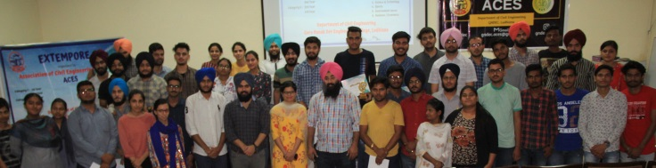

# Association of Civil Engineering Students (ACES)

| [Events Organied](ACES.md) | [Gallery](gallery.md) | [ACES Website](https://gndecaces.wordpress.com/) |

#### Various events conducted in the past year by the students and Coordinator are provided in the following table.

| Sr. No. | Name of Event Organized             | Faculty Coordinator                            | Duration | Date(s)               |
|:--------|:------------------------------------|:-----------------------------------------------|:---------|:----------------------|
| 1.      | Group Discussion                    | Prof. Yuvraj Singh & Prof. Sukhwinderpal Singh | 1 day    | 25,February, 2020     |
| 2.      | Poster Making Contest               | Prof. Yuvraj Singh & Prof. Sukhwinderpal Singh | 3 day    | 19-21,June, 2020      |
| 3.      | Brains Out                          | Prof. Yuvraj Singh & Prof. Sukhwinderpal Singh | 1 day    | 05,July,2020          |
| 4.      | Teachers Day                        | Prof. Yuvraj Singh & Prof. Sukhwinderpal Singh | 1 day    | 05,September,2020     |
| 5.      | Farewell 404                        | Prof. Yuvraj Singh & Prof. Sukhwinderpal Singh | 1 day    | 06,September,2020     |
| 6.      | Engineers Week                      | Prof. Yuvraj Singh & Prof. Sukhwinderpal Singh | 6 Days   | 14-20,September, 2020 |
| 7.      | Squiz your Mind                     | Prof. Yuvraj Singh & Prof. Sukhwinderpal Singh | 2 Days   | 16-18,September, 2020 |
| 8.      | Getting started with Git and Github | Prof. Yuvraj Singh & Prof. Sukhwinderpal Singh | 1 day    | 27,September, 2020    |
| 9.      | FreeCAD - The designing Contest     | Prof. Yuvraj Singh & Prof. Sukhwinderpal Singh | 5 Days   | 11-15,October, 2020   |
| 10.     | Click-Pic-Diwali                    | Prof. Yuvraj Singh & Prof. Sukhwinderpal Singh | 2 Days   | 14-15,October 2020    |
| 11.     | Children’s Day                      | Prof. Yuvraj Singh & Prof. Sukhwinderpal Singh | 1 Day    | 14,November,2020      |
| 12.     | Kala Purab                          | Prof. Yuvraj Singh & Prof. Sukhwinderpal Singh | 4 Days   | 27-30,November, 2020  |
| 13.     | Skillenzia                          | Prof. Yuvraj Singh & Prof. Sukhwinderpal Singh | 8 Days   | 10-17,March,2021      |
| 14.     | Bridge Constructor                  | Prof. Yuvraj Singh & Prof. Sukhwinderpal Singh | 2 Days   | 6 & 9 May 2021        |
| 15.     | Design Mania                        | Prof. Yuvraj Singh & Prof. Sukhwinderpal Singh | 2 hours  | 7,May,2021            |
| 16.     | Plot the Plot                       | Prof. Yuvraj Singh & Prof. Sukhwinderpal Singh | 2 hours  | 7,May,2021            |
| 17.     | Technical Paper Presentation        | Prof. Yuvraj Singh & Prof. Sukhwinderpal Singh | 2 hours  | 8,May,2021            |
| 18.     | Durability of Concrete              | Prof. Yuvraj Singh & Prof. Sukhwinderpal Singh | 1 hour   | 26,May, 2021          |
| 19.     | Ek Chatur                           | Prof. Yuvraj Singh & Prof. Sukhwinderpal Singh | 1 hour   | 26,August, 2021       |
| 20.     | Teachers Day                        | Prof. Yuvraj Singh & Prof. Sukhwinderpal Singh | 1 hour   | 05,September,2021     |
| 21.     | ACES Felicitation Ceremony          | Prof. Yuvraj Singh & Prof. Sukhwinderpal Singh | 2 hours  | 15,September,2021     |
| 22.     | Engineers' Day                      | Prof. Yuvraj Singh & Prof. Sukhwinderpal Singh | 2 hours  | 15,September,2021     |
| 23.     | Article Wririting Contest           | Prof. Yuvraj Singh & Prof. Sukhwinderpal Singh | 5 Days   | 12-16,September,2021  |
| 24.     | Race to Win                         | Prof. Yuvraj Singh & Prof. Sukhwinderpal Singh | 2 Days   | 12-13,October,2021    |
