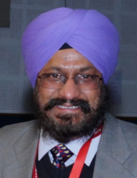
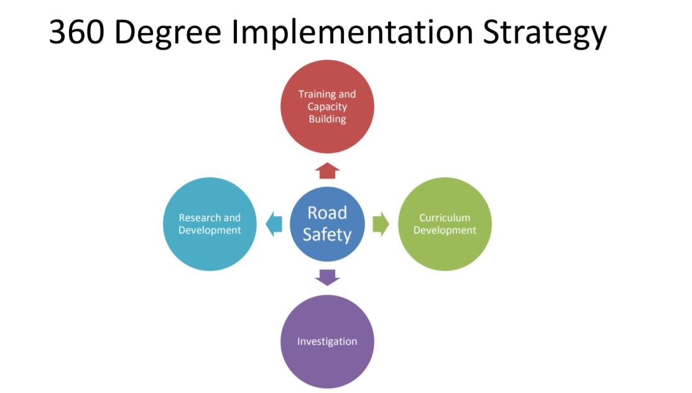
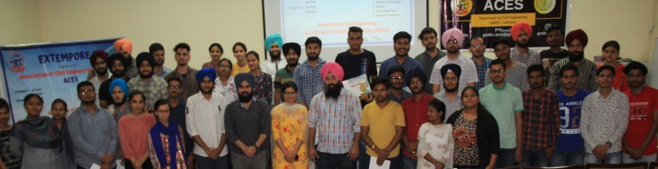

# Department of Civil Engineering  

## Message from HoD's Desk  

It is great to note that the second edition of online “Newsletter” is being published, which will be a compilation of all achievements of various departments/sections. The efforts of the Editorial Team is highly appreciable.

Our vision is to prepare every student for the construction industry and for that our faculty keep updating their knowledge by attending conferencing / workshops / seminars and also contributing to the knowledge pool by conducting research.

The current period imposed additional challenges due to pandemic Covid-19, in which we all need to change our way of working, and need to reorient in our each and every activity. However it also resulted in taking advantage of new technology, which everyone learnt in a short time, which otherwise might have taken quite longer.

We have established a Centre of excellence in Road Safety and Traffic Management with the collaboration of Punjab Police (Govt/. of Punjab) to provide solutions to the problems related to this vital topic and also conduct research in the same area.

Our department is committed to providing students with a strong, broad-based fundamental engineering education, using cutting edge technologies and modern equipment. That coupled with dedicated efforts of staff and faculty results in excellent outcomes, which make our students shine in every nook and corner of this planet.

We also impart entrepreneurial skills to students through summer internships/workshops, so that they would drive the spirit of growth of our economy and would be able to generate employment opportunities for other qualified and skilled people.

I ensure on behalf of my faculty colleagues and staff that we will continue to strive for greater heights in teaching and research that is relevant and shall help in nation-building.

Hope readers of this newsletter find the information therein valuable.

Dr. H S Rai  
HoD, Civil Engineering Department

## Department at Glimpse

####  **UKIERI Concrete Congress**

Department of Civil Engineering, GNDEC alongwith NIT, Jalandhar hosted 5th UKIERI Concrete Congress on **Sustainable Concrete Infrastructure** from March 14-17,2023 in virtual mode. Concrete, being the most powerful material for construction, should have minimal toxic impact on the environment. Keeping this in mind, abundant ideas with feasible solutions were presented by reseachers across world. Dr. Sehijpal Singh, Principal, GNDEC and Dr, H. S. Rai, Head of the Department of Civil Engineering, GNDEC acted as patron and co-patron for this mega-conference, respectively.
To address the issues associated with poor workflow, and making sure that the computer resources are used efficiently and with the provision to track changes, TEQIP-III sponsored skill development training on "Efficient, Trackable and Sustainable Workflow" was organised by Examination Branch of Guru Nanak Dev Engineering College (GNDEC) in association with Departments of Civil Engineering and Computer Science Engineering from December 02-08, 2020.

***The organising team of SDT during the event***  

This one week training suitable for all professionals commenced from December 02, 2020 onwards on a self-paced mode. The skill development training concluded successfully with a valedictory function. Course Co-ordinator, Dr H S Rai while briefing the proceedings of the training program which focussed on Version Control System (VCS) mentioned the diverse range of participants from the Principal of the institution, faculty members, students to non-teaching staff. In order to deliver the course content effectively and efficiently, an excellent learning platform and content management system called Moodle was used. This platform enabled the participants to learn and attain hands on experience at their own pace. The training program also encouraged peer learning by discussing doubts among participants at the dedicated forum. Furthermore, keeping in view the changing scenario, Dr Rai emphasized on paper-less and thus a sustainable approach towards documentation by using available open-source powerful tools. Adding to this, he also talked about importance of version control of these documents which was the core of this training program.

During the valedictory function, feedback from participants was taken. The participants expressed their joy in learning new skills during the training program. One of the participants, Dr K D Singh said that if implemented, such a version control system can prove to be a revolutionary step for the organisation to address issues related to effective management of documentation. Dr Sehijpal Singh, Principal, GNDEC, while addressing the audience said that efficient workflow is the need of every organisation as poor documentation often leads to mismanagement and wastage of lot of resources. He expressed his views on importance of this much needed course for addressing the said issues. Furthermore, he, as a course participant too, said that the training program was an enjoyble and a great learning experience. He congratulated the organising team for this wonderful effort and dedicated approach during the training program.

####  Centre of Excellence-Punjab Road Safety and Traffic Management

To address the issues of increasing road accidents and other traffic related problems in the region of Punjab. The department of Civil Engineering has signed an MoU with Punjab Traffic Police. The department has established an Excellence Centre for conducting various research projects to improve the effectiveness of the Traffic system and reduce the accident rate. The Lab had been setup in August 2021 with the sponsorship of Punjab Police. The Coordinators for the Centre of Excellence is DGP Punjab and from the organization, Dr. Prashant Garg and Prof. Pushpinder Singh are working on various research projects related to the Traffic Management with the participation of students.

## Faculty Achievements  

- **Dr. Harpal Singh** delivered Expert Lecture on BRIDGES-World’s Most Famous,  World’s Longest Model at Institute of Engineering and Technology Jammu, J&K on 7 September 2021"

- **Dr. Harvinder Singh** published a book on Structural Materials in SRPINGER."

## Publications  
- [**Yuvraj Singh, Harvinder Singh.** (2022) The effect of Steel Fibers on Ductility of Reinforced Concrete Beams. In: Indian Structural Steel Conference. Indian Institute of Technology, Hyderabad, India

- [Gaurav Bhougal, **Prabhjot Singh, Dr. H. S. Rai** (2022) Study of Mechanical and Durability properties of Geopolymer concrete incorporated Waste Brick Powder as fine aggregate. In: International Research Journal of Engineering and Technology (IRJET), Volume:09 Issue:11 (p-ISSN:2395-0072)

- [Harmandeep Singh, **Mandeep Kaur, Manvinder Kingra.** Optimum Dosage of GGBFS, Broken Ceramic Tiles, and Copper Slag in the Production of Sustainable Concrete. In: International Research Journal of Engineering and Technology (IRJET) Volume: 09 Issue: 09 (p-ISSN:2395-0072)

- [Pooja Rani, **Dr. Gurdeepak Singh, Charnjeet Singh.** Load Settlement Characteristics of Strip Footing placed on piled sandy slope in PLAXIS 3D. In: International Research Journal of Engineering and Technology(IRJET) Volume:09 Issue:08 (e- ISSN:2395-0056)

## Events Organized (FDPs/Conferences/STCs/SDTs/Workshops/Webinars etc.)  

| Sr. No. | Name of Event                                                  | Faculty Coordinator                                                                  | Duration | Date(s)               | Sponsor(s)                             |
|:------- |:-------------------------------------------------------------- |:------------------------------------------------------------------------------------ |:-------- |:--------------------- |:-------------------------------------- |
| 1       | SDT on "Efficient, Trackable and Sustainable Workflow" (Run-1) | Dr H S Rai & Er. Yuvraj Singh                                                        | One Week | 02-08 December, 2020  | TEQIP-III                              |
| 2       | SDT on "Efficient, Trackable and Sustainable Workflow" (Run-2) | Dr H S Rai & Er. Yuvraj Singh                                                        | One Week | 30 Dec - 05 Jan, 2020 | TEQIP-III                              |
| 3.      | Webinar on “Teacher’s Role in NEP Implementation”              | Dr. Jagbir Singh, Prof. Charnjeet Singh                                              | 1 Day    | 27,February, 2021     | NITI AAYOG, Bharathiya Shikshan Mandal |
| 4.      | FDP on “ICT Initiatives in Technical Education’                | Prof. Lakhveer Singh, Prof. Charnjeet Singh, Prof. Navneet Kaur, Prof. Manpreet Kaur | 6 days   | 8-13 February 2021    | TEQIP-III                              |
| 5.      | Success through Innovation for enhanced road safety | Dr. H S Rai, Dr. Prashant Garg, Er. Pushpinder Singh | 1 day  | 2,September,2021           | CoE, Punjab Road Safety and Traffic Management, GNDEC Ludhiana  |
| 6.      |  Use of GIS and Google traffic data in application to Road safety | Dr. H S Rai, Dr. Prashant Garg, Er. Pushpinder Singh | 1 day  | 2,October,2021           | SCoE, Punjab Road Safety and Traffic Management, GNDEC Ludhiana   |

## Events Attended (FDPs/Conferences/STCs/SDTs/Workshops/Webinars etc.)  

| Sr. No. | Name of Faculty   | Name of Event                                                                                     | Duration | Date(s)               | Organizing Institute                                        |
|:------- |:----------------- |:------------------------------------------------------------------------------------------------- |:-------- |:--------------------- |:----------------------------------------------------------- |
| 1       | Yuvraj Singh      | Indian Structural Steel Conference																  | 2 days	 | 6-8 January, 2022	 | IIT Hyderabad											   |
| 2       | Prabhjot Singh    | Workshop on "Wordpress for Beginners"															  | 2 days	 | 3-4 March, 2022	     | GNDEC, Ludhiana											   |
| 3       | Gurdeepak Singh   | Technology Enabled Teaching Learning                                                              | 5 days   | 16-20 January,2023    | NITTTR Chandigarh, GNDEC Ludhiana                           |
| 4       | Sandeep Kaur      | Technology Enabled Teaching Learning			                                                  | 5 days   | 16-20 January,2023    | NITTTR Chandigarh, GNDEC Ludhiana                           |
| 5       | Heena Malhotra    | Technology Enabled Teaching Learning                                                              | 5 days   | 16-20 January,2023    | NITTTR Chandigarh, GNDEC Ludhiana                           |
| 6		  | Mandeep Kaur      | Technology Enabled Teaching Learning                                                              | 5 days   | 16-20 January,2023    | NITTTR Chandigarh, GNDEC Ludhiana                           |
| 7       | Mandeep Kaur      | Free Software and Resources for Technical Education through ICT									  | 5 days   | 21-25 March, 2023	 | GNDEC, Ludhiana                                             |
| 8       | Prashant Garg	  | Technology Enabled Teaching Learning		                                                      | 5 days   | 16-20 January, 2023   | NITTTR Chandigarh, GNDEC Ludhiana                           |
| 9       | Amandeep Singh    | Technology Enabled Teaching Learning															  | 5 days   | 16-20 January, 2023   | NITTTR Chandigarh, GNDEC Ludhiana                           |
| 10	  | Manvinder Kingra  | Technology Enabled Teaching Learning		                                                      | 5 days   | 16-20 January, 2023   | NITTTR Chandigarh, GNDEC Ludhiana                           |
| 11	  | Manvinder Kingra  | Adoption of Green Construction Practices with Focus on Water Resource		                      | 2 days   | 11-12 February, 2022  | Indian Water Works Association Local Nagpur Centre, Nagpur  |
| 12	  | Manvinder Kingra  | Emerging Trends in Science and Technology									                      | 4 days   | 14-18 February, 2022  | Regional College of Education Research & Technology, Jaipur |
| 13	  | Manvinder Kingra  | Industry-Academia Perspective on Civil Engineering Problems									      | 5 days   | 19-23 March, 2022     | NIT Silchar												   |
| 14	  | Manvinder Kingra  | Construction Management																		      | 1 day    | 4th January, 2023     | Oxford Online Study Course						           |

## [Association of Civil Engineering Students](ACES.md)

