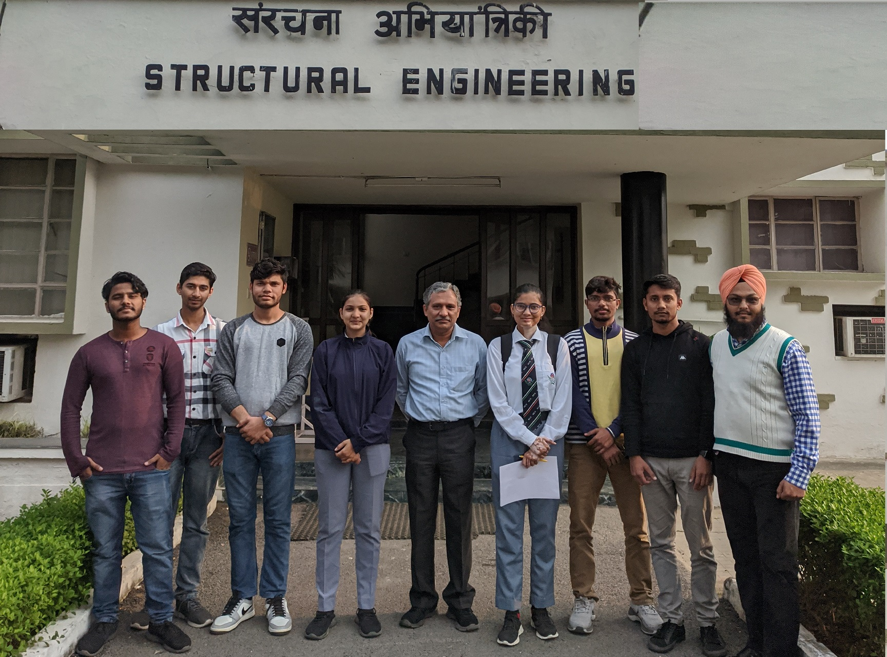

# Department of Civil Engineering  

## Message from HoD's Desk  

It is great to note that the 3rd edition of online “Newsletter” is being published, which will be a compilation of all achievements of various departments/sections. The efforts of the Editorial Team is highly appreciable.

Our vision is to prepare every student for the construction industry and for that our faculty keep updating their knowledge by attending conferencing / workshops / seminars and also contributing to the knowledge pool by conducting research. Our department is committed to providing students with a strong, broad-based fundamental engineering education, using cutting edge technologies and modern equipment. That coupled with dedicated efforts of staff and faculty results in excellent outcomes, which make our students shine in every nook and corner of this planet.

We also impart entrepreneurial skills to students through summer internships/workshops, so that they would drive the spirit of growth of our economy and would be able to generate employment opportunities for other qualified and skilled people.

I ensure on behalf of my faculty colleagues and staff that we will continue to strive for greater heights in teaching and research that is relevant and shall help in nation-building.

Hope readers of this newsletter find the information therein valuable.

Dr. H S Rai  
HoD, Civil Engineering Department  

## Department at Glimpse

### UKIERI Concrete Congress  

Department of Civil Engineering, GNDEC alongwith NIT, Jalandhar hosted 5th UKIERI Concrete Congress on **Sustainable Concrete Infrastructure** from March 14-17,2023 in virtual mode. Concrete, being the most powerful material for construction, should have minimal toxic impact on the environment. Keeping this in mind, abundant ideas with feasible solutions were presented by reseachers across world. Dr. Sehijpal Singh, Principal, GNDEC and Dr, H. S. Rai, Head of the Department of Civil Engineering, GNDEC acted as patron and co-patron for this 

 

## Faculty Achievements  

### Publications  

- **Yuvraj Singh, Harvinder Singh.** (2022) The effect of Steel Fibers on Ductility of Reinforced Concrete Beams. In: Indian Structural Steel Conference. Indian Institute of Technology, Hyderabad, India

- Gaurav Bhougal, **Prabhjot Singh, Dr. H. S. Rai** (2022) Study of Mechanical and Durability properties of Geopolymer concrete incorporated Waste Brick Powder as fine aggregate. In: International Research Journal of Engineering and Technology (IRJET), Volume:09 Issue:11 (p-ISSN:2395-0072)

- Harmandeep Singh, **Mandeep Kaur, Manvinder Kingra.** Optimum Dosage of GGBFS, Broken Ceramic Tiles, and Copper Slag in the Production of Sustainable Concrete. In: International Research Journal of Engineering and Technology (IRJET) Volume: 09 Issue: 09 (p-ISSN:2395-0072)

- Pooja Rani, **Dr. Gurdeepak Singh, Charnjeet Singh.** Load Settlement Characteristics of Strip Footing placed on piled sandy slope in PLAXIS 3D. In: International Research Journal of Engineering and Technology(IRJET) Volume:09 Issue:08 (e- ISSN:2395-0056)

## Conference Organized 

| Name of Event                                                  | Organising Institute                                                                  | Duration | Date(s)               |                            |
|:-------------------------------------------------------------- |:------------------------------------------------------------------------------------ |:-------- |:--------------------- |:-------------------------------------- |
| UKIERI Concrete Congree - Sustainable Concrete Infrastructure |NIT, Jalandhar & GNDEC, Ludhiana | 4 days| March 14th-17th,2023 | 

## Events Organized by ACES

| Sr. No. | Name of Event Organized             | Faculty Coordinator                            | Duration | Date(s)               |
|:--------|:------------------------------------|:-----------------------------------------------|:---------|:----------------------|
| 1.      | Rang De Basanti                     | Prof. Yuvraj Singh & Prof. Mandeep Kaur | 1 day    | June 2,2022	        |
| 2.      | Wordpress for Beginners             | Prof. Yuvraj Singh & Prof. Mandeep Kaur | 2 days   | March 03-04, 2022     |
| 3.      | Dumb Charades                       | Prof. Yuvraj Singh & Prof. Mandeep Kaur | 1 day    | March 16, 2022        |
| 4.      | Basics of Designing a Flyer         | Prof. Yuvraj Singh & Prof. Mandeep Kaur | 1 day    | April 20,2022         |
| 5.      | Let's have fun                      | Prof. Yuvraj Singh & Prof. Mandeep Kaur | 1 day    | June 09, 2022         |
| 6.      | Design Frenzy                       | Prof. Yuvraj Singh & Prof. Mandeep Kaur | 2 days   | December 1-2,2022     |
| 7.      | Technoplot	                        | Prof. Yuvraj Singh & Prof. Mandeep Kaur | 1 day    | March 16, 2023        |
| 8.      | Sanrachna						    | Prof. Yuvraj Singh & Prof. Mandeep Kaur | 1 day    | March 17, 2023        |

## Events Attended (FDPs/Conferences/STCs/SDTs/Workshops/Webinars etc.)  

| Sr. No. | Name of Faculty   | Name of Event                                                                                     | Duration | Date(s)               | Organizing Institute                                        |
|:------- |:----------------- |:------------------------------------------------------------------------------------------------- |:-------- |:--------------------- |:----------------------------------------------------------- |
| 1       | Yuvraj Singh      | Indian Structural Steel Conference																  | 2 days	 | 6-8 January, 2022	 | IIT Hyderabad											   |
| 2       | Prabhjot Singh    | Workshop on "Wordpress for Beginners"															  | 2 days	 | 3-4 March, 2022	     | GNDEC, Ludhiana											   |
| 3       | Gurdeepak Singh   | Technology Enabled Teaching Learning                                                              | 5 days   | 16-20 January,2023    | NITTTR Chandigarh, GNDEC Ludhiana                           |
| 4       | Sandeep Kaur      | Technology Enabled Teaching Learning			                                                  | 5 days   | 16-20 January,2023    | NITTTR Chandigarh, GNDEC Ludhiana                           |
| 5       | Heena Malhotra    | Technology Enabled Teaching Learning                                                              | 5 days   | 16-20 January,2023    | NITTTR Chandigarh, GNDEC Ludhiana                           |
| 6		  | Mandeep Kaur      | Technology Enabled Teaching Learning                                                              | 5 days   | 16-20 January,2023    | NITTTR Chandigarh, GNDEC Ludhiana                           |
| 7       | Mandeep Kaur      | Free Software and Resources for Technical Education through ICT									  | 5 days   | 21-25 March, 2023	 | GNDEC, Ludhiana                                             |
| 8       | Prashant Garg	  | Technology Enabled Teaching Learning		                                                      | 5 days   | 16-20 January, 2023   | NITTTR Chandigarh, GNDEC Ludhiana                           |
| 9       | Amandeep Singh    | Technology Enabled Teaching Learning															  | 5 days   | 16-20 January, 2023   | NITTTR Chandigarh, GNDEC Ludhiana                           |
| 10	  | Manvinder Kingra  | Technology Enabled Teaching Learning		                                                      | 5 days   | 16-20 January, 2023   | NITTTR Chandigarh, GNDEC Ludhiana                           |
| 11	  | Manvinder Kingra  | Adoption of Green Construction Practices with Focus on Water Resource		                      | 2 days   | 11-12 February, 2022  | Indian Water Works Association Local Nagpur Centre, Nagpur  |
| 12	  | Manvinder Kingra  | Emerging Trends in Science and Technology									                      | 4 days   | 14-18 February, 2022  | Regional College of Education Research & Technology, Jaipur |
| 13	  | Manvinder Kingra  | Industry-Academia Perspective on Civil Engineering Problems									      | 5 days   | 19-23 March, 2022     | NIT Silchar												   |
| 14	  | Manvinder Kingra  | Construction Management																		      | 1 day    | 4th January, 2023     | Oxford Online Study Course						           |

### Students' Achievements

A group of 6 students went to CSIR-IIT Roorkee for their 6 months Industrial Training. The details are as given below:

| Sr. No. | Name of Student | Name of Project |
| -- | -- | -- |
| 1|Sharanjit Singh | Evaluating 28 - Days Performance Of Rice Husk Ash Green Concrete Under Compression Gleaned From Neural Networks|
| 2|Sidhant Jindal|Retrofitting Of Precode-Built Reinforced Concrete Sructues As Per Present Codes Of Practice Using Sap2000  |
| 3| Yogesh Kumar|Neural Network Based Algorithm To Estimate The Axial Capacity Of Corroded Rc Columns  |
| 4| Mool Chand|Evaluation Of Seismic Performanc Of Rcc Corroded Framed Structure And It’s Retrofitting Using Sap2000 |
| 5|Rohan Singh |Enhancing Sustainability Of Corroded Rc Structures: Estimating Steel-To-Concrete Bond Strength With Ann And Svm Algorithms |
| 6|Sarvanshdeeo Singh Sahota |Ml-Based Computational Model To Estimate The Compressive Strength Of Sustainable Concrete Intergrating Silica Fume And Steel Fiber |

## [Association of Civil Engineering Students - Click Here](ACES.md)

