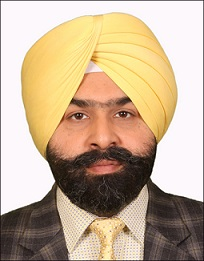

# Department of Computer Science and Engineering  

## Message from HoD's Desk

## Department at Glimpse

 Department of Computer Science and Engineering is established in year 1997. Department is offering B.Tech. and M.Tech. programs in Computer Science and Engineering. Laboratories of the department are equipped with state of the art infrastructure to cater course work and research activities. A Good number of books is available in departmental library for prompt access to students and faculty members. Under academic autonomy, study schemes of the offered programs are updated regularly focusing outcome based education, to make students employable as per national and international requirements. Graduates of the department are serving around the globe in eminent companies, academia, as well as in public sector. They are bringing laurel to the department by excelling in fields of their work. Every year a good number of students are clearing different competitive exams

## Student Coordinator
- Harmehak Singh Khangura (1905103)
- Gurleen Kaur (1904995)
- Dupesh Malhan (2004562)
- Ramneet Kaur Sekhon (2004647)

## Student Achievements

- Harveer Singh URN: 1805183, Student of 2018-2022 Batch got placed at a highest package of 51 Lakh per Annum in Microsoft.
- Two students of CSE Department (2017-2021 Batch) URN 1706410, Ayushi Sharma and URN 1706461 Kunika Malhotra got placed at a highest package of 18.17 Lakh per Annum in Walmart Global Technology Services India in 2021.
- Nitin Goyal, Anshik Thakur, Bhavneet, Ashwin, Aaina, Harshil, Participated in Grand Finale, Smart India Hackathon, 2022, Organized at KL university, Vijaywada, Andhra Pradesh.   
- Punar Partap Singh Sidhu URN: 1905032 has been selected in Junior National Shooting Squad.

### Students of CSE Department has successfully cleared various NPTEL MOOC’s courses

| Sr.No. | Name                    | U.R. No. | Course Name                                   | Year |
|:--------|:-------------------------|:----------|:-----------------------------------------------|:------|
| 1      | Anmol Mittal            | 2004540  | Ethical Hacking                               | 2022 |
| 2      | Devanshi Singh          | 2004558  | Ethical Hacking                               | 2022 |
| 3      | Harsh Verma             | 2004586  | Online Privacy                                | 2022 |
| 4      | Harsh Verma             | 2004586  | Ethical Hacking                               | 2022 |
| 5      | Nishant Khanna          | 2115093  | The Joy of Computing using Python             | 2022 |
| 6      | Prabhdeep Kaur          | 2004640  | Ethical Hacking                               | 2022 |
| 7      | Rohit                   | 2004653  | Ethical Hacking                               | 2022 |
| 8      | Rohit                   | 2004653  | Introduction to Industry 4.0 and IIOT         | 2022 |
| 9      | Rohit                   | 2004653  | Statistical Learning for Reliability Analysis | 2022 |
| 10     | Saurav Sharma           | 2004662  | Ethical Hacking                               | 2022 |
| 11     | Saurav Sharma           | 2004662  | Online Privacy                                | 2022 |
| 12     | Yakshi Puri             | 2004688  | Ethical Hacking                               | 2022 |
| 13     | Yakshi Puri             | 2004688  | Social Networks                               | 2022 |
| 14     | Harmehak Singh Khangura | 1905103  | Introduction to Industry 4.0 and IIOT         | 2022 |
| 15     | Harmehak Singh Khangura | 1905103  | Online Privacy                                | 2022 |
| 16     | Harmehak Singh Khangura | 1905103  | Social Network Analysis                       | 2022 |
| 17     | Harmehak Singh Khangura | 1905103  | Solar Energy Engineering and Technology       | 2022 |
| 18     | Gurleen Kaur            | 1904995  | Ethical Hacking                               | 2022 |
| 19     | Gurleen Kaur            | 1904995  | Online Privacy                                | 2022 |
| 20     | Nitin Goyal             | 1905026  | Deep Learning                                 | 2022 |
| 21     | Jaskamal Singh          | 1905006  | Online Privacy                                | 2022 |
| 22     | Kanav Dua               | 1905011  | Ethical Hacking                               | 2022 |
| 23     | Kanav Dua               | 1905011  | Introduction to Industry 4.0 and IOT          | 2022 |
| 24     | Kanav Dua               | 1905011  | Conservation Geography                        | 2022 |
| 25     | Blossom                 | 1904984  | Online Privacy                                | 2022 |
| 26     | Gurleen Kaur            | 1904994  | Online Privacy                                | 2022 |
| 27     | Gurleen Kaur            | 1904994  | Ethical Hacking                               | 2022 |
| 28     | Jasmine Kaur Gill       | 1905008  | Online Privacy                                | 2022 |
| 29     | Jasleen Kaur            | 1905007  | Online Privacy                                | 2022 |
| 30     | Shantanu Kumar          | 1905049  | Ethical Hacking                               | 2022 |
| 31     | Vishal Dutta            | 1905062  | Ethical Hacking                               | 2022 |
| 32     | Prabhjot Singh          | 1905029  | Ethical Hacking                               | 2022 |
| 33     | Avneet Kaur             | 2004556  | Social Networks                               | 2021 |
| 34     | Harsh Verma             | 2004586  | Social Networks                               | 2021 |
| 35     | Harsh Verma             | 2004586  | The Joy of Computing using Python             | 2021 |
| 36     | Karandeep Singh         | 2004608  | Problem Solving through Programming in C      | 2021 |
| 37     | Karandeep Singh         | 2004608  | Programming, DS and Algo using Python         | 2021 |
| 38     | Karandeep Singh         | 2004608  | The Joy of Computing using Python             | 2021 |
| 39     | Muskandeep Kaur         | 2004628  | Social Networks                               | 2021 |
| 40     | Prabhdeep Kaur          | 2004640  | Social Networks                               | 2021 |
| 41     | Rajat Kapoor            | 2004646  | Social Networks                               | 2021 |
| 42     | Rohit                   | 2004653  | Social Networks                               | 2021 |
| 43     | Saurav Sharma           | 2004662  | Social Networks                               | 2021 |
| 44     | Harmehak Singh Khangura | 1905103  | Social Networks                               | 2021 |
| 45     | Harmehak Singh Khangura | 1905103  | The Joy of Computing using Python             | 2021 |
| 46     | Harmehak Singh Khangura | 1905103  | Introduction to Machine Learning              | 2021 |
| 47     | Gurleen Kaur            | 1904995  | The Joy of Computing using Python             | 2021 |
| 48     | Nitin Goyal             | 1905026  | Data Analytics with Python                    | 2021 |
| 49     | Jaskamal Singh          | 1905006  | Social Networks                               | 2021 |
| 50     | Jaskamal Singh          | 1905006  | Data Analytics with Python                    | 2021 |
| 51     | Kanav Dua               | 1905011  | The Joy of Computing using Python             | 2021 |
| 52     | Kanav Dua               | 1905011  | Real -Time Systems                            | 2021 |
| 53     | Blossom                 | 1904984  | The Joy of Computing using Python             | 2021 |
| 54     | Blossom                 | 1904984  | Introduction to Internet Of Things            | 2021 |
| 55     | Jasmine Kaur Gill       | 1905008  | Social Networks                               | 2021 |
| 56     | Jasmine Kaur Gill       | 1905008  | Introduction to Internet Of Things            | 2021 |
| 57     | Jasleen Kaur            | 1905007  | The Joy of Computing using Python             | 2021 |
| 58     | Shantanu Kumar          | 1905049  | Real-Time Systems                             | 2021 |
| 59     | Shantanu Kumar          | 1905049  | Social Networks                               | 2021 |
| 60     | Shantanu Kumar          | 1905049  | The Joy of Computing using Python             | 2021 |
| 61     | Shantanu Kumar          | 1905049  | Introduction to Internet Of Things            | 2021 |
| 62     | Gurinder Singh          | 1904992  | Social Networks                               | 2021 |
| 63     | Vishal Dutta            | 1905062  | The Joy of Computing using Python             | 2021 |
| 64     | Vishal Dutta            | 1905062  | Data Analytics with Python                    | 2021 |
| 65     | Prabhjot Singh          | 1905029  | Optical Engineering                           | 2021 |
| 66     | Vrishti Gupta           | 1905064  | The Joy of Computing using Python             | 2021 |
| 67     | Priyanka Jhamb          | 1905379  | Design Thinking - A Primer                    | 2021 |
| 68     | Priyanka Jhamb          | 1905379  | The Joy of Computing using Python             | 2021 |
| 69     | Sehajbir Singh          | 1905046  | Data Analytics with Python                    | 2021 |
| 70     | Sehajbir Singh          | 1905046  | Data Science for Engineers                    | 2021 |
| 71     | Harmehak Singh Khangura | 1905103  | Introduction to Internet Of Things            | 2020 |
| 72     | Gurleen Kaur            | 1904995  | Introduction to Internet Of Things            | 2020 |
| 73     | Nitin Goyal             | 1905026  | Data Structure and Algorithms using Java      | 2020 |
| 74     | Nitin Goyal             | 1905026  | Design and Analysis and Algorithms            | 2020 |
| 75     | Jaskamal Singh          | 1905006  | The Joy of Computing using Python             | 2020 |
| 76     | Kanav Dua               | 1905011  | Introduction to Machine Learning              | 2020 |
| 77     | Kanav Dua               | 1905011  | Social Networks                               | 2020 |
| 78     | Shantanu Kumar          | 1905049  | Introduction to Machine Learning              | 2020 |
| 79     | Anjandeep Kaur          | 1904978  | Introduction to Internet Of Things            | 2020 |
| 80     | Vrishti Gupta           | 1905064  | Problem Solving through Programming in C      | 2020 |
| 81     | Sehajbir Singh          | 1905046  | Python for Data Science                       | 2020 |
| 82     | Priyanka Jhamb          | 1905379  | Developing Soft Skills and Personality        | 2019 |

### Students/ Faculty Conference Publications

| Sr. No. | Title of Paper                                                                             | Name of Authors                      | Name of Journal/ Conference                                                               | Level          | Year |
|---------|--------------------------------------------------------------------------------------------|--------------------------------------|-------------------------------------------------------------------------------------------|----------------|------|
| 1       | Face Sketch constructor and Identity Attestation                                           | 1. Jasmine Kaur Gill (1905008)       | 10th International Conference on Advancements in Engineering and Technology (ICAET-2022)  | International  | 2022 |
|         |                                                                                            | 2. Sehajpreet Kaur (1905222)         |                                                                                           |                |      |
|         |                                                                                            | 3. Blossom (1904894)                 |                                                                                           |                |      |
|         |                                                                                            | 4. Prof. Gurjit Kaur                 |                                                                                           |                |      |
| 2       | Aristocratic Trends of Cyber Attacks: Visualizing Ukraine Defended Surface as a Case Study | 1. Harmehak Singh Khangura (1905103) | International Conference on Data Science and Computational Intelligence (ICDSCI-2022)     | International  | 2022 |
|         |                                                                                            | 2.Khushanpreet Singh (1905012)       |                                                                                           |                |      |
|         |                                                                                            | 3. Harpreet Singh (2004694)          |                                                                                           |                |      |
|         |                                                                                            |  4. Dr. Daljit Singh                 |

## Students of CSE participated and bagged various positions in IKGPTU Zonal Youth Festival  

| S.No. | Name             | URN     | Name of Event                                                                           | Level |
|-------|------------------|---------|-----------------------------------------------------------------------------------------|-------|
| 1     | Avaluday Singh   | 2004554 | Bhangra  (1st Position), IKG Punjab Technical University Zonal Youth Festival           | Zonal |
| 2     | Taranpreet Kaur  | 2004678 | Gidha (2nd Position), IKG Punjab Technical University Zonal Youth Festival              | Zonal |
| 3     | Hushanpreet Kaur | 2004588 | Gidha (2nd Position), IKG Punjab Technical University Zonal Youth Festival              | Zonal |
| 4     | Nidhi            | 2004630 | Gidha (2nd Position), IKG Punjab Technical University Zonal Youth Festival              | Zonal |
| 5     | Parminder Kaur   | 2004558 | Gidha (2nd Position), IKG Punjab Technical University Zonal Youth Festival              | Zonal |
| 6     | Ayush Kalia      | 2215003 | Western Group Song (1st Position), IKG Punjab Technical University Zonal Youth Festival | Zonal |
| 7     | Ashish Baweja    | 2104078 | Group Shabad (1st Position), IKG Punjab Technical University Zonal Youth Festival       | Zonal |
| 8     | Karthik K.       | 2104134 | Group Shabad/Group Song Indian, IKG Punjab Technical University Zonal Youth Festival    | Zonal |
|       |                  |         | (1st & 2nd Position)                                                                    |       |
| 9     | Vansh Khanna     | 2004683 | Group Shabad/Group Song Indian                                                          | Zonal |
|       |                  |         | (1st & 2nd Position), IKG Punjab Technical University Zonal Youth Festival              |       |
| 10    | Yogita Sharma    | 1905835 | Light Indian Vocal/Group Song Indian                                                    | Zonal |
|       |                  |         | (2nd Position), IKG Punjab Technical University Zonal Youth Festival                    |       |
| 11    | Ekuspreet Singh  | 2115043 | Elocution/Essay Writing                                                                 | Zonal |
|       |                  |         | (2nd Position), IKG Punjab Technical University Zonal Youth Festival                    |       |
| 12    | Naval            | 2104226 | Quiz                                                                                    | Zonal |
|       |                  |         | (1st Position), IKG Punjab Technical University Zonal Youth Festival                    |       |
| 13    | Vivek Thakur     | 2004687 | On The Spot Painting                                                                    | Zonal |
|       |                  |         | (1st Position), IKG Punjab Technical University Zonal Youth Festival                    |

## Faculty Achievements  

-  **Dr. Daljeet Singh** became Nominee Member of Computer Society of India, Till 31st Oct, 2023.
- **Dr. Kiran Jyoti** joined as an Associate Professor in the department of Computer Science & Engineering.
- **Dr. Amit Jain** with his team published a Patent entitled “INTELLIGENT VIDEO MONITORING SYSTEM BASED ON DEEP LEARNING TECHNIQUES FOR AUTOMATIC SURVEILLANCE” vide application ID 202141026147.
- **Dr. Amit Jain** with his team published a Patent entitled “AN IOT AND CLOUD COMPUTING ENABLED 5G SENSOR NETWORK FOR SMART CITY IMPLEMENTS” vide application ID 202111041401.

## Publications  

- [Pankaj Bhambhri, Manpreet Singh, **Amit Jain, Inderjit Singh Dhanoa**, Vijay Kumar Sinha & Shyam Lal (2021, June). Classification of Gene Expression Data with the Aid of Optimized Feature Selection. Turkish Journal of Physiotherapy and Rehabilitation, 32(3).](https://turkjphysiotherrehabil.org/pub/pdf/321/32-1-142.pdf)
- [Navdeep Kaur Deol, **Vivek Thapar, Jaswant Singh.** (2021, September). Movies Reviews Sentiment Analysis using Improved Random Forest Algorithm and ACO (Ant Colony Optimization) Approach. International Journal of Computer Sciences and Engineering, 9(9).](https://www.ijcseonline.org/pdf_paper_view.php?paper_id=5390&4-IJCSE-08697.pdf)
- [Isha, **Jasbir Singh Saini & Kamaldeep Kaur** (2021, July). A Machine Learning Approach for Network Traffic Classification. International Journal of Engineering Research in Computer Science & Engineering, 8(7).](https://www.technoarete.org/common_abstract/pdf/IJERCSE/v8/i7/Ext_07294.pdf)
- [**Amit Jain**, Vikrant Aggarwal, Rakesh Kumar & Harmeet Singh Pabla (2021). Availability and Optimization of Continuous Manufacturing System Using Markov Modelling and Genetic Algorithm. International Conference on Communication and Artificial Intelligence. Mathura: Springer Lecture Notes in Networks and Systems.](https://link.springer.com/chapter/10.1007/978-981-33-6546-9_24)
- [**Amit Jain**, Manpreet Singh & Pankaj Bhambri (2021, February). Performance evaluation of IPv4-IPv6 tunneling procedure using IoT. Journal of Physics.](https://iopscience.iop.org/article/10.1088/1742-6596/1950/1/012010/meta)
- [Kanika, **Vivek Thapar & Gurjit Kaur** (2021, July). Analysis of Various Image Blind Detection Techniques: Review. International Journal of Engineering Research in Computer Science & Engineering, 8(7).](https://www.technoarete.org/common_abstract/pdf/IJERCSE/v8/i7/Ext_05917.pdf)
- [Kanika, **Vivek Thapar & Gurjit Kaur** (2021, July). Image Blind Detection Using GLCM, ABC and Voting Classification Method. International Journal of Engineering Research in Computer Science & Engineering, 8(7).](https://www.technoarete.org/common_abstract/pdf/IJERCSE/v8/i7/Ext_05126.pdf)
- [Baldeep Kaur, **Sumeet Kaur Sehra & Daljit Singh** (2021, July). An Ensemble Classification Model For Software Defect Prediction. International Journal of Engineering Research in Computer Science & Engineering, 8(7).](https://www.technoarete.org/common_abstract/pdf/IJERCSE/v8/i7/Ext_64715.pdf)
- [**kamaldeep Kaur & Parminder Singh** (2021, December). Punjabi Emotional Speech Database: Design, Recording and Verification. International Journal of Intelligent Systems and Applications in Engineering, 9(4).](https://www.ijisae.org/IJISAE/article/view/1393)
- [**Manpreet Kaur**, Mohammad Zubair Khan, Shikha Gupta, Abdul fattah Noorwali, Chinmay Chakraborty & Subhendu Kumar Pani (2021, May). MBCP: Performance Analysis of Large Scale Mainstream Blockchain Consensus Protocols. (I. Access, Ed.) 9.](https://ieeexplore.ieee.org/abstract/document/9444429)
- [Manpreet Singh, Pankaj Bhambri, **Inderjit Singh, Amit Jain** & Kirandeep Kaur (2021, April). Data Mining Classifier for Predicting Diabetics. Annals of the Romanian Society for Cell Biology, 25(4).](https://ores.su/en/journals/annals-of-the-romanian-society-for-cell-biology/)
- [**Diana Nagpal** & Rajiv Kumar (2021). A Review On Machine Learning Techniques for Human Actions Recognition. Computational Intelligence in analytics and Information Systems. Faridabad.](https://www.appleacademicpress.com/computational-intelligence-in-analytics-and-information-systems-2-volume-set-volume-1-data-science-and-ai-selected-papers-from-ciais-2021-volume-2-advances-in-digital-transformation-selected-papers-from-ciais-2021-/9781774911426)

## Events Attended (FDPs/ Conferences / STCs /SDTs / Workshops / Webinars / Seminars /Training Program etc.)  

| Sr. No. | Name of Event                                                                                                                 | Faculty Coordinator                                           | Duration | Date(s)                | Organizer(s)                                 |
|:--------|:------------------------------------------------------------------------------------------------------------------------------|:--------------------------------------------------------------|:---------|:-----------------------|:-----------------------------------------------|
| 1       | Workshop on Hands on Training for Digital Teaching Aids           | Er. Mandeep Kaur | One Day | 07 January, 2021   | GNDEC Ludhiana |
| 2       | Workshop on Hands on Training for Digital Teaching Aids           | Er. Priyanka Arora | One Day | 07 January, 2021   | GNDEC Ludhiana |
| 3       | Workshop on Hands on Training for Digital Teaching Aids           | Er. Kamaldeep Kaur | One Day | 07 January, 2021   | GNDEC Ludhiana |
| 4       | FDP on Google ANDROID DEVELOPMENT WITH KOTLIN           | Er. Mandeep Kaur | One Week | 01-06 March, 2021   | ICT Academy and Google India |
| 5       | FDP on Google ANDROID DEVELOPMENT WITH KOTLIN           | Er. Manpreet Kaur | One Week | 01-06 March, 2021   | ICT Academy and Google India |
| 6       | A PDT for Faculty & Administrators of Project Institutions on Building Institutes for Future           | Er. Priyanka Arora | One Day | 09-11 February, 2021   | IIM, Vishakhapatnam |
| 7       | A PDT for Faculty & Administrators of Project Institutions on Building Institutes for Future           | Dr. Hardeep Singh Kang | One Day | 09-11 February, 2021   | IIM, Vishakhapatnam |
| 8       | A PDT for Faculty & Administrators of Project Institutions on Building Institutes for Future           | Dr. Amit Jain | One Day | 09-11 February, 2021   | IIM, Vishakhapatnam |
| 9       | One Week Online FDP on Efficient, Trackable and Sustainable Workflow           | Dr. Amit Jain | One Day | 30-12-2020 to 05-01-2021   | GNDEC Ludhiana |
| 10       | One Week Online FDP on Efficient, Trackable and Sustainable Workflow           | Er. Jaswant Singh | One Day | 30-12-2020 to 05-01-2021   | GNDEC Ludhiana |
| 11       | One Week Online FDP on Efficient, Trackable and Sustainable Workflow           | Er. Priti Aggarwal | One Day | 30-12-2020 to 05-01-2021   | GNDEC Ludhiana |
| 12       | One Day Online workshop on Github           | Er. Jaswant Singh | One Day | 18 February, 2021   | GNDEC Ludhiana |
| 13       | One Day Online workshop on Github           | Dr. Amit Jain | One Day | 18 February, 2021   | GNDEC Ludhiana |
| 14       | One week Online workshop on ICT Initiatives in Technical Education           | Er. Jaswant Singh | One Day | 8-13 February, 2021   | GNDEC, Ludhiana |
| 15       | Two week Online workshop on Data Science & Analytics           | Er. Jaswant Singh | Two Week | 11-23 February, 2021   | IIT Gandhi Nagar |
| 16       | One Day webinar on Womes's health and wellness| Er. Priti Aggarwal | One Day | 10 March, 2021   | IEEE |

## Main recruiters for CSE Students  
  
| Sr. No. | Name of Company                           |
|---------|-------------------------------------------|
| 1       | Microsoft                                 |
| 2       | Accenture                                 |
| 3       | Walmart Global Technology Services India  |
| 4       | Cognizant                                 |
| 5       | HCL Technologies Ltd.                     |
| 6       | Infosys Limited                           |
| 7       | TCS                                       |
| 8       | WIPRO Limited  Om Careers                 |
| 9       | TATRAS Data Services Pvt. Ltd.            |
| 10      | Nagaro                                    |
| 11      | ASG Technologies Pvt. Ltd.                |
| 12      | Yatra Online Freight Services Pvt. Ltd.   |
| 13      | Om Careers                                |

## Expert Talks held: 
  
| Sr. No. | Name of Expert with Designation and Company                                                                                                                | Audience                                           | Topic of Expert Talk  | Date(s)                | Timings(s)                                 |
|:--------|:------------------------------------------------------------------------------------------------------------------------------|:--------------------------------------------------------------|:---------|:-----------------------|:-----------------------------------------------|
| 1       | Mr. Bharat Gulati, Delivery Head, ASG Technologies, Delhi           | B.Tech. (CSE-5th Semester) | Statistics for Data Science |  15 December, 2021   | 5:00 PM|
| 2       | Mr. Maninder Singh, Senior Software Developer, Accenture, Bangalore           | B.Tech. (CSE-5th Semester) | Artificial Intelligence |  4 December, 2021   | 11:00 AM|
| 3       | Ms. Snehdeep Kaur, Member, education Training and Assessment, Infosys, Mysore          | B.Tech. (CSE-3rd Semester) | Object Oriented programming |  4 December, 2021   | 1:00 PM|
| 4       | Mr. Manpreet Gill, Senior IT Test Specialist, Telstra, Australia           | B.Tech. (CSE-3rd Semester) | Compter Networks |  4 December, 2021   | 5:00 PM|
| 5       | Mr. Gurdeepak Singh, Data Warehouse and Reporting, Federal Home Loan Bank of Indianapolis, US           | B.Tech. (CSE-3rd Semester) | Database and Management System |  25 November, 2021   | 5:00 PM|
