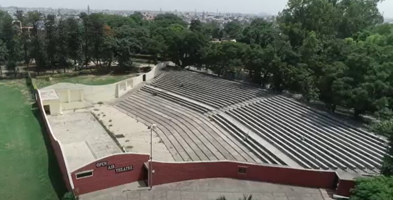

# Cultural Committee

The Cultural Committee of Guru Nanak Dev Engineering College is a fusion of Cultural and fine arts committee. It celebrates the social decent as well as cultural diversity in the campus by organizing various festivals and events. The committee guarantees that the students have a home-away-from-home involvement and experience at the campus. The committee gives enough chances to the students to relax and enjoy campus life in the midst of thorough academics.

The students of the college come from diversified backgrounds, the committee helps to unite and learn each other’s cultural diversity. We understand the importance of cultural sensitivity in today's world and the cultural committee makes the young leaders at GNDEC sensitive to each other's culture.

It aims to provide rich social-cultural experiences with the goal that the students appreciate the multi-cultural diversity of our general public.

The Cultural Committee of Guru Nanak Dev Engineering College is one of the crucial committees responsible for the buzz factor amid rigorous students' college life. It takes care of the social as well as the cultural aspects of life at the institute. The Cultural Committee provides a platform to catch the energetic persona of the students by offering them a stage to exhibit their inward imagination and talents.

The team organizes various cultural activities round the year to keep the spirits of the campus at enigmatic heights. It ensures that the memories of each event is permanently etched in the hearts of the students. It requires a lot of effort and planning to organize events on this scale, for which we are glad that GNDEC Ludhiana has a strong and dedicational team with multitude of skills.

The committee seeks to create a platform that provides the students with an opportunity to display creative talents in a variety of ways.

## Infrastructure
### **Auditorium**

The auditorium is a central and important space in any organization lucky enough to have one. It is used for all types of formal assembly: lectures, award ceremonies, dramatic plays, musical theatre productions, Dance, and Literary competitions and so on. These varied events place a range of demands on the room. For all events, it is essential that everyone in the room hear, clearly and enjoyably, everything that is presented. This is the goal of acoustical design for auditorium spaces. Capacity of Auditorium is 650

### **Open Air Theatre**

Open air theatre is a central point of attraction for the students where various events are organized. It is used for all types Cultural Activities - Dance, Theatre, Music and Literary competitions and so on. Capacity of Auditorium is 3500. Annual Cultural Function - Anand Utsav is also organized in Open Air Theatre

## Achievements

- 2020  
    - College Bhangra Team participated in National Youth Festival held at Amity University, Noida

- 2019  
    - College Won Overall Trophy in Zonal and InterZonal in IKGPTU Youth Festival
    - College Bhangra Team Participated in North Inter University Youth Festival held at Guru Nanak Dev University, Amritsar and bagged 3rd Position
    - College Theatre Team participated in North Inter University Youth Festival held at Guru Nanak Dev University, Amritsar

- 2018  
    - College Won Overall Trophy in Zonal IKGPTU Youth Festival
    - College Bhangra team participated in South Asian Universities Festival held at Ganpat University, Mehsana, Gujarat (International Level)

- 2017  
    - College Won Overall Trophy in Zonal in IKGPTU Youth Festival
    - College Bhangra Team Participated in North Inter Uninversity Festival held at MMU University, Ambala

- 2016  
    - College Won Overall Trophy in Zonal IKGPTU Youth Festival
    - College Bhangra Team Participated in National Level Youth Festival held at Shivaji University, Kolhapur and Bagged 1st Position
    - College Bhangra Team Participated in North Inter University Youth Festival held at Chhatrapati Shahu Ji Maharaj University , Kanpur and bagged 2nd Position

- 2015
    - College Won Overall Trophy in Zonal PTU Youth Festival
