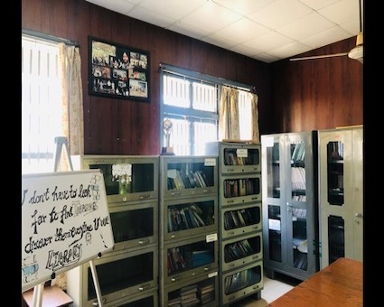

# Department of Electronics and Communication Engineering Engineering  

## Message from HoD's Desk  

The Department of Electronics and Communication Engineering, established in 1981, is one of the most dynamic departments of Guru Nanak Dev Engineering College. It was the first major diversification initiative by the college, 25 years after its establishment. The department is currently running Bachelors and Masters of Technology courses in Electronics and Communication Engineering and has around 10 scholars enrolled for doctorate in areas like Antenna Design, VLSI, Optical communication etc. Ever since its inception, the department has been the hub of academic excellence through some great teachers who have laid a sound foundation as well as the cream of students of the region, who have spread their wings all over the globe. The alumni of the department are not only excelling in India but also in the Silicon Valley and other hubs of Electronics Technology. They are at the forefront of the Telecom revolution of the last 20 years and manning pivotal positions in Telecom operators in India, South East Asia, Pacific region and Africa. In the end, I can say that we incorporate good technical skills and knowledge to each individual associated with us.

Prof. Ameeta Seehra  
Head of Department

## Department at Glimpse

**
The Department's Entrance 
**

**
The Department Office
**

**
The Departmental Library
**

**
Faculty and Students during an Event
**

**
Faculty during an Industrial Visit of First Year Students
**

 **
 One Day Workshop on Home Automation- IETE Students’
Forum (ISF), GNDEC
**

IETE Students’ Forum (ISF), Guru Nanak Dev Engineering College, Ludhiana in association with Bharat Innovations. Organised a workshop named ‘One Day Workshop on Home Automation – Convert your home into smart home’ on November 30, 2021, 3:00 pm onwards. The workshop was organised to give students detailed information about Home Automation in a more practical way. Institution of Electronics and Telecommunication Engineers (IETE Students’ Forum), Guru Nanak Dev Engineering College is thriven to deliver useful detailed information on various ongoing electronics innovations. Our PRO Jashanpreet kaur whole heartedly welcomed the speaker of the day, Raman Srivastav, Founder and owner of Bharat Innovations. Event was successfully managed by Convenor of our ISF society Harshit Singh. The event reached its peaks of success due to Dr. Munish Rattan (Coordinator, ISF), Prof. Shivmanmeet Singh (Faculty Incharge, ISF). Then Raman Srivastav Sir practically enhanced the skills of students by performing group tasks in home automation. The speaker was cordially honoured by Dr. Munish Rattan and Prof. Shivmanmeet Singh.

**
Dr. Munish Rattan and Shivmanmeet Singh honouring the speaker 
**

## Faculty Achievements  

- Dr. Baljeet Kaur, Best paper Award for **Performance Analysis and Power Allocation with Joint Sharing in Hybrid Multicarrier based Cognitive Radio Network**, International conference, PSIT Kanpur, 16-17 December,2021.

- **Harminder Kaur** completed ""Virtual Discussion on National Web Series"" an online course authorized by NEP 2020 on 11 August,2021

- **Harminder Kaur** completed online webinar on **GaN on Silicon Front End Electronics in Advanced Microwave and Millimeter Wave for Space and Defence** on 26 August,2021(NITTTR)

- **Harminder Kaur** participated in one day workshop on **How to write research paper and report writing using LATEX** held on 17 June 2021 at Punjabi University, Patiala in technical collaboration with IEEE Chandigarh

- **Harminder Kaur** participated in an online webinar on **Applications of Texas Instruments Technologies** organised by ECE deptt GNDEC on 7 July 2021

- **Gurjot Kaur Walia** completed **NPTEL online course on "Innovation by Design"** from February-March, 2021

- **Chahat Jain** completed course  by NPTEL on **" Innovation by Design"** from Feb-Mar'2021

- **Chahat Jain** got Best paper Award in **" International Conference on Emerging Technologies: AI, IoT and CPS for Science and Technology Applications"** held during Sept 6-7'2021 at NITTTR, Chandigarh

- **Navneet Kaur** completed online Coursera Course on **“Introduction to Machine Learning”**, completed on 28 May, 2021.

- **Navneet Kaur** completed online Coursera Course on **"Getting Started with AWS Machine Learning by Amazon Web Services"**, completed on 4 July, 2021.

- **Dr. Gurpurneet Kaur**, Completed **Ph.D., July, 2021, I.K.G.P.T.U, Jalandhar**

- **Navneet Kaur** completed online Coursera Course on **"Writing and Editing: Word Choice and Word Order"**, completed on 30 Nov,2021

- **Shivmanmeet Singh**, Reviewed two paper for ICCS 2021 named **“ Investigations on Applicability of Modulation Formats in Coherent Optical Transmission” and "Impact of Data Augmentation on identifying Water bodies in Satellite Images"**

## Publications  

- **Narwant Singh Grewal**, A Review on Inter-Satellite Optical Wireless Communication
System, 9th International Conference on Advancements in Engineering and Technology, (ICAET-2021)- BGIET, Sangrur, pp. 117-121, June 25-26, 2021 (ISBN: 978-81-924893-6-0).

- **Narwant Singh Grewal**, Design Of Square Shape Metasurface Antenna for 2.4 Ghz, 9th International Conference on Advancements in Engineering and Technology, (ICAET-2021)- BGIET, Sangrur, pp. 160-164, June 25-26, 2021
(ISBN: 978-81-924893-6-0)

- **Dr. Baljeet Kaur** ,Hybrid Sharing and Power Allocation using Waterfilling Algorithm for MIMO-OFDM based Cognitive Radio Network,ICTACT Journal on Communication Technology,UGC Care List,2021

- **Dr. Baljeet Kaur** ,Performance Analysis and Power Allocation with Joint Sharing in Hybrid Multicarrier based Cognitive Radio Network, international conference, PSIT Kanpur, 15-16 December.

- **Dr. Baljeet Kaur**, Machine Learning-based
Security Solutions for Healthcare: An Overview, International Conference on Emerging Technologies for Computing, Communication and Smart Cities (ETCCS-2021) organized by Baba Farid College of Engineering and
Technology, Bathinda, Punjab, India on 21st & 22nd August.

- **Dr. Baljeet Kaur**, Security in Industrial control systems using Machine learning algorithm: An overview, 6th international conference on ICT for sustainable development, GOA, 5-6 August, 2021

- **Dr. Baljeet Kaur** ,Performance enhancement of 8 channel SCM-WDM based RoF link using Dispersion Compensation
Technique,9th International Conference on Advancements in Engineering and Technology (ICAET-2021) June 25 – 26, 2021

- **Harminder Kaur** ,Localization in wireless sensor networks using improved DV-Hop algorithm, international research journal of engineering and technology. 3 March 2021.

- **Harminder Kaur** , Performance Enhancement of 8 channel SCM-WDM Based RoF link using dipersion compensation techniques. IEEE technically sponsored 9th International Conference June 25-26, 2021 Bhai Gurdas Institute and Technology Sangrur.

- **Gurjot Kaur Walia** presented a paper titled "Comparative Analysis Of Different Noises And Bayer Pattern On Image Demosaicing", in International Conference on Recent Innovations in Science & Technology(RIST 2021), 19-20 June, 2021.

- **Gurjot Kaur Walia** presented a paper "Performance Analysis of kNN based Image Demosicing for variable window sizes", in International Conference on Microelectronics and Telecommunication Engineering(ICMETE 2021), 26-27 September, 2021.

- **Gurjot Kaur Walia**, "Internet of Things: Assurance Provocation", in International Conference on Emerging Technologies:AI, IOT, and CPS for Science and Technology Applications(ICET 2021), 6-7 September, 2021.

- **Gurjot Kaur Walia**, "Image Demosaicing: A Roadmap to Peculiarity Imaging", in Turkish Journal of Computer and Mathematics Education, May, 2021.

- **"Navneet Kaur**, A Review Paper On Digital Watermarking Techniques, ""International Conference on Emerging Technologies:AI, IoT, and CPS for Science &
Technology Applications, September 6- 7, 2021.

- **Navneet Kaur**, Impact of Fin Aspect ratio (Tk /Lg) on FinFET Characteristics using Compound gate Dielectrics, "International Conference on Emerging Technologies:AI, IoT, and CPS for Science & Technology Applications, September 6- 7, 2021.

- **Gurpurneet Kaur, Sandeep Singh Gill, Munish Rattan**, Lanthanum Doped Zirconium Oxide (LaZrO2) High-k Gate Dielectric FinFET SRAM Cell Optimization, Transactions on Electrical and Electronic materials, March, 2021, https://doi.org/10.1007/s42341-021-00296-2

- **Gurpurneet Kaur, Sandeep Singh Gill, Munish Rattan**, Whale Optimization Algorithm Approach for Performance Optimization of Novel Xmas Tree-Shaped FinFET, Silicon, April, 2021,https://doi.org/10.1007/s12633-021-01077-5

- **Gurpurneet Kaur, Dr.Sandeep Singh Gill, Dr. Munish Rattan and Dr. Navneet Kaur**, Impact of Fin Aspect ratio (Tk /Lg) on FinFET Characteristics using Compound gate Dielectrics,International Conference on Emerging Technologies: AI, IoT and CPS for Science & Technology Applications, Department of Electronics & Communication Engineering and Electrical Engineering, National Institute of Technical Teachers Training and Research (NITTTR) Chandigarh (Ministry of Education, Govt. of India),06-07 September, 2021

- **Chahat Jain**, " Experimental Investigation of a flexible 3D Ring resonator for Bluetooth Applications", International conference on Emerging Technologies: AI, IoT and CPS for Science & technology Applications", Sept 6-7, 2021, http://ceur-ws.org/Vol-3058/Paper-081.pdf.

- **Chahat Jain**, ""Development of Rectangular Patch Antenna on Primary Recycled ABS Substrate Using Additive Manufacturing for Wireless Communication Applications"",
Reference Module in Materials Science and Materials Engineering,Dec16,2021 https://doi.org/10.1016/B978-0-12-820352-1.00229-7.

- **Chahat Jain**, " Flexible and Wearable Patch Antennas Using Additive Manufacturing: A Framework", Reference Module in Materials Science and Materials Engineering,9 June 2021, https://doi.org/10.1016/B978-0-12-820352-1.00093-6

- **Harsimranjit Singh Gill**, et al., “Metaheuristic Algorithms for Big Data Analytics within the Internet of Things”, Wireless Communications and Mobile Computing, Vol. 2021, Article ID 7147940, 2021.

- **Harsimranjit Singh Gill**, et al., ""Localization in Wireless Sensor Networks Using Improved DV-Hop Algorithm"", International Research Journal of Engineering and Technology, Vol. 8, No. 03, Mar., 2021.

- **Harsimranjit Singh Gill**, et al., “Chaos-based joint speech encryption scheme using SHA-1”, Multimedia Tools and Applications, Vol. 80, pp. 10927-10947, Jan., 2021.

- **Shivmanmeet Singh**, A review on inter satellite optical wireless communication system”, “ 9th International Conference on advancement in Engineering and Technology” on 25-26 June 2021

- **Supriya Sharma, Gurpurneet Kaur and Harminder Kaur**, Crow Search BEENISH Routing Protocol to Increase the Lifetime and Stability of Nodes in WSN, International Conference on Emerging Technologies: AI, IoT and CPS for Science & Technology Applications, Department of Electronics & Communication Engineering and Electrical Engineering, National Institute of Technical Teachers Training and Research (NITTTR) Chandigarh (Ministry of Education, Govt. of India), 06-07 September, 2021

-

## Events Organized (FDPs/Conferences/STCs/SDTs/Workshops/Webinars etc.)  

| Sr. No. | Name of Event                                                  | Faculty Coordinator           | Duration | Date(s)               | Sponsor(s) |
|:--------|:---------------------------------------------------------------|:------------------------------|:---------|:----------------------|:-----------|
| 1       | One week faculty development programme on “  ICT initiatives in Technical Education” | Dr. Narwant Singh Grewal, Prof. Lakhvir Singh Khana| Five days | 08-02-2021 to 13-02-2021 | TEQIP-III  |
| 2       | FDP on “ICT Initiatives in Technical Education” | Dr.Navneet Kaur (Co-cordinator) | One week | 8th-13th February, 2021| TEQIP-III  |
| 3       | One Day workshop on “Hands-on-Training for Digital Teaching Aids” under SWAYAM-NPTEL Local Chapter | Dr.Navneet Kaur (Organizing Member) | One day |07-Jan-2021| TEQIP-III  |
| 4       |Seminar on "Career Guidance" | Dr.Navneet Kaur | One day |25-November-2021 | -----  |
| 5       | Webinar on "Applications of Texas Instrument Technologies" | Gurjot Kaur Walia | One day | 07-Jul-21| EdGate Technologies, Bangalore |
| 6       | Webinar on "VLSI and its Real World Applications"| Gurjot Kaur Walia| One day |13-Aug-21 | ----- |
| 7       |Webinar Series to mark Engineer's Day | Gurjot Kaur Walia | Three Days | 13 September, 2021 - 15 September, 2021 | -----  |
| 8       | Virtual session on Strategic IP and Innovation Management | Er. Simranjit Kaur. Dr. Arvind Dhingra | One Day |03-Apr-21 | IPR Cell , STEP, PHDCCI  |
| 9       | BRAIN STORM 2021 | Prof. Shivmanmeet Singh | One Day |18 Feb 2021 | IETE |
| 10       | TRICKS AND BRICKS 2021 | Prof. Shivmanmeet Singh | One Day |15 April 2021 | IETE |
| 11       | EV DRIVE | Prof. Shivmanmeet Singh | One Day |29 May 2021 | IETE |
| 12       | WORKSHOP ON HOME AUTOMATION | Prof. Shivmanmeet Singh | One Day |30 November 2021 | IETE |
| 13       | Skill Development Workshop on Information Security | Dr.Harsimranjit Singh Gill  | Two Weeks |February 8 – 20, 2021 | TEQIP-III under the NPIU program, “Train-the-Trainer”,  |

## Events Attended (FDPs/Conferences/STCs/SDTs/Workshops/Webinars etc.)  

| Sr. No. | Name of Faculty | Name of Event | Duration | Date(s) | Organizing Institute |
|:--------|:----------------|:--------------|:---------|:--------|:---------------------|
| 1       |   Gurjot Kaur Walia |      ATAL-FDP on Personal Effectiveness |     One week  |      5 January, 2021 - 9 January, 2021 | Birla Institute of Technology, Mesra | 2       |     Gurjot Kaur Walia |     NPTEL-AICTE FDP on Innovation by Design |  1/2 of one week  |15 February-12 March, 2021| IIT, Bombay |
| 3        |    Gurjot Kaur Walia |         FDP on NBA Accreditation and Examination Reforms  | One Week  | 17 May, 2021 - 21 May, 2021 |  NITTTR, Chandigarh |
| 4        |    Gurjot Kaur Walia | ATAL-FDP on Recent Trends in Digital Image Processing |    One Week |  7 June, 2021 - 11 June, 2021 |    Poornima institute of Engineering and Technology, Jaipur |
| 5        |   Gurjot Kaur Walia| ATAL-FDP on Moral Values, Attitude and Workplace Behavior| One Week |27 July, 2021 - 31 July, 2021 |            GL Bajaj Institute of Technology and Management, Greater Noida|
| 6         | Dr. Gurpurneet Kaur, Gurjot Kaur Walia, Harminder Kaur  | Webinar on GaN on Silicon front-end electronics in advanced microwave and millimeter-wave systems for space and defence |  One Day  | 26-August -21 | NITTTR, Chandigarh |
| 7        |  Gurjot Kaur Walia, Dr.Gurpurneet Kaur,Chahat Jain, Harminder Kaur Aulakh   |QIP-STC on Visual Cognition | One Week | 4 October, 2021 - 9 October, 2021 | NITTTR, Chandigarh |
| 8        | Gurjot Kaur Walia  |    Workshop on Funding Opportunities in Electronics Engineering |     One Day |     26-Nov-21 |    PEC, Chandigarh and IEEE Chandigarh Subsection |
| 9        |   Gurjot Kaur Walia |     ATAL-FDP on ROAD: Response Effectiveness, Organizing Self, Attitudinal Shift, Decision Making |  One Week |  6 December, 2021 - 10 December, 2021 | Girijananda Chowdhury Institute of Pharmaceutical Science, Guwahati |
| 10         | Harsimranjit Singh Gill  | NBA Accreditation and Examination Reforms |One Week|  17 May, 2021 - 21 May, 2021|    Curriculum Development Centre, NITTTR, Chandigarh |
|  11      |  Harsimranjit Singh Gill |  Addressing FEC challenges on your next generation 800G desi  | 1 day| August 04, 2021 |       Keysight Technologies|               
| 12 |Harminder Kaur Aulakh, Harsimranjit Singh Gill |   Recent Developments and Applications in Aerospace | One Week |22 Nov 2021 to 26 Nov 2021 | Punajb State Aeronautical Engineering College|      
| 13         | Chahat Jain |ATAL FDP on Manufacturing and Characterization of 3D Printed Materials (MC3DPM-2021)| One Week | 13 Dec 2021to 17 Dec 2021 |NITTTR, Chandigarh
| 14   | Chahat Jain | Elementary FDP on " 3D Printing & Design" | One Week |23 Aug 2021-27 Aug 2021 |Murugappa Polytechnic College |                 
| 15   | Chahat Jain | 9th international conference on  " Advancements in Engineering & Technology" |  2 Days |25 June 2021-26 June 2021| Bhai Gurdas Institute of Engineering & Technology, Sangrur (Punjab)|                 
|  16             | Chahat Jain|  AICTE tecognised FDP on "NBA Accreditation and Examination Reforms" | One week |17 May 2021-21 May 2021|   NITTTR, Chandigarh|     
|  17             | Chahat Jain |  One day seminar on" Quality Ecosystem Through NEP‐2020"|  One Day|26 October 2021| NITTTR, Chandigarh
| 18|   Dr.Gurpurneet Kaur  |     Online ATAL Faculty Development Programme on “Nanotechnology for Electronic and Photonic Devices (NanoDev-2021)”          | One Week          |July 12-16, 2021         |Punjab Engineering College, Chandigarh (Deemed to be University)
|   19      |    Dr Baljeet Kaur, Harminder Kaur,  Shivmanmeet Singh |Webinar on VLSI and its real world applications |  One Day  | 13-Aug-21   |     Guru Nanak Dev Engineering College, Ludhiana |
|   20      |        Shivmanmeet Singh | Seminar on Quality ecosystem |One Day|  26 October 2021 | NITTTR, Chandiagrh |
|21|	Gurpurneet Kaur, Harminder Kaur Aulakh, Shivmanmeet Singh |	TEQIP-III sponsored FDP on “ICT initiatives in technical education”|	One Week|8-13 February 2021|	Guru Nanak Dev Engineering College, Ludhiana|
|22|	Harminder Kaur Aulakh |	Professional Development Training (PDT)|	One Week|	March 01 - 06, 2021|Indian Institute of Management Kozhikode  (Online)|
|23|		Harminder Kaur Aulakh|	Applications of Texas Instrument Technologies|	One Day|	07 July 2021|	ECE Department in collaboration with EdGate Technologies Pvt.Ltd.,Bangalore|
|24|	Narwant Singh Grewal |	Workshop on Implementation of NEP-2020 for Quality Online and Open Distance Learning (ODL) Education|	One Day |	April 28, 2021 |	NITTTR, Chandigarh|
|25	|	Narwant singh Grewal|	One week FDP on Data Science and Big Data Analytics|	One Week|	July 26-31, 2021 |	IGCE Abhipur, Chandigarh|
|26|	Dr Baljeet Kaur, Harminder Kaur Aulakh|	Next Generation Wireless Technologies: 5 G and beyond |	One Week |	12 July-17 July 2021|Indo Global College of Engineering, Abhipur New Chandigarh|  
|27|	Narwant singh Grewal|	NPTEL Online course on Design for Internet of Things|	Eight Weeks |	July 26-Sep. 17, 2021 |	NPTEL|
|28|	Harminder Kaur Aulakh |Webinar on “How to be industry ready”|	  One Day |	September 13, 2021|	ECE department GNDEC Ludhiana|
|29	|Harminder Kaur Aulakh |Webinar on “Portrayal of data analytics in industry”|	  One Day |	September 14, 2021|	ECE department GNDEC Ludhiana|
|30	|Harminder Kaur Aulakh |Webinar on “Embedded Systems”|	  One Day |	September 15, 2021|	ECE department GNDEC Ludhiana|
|31	|   Dr. Gurpurneet Kaur    | AICTE - ATAL sponsored FDP on "Future Perspective on Semiconductor Devices 	    |	One Week      | 21st to 25th June, 2021     |	 Kalasalingam Academy of Research and Education     |
|32| Dr. Gurpurneet Kaur |	AICTE-MRSPTU sponsored FDP/STTP on “IoT & its Applications” |	  One Week|February 15-20, 2021|	Giani Zail Singh Campus College of Engineering & Technology-MRSPTU, Bathinda (Punjab) |
|33|	Dr.Gurpurneet Kaur |	Online ATAL Faculty Development Programme on “VLSI -IP DESIGN Approach to SRAM compiler design”| One week|	August 16-20, 2021|GM Institute of Technology|
|34|	Dr.Gurpurneet Kaur| Academy Online Elementary FDP on "Branding of Higher Education Institutes for Enhanced Outcomes" |	One Week |	September 13-17, 2021|	National Institute of Technical Teachers Training & Research, Chandigarh|
|35| Dr. Baljeet Kaur|Online Professional Development Training|3 days|1-3 March 2021|IIM Trichy|	 
|36| Dr. Baljeet Kaur|"Emerging Trends in OFC Technology"AICTE Training And Learning (ATAL) Academy|1 week |2-6 August  2021|NITTTR, Chandigarh|	 

## Expert Lecture delivered

- **Dr. Baljeet Kaur**, Radio on Fiber (RoF) &Passive Optical Networks (PONs), 05.08.2021,AICTE Training And Learning (ATAL) Academy Online Elementary FDP on ""Emerging Trends in OFC Technology"" from 02/08/2021 to 06/08/2021 at National Institute of Technical Teachers Training and
Research (NITTTR) .

- **Dr. Baljeet Kaur**, Expert talk on short- term course (Online mode) on “Advances in OFC Technology” from 12-16 July 2021. NITTTR Chandigarh

- **Dr. Harsimranjit Singh Gill**, Networks and Standards of Multimedia Communication, 6th to 8th Jan., 2021 , Govind Ballabh Pant Institute of Engineering & Technology, Pauri Garhwal, Uttarakhand.  

- **Dr. Harsimranjit Singh Gill**, “Information Security” at Guru Nanak Dev Polytechnic College, Ludhiana, 7 Dec., 2021.

- **Prof. Shivmanmeet Singh**, Lecture on Research papers, at GNDEC Ludhiana on 9th March 2021.

## Student's Corner  

#### - Student's Achievements

- **Jashanpreet Kaur**, secured 3rd position in the event Speak with Slides held from 6-9 May, 2021 organized during i-GNEz at Guru Nanak Dev Engineering College, Ludhiana.
- **Gurveer Kaur** participated in one week TEQIP-III sponsored student development programme (SDP) on "Students Learning and Skill Enhancement Through Interdisciplinary Interventions "
- **Jashanpreet Kaur**, got 2nd prize in Painting competition in Anand Utsav 2021.

## IETE STUDENT FORUM

### 
BRAIN STORM 2021

ISF organized a Machine Learning Quiz named “BRAIN STROM” on 18th of February, 2021.
The event was organized under the guidance of:

- Prof. Shivmanmeet Singh
(Faculty)ECE dept.
- Arshad Ali (Convenor)
D4ECA1
- Co-Convenor: Sanu Kumar,
Harshit Singh
The organizers of this event were the following students:
- Shubhangi Aryan D4ECE
- Mani Raj Ranjan D2ECE
- Krishna Murari D2EE

### 
TRICKS AND BRICKS APTITUDE

IETE Students’ Forum (ISF) regularly organizes technical and non-technical events where students are given chance to showcase their talent and knowledge. The prime intent of this
ISF is to enhance the students’ technical merit and implant the habit of deeper learning and research.
With same vision, ISF organized a Fun-Techno event named “TRICKS AND BRICKS APTITUDE”
on 15 th of April, 2021.
The event was organized under the guidance of:

- Prof. Shivmanmeet Singh
(Faculty) ECE dept.
- Arshad Ali (Convenor)
- Harshit Singh (Co-Convenor)

### 
EV-DRIVE
   

 IETE Students' Forum organized an event named “EV-DRIVE” on 29th MAY, 2021. A total of 240 students and faculty participated in the event.
The event was organized under the guidance of:

- FACULTY ADVISOR
Prof. SHIVMANMEET SINGH
- CONVENOR Mr. ARSHAD ALI
- EVENT HEAD Mr. REHAN DHIR
- SECRETARY Ms. SHUBHANGI ARYAN
- CO-CONVENOR  Mr. HARSHIT SINGH
