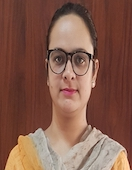

̨̨̨
# Department of Electronics and Communication  Engineering

## Message from HoD's Desk  

The Department of Electronics and Communication Engineering, established in 1981, is one of the most dynamic departments of Guru Nanak Dev Engineering College. It was the first major diversification initiative by the college, 25 years after its establishment. The department is currently running Bachelors and Masters of Technology courses in Electronics and Communication Engineering and has around 10 scholars enrolled for doctorate in areas like Antenna Design, VLSI, Optical communication etc. Ever since its inception, the department has been the hub of academic excellence through some great teachers who have laid a sound foundation as well as the cream of students of the region, who have spread their wings all over the globe. The alumni of the department are not only excelling in India but also in the Silicon Valley and other hubs of Electronics Technology. They are at the forefront of the Telecom revolution of the last 20 years and manning pivotal positions in Telecom operators in India, South East Asia, Pacific region and Africa. In the end, I can say that we incorporate good technical skills and knowledge to each individual associated with us.

Dr. Narwant Singh Grewal  
(Head of Department)

## Department at Glimpse

### The Department's Entrance

-----------------------------------------

### The Departmental Library

-----------------------------------------

### Two days workshop on “Recent trends and career opportunities in VLSI design on 22-23, Sept 2022

-----------------------------------------

### Expert talk on Recent Advancements in Optical communication on 12, Aug 2022

------------------------------------------

### Expert talk on Recent Advancements in Optical Field on 12, Aug 2022

-----------------------------------------

### Teachers Day Celebration at ECE Department on 5, Sept 2022

-----------------------------------------

### ECE Student developed website for esteemed Engineering Institute in Maharashtra

**Mohammad Yasir(URN:2104400)** worked on paid project that is development of college’s official website(dynamic) and Alumni portal of SSGMCE, Shegaon, Buldhana District, Maharashtra.

College Website link: https://ssgmce.ac.in/

Alumni portal link: https://www.alumni.ssgmce.ac.in/alumni/

-----------------------------------------

### ECE Students during GNEAPEX on 8, Apr, 2022

Project: Designed a working model of a hydraulic Excavator which works on the principle of of Pascal’s Law

Team Members:
- Ali Ahmad Ansari
- Adarsh Mishra
- Anant Vijay
- Rahul Kumar
- Gurnoor Singh
- Guransh Singh

-----------------------------------------

## Faculty Achievements  

- **Preeti Pannu** earned Elite and Topper certificate for NPTEL 4 week Course on Stress Management from July-Dec, 2022.

- **Preeti Pannu** recognised as mentor for the NPTEL online certification course "Stress Management"(July 2022- Dec 2022).

- **Harminder Kaur D/o S. Avtar Singh** recognised as mentor for the NPTEL online certification course(July 2022- Dec 2022).

- **Gurjot Kaur Walia** was Program Committee Member and Reviewer of International Joint Conference on Advances in Computational Intelligence(IJCACI 2022) organised by SCRIL, South Asian University, New Delhi, India and Jahangir nagar University, Bangladesh on 15-16 October, 2022.

- **Gurjot Kaur Walia** was Reviewer of International Conference on Innovations in Communication Computing and Sciences(ICCS 2022) organised by CEC, Landran on 15-16 September, 2022.

- **Gurjot Kaur Walia** was Program Committee Member and Reviewer of International Conference on Computational Intelligence(ICCI 2022) organised by Indian Institute of Information Technology, Pune on 29-30 December, 2022.

- **Gurjot Kaur Walia** was Program Committee Member and Reviewer in IEEE World Conference on Applied Intelligence and Computing(AIC 2022) held from 17-19, June 2022.

- **Gurjot Kaur Walia, Chahat Jain, Navneet Kaur** won the Best Oral Presentation Award in AICTE Sponsored International Conference on Role of Artificial Intelligence and Sustainable Engineering in Driving Smart Cities, organised by Shri Vishnu Engineering College for Women, Bhimavaram, Andhra Pradesh from 29-31 March, 2022.

- **Gurjot Kaur Walia** earned Elite and Topper certificate for NPTEL 4 week Course on Leadership from Jan-May, 2022.

- **Gurjot Kaur Walia** earned Elite and Topper certificate for NPTEL 4 week Course on Effective Writing from Jan-May, 2022.

- **Navneet Kaur** was Reviewer of 3rd International Conference on Computing, Analytics and Networks (ICAN2022) organised by Chitkara University with technical sponsorship from IEEE during 18-19, November 2022.

- **Navneet Kaur** was Reviewer of International Conference on Innovations in Communication Computing and Sciences(ICCS 2022) organised by CEC, Landran on 15-16 September, 2022.

- **Navneet Kaur** was Reviewer of Journal of Optical Communications.

-**Navneet Kaur** earned Elite and Topper certificate for NPTEL 4 week Course on Effective Writing from Jan-May, 2022.

- **Navneet Kaur** was presented with Top Performing Mentor certificate for NPTEL 4 week Course on Effective Writing from Jan-May, 2022.

- **Navneet Kaur** earned Elite and Topper certificate for NPTEL 4 week Course on Leadership from Jan-May, 2022.

- **Gurpurneet Kaur** earned Elite certificate for NPTEL 4 week Course on Effective Writing from Jan-Feb, 2022.

- **Gurpurneet Kaur** earned Elite and silver certificate for NPTEL 8 week Course on Introduction to Soft Computing from Jan-March, 2022.

- **Gurpurneet Kaur** earned Elite certificate for NPTEL 12 week Course on Digital Circuits from July-October, 2022.

- **Gurpurneet Kaur** earned Elite certificate for NPTEL 8 week Course on System Design Through VERILOG from July-September, 2022.

- **Shivmanmeet Singh** was reviewer of SCIE journal named “frontiers in public health” for paper entitled "The landscape of Photoaging”.

- **Shivmanmeet Singh** received a certificate of appreciation from AICTE for validating the lectures of following SWAYAM course chemical Reaction Engineering-I in the Punjabi language.

- **Shivmanmeet Singh** was reviewer of Scopous (Elsevier) journal named “International Journal of Electrical and Computer Engineering Systems” for paper entitled "Performance Optimization of Universal Filtered Multicarrier Technique for Next Generation Communication Systems”.

- **Simranjit Kaur** organised a one day IP awareness program in collaboration with NIPAM, Govt. of India in GNDEC Ludhiana on 15, March 2022.

- **Simranjit Kaur** presented a research paper in the IEEE international conference, MAPCON 2022 (IEEE-MTT/AP) held in Bangalore, India from 13-15, Dec 2022.

- **Chahat Jain** earned Elite certificate for NPTEL 4 week Course on Leadership from Jan-May, 2022.

- **Chahat Jain** was Reviewer of Journal of Experimental and theoretical artificial intelligence.

## Publications  

- 𝐉𝐚𝐬𝐩𝐫𝐞𝐞𝐭 𝐊𝐚𝐮𝐫, **𝐍𝐚𝐫𝐰𝐚𝐧𝐭 𝐒.𝐆𝐫𝐞𝐰𝐚𝐥, 𝐍𝐚𝐯𝐧𝐞𝐞𝐭 𝐊𝐚𝐮r**, "A Review On Antenna Array Failure Correction Using Optimization Techniques" Journal of Emerging Technologies and Innovative Research (JETIR)(UGC approved: 63975).

- **Narwant Singh Grewal, Gurpurneet Kaur**, "Impact Of Work Function And Temperature Variation On Schottky-Barrier Hetero-Dielectric Gate All Around Nanowire Field Effect Transistor"" Journal of Emerging Technologies and Innovative Research (JETIR)(UGC approved: 63975)".

- **Navneet Kaur, Munish Rattan, Gurpurneet Kaur, Gurjot Kaur Walia**, "Marine Predators Algorithm for Performance Optimization of Nanoscale FinFET", Materials Today Proceedings. DOI: https://doi.org/10.1016/j.matpr.2022.06.404".

- **Gurjot Kaur Walia**, "Estimation of optimized window size for hybridized kNN-Random Forest algorithm based Image Demosaicing", Materials Today Proceedings. DOI:https://doi.org/10.1016/j.matpr.2022.07.017".

- **Gurjot Kaur Walia**, "Hybridised KNN-Random Forest Algorithm: Image Demosaicing with Reduced Artifacts", National Academy Science Letters, DOI: https://doi.org/10.1007/s40009-022-01165-z".

- **Baljeet Kaur, Gurjot Kaur Walia**, "Performance Evaluation of PDM-256_QAM Inter-satellite Optical Wireless System(IsOWC) using DSP and Different Wavelength Windows"", journal of optical Communication, DOI:https://doi.org/10.1515/joc-2022-0119.

- **Navneet Kaur**, "Performance Evaluation of Junctionless FinFET using Spacer Engineering at 15 nm Gate Length, Silicon, March 2022, Volume 14, 10989–11000 https://doi.org/10.1007/s12633-022-01820-6".

- **Navneet Kaur**, "Comparison of Electrical Characteristics of Si Homojunction and SiGe Heterojunction 14 nm SOI FinFET, Journal of The Institution of Engineers (India): Series B, August 2022, Volume 103, Issue 4, p.1061-1067".

- **Shivmanmeet Singh, Dr. Narwant Singh Grewal and Dr. Baljeet Kaur**, "DEVELOPMENT AND ANALYSIS OF HIGH-SPEED SINGLE-CHANNEL ISOWC TRANSMISSION LINK USING A SPECTRALLY EFFICIENT HIGHER-ORDER MODULATION FORMAT (ISSN: 2229-6948(ONLINE) ICTACT JOURNAL ON COMMUNICATION TECHNOLOGY, DECEMBER 2022, VOLUME: 13, ISSUE: 04).

- **Shivmanmeet Singh, Dr. Narwant Singh Grewal and Dr. Baljeet Kaur**, "Performance investigation and development of 112 gbit/s dual polarization 16 QAM transmission system using differential encoding (Optical and Quantum Electronics (2023) 55:70 https://doi.org/10.1007/s11082-022-04287-2)".

- Rajiv Khanna, **Dr. Narwant Singh Grewal, Harminder Kaur**, A Tree Seed Tuned Partial Transmit Sequence Approach For Improving Peak To Average Power Ratio In Universal Filter Multi Carrier For 5G Communication Journal of Emerging Technologies and Innovative Research (JETIR)(UGC approved: 63975).

- Neha  Sharma, **Baljeet  Kaur, and Narwant Singh Grewal**, "Performance enhancement of 8 channel SCM–WDM based RoF link using different type of transmission fibers along with different type of channel spacing" Journal of Optical Communications, (De Gruyter), ISSN 2191-6322".

- Harleen Kaur, **Narwant Singh Grewal**, " Ultra high-speed VLC system using polarization division multiplexed QPSK, DSP, and matched filters. " Optical and Quantum Electronics (Springer)  SCIE  ISSN 1572-817X.

- **Gurjot Kaur Walia, Harminder Kaur**,"A multichannel Hermite Gaussian (HG) intensity profiles based inter-satellite optical wireless communication(IsOWC) using transmitter diversity",Optical and Quantum Electronics. DOI:10.1007/s11082-022-04383-3.

- **Gurjot Kaur Walia**, "Adaptive Image Demosaicing Algorithm Based on K-Nearest Neighbor for Improved Visual Quality"", Samriddhi, DOI: https://doi.org/10.18090/samriddhi.v14i02.17".

- **Harminder Kaur, Gurjot Kaur Walia**,"Impact of various multiplexing, modulation and coding techniques on ISOWC system: A Review",International conference on Tech trends in science and engineering (ICTTSE 2022), Suryodaya College of Engineering and Technology, Nagpur, 25-26 Feb,2022.

- **Baljeet Kaur, Gurjot Kaur Walia**, "Performance and Distance Enhancement of 160GBps ISOWC System using Polarization Division Multiplexed 256-QAM", in 4th International Conference on Recent Innovations in Science and Technology(RIST 2022).

- **Gurjot Kaur Walia, Chahat Jain, Navneet Kaur**, "Pseudo User Interference for Security Enhancement in Co-existing asynchronous GPON/XG-PON System", in International Conference on Role of Artificial Intelligence and Sustainable Engineering in Driving Smart Cities.

- **Simranjit Kaur, Balwinder Singh Dhaliwal** and Sachin Maitthani,"A Compact Flexible Crown Rectangular Fractal Antenna on Low-Cost PET Substrate", in  2022 IEEE Microwaves, Antennas, and Propagation Conference (MAPCON),  IEEE explore , doi: 10.1109/MAPCON56011.2022.10047139".

- Neeraj Kumar, **Ameeta Seehra and Simranjit Kaur**, "Multiple carrier optical frequencycomb generation based on cascading of three different types of modulator in an optical network " in ICRTEM 2022, 2nd international conference on research trends in engineering and management, Aug 2022, ISBN: 978-93-92105-01-2".

- **Chahat Jain, Balwinder S. Dhaliwal** and Rupinder Singh, "On 3D-Printed Acrylonitrile Butadiene Styrene-Based Sensors: Rheological, Mechanical, Morphological, Radio Frequency, and 4D Capabilities" in Journal of Materials Engineering and Performance,2022,https://doi.org/10.1007/s11665-022-06884-4".

- **Chahat Jain,Balwinder S. Dhaliwal**, Rupinder Singh and Vinay Kumar, "Investigations on 3D printed primary recycled ABS for one-way programming"in Advances in Materials and Processing Technologies,2022, https://doi.org/10.1080/2374068X.2022.2109641".

- **Chahat Jain,Balwinder S. Dhaliwal** and Rupinder Singh, "Flexible and Wearable Patch Antennas Using Additive Manufacturing: A Framework" in Encyclopaedia of materials : plastics & polymers,2022,https://doi.org/10.1016/B978-0-12-820352-1.00093-6.

- **Chahat Jain,Balwinder S. Dhaliwal** and Rupinder Singh, "Development of Rectangular Patch Antenna on Primary Recycled ABS Substrate Using Additive Manufacturing for Wireless Communication Applications" in Encyclopaedia of materials : plastics & polymers,2022. https://doi.org/10.1016/B978-0-12-820352-1.00229-7.

## Events Organized (FDPs/Conferences/STCs/SDTs/Workshops/Webinars etc.)  

| Sr. No. | Name of Event                                                  | Faculty Coordinator           | Duration | Date(s)               | Sponsor(s) |
|:--------|:---------------------------------------------------------------|:------------------------------|:---------|:----------------------|:-----------|
| 1       |  Two days workshop on “Recent trends and career opportunities in VLSI design” | Dr. Narwant Singh Grewal, Prof. Gurjot Kaur, Dr. Navneet Kaur| Two days | 22-09-2022 to 23-09-2022 | GNDEC, Ludhiana |
| 2       | Expert talk on Recent Advancements in Optical communication |Gurjot Kaur Walia, Navneet Kaur | One Day | 12-08-2022| GNDEC, Ludhiana |
| 3       | Expert talk on Research Opportunities in Optical Field |Gurjot Kaur Walia, Navneet Kaur | One Day | 12-08-2022| GNDEC, Ludhiana |
| 4       |Workshop on Life Skill Fundamentals | Shivmanmeet Singh | one week |24-01-2022 to 28-01-2022 | GNDEC, Ludhiana |
| 5       | SDP on Women's Day: Poster Competition| Shivmanmeet Singh |One Day| 07-03-2022 |GNDEC, Ludhiana |
| 6       |Hand on session on Split Ink (Apex)| Shivmanmeet Singh  | One Day |08-04-2022 | GNDEC, Ludhiana |
| 7      | Photography Workshop (Apex )| Shivmanmeet Singh  | One Day |08-04-2022 | GNDEC, Ludhiana |
| 8      | A Seminar on Dr. B.R. Ambedkar: An Architect of Modern India| Shivmanmeet Singh | One Day |22-04-2022 | IETE |
| 9    | STC on Video Making Competition | Shivmanmeet Singh | Three Days |17-05-2022 to 20-05-2022 | IETE |
| 10       | "Pedal For Sidhu Moosewla" Event | Shivmanmeet Singh | One Day |03-06-2022 | IETE |
| 11       | Seminar on Mission CAT (Punjab 100) | Shivmanmeet Singh | One day | 24-07-2022 | GNDEC Ludhiana |
| 12       | Seminar on Introductory session on Internships & Scholarships| Shivmanmeet Singh | One day | 05-08-2022 | GNDEC Ludhiana |
| 13     | 5 days workshop on Hands on training: Decision making skills and research writing skills | Shivmanmeet Singh | One week | 08-08-2022 to 12-08-2022 | GNDEC Ludhiana |
| 14       | Webinar on entrepreneurship  - A guide to Success | Shivmanmeet Singh | One day | 07-09-2022 | GNDEC Ludhiana |
| 15       | SDP on Series on time management | Shivmanmeet Singh | Two Days | 10-10-2022 to 12-10-2022 | GNDEC Ludhiana |
| 16     | Seminar on Role of Health and Happiness in life | Shivmanmeet Singh | One Day | 01-12-2022 | GNDEC Ludhiana |

## Events Attended (FDPs/Conferences/STCs/SDTs/Workshops/Webinars etc.)  

| Sr. No. | Name of Faculty | Name of Event | Duration | Date(s) | Organizing Institute |
|:--------|:----------------|:--------------|:---------|:--------|:---------------------|
|   1   |	Preeti Pannu	|  One week faculty development programme on “Recent Trends in Robotics” |	2 weeks |	04-07-2022 to 15-07-2022  |	Electronics and ICT Academics at IIT Roorkee, MNIT Jaipur, NIT Patna and PDPM IITDM Jabalpur  |
|   2   | 	Preeti Pannu   |	  One week Faculty development programme on “Cyber Threats and Security Measures”   | 1 week   |	25-07-2022 to 29-07-2022  |	NITTTR, Chandigarh |
|   3   |	Preeti Pannu  |	Four week FDP on NPTEL course “Stress Management” |	4 weeks |	22-08-2022 to 21-09-2022  |	IIT Kharagpur |
|   4   | Harsimranjit Singh Gill |	Electric Vehicle Technology |	1 week  |	14-02-2022 to 18-02-2022 | NITTTR, Chandigarh  |
|   5   | Harsimranjit Singh Gill |	Cryptography for Information Security	| 1 week  | 09-05-2022 to 13-05-2022 | NITTTR, Chandigarh |
|  6    | Harsimranjit Singh Gill |	National Level Workshop on Curriculum Framework 2022 for Universities, Engineering Colleges and Degree Colleges	|2 days|	21-03-2-22 to 22-03-2022|	Institute for Academic Excellence, Hyderabad|
	|7| Harminder Kaur D/o S. Avtar Singh|	One week faculty development programme on “Recent Trends in Robotics”|	2 weeks| 04-07-2022 to 15-07-2022|	Electronics and ICT Academics at IIT Roorkee, MNIT Jaipur, NIT Patna and PDPM IITDM Jabalpur|
	|8|Harminder Kaur D/o S. Avtar Singh|	One week faculty development programme on “Cyber Threats and Security Measures”	|1 week|	25-07-2022 to 29-07-2022|	NITTTR, Chandigarh|
	|9|Harminder Kaur D/o S. Avtar Singh|	Four week FDP on NPTEL course “Stress Management”|	4 weeks|	22-08-2022 to 21-09-2022|	IIT Kharagpur|
	|10|Harminder Kaur D/o S. Avtar Singh|	IP awareness/ Training program|	2 hour|	15-03-2022|	Intellectual Property Office, India|
	|11|Gurjot Kaur Walia	|Research Methodology using Cross Sectional, Time Series and Panel Data	|Two Week + 6days|	20-12-2021 to 07-01-2022	|NITTTR, Chandigarh|
	|12|Gurjot Kaur Walia|	Recent Developments in IoT|	One Week|	17-01-2022 to 21-01-2022|	Institute of Engineering & Management, Kolkata|
	|13|Gurjot Kaur Walia|	MATLAB and LabVIEW Programming for Engineering Applications|	Two Week|	24-01-2022 to 04-02-2022|	NITTTR, Chennai|
	|14|Gurjot Kaur Walia|Igniting the Imagination Power|	One day|	03-03-2022|Guru Nanak Dev Engineering College, Ludhiana|
	|15|Gurjot Kaur Walia|	IP Awareness|	One day	|15-03-2022|	Guru Nanak Dev Engineering College, Ludhiana|
	|16|Gurjot Kaur Walia	|Confidential Computing: Intel's Approach and Solutions through Technology Offerings|	One Day|	23-11-2022|	Intel, India|
	|17|Gurjot Kaur Walia	|IoT and its Applications	|One Week|	05-12-2022 to 09-12-2022	|NITTTR, Chandigarh|
	|18| Navneet Kaur|	DST-STUTI Hands on Training Program on Semiconductor Device Fabrication and Characterization" to be held at PEC Chandigarh |	One Week|	21-11-2022 to 27-11-2022|	PEC, Chandigarh|
	|19|Navneet Kaur|	lecture on Igniting the Imagination Power organized by IEEE students chapter GNDEC and Electrical Engineering Students Society|One day|	03-03-2022| GNDEC,Ludhiana|
	|20| Navneet Kaur, Gurpurneet Kaur|	Research Methodology using Cross Sectional, Time Series and Panel Data	|Two Week + 6days|	20-12-2021 to 07-01-2022	| NITTTR, Chandigarh|
	|21|Navneet Kaur|	MATLAB and LabVIEW Programming for Engineering Applications|	Two Week|	24-0-2022 to 04-02-2022|	NITTTR, Chennai|
	|22|Gurpurneet Kaur	|DST-STUTI Hands on Training Program on Semiconductor Device Fabrication and Characterization" |	One Week|	21-11-2022 to 27-11-2022|	PEC, Chandigarh|
	|23|Gurpurneet Kaur	|One week Faculty Development Programme on Nanotechnology for electronic and photonic devices |	One Week|	06-06-2022 to 10-06-2022|	NITTTR, Chandigarh|
	|24|Gurpurneet Kaur|	One week Faculty Development Programme on Refresher Course in Nanoscience and Nanotechnology|	Two Week|	13-06-2022 to 24-06-2022|	NITTTR, Chandigarh|
	|25|Gurpurneet Kaur	|One week Faculty Development Programme onTransformation of Technical Education in Digital Mode |One Week|	01-08-2022 to 05-08-2022|	NITTTR, Chandigarh|
	|26|Gurpurneet Kaur|	One week Faculty Development Programme on VLSI Devices and Circuits for AI Applications|	One Week|	19-09-2022 to 23-09-2022|	NITTTR, Chandigarh|
	|27|Gurpurneet Kaur	|One week Faculty Development Programme on  Free Simulators for ECE Lab Practices (Module-1) |	One Week|	22-08-2022 to 26-08-2022|	NITTTR, Chandigarh|
	|28|Shivmanmeet Singh|	5 Days National Conference on Creating Future Path of Scientific Development in 75th Year of Independence|	One Week|	18-04-2022 to 22-04-2022|	NITTTR, Chandigarh|
	|29|Simranjit kaur|	One week Faculty Development Programme on Antenna Design using Soft Computing Algorithms organized|	One Week|	25-07-2022 to 29-07-2022|	NITTTR, Chandigarh|
	|30|Simranjit kaur| international conference MAPCON 2022, organised by IEEE MTT/AP society, Bangalore|	3 days|	13-12-2022 to 15-12-2022	|Bangalore, India|
	|31|Simranjit kaur| IP awareness program organised by NIPAM, Govt. of India|	1 day	|15-03-2022|	GNDEC, Ludhiana|
  |32|	Simranjit kaur|	IEEE lecture series on Igniting the Imagination Power|	One day	|03-03-2022|	Guru Nanak Dev Engineering College, Ludhiana|

## Expert Lecture delivered

- **Harsimranjit Singh Gill**,	delivered expert lecture on Information Security, Organized by ECE Dept., GNDP, Ludhiana, 05-01-2022.

- **Harsimranjit Singh Gill**,	delivered expert lecture on Digital Security, Organized by IEEE GBPIET, Pauri, Uttarakhand, 25-05-2022.

- **Shivmanmeet Singh**,	delivered expert lecture on Adobe Photoshop: A tool for professional digital art, especially in raster graphics editing, organzied by CML on 08-02-2022.

- **Gurjot Kaur Walia**, delivered expert lecture on VLSI Technology, organized by ECE Dept., GNDP, Ludhiana, 02-03-2022.

-  **Gurjot Kaur Walia**, delivered expert lecture on Image Processing and its Apllications in Agriculture, Organized by PAU, Ludhiana, 25-03-2022.

-  **Navneet Kaur**, delivered expert lecture on MATLAB: A Tool for Data Analysis, Graphics & Optimization, organized by PAU Ludhiana  on 28-03-2022.

## Student's Corner  

#### - Student's Achievements

- **Jagjot Singh(URN:2104387)** got 3rd prize in Causmic Club Quiz Event "Fast and Curious" held under Applied Science Department Society on 08-12-2022.

-  **Jaspal Singh(URN:2104391)** attended North India Inter-University Cricket Camp from 17-12-2022 to 22-12-2022.

-  **Riya Saluja(2104418)** Got silver in inter college handball (sangrur), second in heritage annual function and awarded in theater one act play annual function.

- **Sonu Kumar(URN:2004860)**, selected in Inter-University Kabbadi team by Punjab Technical University on 01-12-2022.

- **Pranav Ranjan(URN:2004841)**, was runner up in Inter-year cricket organized by GNDEC on 05-11-2022.

----------------------------------------

- **Anchal verma(URN 2103949)**, participated in intercollege competition at Khalsa College of Engineering & Technology Amritsar. She got 2nd position in pot making competition on 12-05-2022.

----------------------------------------

- **Anmol Kumar Srivastav(URN:2134680)** assigned the event GNE APEX (2022) organized by GNDEC ON 08-04-2022.

-----------------------------------------

-  **Adarsh Mishra(URN:2103943)** was Finalist in “Privatiza”, Cognizance 2022 at IIT Roorkee held a case study competition from 24th to 28-03-2022

- Selected as Virtual Lab Developer at IIT Roorkee in June 2022 (Created 3 working experiments at Lab).

- Organized an event “Science in our Daily life” at GNDEC on 30-01-2022.

- 
 Freelance Intern at PhysicsWallah from April to May 2022.

-----------------------------------------

- **Anant Vijay(URN:2103948)** was GK Quiz Head Organizer at GNE APEX 2022. Organized an inter school event at GNDEC Ludhiana on 08-042022.

- Selected as Virtual Lab Developer at IIT Roorkee in June 2022.

- Organized an event “Science in our Daily life” on 30-01-2022.

- Selected for MERA SWARAJ EDUCATION PROGRAM. A scholarship program run by MAHINDRA and MAHINDRA Swaraj division through “Manav Vikas Sansthan” in March, 2022.

-----------------------------------------

-  **Mohammad Yasir(URN:2104400)** launched his application on "National Workshop on Lifestyle for Environment" for Ministry of Forest and Climate organized at Indira Paryavaran Bhawan Headquarters, Ministry of Forest and Climate Change, Govt of India. The Ministry of Forest and Climate Change conducteds this event and invited
more than 2000 school children, ENVIS partners from all the states of India. Applications namely,
i)Water Footprint Calculator ii)Wetlands in India iii)Traditional Water Management Practice.

-----------------------------------------

## IETE STUDENT FORUM

- The events were organized under the guidance of:

Dr. Munish Rattan (Coordinator, ISF)

Prof. Shivmanmeet Singh (Faculty Incharge, ISF)

-----------------------------------------
### Web development workshop

- 
 IETE Students’ Forum (ISF), Guru Nanak Dev Engineering College, Ludhiana organized a hands-on training session on 5, Feb, 2022 to give students detailed information about electronics circuits in a more practical way. Institution of Electronics and Telecommunication Engineers (IETE Students’ Forum), Guru Nanak Dev Engineering College is thriven to deliver useful detailed information on various ongoing automation. Event was successfully managed by speaker Gursidak Singh.

-----------------------------------------
### Tricky Circuits

IETE Students Forum (ISF) , Guru Nanak Dev Engineering College , Ludhiana , organized acompetition based event ‘Tricky Circuits’ on 13-05-2022 at 11:30pm onwards. The main motive of this event was to aware the students regarding the technical circuits and build the confidence in solving numericals. Institution of Electronics and Telecommunication Engineers (IETE Students’ Forum), Guru Nanak Dev Engineering College is thriven to deliver information on the technical circuits and questions.

-----------------------------------------
### One Day Workshop on Database automation

- IETE Students’Forum(ISF),Guru Nanak Dev Engineering College, Ludhiana organized a hands-on training session to give students detailed information about database automation in a more practical way on 12, Oct, 2022. Institution of Electronics and Telecommunication Engineers (IETE Students’ Forum), GuruNanak Dev Engineering College is thriven to deliver useful detailed information on various on going automation projects.

-----------------------------------------
### Advisor Session (Team building and Motivation)

- IETE Students’ Forum (ISF), Guru Nanak Dev Engineering College, Ludhiana organized a session to give students detailed information about team building and motivation towards joining IETE on 10, Nov, 2022. Institution of Electronics and Telecommunication Engineers (IETE Students’ Forum), Guru Nanak Dev Engineering College is thriven to deliver useful detailed information on various ongoing automation. Event was successfully managed by team of our ISF society.

**Editor: Dr. Preeti Pannu**
