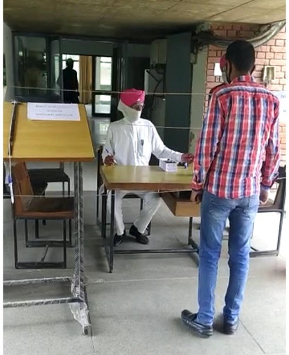

# Department of Electrical Engineering  

## Message from HoD's Desk

Technical education blended with ethics and quality comprises of one of the most powerful tools, which gives shape to the coming generations. We at Guru Nanak Dev Engineering College, Ludhiana are trying our level best to make optimized utilization of modern tools and techniques, so that quality technical education can come within the reach of the large masses of India with convenience and affordability.
I am very hopeful that the publishing of the present College Newsletter will showcase our valuable achievements to the world, which the students and staff have made in spite of all the past and ongoing natural and man-made hurdles.
I am thankful to God almighty for making us capable to perform these tiny but effective efforts. Last but not the least, I congratulate the whole Editorial Board and all involved for their fine individual and team works.

Dr. Navneet Singh Bhangu     
Associate Professor and H.O.D.    
(Department of Electrical Engineering)

## Department at Glimpse

**Industrial Visit to NPTI , Nangal** :

An industrial visit to NPTI (National Power Training Institute), Nagal by Electrical Engineering Department was organized for Third year Students. Around 85 students visited the Institute with EED faculty.Er. Saurabh Mahajan, Assistant Director of NPTI gave interactive lecture to students about the emerging technologies in the power plant with a need of Renewable Sources. The students were shown Simulator for the nearby Plant and experienced the practical application of the subjects, they studied in the college.

   
**Pf. Samreet Kaur, Pf.Arshdeep Kaur and Pf. Puneet** along with Third year students at National Power Training Institute(NPTI)

**Workshop on Virtual Reality and artificially intelligence: perspective for industry 4.0**

A workshop was organised by E2S2 society of Electrical Engineering Department on 18th December 2022. The session was conducted by Er. Anubhi Khandewal (CEO, Terrafac Technology ).She explained the importance of VR and AI in industry. Students showed keen interest in the workshop. They were highly impressed with the hand on session by M/S TERRAFAC Technologies.

**Industrial Visit to SLDC , Patiala**

 
 **Pf.Arshdeep Kaur, Pf.Sukhpal Singh and Pf. Puneet** along with Second year students at SLDC , Patiala.

**Glimpses of Teacher’s day celebration organised by Students of Electrical Engineering Department  on 5th of september,2022.**

**Dr Arvind Dhingra and Mentor’s of First Year Students ** Welcomed first year student of Electrical Engineering department.**

**Organised expert lecture delivered by wonder automation training division on Industrial Drives and its usage on 30th November 2022**

**Organised an expert lecture on power system deregulation on 6th September 2022**

## Faculty Achievements
- **Dr. Arvind Dhingra** won Best Faculty Award, IISA, August,2022.
- **Dr. Arvind Dhingra** won Golden Pinnacle Award, National Sports & Amp; Youth development Council, June,2021.
- **Dr. Arvind Dhingra** won International Adroit Educator Award,2021 by Green Thinkerz International Adroit Educator Award,2021 by Green Thinkerz
- **Dr. Arvind Dhingra** won award for mentoring students in Innovative Projects Competition on theme of Energy Conservation and Energy Efficiency organized by   Punjab Energy Development Agency, March,2021. 
- **Dr. Arvind Dhingra** won International Best Adroit Educator Award at Green Thinkerz Dec, 31, 2021.
- **Dr. Kanwardeep Singh** got finanical award for paper publication in SCIE journal, 2021.
- **Dr. Arvind Dhingra** published book	Electronics – Electrician domestic Job Role Electrician Domestic: NSQF Level-2,MBD Publications, March,2020: ISBN 2002M5507C5779
-  **Dr. Arvind Dhingra** won Dr.Sarvepalli Radhakrishnan Award at Educator’s Commemoration Ceremony by MentorX, September 5,2020.
- **Dr. Arvind Dhingra** won I2OR National eminent Educator Award 2020, I2OR.
- **Dr. Arvind Dhingra** won ISTE Best teacher award 2020 awarded at Chandigarh University, ISTE Teachers Convention, 2020, December 23,2020
- **Er. Karanbir Singh** got Best Paper Award  for a paper entitled Residential Load  profile optimization using DSM  by  incorporating  models  of  Appliances  at  TEQIP-III sponsored  International Congress  on  Sustainable  Development  through  Engineering  Innovations  held  on September  17-19,  2020,  organized  by  the  college  in  association  with  Indian Geotechnical Society: Ludhiana Chapter and  Institution  of  Engineers (I): Ludhiana Center.

## Publications  
- **Dr Kanwardeep Singh**, Anu Singla and Vinod Kumar Yadav, ''Optimization of Distributed Solar Photovoltaic Power Generation in Day-Ahead Electricity Market Incorporating Irradiance Uncertainty'' published in Journal of Modern Power System and Clean Energy (SCIE, Impact factor 3.09, Print/Electronic ISSN:2196- 5625 /2196-5420, 2021)
- **Dr Kanwardeep Singh** and Anupam Mittal ''Control of Market Power Using Demand Responsiveness in Congested Restructured Power System Networks'' at International Conference on Computing, Networks & Renewable Energy, IKG Punjab Technical University, Kapurthala, August 5-6, 2021.
- **Dr Kanwardeep Singh** and Parminder Singh "Electric Load Forecasting Using Bi-LSTM Based Artificial Neural Technique"at International Conference on Computing, Networks & Renewable Energy, IKG Punjab Technical University, Kapurthala, August 5-6, 2021.
- **Dr Kanwardeep Singh**, Research Paper Titled “Optimizing Distributed Solar Photovoltaic Power Generation in Day- Ahead Electricity Market Incorporating Irradiance Uncertainty" published in Journal of Modern Power
Systems and Clean Energy (Science Citation Index Expanded, ISSN: 2196-5625/ e-ISSN:2196-5420, impact factor: 3.09, open access), October 21st ,2020
- **Dhingra Arvind** , Kaur Harpreet, Gupta Surbhi "Agricultural waste power generation in Ludhiana district, Punjab, India" in Elsvier Materials Proceedings, 2021
- **Dhingra Arvind**, A. Khanna, R. Pandey, J. Madan "Numerical Simulation and Optimisation of Wide Bandgap (1.45eV) PbSCQD Solar Cell for 14% Conversion Efficiency" in 48th IEEE Photovoltaic Specialists Conference (PVSC 48), 2021
- **Dhingra Arvind**, A. Khanna, R. Pandey, J. Madan "Thickness Optimisation and Defect Analysis of Wide Bandgap PbS-CQD Solar Cell by SCAPS-1D Simulations in 48th IEEE Photovoltaic Specialists Conference (PVSC 48), 2021"
- **Dhingra Arvind**, Singh Parminder, Nijhawan Parag, Model reduction of linear time invariant SISO systems using different optimal techniques, International Conference on Sustainable Developments through Engineering Innovations SDEI’20, Guru Nanak Dev Engineering College, Ludhiana, September 17-19th,2020
- **Dhingra Arvind**, Nijhawan Parag, Manish Kumar Singla, Meera Sharma, Sensor based optimization of energy in internet of things: A review, International Conference on Sustainable Developments through Engineering Innovations SDEI’20, Guru Nanak Dev Engineering College, Ludhiana, September 17-19th,2020
-	**Dhingra Arvind**, Sidhu Sukhjot, Day ahead forecasting in PSPCL, International Conference on Sustainable Developments through Engineering Innovations SDEI’20, Guru Nanak Dev Engineering College, Ludhiana, September 17-19th,2020
- **Dhingra Arvind**, Singh Tejinder, Energy conservation for sustainable future, International Conference on Sustainable Developments through Engineering Innovations SDEI’20, Guru Nanak Dev Engineering College, Ludhiana, September 17th-19th,2020.
- **Navneet Singh Bhangu** "Performance Analysis of s unidentical k-out-of-n System using Reliability Block Diagram and Fault Tree Technique: A Case Study" in Journal of Engineering & Technology Education (2229-631X, UGC) ,2021
- **Navneet Singh Bhangu**,   Application of Fault Tree Analysis for Evaluating Reliability: A Case Study of Gear Box of Wind Turbine, International Journal of Advanced Science and Technology Volume 29 Issue 3, March 2020, ISSN: 2005-4238 (Print), ISSN: 2207-6360 (Online), Pages: 4486-4492, SCOPUS Indexed Journal.
- **Rupinderjit Singh** and Manmohit Sharma Estimation of Power Generation using Bio Mass: A case study of Sirmaur District (H.P.) in Int. Research Jour. Of Modernization in Engineering Technology and Science, 2021
- **Ravinder Kaur** Binny Sharma "comparative study of multi level inverters based on the outputput total Harmonic distortion" in International Reasereach journal of Engineering Technology, 2021
- **Baljeet Singh**, **Puneet Chandel** "Power Quality Improvement in Power System using UPFC" in International Journal of all Research education and Scientific methods, 2021.

- **Baljeet Singh**, **Puneet Chandel** "Impact of Upfc on the
Power Quality in Grid" in International Journal of
Engineering Applied Sciences and Technology, 2021.

- **Kuldeep Singh**, **Baljeet Singh** "Optimal Placement of phasor measuring unit in power system" in International Journal of Engineering Sciences & Research Technology, 2021
- **Kuldeep Singh**, **Karanbir Singh** "Optimal Placement on Extra High Voltage Bus System of Northern Eastern Region of Indian Power Grid Using PSAT " in International Journal of Engineering Sciences & Research Technology, 2021
- **Karanbir Singh**, **Kuldeep Singh** "Home Energy Management
System using WHALE Optimization Algorithm" in International Conference on Computing, Network & renewable energy

- **Karanbir Singh**, **Kuldeep Singh** and **Amandeep Singh Ghatora** ,presented paper titled “Residential Load Profile Optimization using DSM by incorporating models of appliances”, in SDEI international conference September 17th -19th 2020.

- **Karanbir Singh**, presented research paper titled  “Demand Side Management for cost and peak load optimization with load modelling”, in IEMERA in Imperial College, London, U.K from  March 26th-28th 2020.

- **Gagandeep Kaur Gill** and **Rupinderjit Singh** presented paper titled “Bagasse congeneration plant efficiency improvement by using data envelopment analysis models"in SDEI international conference September. 17th -19th 2020.

- **Arshdeep Kaur** and Dr. Y.S Brar , presented paper titled "Optimization of Power System Using Static Synchronous Compensator to Enhance Voltage Stability" in SDEI international conference September 17th -19th 2020.

- **Swapandeep Kaur** "Selection of industrial arc welding robot with TOPSIS and Entropy MCDM techniques" in Materials Today: Proceedings/ 2214-7853, 2021

- **Swapandeep Kaur** , "Agricultural waste power generation in Ludhiana district, Punjab, India" in  Materials Today: Proceedings, 2021

- **Swapandeep Kaur** "Smart Watches: A Review
of Evolution in Bio Medical Sector" in  Materials Today: Proceedings, 2021
- **Swapandeep Kaur** "Application of multicriteria decision-making

 theory with VIKORWASPAS -Entropy methods: A case study of silent Genset" in  Materials Today: Proceedings, 2021

- **Swapandeep Kaur** "Electric Vehicle Scenario in India: Evolution, Challenges and Opportunities" in  International Journal of Advances in Engineering and Management (IJAEM), 2021

## Events Organized (FDPs/Conferences/STCs/SDTs/Workshops/Webinars etc.)  

| Sr. No. | Name of Event                                                  | Faculty Coordinator           | Duration | Date(s)               | Sponsor(s) |
|:--------|:--------------------------------------------------------------|:------------------------------|:---------|:----------------------|:-----------|
| 1       |Short Term Course on Technology Enabled Teaching Learning | Dr. Arvind Dhingra|5 Days|16-20 Jan 2023|GNDEC,Ludhiana|
|2|IEEE Lecture series organised by IEEE students chapter GNDEC and Electrical Engineering Student society|Dr. Arvin Dhingra and Pf Arshdeep Kaur|1 week|April- May 2022|GNDEC Ludhiana|
|3|Workshop on Virtual Reality and artificially intelligence: perspective for industry 4.0|Dr. Arvind Dhingra, Pf. Sukhpal and Pf Amrinder Kaur|1 Day|18th December 2022|GNDEC Ludhiana|
|4| Expert lecture by wonder automation on Industrials Drives and its usage |Dr Arvind Dhingra|1 Day|30th November 2022|GNDEC Ludhiana|
|5|  Industrial Tour Visit to NPTI Nangal|Dr. Navneet Singh Bhangu|1 Day|26th November, 2022|GNDEC Ludhiana|
|6|Industrial Tour Visit to NPTI Nangal|Dr. Kanwardeep Singh|1 Day|2nd Dec, 2021|
| 7     | ICT enabled FDP on Energy Conservation and Management (Run-2) | Dr Arvind Dhingra | One Week | 04-08 May, 2020 | TEQIP-III  |
|8|ICT enabled FDP on Energy Conservation and Management(Run-1)|Dr. Arvind Dhingra |3 Days| April 27- May 1|
|9|ICT enabled FDP on Energy Conservation and Management(Run-1)|Dr. Arvind Dhingra |3 Days| April 27- May 1|

## Events Attended (FDPs/Conferences/STCs/SDTs/Workshops/Webinars etc.)  

| Sr. No. | Name of Faculty | Name of Event | Duration | Date(s) | Organizing Institute |
|:--------|:----------------|:--------------|:---------|:--------|:---------------------|
|1|Dr. Arvind Dhingra| SPARC course on Smart Grids: Future Intelligent electricity Distribution Grids | Five Days| (February 4-14,2022)| , MNIT Jaipur & Cardiff University, UK|
|2| Dr. Arvind Dhingra |  FDP on Green and Intelligent Buildings |1 Week |April 14th-18th,2020  | NITTTR, Chandigarh |
|  3   |  Dr. Arvind Dhingra |    FDP on Technological Advancement in Power System Control, Power Controllers, drives & E- Vehicles- TAPPAD2020  |  1 Week     |   April 27th- May 1st,2020 | Dr NGP Institute of Technology, Coimbatore |   
|4|Dr. Arvind Dhingra|IGEN PIT FDP on Renewable Energy Systems	|1 Week|June 8-12th , 2020|The Institution of Green Engineers, Panimalar Institute of Technology, Chennai|
| 5 |          Dr. Arvind Dhingra         |     TEQIP-III sponsored Efficient, trackable and sustainable workflow, Examination Branch          |     1 Week    |      December 2nd -7th, 2020    |           GNDEC, Ludhiana       |
| 6 | Dr. Navneet Singh Bhangu|Energy Conservation and Management, TEQIP-III sponsored ICT enabled FDP|1 week|April 27 to May 1, 2020|EED at GNDEC, Ludhiana|
|7|Dr. Navneet Singh Bhangu|Online AICTE Recognized FDP On	Waste Management|1 week| May 11th -15th 2020| Mechanical Engg. Deptt., NITTTR Chandigarh|
|8|Dr. Navneet Singh Bhangu|Education 4.0: Reliability Centered Maintenance, Webinar|1 day|July 19th 2020 |School of Mechanical Engineering (SMEC) Vellore Institute of Technology, Chennai |
|9|Dr. Navneet Singh Bhangu|Professional Development Training Program for Faculty and Administrators of Project Institutions of TEQIP-III, National Project Implementation Unit, MHRD, Govt. of India|2 days|26 to 28 November 2020|Indian Institute of Management (IIM),Visakhapatnam |
|10|Dr. Navneet Singh Bhangu|Digital Transformation of Institutions of Higher Learning|1 week| December 1st -6th 2020| National Academy of Human Resource Development,New Delhi|
|11|Er. Rupinderjit Singh|Education 4.0: Reliability Centered Maintenance, Webinar|1 day|19th July|School of Mechanical Engineering (SMEC) Vellore Institute of Technology, Chennai |
|12|Er. Rupinderjit Singh|Professional Development Training Program for Faculty and Administrators of Project Institutions of TEQIP-III, National Project Implementation Unit, MHRD, Govt. of India|2 days|26 to 28 November 2020|Indian Institute of Management (IIM),Visakhapatnam|
|13|Er. Ravinder Kaur|Two Weeks AICTE Sponsored FDP Under AQIS:Innovative Pedagogical Methodologies And Tools For Effective Learning In Engineering Education|2 Weeks| October 26th to November 7th, 2020|Department Of Business Administration,GNDEC,Ludhiana|
|14|Er. Samreet Kaur|AICTE Sponsored FDP Under AQIS:Innovative Pedagogical Methodologies And Tools For Effective Learning In Engineering Education|Two Weeks |October 26th to November 7th, 2020| Department Of Business Administration,GNDEC,Ludhiana||
|15|Er. Amandeep Singh|FDP on “Advanced Optimization Techniques and hands-on with MATLAB/SCILAB”|2 Week|13 – 24 July 2020|Electronics and ICT Academies” by the Ministry of Electronics and Information Technology (MeitY), Government of India.|
|16|Er.Amandeep Singh|Webinar on"Power Monitoring, Home Automation and Building Management System"|1 Week|June 29-3 July 2020|School of Electrical Engineering KIIT, Bubnehwar and Schneider electric india|
|17| Er. Amandeep Singh|Webinar on ABB Heavy Vehicle Charging|1 Day|July 7th 2020|ABB Australia|
|18|Er. Amandeep Singh|Electric Vehicle:New Trends and Technologies|1 Week| 22-26 June 2020|ABES Engineering College, Ghaziabad|
|19|Er. Karanbir Singh|FDP on “Advanced Optimization Techniques and hands-on with MATLAB/SCILAB”|2 Week|13 – 24 July 2020|Electronics and ICT Academies” by the Ministry of Electronics and Information Technology (MeitY), Government of India.|
|20|Er. Karanbir Singh|Webinar on"Power Monitoring, Home Automation and Building Management System"|1 Week|June 29-3 July 2020|School of Electrical Engineering KIIT, Bubnehwar and Schneider electric india|
|21|Er.Karanbir Singh|  Workshop on Virtual Labs|1 Day| December 3rd, 2021| GNDEC,Ludhiana |
|22|Er. Gagandeep Kaur Gill|TEQIP –III sponsored STTP on “PLC, Drives and Industrial Automation”|1 Weeks|March 2nd -6th,2020|Sant Longowal Institute of Engineering and Technology, Longowal|
|23|Er. Gagandeep Kaur Gill|Two Week Faculty Development Programme on “Digital Design and Emerging Trends in Signal Processing”|2 Weeks| August 10-22, 2020|Department of Electronics & Communication Engineering, Government Engineering College Bikaner.|
|24|Er. Gagandeep Kaur Gill| Innovative Pedagogical Methodologies And Tools For Effective Learning In Engineering Education|2 Weeks| December 7th to  December 21st, 2020|Department Of Business Administration, GNDEC,Ludhiana|
|25|Er. Bhawna|Innovative Pedagogical Methodologies and Tools for Effective Learning in Engineering Education |2 Weeks| December 7th to  December 21st, 2020|Department Of Business Administration,GNDEC,Ludhiana|
|26|Er. Bhawna|  AICTE approved FDP course on "Electrical Vehicles ”|4 Week|January – March 2020| NPTEL Online Course.|
|27|Er. Bhawana|  Workshop on Virtual Labs|1 Day| December 3rd, 2021| GNDEC,Ludhiana |
|28|Er. Arshdeep Kaur|TEQIP –III sponsored STTP on “PLC, Drives and Industrial Automation”|1 Weeks|March 2nd -6th,2020|Sant Longowal Institute of Engineering and Technology, Longowal|
|29|Er. Arshdeep Kaur|Two Week Faculty Development Programme on “Digital Design and Emerging Trends in Signal Processing”|2 Weeks| August 10-22th, 2020|Department of Electronics & Communication Engineering, Government Engineering College Bikaner|
|30|Er. Arshdeep Kaur|One-week Online Short Term Training Program (STTP) on “Recent Trends in Instrumentation Engineering”|1 Week|September 7th-11th, 2020|Department of Electrical Engineering, NIT, Uttarakhand and Department of Electrical & Instrumentation Engineering, SLIET Longowal, Punjab |
|31|Er. Arshdeep Kaur|Two Weeks AICTE Sponsored FDP Under AQIS:Innovative Pedagogical Methodologies And Tools For Effective Learning In Engineering Education|2 Weeks| October 26th to November 7th, 2020|Department Of Business Administration,GNDEC,Ludhiana|
|32|Er. Arshdeep Kaur|  AICTE approved FDP course on "Introduction to smart grids ”|8 Week|September 14th-December 18th, 2020| NPTEL Online Course |
|33|Er. Arshdeep Kaur|  Workshop on Virtual Labs|1 Day| December 3rd, 2021| GNDEC,Ludhiana|
|34|Er. Swapandeep|  Workshop on Virtual Labs|1 Day| December 3rd, 2021| GNDEC,Ludhiana |
|35|Er.Puneet|  Workshop on Virtual Labs|1 Day| December 3rd, 2021| GNDEC,Ludhiana |
|36|Er.Sukhpal Singh|  Workshop on Virtual Labs|1 Day| December 3rd, 2021| GNDEC,Ludhiana |

## Student's Corner  

**Sukhchain Singh** (D3EE) made project "**2 meter waring system** for staff who is on COVID -19 Government Duty under the guidance of **Pf. Gagandeep Singh Sodhi**

**Amempreet Singh, Daswinder Singh, Armaan Ali and Kaveesh Arora** (D4EE) made project ** A Self Balancing electric scooter ** under the guidance of **Dr.Arvind Dhingra**

**Arunjot, Rajat Tiyagi, Riaz Mohammad, Mayank Bakshi, Sukhpreet Singh, Puneet Singh** (D4EE) made project on **Electric Vehicle** under the guidance of **Pf. Kuldeep Singh and Pf. Baljeet Singh**

**Simran Kaur Rajpal and Tania Sharma** post graduate students worked on smart grid project and got first prize at NITTTR Chandigarh under the guidance of **Pf.Kanwardeep Singh**
### Student's Achievements

Project filed for Patent in December 2020.

- **Abhishek Goyal, Gurpartap Singh, Kunal Singla and Mainik Walia**
 made the project "Sky Robot" under the guidance of **Dr. Arvind Dhingra** .This robot is to help maintain a vigil against unwanted intruders. The robot is so designed so as to work effectively during day and night with same efficiency. The robot is capable of sending an alarm in case of any unwanted activity. This will help our soldiers guarding our borders to maintain effective vigil.

- **Santokh Singh, Sapandeep Singh,Simranjeet Singh and Harpreet Singh** made the project "Palace Power Saver" under the guidance of **Pf. Arshdeep Kaur**. One of the major reason for designing this project, is the wastage of electricity especially at palaces, libraries, hostels, hotels, cinemas, parking and offices, where no one take responsibility to switch off the electrical equipment. This project is based on an intelligent electricity system which  automatically switched off the light/equipment when the room will empty.

  
  **Project: Palace Power Saver**

### Electrical Engineering Staff and Students (E2S2)
 
- Organised **IEEE Lecture Series** for Third Year and Final Year Students Coordinated by Dr.Arvind Dhingra and Pf. Arshdeep Kaur.
- Organised Workshop on **Virtual Reality and artificially intelligence:** perspective for industry 4.0 on 18th December 2022.
- Organised expert lecture delivered by **Wonder automation training division** on Industrial Drives and its usage on 30th November 2022
- Organised an expert lecture on **power system deregulation** on 6th September 2022
- Organised Teacher’s Day celebration on 5th September,2022.
- Organized Competition **Circuit Designing Using Simulation** on 15th September 2021 where Dr.Arvind Dhingra, Pf.Samreet Kaur and Pf.Arshdeep Kaur were judges in the event.

  
  - Organised online quiz " **MIND MANTRA** " Coordinated by Dr.Arvind Dhingra, Pf.Gagandeep Kaur Gill and Pf.Amandeep Singh on July 2020.

  - Organised event **Charter’s Day** on 8th of september,2021.

  

 **Dr Arvind Dhingra** guided students for their career.

  - Organized Competition **Circuit Designing Using Simulation** on 15th September 2021 where Dr.Arvind Dhingra, Pf.Samreet Kaur and Pf.Arshdeep Kaur were judges in the event.

   

   

**Deepak Kumar** of Electrical Engineering Department won First prize 2nd year.

