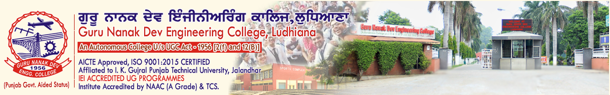

# GNDEC at Glance

| [About Us](GNDEC.md) | [GNDEC in News](News.md) | [Video Gallery](Videos.md) | [GNDEC Home](https://gndec.ac.in/) | [Departments at Glimpse](../CoverPage/Contents.md) | [Cultural Committee](../Cultural/Cultural.md) |

<iframe width="560" height="315" src="https://www.youtube.com/embed/zIpXf4SVzUs" frameborder="0" allow="accelerometer; autoplay; clipboard-write; encrypted-media; gyroscope; picture-in-picture" allowfullscreen></iframe>

 Guru Nanak Dev Engineering College was established by the Nankana Sahib Education Trust. NSET was founded in memory of the most sacred temple of Nankana Sahib, birth place of Guru Nanak Dev Ji. Shiromani Gurudwara Prabandhak Committee, Amritsar, a premier organization of universal brotherhood, was the main force behind the mission of "Removal of Economic Backwardness through Technology". With this mission, a Polytechnic was started in 1953 and Guru Nanak Dev Engineering College was established in 1956. The Trust deed was registered on 24th February 1953 with a commitment by The Nankana Sahib Education Trust to uplift the vast weaker section of Indian polity comprising Rural India by admitting 70% students every year from Rural Areas. This commitment was made to the nation on 8th April, 1956. The day when foundation stone of the College Building was laid by Late Dr. Rajendra Prasad Ji, the First President of India. Nearly 10,000 graduate and 3000 Post Graduate Engineers have passed out from this college during the last 50 years and are at present successfully employed in India & abroad. The college is now ISO 9001-2008 Certified, NBA accredited and have signed MoU with IOWA University [USA] for exchange of students and faculty.

#### Mission

- Upliftment of Rural Students through technical education.
- Respond to local societal needs by developing selected 'targeted research projects'.
- Quality training programs in need based modern technology.
- To maintain state-of-the-art infrastructure in laboratories.
- To promote culture of self-employment.
- To impart non-formal education to unemployed youth.
- To inculcate moral, ethical, spiritual values in education at all levels.

### Vision

Realization of Glimpses of a Golden India in the real(rural) India which lives and abounds in its villages. GNDEC will excel nationally and distinguish itself as a recognized pre-eminent leader to serve this 70% Brotherhood through its socioeconomic upliftment by exposure of the havenots to Engg. & Technology thereby grooming them as technically competent and intellectually-vital Graduates through practically focused quality learning experiences, and thus assuring productive Careers for them.

### Campus

Guru Nanak Dev Engineering College campus is spread over 86 acres of prime land about 5 Kms from Bus Stand and 8 Kms from Ludhiana Railway Station on Ludhiana-Malerkotla Road. The college campus is well planned with beautifully laid out tree plantation, pathways, flowerbeds besides the well maintained sprawling lawns all around. It has beautiful building for College, Hostels, Swimming Pool, Sports and Gymnasium Hall Complex, Gurduwara Sahib, Bank, Dispensery, Post Office, Open Air Theatre. There are three hostels for boys and one for girls with a total accomodation of about 1200 students. These hostels are provided with all amenities and basic services. The greenery of the campus is remarkable and special care is being taken to preserve it.
