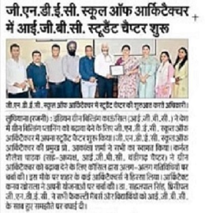
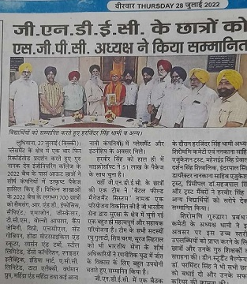
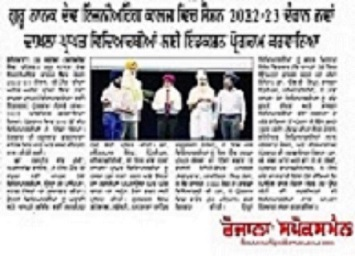
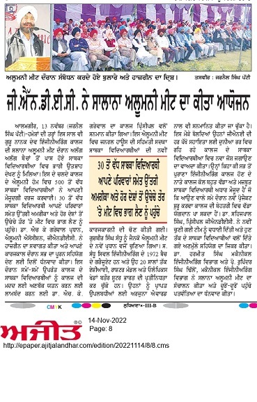
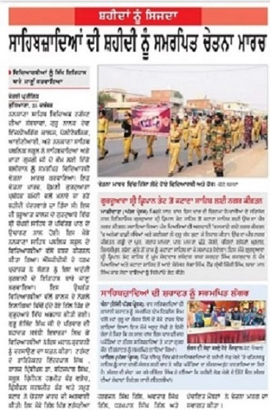
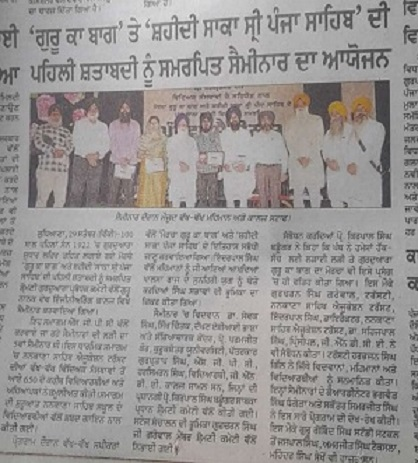

# **GNDEC in News**

## Pedal for sidhu moosewala

###### |🕒 Published on June 6,2022

    

    

Pedal for Sidhu Moosewala – CML GNDEC 03-06-22, Ludhiana | On the occasion of World Bicycle Day and to pay tribute to its alumnus, Shubhdeep Singh Sidhu(Sidhu Moosewala), students of Guru Nanak Dev Engineering College organised a Silent Cycling March, “Pedal for Sidhu Moosewala”. Around 100 cyclists took park in the rally and completed the 15 km ride.Shubhdeep Singh (Sidhu Moosewala) was an alumnus of 2016 batch of Electrical Engineering from Guru Nanak Dev Engineering College, Ludhiana. Students pedalled their way through the route and chanted, “Live Forever, Sidhu(“Sidhu Moosewala Amar Rahe”). The whole event was to mark the never giving up and never stopping attitude of the departed Punjabi Singer and College alumnus. The cyclist including students and other active cyclists from Ludhiana showed intense sorrow for the departed soul and pledged to be as enthusiastic as he was to make Sidhu Moosewala always alive in all. 
The initiative was taken by Center for Multifaceted, GNDEC which is a student run body in the college and Punjabi Runners. The event was supported by partners like Decathlon, Orika and Fortis Hospital. The event was concluded by speeches and views from Prof. Shivmanmeet Singh (Student Coordinator CML, GNE College), Mr. Deepak Mishra (Alumnus GNE, 2011-15 Batch, Day Fit India Ambassador, Punjab), Mr. Jappanjot Singh(Convener CML, Final Year Student, GNE College), and representatives from Decathlon followed by refreshments. The cyclists thanked the College Principal and organising bodies for organising the event for a good cause.

# **GNDEC in News**

## E Cell of GNDEC organizes startup session

###### |🕒 Published on January 5,2022

<imgsrc="IMG2.jpg">

E Cell of GNDEC organizes startup session
 E- Cell of Guru Nanak Dev Engineering College Ludhiana organized a session on startups. The guest speaker was Mr.Bernard Curren from University of Birmingham,UK. Welcoming the guests Dr.Sehijpal Singh Principal said startup culture needed a boost. Introducing the guest speaker Dr.Parampal Singh HOD Business Administration Department said that Mr. Curren was a seasoned startup coach having guided over a 1000 different businessman to grow. Mr. SK Rai, Vice President Hero Group and Executive director MBCU said that Business was in blood of Ludhianavis. But the way Business is done these days is quite different from earlier times. In his address, Mr. Curren highlighted skills required to start a business. He advocated doing a complete  SWOT analysis to do business with minimum risk. Dr. Prem Kumar, Executive director, MBCIE said that opportunities were immense for startups. Dr. Arvind Dhingra Executive director STEP while thanking the guests for their insightful thought sharing said that College Technology Buisness Incubator (TBI) was open to extending all support including financial grants to budding entrepreneurs to start and establish their business.  Over 75 students attended the event.

# **GNDEC in News**

## IGBC Student Chapter started at GNDEC School of Architecture

###### |🕒 Published on June 23,2022

  <imgsrc="IMG3.jpg">

Indian Green Building Council (IGBC) launched its student chapter at GNDEC School of Architecture to promote green building concepts in the country. IGBC is a council which works to enable sustainable built environment for all and facilitate India to be one of the global leaders in sustainable built environment by 2025. The event started with the welcome note by Prof. Akanksha Sharma, Head-GNDEC School of Architecture. Col. Shailesh Pathak, Co Chairman, IGBC Chandigarh Chapter discussed the agenda as well as the activities done at different levels by the council to promote green architecture and gave a presentation on ‘Glass as a Sustainable Building Material’ which was very informative for the students. Many other members of IGBC and eminent architects of the city were part of this event. Ar. Kanav Khosla presented his office projects to the audience which were appreciated by all the students and faculty. Dr. Sehijpal Singh, Principal GNDEC congratulated the faculty members and the students for this successful collaboration with IGBC and motivated the students to be part of such endeavors in future as well.

# **GNDEC in News**

## SGPC President honors GNDEC students 

###### |🕒 Published on July 27,2022

  <imgsrc="IMG4.jpg">

Students of 2022 pass out batch of Guru Nanak Dev Engineering College, Ludhiana have brought laurels to their almamater by getting record placements in  topmost companies of the world with handsome packages. More than 700 students of 2022 batch got placement and internship opportunities in reputed companies like Samsung,  R&D, ZScaler, Infosys, Sapient, TCS, Cognizent, Volvo Eicher,  CapGemini, Wipro, HCL, Saint-Gobain, Honda Motorcycle & Scooters, Larsen & Toubro Ltd, JSW Steel Ltd, DENSO Corporation, Schneider Electric, India Mart, ACC Limited, Tata Elxsi, Vardhman Group, Mahindra & Mahindra, RDC Concrete, SML Isuzu, Sonalika Group, Jayaswal Neco Industries and many more. 

Mr. Harveer Singh recently has been selected by Microsoft at a package of 51.00 Lakhs. Also, team of students of GNDEC added another feather in cap by developing “Battlefield Management System” that is a project completed in association with Indian Army. The system is very useful for developing  strategic wars policies.The project is highly appreciated by top officials of Indian Army and team members – Raghu Gulati, Shiv Charan, Suraj Mehral were honored by the Army officers.
Today during a meeting held in GNDEC, S. Harjinder Singh Dhami, President SGPC and Nankana Sahib Trust, S Maheshinder Singh Grewal, S. Darshan Singh Shivalik, S. Inderpal Singh, Director Trust along with other trust members and Principal Dr. Sehijpal Singh honored Mr Harveer Singh and other students with token of appreciation and siropa. The president appreciated the achievements of students and their guides. Dean Student welfare Dr Parminder Singh  congratulated students for their extraordinary achievements and wished successful career ahead.

# **GNDEC in News**

## Induction Programme "GENCO RAW 2022" starts at GNDEC

###### |🕒 Published on September 21,2022

<imgsrc="IMG5.jpg">

Guru Nanak Dev Engineering College(GNDEC), Ludhiana started induction programme "GENCO RAW 2022" for the incoming batches of B.Tech. More than 600 students marked their presence on the first day of the program. The program commenced with Paath and Shabad kirtan at College Gurudwara Sahib.
Dr. Harpreet Kaur, HOD, Applied Science, extended a formal welcome to the newly admitted Students, their parents, faculty members, HOD's and other dignitaries who were present in the occasion. She exhorted the students to be sincere in their studies and be dedicated for their future career.  
GNDEC Principal, Dr. Sehijpal Singh, motivated the students to have learning attitude and identify their passion that would help them to groom their overall personality required to grow in life. S. Gurcharan Singh Grewal, Trustee NSET  congratulated the students to be a part of the heritage institution of the region.
Air Marshal (Retd.), Rajkiran Singh Shera, the Chief Guest who is 1980 batch alumnus of GNDEC, motivated the students to work hard in life and shared about four Qs. He said that for a successful person intelligence, emotional, physical and spiritual quotients are necessary. He called upon the students to achieve excellence in their professional role. Dr. S.B. Singh, Ex Principal enthusiastically encouraged the students to dream big and achieve benchmarks set by alumni of the college
19 Events such as interaction session with senior students, cultural performance were also marked on 1st day of programme. The coordinators Dr KS Mann and Dr AK Sodhi revealed that many renowned personalities will interact with new comers in upcoming days.They added that this induction program is mandatory for newly admitted students as per AICTE guidelines.

# **GNDEC in News**

## GNDEC organizes 'Blood Donation Camp' in Campus

###### |🕒 Published on October 12,2022

<imgsrc="IMG6.jpg">

In its unwavering commitment to serve the community, the NSS unit of Guru Nanak Dev Engineering College(GNDEC), Ludhiana organized a Blood Donation Camp in collaboration with NIFA Foundation on 12, October in its college premises.
Dr. Sehijpal Singh, Principal, GNDEC and S. Inderpal Singh, Director, NSET lauded this initiative and  humbly urged students/ staff to associate with this noble cause. The camp witnessed active participation as 104  donors donated their blood. Speaking on the occasion, one of the donors said, “It gives us immense contentment to be able to contribute towards our community by way of donating blood for the needy patients.” After donating the Blood, the Donors were given refreshment, a Donor’s certificate by the GNDEC, and NIFA Foundation.
Lot of efforts for making this camp a success were put in by Sachpreet Singh, President, NIFA Foundation, Sarbpreet Singh, Member, NIFA Foundation and, a team of GNDEC faculties including Prof. Jasvir Singh Grewal, NSS Incharge, Prof Sukhjit Singh, Prof. Jaswinder Singh Khalsa.

# **GNDEC in News**

## Golden Jubilee Alumni Meet's organized at GNDEC

###### |🕒 Published on November 13,2022

<imgsrc="IMG7.jpg">

As a part of annual practice, November 11 and 13, 2022 marked the Golden Jubilee Alumni Celebrations of 1971 and 1972 batches respectively of Guru Nanak Dev Engineering College, in the college premises. More than 500 alumni participated in the events.

Mr. Gurbir Sandhu, gave a presidential address on the behalf of GENCO Alumni Association. Principal Dr. Sehijpal Singh welcomed the gencconians and shared various developments made in the college during previous years. K.D Chaudhri, Ex Chairman, PSPCL and H.S Brar, Ex Chairman, Punjab Electricity Board grace the occasions with their presence.
The fond nostalgic memories were shared and a few reflected on stage as well. The alumni also provided financial assistance to the college for various development activities. Director, NSET, Inderpal Singh applauded the efforts of alumni for growth of institution. 
The alumni shared their work experience and wisdom related to job and carrier opportunities which can be availed by students of GNDEC.

# **GNDEC in News**

## ਸਾਹਿਬਜ਼ਾਦਿਆਂ ਦੀ ਸ਼ਹੀਦੀ ਨੂੰ ਸਮਰਪਿਤ ਚੇਤਨਾ ਮਾਰਚ

###### |🕒 Published on December 25, 2022

<imgsrc="IMG8.jpg">

ਨਨਕਾਣਾ ਸਾਹਿਬ ਐਜੂਕੇਸ਼ਨ ਟਰਸੱਟ ਦੀਆਂ ਸੰਸਥਾਵਾਂ ਨੇ ਸਰਬੰਸ-ਦਾਨੀ ਸਾਹਿਬ ਸ੍ਰੀ ਗੁਰੂ ਗੋਬਿੰਦ ਸਿੰਘ ਜੀ ਦੇ ਸਾਹਿਬਜ਼ਾਦਿਆਂ, ਮਾਤਾ ਗੁਜ਼ਰੀ ਜੀ ਅਤੇ ਸ਼ਹੀਦ ਸਿੰਘਾ ਦੀ ਅਦੁੱਤੀ ਸ਼ਹਾਦਤ ਨੂੰ ਸਮਰਪਿਤ ਵਿਦਿਆਰਥੀ ਚੇਤਨਾ ਮਾਰਚ ਗੁਰੂ ਨਾਨਕ ਦੇਵ ਇੰਜੀਨੀਅਰਿੰਗ ਕਾਲਜ ਦੇ ਗੁਰਦੁਆਰਾ ਸਾਹਿਬ ਤੋਂ ਗਿੱਲ ਪਿੰਡ ਦੇ ਗੁਰਦੁਆਰਾ ਸਾਹਿਬਾਨ ਤੱਕ ਆਯੋਜਿਤ ਕੀਤਾ ਗਿਆ। ਇਸ ਵਿੱਚ ਨਨਕਾਣਾ ਸਾਹਿਬ  ਐਜੂਕੇਸ਼ਨ ਟਰਸੱਟ ਦੀਆਂ ਸੰਸਥਾਵਾਂ, ਗੁਰੂ ਨਾਨਕ ਦੇਵ ਇੰਜੀਨੀਅਰਿੰਗ ਕਾਲਜ, ਪੋਲੀਟੈਕਨਿਕ, ਆਈ. ਟੀ. ਆਈ, ਸਟੈਪ ਅਤੇ ਨਨਕਾਣਾ ਸਾਹਿਬ ਪਬਲਿਕ ਸਕੂਲ ਗਿੱਲ ਦੇ ਵਿਦਿਆਰਥੀਆਂ, ਸਟਾਫ਼ ਤੇ ਇਲਾਕੇ ਦੀਆਂ ਸੰਗਤਾਂ ਨੇ ਸਾਹਿਬਜ਼ਾਦਿਆਂ ਅਤੇ ਮਾਤਾ ਗੁਜਰੀ ਜੀ ਦੇ ਕੌਮ ਲਈ ਦਿਤੇ ਬਲੀਦਾਨ ਨੂੰ ਸਮਰਪਿਤ ਵਿਦਿਆਰਥੀ ਚੇਤਨਾ ਮਾਰਚ ਵਿੱਚ ਬਹੁਤ ਹੀ ਸ਼ਰਧਾ ਤੇ ਉਤਸ਼ਾਹ ਨਾਲ ਹਿੱਸਾ ਲਿਆ। ਇਹ ਚੇਤਨਾ ਮਾਰਚ, ਸ਼੍ਰੋਮਣੀ ਗੁਰਦੁਆਰਾ ਪ੍ਰਬੰਧਕ ਕਮੇਟੀ ਵਲੋਂ ਮਨਾਏ ਜਾ ਰਹੇ ਸ਼ਹੀਦੀ ਪੰਦਰਵਾੜੇ ਦਾ ਹਿੱਸਾ ਸੀ। ਇਸ ਧਾਰਮਿਕ ਸਮਾਗਮ ਦੀ ਸ਼ੁਰੂਆਤ ਕਾਲਜ ਦੇ ਗੁਰਦੁਆਰਾ ਸਾਹਿਬ ਵਿਖੇ ਜਪੁਜੀ ਸਾਹਿਬ ਤੇ ਚੌਪਈ ਸਾਹਿਬ, ਦੇ ਪਵਿੱਤਰ ਪਾਠ ਦੇ ਉਚਾਰਣ ਨਾਲ ਹੋਈ। ਇਸ ਮੌਕੇ ਨਨਕਾਣਾ ਸਾਹਿਬ ਪਬਲਿਕ ਸਕੂਲ ਗਿੱਲ ਦੇ ਵਿਦਿਆਰਥੀਆਂ ਵੱਲੋਂ ਸ਼ਬਦ ਕੀਰਤਨ ਵੀ ਕੀਤਾ ਗਿਆ। ਡਾਇਰੈਕਟਰ ਟਰਸੱਟ ਸ.ਇੰਦਰਪਾਲ ਸਿੰਘ, ਪ੍ਰਿੰ. ਡਾ ਸਹਿਜਪਾਲ ਸਿੰਘ, ਪ੍ਰਿੰ ਹਰਮੀਤ ਕੌਰ ਨੇ ਸੰਗਤ ਨੂੰ ਇਸ ਅਦੁਤੀ ਕੁਰਬਾਨੀ ਦੇ ਇਤਿਹਾਸ ਬਾਰੇ ਜਾਣੂ ਕਰਵਾਇਆ।
ਇਸ ਉਪਰੰਤ ਵਿਦਿਆਰਥੀਆਂ ਵੱਲੋਂ ਕਾਲਜ ਦੇ ਨੇੜਲੇ ਇਲਾਕਿਆਂ ਵਿਚੋਂ ਹੁੰਦੇ ਹੋਏ ਗਿੱਲ ਪਿੰਡ ਦੇ  ਗੁਰੁਦਆਰਾ ਸਾਹਿਬ ਵਿਖੇ ਅਰਦਾਸ ਕੀਤੀ। ਦਸਵੇਂ ਗੁਰੂ ਸਾਹਿਬ ਦੇ ਪਰਿਵਾਰ ਦੀ ਸ਼ਹਾਦਤ ਸਬੰਧੀ ਮਾਟੋ, ਪੋਸਟਰ ਤੇ ਇਬਾਰਤਾਂ ਲਿਖ ਕੇ ਵਿਦਿਆਰਥੀਆਂ ਨੇ ਇਸ ਮਹਾਨ ਕੁਰਬਾਨੀ ਨੂੰ ਦਰਸਾਉਣ ਦਾ ਯਤਨ ਕੀਤਾ।  
ਸ. ਇੰਦਰਪਾਲ ਸਿੰਘ, ਡਾਇਰੈਕਟਰ, ਨਨਕਾਣਾ ਸਾਹਿਬ ਐਜੂਕੇਸ਼ਨ ਟਰੱਸਟ, ਡਾ. ਸਹਿਜਪਾਲ ਸਿੰਘ ਪ੍ਰਿੰਸੀਪਲ ਜੀ. ਐੱਨ. ਡੀ. ਈ. ਸੀ, ਹਰਮੀਤ ਕੌਰ ਵੜੈਚ ਪ੍ਰਿੰਸੀਪਲ ਨਨਕਾਣਾ ਸਾਹਿਬ ਪਬਲਿਕ ਸਕੂਲ,ਗਿੱਲ, ਡਾ.ਸਰਬਜੀਤ ਕੌਰ,ਪ੍ਰਿੰਸੀਪਲ ਪੋਲੀਟੈਕਨਿਕ ਕਾਲਜ ਅਤੇ ਸਮੂਹ ਸਟਾਫ ਨੇ ਚੇਤਨਾ ਮਾਰਚ ਦੀ ਅਗਵਾਈ ਕੀਤੀ।
ਇਸ ਮੌਕੇ ਗਿੱਲ ਪਿੰਡ ਟਰੱਸਟੀ ਸਾਹਿਬਾਨ ਸ.ਬਲਜੀਤ ਸਿੰਘ, ਸ.ਹਰਭਜਨ ਸਿੰਘ, ਸ.ਅਵਤਾਰ ਸਿੰਘ, ਸ.ਧਰਮਪਾਲ ਸਿੰਘ, ਸ.ਸਚਦੇਵ ਸਿੰਘ, ਸ.ਕਮਿਕਰ ਸਿੰਘ ਅਤੇ ਪੰਚਾਇਤ ਮੈਂਬਰਾਂ  ਨੇ ਚੇਤਨਾ ਮਾਰਗ ਦਾ ਤਹਿ ਦਿਲੋਂ ਸਵਾਗਤ ਕੀਤਾ ਅਤੇ ਇਸ ਉਪਰਾਲੇ ਦੀ ਸ਼ਾਲਾਂਘਾ ਕੀਤੀ।

# **GNDEC in News**

## ਸ਼੍ਰੋਮਣੀ ਗੁਰੂਦੁਆਰਾ ਪ੍ਰਬੰਧਕ ਕਮੇਟੀ ਵੱਲੋਂ ਗੁਰੂ ਨਾਨਕ ਦੇਵ ਇੰਜ. ਕਾਲਜ ਵਿਖੇ ' ਗੁਰੂ ਕਾ ਬਾਗ ' ਅਤੇ ਸ਼ਹੀਦੀ ਸਾਕਾ ਸ੍ਰੀ ਪੰਜਾ ਸਾਹਿਬ ਨੂੰ ਸਮਰਪਿਤ ਸੈਮੀਨਾਰ ਕਰਵਾਇਆ ਗਿਆ

###### |🕒 Published on September 29, 2022

<imgsrc="IMG9.jpg">

100 ਸਾਲ ਪਹਿਲਾਂ ਸੰਨ 1922 ਵਿੱਚ ਗੁਰੂਦੁਆਰਾ ਸੁਧਾਰ ਲਹਿਰ ਤਹਿਤ ਲਗਾਏ ਗਏ ਮੋਰਚੇ ਗੁਰੂ ਕਾ ਬਾਗ ਅਤੇ ਸ਼ਹੀਦੀ ਸਾਕਾ ਸ੍ਰੀ ਪੰਜਾ ਸਾਹਿਬ ਦੀ ਪਹਿਲੀ ਸ਼ਤਾਬਦੀ ਨੂੰ ਸਮਰਪਿਤ ਸ਼੍ਰੋਮਣੀ ਗੁਰੂਦੁਆਰਾ ਪ੍ਰਬੰਧਕ ਕਮੇਟੀ ਵੱਲੋਂ ਗੁਰੂ ਨਾਨਕ ਦੇਵ ਇੰਜ. ਕਾਲਜ ਵਿਖੇ ਸੈਮੀਨਾਰ ਕਰਵਾਇਆ ਗਿਆ। ਇਹ ਸਮਾਗਮ ਧਰਮ ਪ੍ਰਚਾਰ ਕਮੇਟੀ ਵੱਲੋਂ ਕਰਵਾਏ ਜਾ ਰਹੇ ਸੈਮੀਨਾਰਾਂ ਦੀ ਲੜੀ ਦਾ ਪੰਜਵਾਂ ਸੈਮੀਨਾਰ ਸੀ। ਇਸ ਧਾਰਮਿਕ ਸਮਾਗਮ ਵਿੱਚ ਨਨਕਾਣਾ ਸਾਹਿਬ ਐਜੂਕੇਸ਼ਨ ਟਰੱਸਟ ਦੀਆਂ ਅਲੱਗ-ਅਲੱਗ ਵਿਦਿਅਕ ਸੰਸਥਾਵਾਂ ਤੋਂ ਆਏ 650 ਦੇ ਕਰੀਬ ਵਿਦਿਆਰਥੀਆਂ ਅਤੇ ਅਧਿਆਪਕ ਸਾਹਿਬਾਨ ਨੇ ਸ਼ਮੂਲੀਅਤ ਕੀਤੀ। ਸਮਾਗਮ ਦੀ ਸ਼ੁਰੂਆਤ ਨਨਕਾਣਾ ਸਾਹਿਬ ਸਕੂਲ ਦੇ ਵਿਦਿਆਰਥੀਆਂ ਵੱਲੋਂ ਸ਼ਬਦ ਗਾਇਨ ਨਾਲ ਕੀਤੀ ਗਈ।
ਪ੍ਰੋਗਰਾਮ ਦੌਰਾਨ ਅਲੱਗ-ਅਲੱਗ ਸਪੀਕਰਾਂ ਵੱਲੋਂ ' ਮੋਰਚਾ ਗੁਰੂ ਕਾ ਬਾਗ ਅਤੇ ਸ਼ਹੀਦੀ ਸਾਕਾ ਪੰਜਾ ਸਾਹਿਬ ' ਦੇ ਇਤਿਹਾਸ ਸਬੰਧਿਤ ਸੰਗਤਾਂ ਨੂੰ ਜਾਣੂ ਕਰਵਾਇਆ ਗਿਆ । ਸ. ਇੰਦਰਪਾਲ ਸਿੰਘ ਜੀ, ਡਾਇਰੈਕਟਰ ਨਨਕਾਣਾ ਸਾਹਿਬ ਐਜੂਕੇਸ਼ਨ ਟਰੱਸਟ, ਨੇ ਮਹਿਮਾਨਾਂ ਤੇ ਵਿਦਿਆਰਥੀਆਂ ਨੂੰ ਜੀ ਆਇਆਂ ਆਖਦਿਆਂ, ਖਾਲਸਾ ਰਾਜ ਦੇ ਸੁਨਹਿਰੀ ਯੁਗ ਨੂੰ ਚੇਤੇ ਕਰਦਿਆਂ, ਸਿੰਘ ਸਭਾ ਲਹਿਰ ਤੇ ਗੁਰਦੁਆਰਾ ਸੁਧਾਰ ਲਹਿਰ ਦੀ ਭੂਮਿਕਾ ਦਾ ਜਿਕਰ ਕੀਤਾ ਗਿਆ। ਸੈਮੀਨਾਰ ਵਿੱਚ ਵਿਦਵਾਨ ਸਜਣ ਡਾ.ਸੇਵਕ ਸਿੰਘ, ਸਿੱਖ ਚਿੰਤਕ, ਦੱਖਣ ਏਸ਼ੀਆਈ ਭਾਸ਼ਾ ਅਤੇ ਸਭਿਆਚਾਰਕ ਕੇਂਦਰ, ਪ੍ਰੋ.ਪਰਮਜੀਤ ਕੌਰ, ਕੁਰੂਕਸ਼ੇਤਰ ਯੂਨੀਵਰਸਿਟੀ, ਪੱਤਰਕਾਰ ਸ. ਗੁਰਪ੍ਰਤਾਪ ਸਿੰਘ, ਸ਼੍ਰੋਮਣੀ ਗੁਰਦੁਆਰਾ ਪ੍ਰਬੰਧਕ ਕਮੇਟੀ, ਸ.ਹਰਸਿਮਰਤ ਸਿੰਘ, ਵਿਦਿਆਰਥੀ, ਜੀ.ਐੱਨ.ਡੀ.ਈ. ਕਾਲਜ ਸ਼ਾਮਿਲ ਸਨ। ਸੈਮੀਨਾਰ ਦੀ ਪ੍ਰਧਾਨਗੀ ਪ੍ਰੋ. ਕਿਰਪਾਲ ਸਿੰਘ ਬਡੂੰਗਰ ਸਾਬਕਾ ਪ੍ਰਧਾਨ ਸ਼੍ਰੋਮਣੀ ਕਮੇਟੀ ਵੱਲੋਂ ਕੀਤੀ ਗਈ। ਸਟੇਜ ਸੰਚਾਲਨ ਦੀ ਭੂਮਿਕਾ ਸ. ਗੁਰਚਰਨ ਸਿੰਘ ਜੀ ਗਰੇਵਾਲ ਮੈਂਬਰ ਸ਼੍ਰੋਮਣੀ ਕਮੇਟੀ ਵੱਲੋਂ ਨਿਭਾਈ ਗਈ।
ਵਿਸ਼ਾਲ ਸੰਗਤੀ ਇਕੱਠ ਨੂੰ ਸੰਬੋਧਨ ਕਰਦਿਆਂ ਪ੍ਰੋ. ਕਿਰਪਾਲ ਸਿੰਘ ਬਡੂੰਗਰ ਨੇ ਕਿਹਾ ਕਿ ਪੰਥ ਨੇ ਹਮੇਸ਼ਾਂ ਹੱਕ ਸੱਚ  ਲਈ ਲੜਾਈ ਲੜੀ ਤੇ ਗੁਰਦੁਆਰਾ ਗੁਰੂ ਕਾ ਬਾਗ ਦਾ ਮੋਰਚਾ ਵੀ ਇਸੇ ਪ੍ਰਸੰਗ ਵਿੱਚ ਹੀ ਫਤਹਿ ਕੀਤਾ ਗਿਆ।  ਸ. ਗੁਰਚਰਨ ਸਿੰਘ ਗਰੇਵਾਲ, ਟਰੱਸਟੀ, ਨਨਕਾਣਾ ਸਾਹਿਬ ਐਜੂਕੇਸ਼ਨ ਟਰੱਸਟ, ਨੇ ਇਸ ਮੌਕੇ ਆਪਣੇ ਵਿਚਾਰ ਸਾਂਝੇ ਕਰਦਿਆਂ ਕਿਹਾ ਕੇ ਸਾਨੂੰ ਸਭ ਨੂੰ ਸਿੱਖ ਇਤਿਹਾਸ ਦੇ ਪੰਨਿਆਂ ਤੋਂ ਸੇਧ ਲੈ ਕੇ ਇੱਕਜੁਟਤਾ ਨਾਲ ਪੰਥ ਦੀ ਚੜ੍ਹਦੀ ਕਲਾ ਲਈ ਕਾਰਜ ਕਰਨ ਦੀ ਲੋੜ ਹੈ। ਸ. ਇੰਦਰਪਾਲ ਸਿੰਘ, ਡਾਇਰੈਕਟਰ, ਨਨਕਾਣਾ ਸਾਹਿਬ ਐਜੂਕੇਸ਼ਨ ਟਰੱਸਟ ਅਤੇ ਡਾ. ਸਹਿਜਪਾਲ ਸਿੰਘ, ਪ੍ਰਿੰਸੀਪਲ, ਗੁਰੂ ਨਾਨਕ ਦੇਵ ਇੰਜੀਨੀਅਰਿੰਗ ਕਾਲਜ, ਅਤੇ ਸਮੂਹ ਮੈਂਬਰ ਨਨਕਾਣਾ ਸਾਹਿਬ ਐਜੂਕੇਸ਼ਨ ਟਰੱਸਟ ਨੇ ਪ੍ਰੋਗਰਾਮ ਵਿਚ ਉਚੇਚੇ ਤੌਰ ਤੇ ਸ਼ਿਰਕਤ ਕੀਤੀ ਤੇ ਸਭ ਨੇ ਮੋਰਚੇ ਦੌਰਾਨ ਸਿੱਖਾਂ ਦੀ ਅੰਗਰੇਜ਼ ਸਰਕਾਰ ਦੇ ਜ਼ੁਲਮ ਅੱਗੇ ਦ੍ਰਿੜਤਾ ਅਤੇ ਬਿਨਾ ਡੋਲੇ ਜਿੱਤ ਪ੍ਰਾਪਤ ਕਰਨ ਵਾਲੇ ਸੰਘਰਸ਼ ਨੂੰ ਯਾਦ ਕੀਤਾ।
ਡਾ. ਸੇਵਕ ਸਿੰਘ ਨੇ  ਵਿਰਾਸਤ ਦੀ ਮਹੱਤਤਾ ਨੂੰ ਦਸਦਿਆਂ ਸ਼ਬਦਾਂ ਨੂੰ ਵਿਸ਼ੇਸ਼ ਅਹਿਮੀਅਤ ਦੇਣ ਦੀ ਗੱਲ ਕਰਦਿਆਂ ਕਿਹਾ ਕਿ ਇਨ੍ਹਾਂ ਸ਼ਬਦਾਂ ਜ਼ਰੀਏ ਹੀ ਕੌਮ ਦੇ ਆਜ਼ਾਦ ਅਤੇ ਗੁਲਾਮ ਹੋਣ ਦਾ ਪਤਾ ਲੱਗਦਾ  ਹੈ। ਡਾ. ਪਰਮਜੀਤ ਕੌਰ ਨੇ ਸਿੱਖ ਸ਼ਹਾਦਤ ਦੀ ਪਰੰਪਰਾ ਨਾਲ ਸਾਂਝ ਪਾਉਂਦਿਆਂ ਮੋਰਚਾ ਗੁਰੂ ਕਾ ਬਾਗ ਅਤੇ ਸਾਕਾ ਪੰਜਾ ਸਾਹਿਬ ਨੂੰ ਉਸੇ ਕੜੀ ਦਾ ਹਿੱਸਾ ਦਸਿਆ। ਸ. ਗੁਰਪ੍ਰਤਾਪ ਸਿੰਘ ਨੇ ਸਿੱਖਾਂ ਨੂੰ ਗੁਰੂ ਪਰੰਪਰਾ ਅਤੇ ਸਿੱਖ ਇਤਿਹਾਸ ਮੁਤਾਬਕ ਅਭਿਆਸ ਕਰਨ ਦੀ ਗੱਲ ਆਖੀ ਤਾਂ ਜੋ ਗੁਰੂ ਸਾਹਿਬ ਵਲੋਂ ਬਖਸ਼ੀ ਰਵਾਇਤ ਨੂੰ ਮੁੜ ਸੁਰਜੀਤ ਕੀਤਾ ਜਾ ਸਕੇ। ਪ੍ਰਧਾਨਗੀ ਭਾਸ਼ਣ ਵਿਚ ਪ੍ਰੋ. ਕਿਰਪਾਲ ਸਿੰਘ ਬਡੂੰਗਰ ਨੇ ਪੜ੍ਹੇ ਪਰਚਿਆਂ ਦੀ ਪ੍ਰੋੜਤਾ ਕਰਦਿਆਂ ਸਿੱਖ ਪੰਥ ਨੂੰ ਇਕੱਤਰ ਹੋਣ ਅਤੇ ਵਿਰੋਧੀ ਤਾਕਤਾਂ ਵਲੋਂ ਸੁਚੇਤ ਹੋਣ ਦੀ ਗੱਲ ਕੀਤੀ।
ਇਸ ਮੌਕੇ ਜਿੱਥੇ ਵਿਦਵਾਨ ਸੱਜਣਾ ਨੂੰ ਸਨਮਾਨਿਤ ਕੀਤਾ ਗਿਆ ਉਥੇ ਪਹੁੰਚੇ ਹੋਏ ਪ੍ਰਿੰਸੀਪਲ ਸਾਹਿਬਾਨ ਅਤੇ ਵਿਦਿਆਰਥੀਆਂ ਨੂੰ ਵੀ ਸਨਮਾਨਿਤ ਕੀਤਾ ਗਿਆ। ਨਨਕਾਣਾ ਸਾਹਿਬ ਪਬਲਿਕ ਸਕੂਲ ਦੇ ਵਿਦਿਆਰਥੀਆਂ ਵੱਲੋਂ ਵਾਰਾਂ ਤੇ ਕਵੀਸ਼ਰੀ ਦੀ ਸ਼ਾਨਦਾਰ ਪੇਸ਼ਕਾਰੀ ਕੀਤੀ ਗਈ। ਸ਼੍ਰੋਮਣੀ ਕਮੇਟੀ ਵਲੋਂ ਕਰਵਾਏ ਜਾ ਰਹੇ ਇਨ੍ਹਾਂ ਸੈਮੀਨਾਰਾਂ ਦੇ ਕੋਆਰਡੀਨੇਟਰ ਸ. ਭਗਵੰਤ ਸਿੰਘ ਜੀ ਧੰਗੇੜਾ ਅਤੇ ਸਕੱਤਰ ਸ. ਸਿਮਰਜੀਤ ਸਿੰਘ ਨੇ ਇਸ ਸਾਰੇ ਪ੍ਰੋਗਰਾਮ ਦੀ ਦੇਖ ਰੇਖ ਕੀਤੀ। ਇਸ ਮੌਕੇ ਟਰੱਸਟੀ ਸ. ਹਰਭਜਨ ਸਿੰਘ ਗਿੱਲ, ਗੁਰੂ ਗੋਬਿੰਦ ਸਿੰਘ ਸਟੱਡੀ ਸਟਕਲ ਤੋਂ ਸ. ਜਸਪਾਲ ਸਿੰਘ ਜਨਰਲ ਸਕੱਤਰ ਗੁਰੂ ਰਾਮਦਾਸ ਆਰਥਿਕ ਵਿਕਾਸ ਕੇਂਦਰ, ਅਮਰਜੀਤ ਸਿੰਘ ਟੈਕਸਲਾ,ਸ. ਜਸਪਾਲ ਸਿੰਘ ਜੋਨਲ ਪ੍ਰਧਾਨ, ਪੰਜਾਬੀ ਭਾਸ਼ਾ ਪ੍ਰਸਾਰ ਭਾਈਚਾਰਾ ਵੱਲੋਂ  ਸ. ਮਹਿੰਦਰ ਸਿੰਘ ਸੇਖੋਂ ਨੇ ਵਿਸ਼ੇਸ਼ ਤੌਰ 'ਤੇ ਹਾਜਰੀ ਭਰੀ। ਆਏ ਵਿਦਵਾਨਾਂ ਅਤੇ ਸਰੋਤਿਆਂ ਦਾ ਧੰਨਵਾਦ ਪ੍ਰਿੰਸੀਪਲ ਡਾ. ਸਹਿਜਪਾਲ ਸਿੰਘ ਜੀ ਨੇ ਕੀਤਾ।

**PRO: Prof. Satjot Singh Dhillon**

**APRO: Dr. Preeti Pannu**

**Student's Executive Members: Harmanpreet Kaur(URN:2104509, IT Branch), Chahat Jarewal(URN:2104487, IT Branch)**

