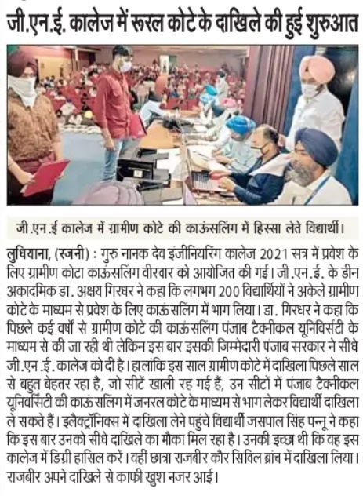
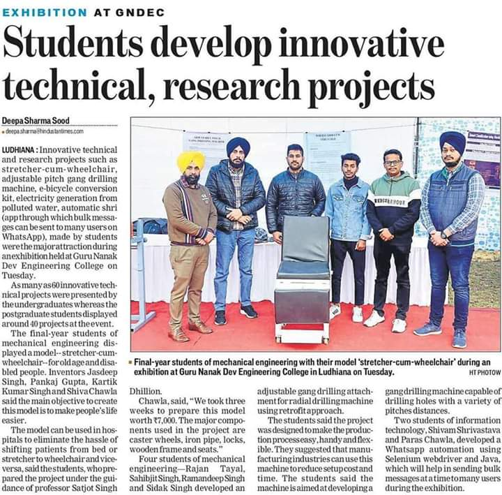
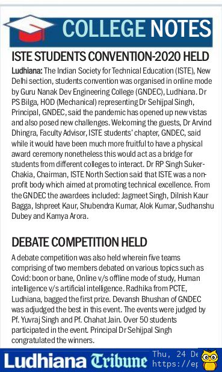

# **GNDEC in News**

## 450 GNDEC students got campus placement and internships in Phase-1

###### |🕒 Published on January 5, 2022

Nearly 450 current batch students of Guru Nanak Dev Engineering College (GNDEC) have been hired by multinational companies for placement and internships. The Training and Placement Cell disclosed that recruiters including Samsung R&D, Zscaler, ZS Associates, Walmart Inc., Airtel offered a package of 12.5-18.0 LPA to the engineering graduates of the final year.
Other major recruiters like Infosys, IndiaMART, InterMES., Publicis Sapient, Tata Consultancy Services (TCS), Larsen & Toubro (L&T), Cognizant, Hitachi Vantara, IBM, Modak Analytics, VI(Vodafone Idea), Pure Software, Infor, Volvo-Eicher, Paxcom, Byjus,Yatra Freight, Brillio, JSW and Acxiom Consulting offered a package of 5.0-8.5 LPA.
Recruiters like Wipro, XenonStack, RDC Concrete, Hero Cycles, HCL, Capgemini, Bizmerlin HR, Clerisy Solutions, Vardhman, VVDN Technologies and many others provided good jobs offers. Prof. G.S. Sodhi, Training and Placement officer shared about one promising trend that various MNCs, MSMEs & leading industries like SML ISUZU, Larsen & Toubro, Bhagwansons Asian Bikes, Stylumia, Samsung, Damsun, International Tractors, Impact Agencies, New Era Machines, Citizen Components, Happy Forgings, Zscaler, Kangaro KGOC,Venture Pact, SafeAeon, Bizmerlin HR and many more have come forward to offer internships to students with handsome stipends up to 30000/- . “All the internships are eventually converted to the placement in the same company. The companies have one full semester time to convert these interns into trained professionals. The companies are starting the internships in January 2022”. He added
Principal Dr. Sehijpal Singh disclosed that this year a noticeable rise has been observed in number of placements as well as in the salary packages. While congratulating the placed students, he said that almost all students who wish to get placement will definitely get it by the session end as more recruiting companies are yet to come in the second phase. A special cell has been established in the college for preparing the students for placements.

---

## Awareness March dedicated to the martyrdom of Sahibzadas

###### |🕒 Published on December 25, 2021

---

## Trilingual Glossary Workshop begins GNDEC

###### |🕒 Published on December 23, 2021

A five day national workshop to build a comprehensive technical glossary for words used in technical courses began at Guru Nanak Dev Engineering College, Ludhiana.  The workshop is being organized by  Commission for Scientific and Technical Terminology, MoE, Department of Higher Education, GoI, New Delhi. Thanking CSTT for choosing GNDEC as a venue for their first workshop, Dr. Sehijpal Singh, Principal said that such a workshop was the need of the hour in order to promote technical education in regional languages as per mandate of new education policy. Sh. Ashok N Selwatkar, Asst.. Director and Sh. Shalendra Singh, Asstt. Scientific Officer, CSTT , MoE are central coordinators for this workshop. They informed that Hindi glossary of equivalent technical words had already been prepared and in this workshop the Punjabi terminology was being worked out. Dr. Arvind Dhingra, Local Coordinator said that the workshop was being organized in line with the objectives of NEP-2020 which envisaged imparting technical knowledge in regional languages. As of now such an effort is being made for seven regional languages. The workshop has involvement of linguistic experts from Punjabi University, Patiala and Guru Nanak Dev University, Amritsar and technical experts from GNDEC, GNDU and NIT, Jalandhar.

---

## Homecoming: GNDEC Alumni Meet 2021

###### |🕒 Published on November 16, 2021

Guru Nanak Dev Engineering College (GNDEC), organized the much awaited annual Alumni meet at the college premises with over 250 old students. The event started with Ardaas in college gurudwara sahib. 25 Genconians from Golden jubilee batch 1971 and 15 from Silver jubilee batch 1996 were honored during the alumni meet. A galaxy of technocrats from various multinational companies, chief engineers from Central and State Govt organizations, senior officers from defense forces, MD, CEO of industries, engineers settled working in USA, UK, and Canada were seen becoming nostalgic. They interacted with each other and shared old memories of their student life. Dr H.K. Grewal President Alumni Association welcomed the audience. A couple of recent projects supported by various alumni were mentioned by Principal Sehijpal Singh during his introductory speech that includes modernization of labs by 1968 batch, center of excellence in the field of road safety, traffic management, smart metering, Software Development Center, and funding for innovative projects by 1963 batch. S Gurcharan Singh Grewal, trustee of Nankana Sahib Education Trust (NSET) conveyed that Alumni should come forward for the further development of the college and promised all support from the trust. Director NSET, S. Inderpal Singh highlighted the history of formation of GNDEC and expressed his happiness that the genconians have brought laurels for their almamater. Er Rajinder Singh Tanda who came from USA to attend the meet disclosed that his batch has doled out scholarship of approximate one crore to the present students of GNDEC in past 5 years. He called upon the alumni to support the present students. Ex Principal Dr S.B Singh also appealed to the alumni for supporting the underprivileged students. Olympian Gurbir Singh Sandhu, who is 1972 batch alumnus of GNDEC inaugurated a state-of-the art gymnasium in sports complex of the college. 1962 batch passout, Er. Balbir Singh Ex- Chief engineer announced financial support of 2.0 lakhs for upgradation of labs. A good number of well established alumni offered to guide the students for placements. The meet ended with a promise to meet again and everyone laid an emotional farewell to each other.

---

## GNDEC initiates Induction for new entrants

###### |🕒 Published on October 21, 2021

An induction cum orientation programme for newly admitted students of B.Tech has started at Guru Nanak Dev Engineering College, Ludhiana on 19, October 2021. More than 450 students and their parents attended the inaguration ceremony.

The program commenced with shabad gayan at college auditorium and evoking the blessing of almighty on upcoming batch. The auditorium was packed with newly enrolled students, their parents, mentors and teachers.

Director Nankana Sahib Education Trust welcomed the guests and students and explained the history and origin of GNDEC. Principal Dr. Sehijpal Singh, emphasized upon the importance of major graduate attributes of outcome based education and said that this programme is a harbinger of various activities specially designed for entrants to fill the gap between School and hard-core engineering.

Former Air Vice Marshal P.S Malhi, a GNDEC alumnus of 1986 batch, was the chief guest at the occasion. He shared his memories of student life and explained his success story in Indian Air force. He encouraged the students to work hard and motivated them to achieve heights in life.

S Gurbhajan Singh Gill, a renowned punjabi poet, editor and cultural activist suggested students to stick to the roots and moral values. Dr S.B singh, Ex principal, GNDEC gave a manta of success to the students "no tension full attention".

Ujjwal, a student from Patiala, said: “My first day of the college proved to be a memorable one. Apart from academics, the co-curricular activities provided by the college are exemplary. The updated infrastructure, including the laboratories, shall definitely provide a boost to our studies. I am lucky to get a chance to study in this college.”

Another student Monisha of Mechanical branch said: “It was my first day in the college". I am really elated to secure a seat in the top most institutions of northern India. On my first day of attendance today, I found my mentor to be very cooperative and caring.

Coordinators Dr K.S. Mann and Dr AK Sodhi said, "This programme is designed to acclimatize the students to the new environment and get them acquainted with the institution culture".

---

## Huge Rush for engineering admission seekers at GNDEC

###### |🕒 Published on 2021

IKG PTU counselling for B.Tech courses based on either JEE-Main scores or 12th marks has started
on 10th September. GNDEC, Ludhiana has set up an admission
help-desk witnessing 150+ registrations on the first day itself.

The college has assigned an admission
mentor on every 50-60 students who will address all the queries over telephone. Students can
even reach out to the mentor physically during college hours. The college website has already
seen over 1500 applications and the counselling continues on saturdays and sundays.

Prof. Akshay Girdhar, Dean Academics, conveyed that list of compulsory subjects for 12th
passed students has been extended this time as per Govt. notification with many subjects such as biology etc. Therefore the students can take admission even if they did not pass 12th exam with non medical subjects.
He also said that the students must update themselves with overall counselling schedule
uploaded on website.

Principal, Sehijpal Singh, told that all engineering programs at GNDEC are AICTE approved and the college is autonomous with independent academic system where the students can opt for many latest courses of their choice.

---

## GNDEC, Ludhiana reputation attracts rural area aspirants

###### |🕒 Published on September 3, 2021

Guru Nanak Dev Engineering College, Ludhiana has always committed to accelerate and improve the education system of rural area. This is the only college of punjab that have bucked the trend of direct counselling for Rural Quota(B.Tech I year) and has 70% reservation for the same whereas other colleges does not provide such facility for rural area applicant's.

According to Dr. Akshay Girdhar, Dean Academics, GNDEC, rural quota seats were filled by Punjab Technical University earlier but from this year onwards, the college itself will commence the counselling. Principal Prof Sehajpal Singh said, “The College ensures this pragmatic counseling approach will better serve the rural students pursuing hopes for their bright future".

Several students from various places could also be seen standing in queues for counselling. NAME, who came from PLACE said, “I want to study in this college as many MNCs come here for placement and placement graph for this college increases every year.” Another student, NAME from PLACE said that "the scholarships provided by this college is attracting the students from various places".

---

## SGPC organised mega meeting of educationists and preachers for enhancing the standard of education

###### |🕒 Published on August 10, 2021

An impressive event was organised in Guru Nanak Dev Engineering college to deliberate upon the status and future direction to the educational institutions. The gathering included Principals of all schools and colleges run by SGPC, preachers of Dharam parchar committee, Managers of major gurudawaras. Bibi Jagir kaur president SGPC focused upon the need of consolidating the capabilities and strengths of all educational and religious organisations so that young generation can be guided, motivated and empowered to excel in their career. There is strong need to inculcate moral and ethical values in the youth to develop sound society. She mentioned that SGPC institutions have adequate infrastructre and more efforts are being done continuously to further improve the facilities. Chief secretary, SGPC, Harjinder Singh Dhami, while addressing the gathering stressed upon the need of bringing positiveness in the minds of people about Sikh institutions. S Gurcharan Singh Grewal member SGPC coordinated the stage. Appointment letters were given to the newly recruited teachers of schools and colleges.

Er. Sukhminder Singh, Secretary education of SGPC said that the communication gaps need to be improved. We should work out the solutions to increase enrollment in schools and colleges. Interactive session was conducted to deliberate and address the issues raised by educationists and religious dignitaries. Director NSET Inderpal Singh, highlighted the role of Nankana Sahib Education Trust in spreading the education in rural areas. A presentation about the legacy of GNDEC and it's contribution towards engineering education was give by Principal Sehijpal Singh. Trustee, NSET, Maheshinder Singh Grewal, Harbhajan Singh Gill and several members of SGPC graced the occasion with their presence.

---

## GNDEC ties up with US software company for training and placement

###### |🕒 Published on July 21, 2021

To create quality training, job and entrepreneurial opportunities for students, Guru Nanak Dev Engineering College Ludhiana (GNDEC) has collaborated with a US based company SUFI. A platform named ‘Trakki’ is launched under which the students will be trained in the fields of data science, data analytics, artificial intelligence and cyber security. Apart from technical training, the students shall be prepared for developing soft and interview skills. Mr. Jasvir Singh Gill founder and CEO of Alert Enterprise and Mr. Kaval Kaur CEO of Startup Farms International (SUFI) participated in the inaugural ceremony. Alert Enterprise is headquartered in Fremont, CA with offices in many countries. Startup Farms International LLC is headquartered in Fremont, CA and has presence in Chandigarh. It is a startup incubator and accelerator which supports innovative early stage startups to grow. Mr. Navjot Singh Tung who is alumnus of GNDEC and took initiative for this collaboration welcomed the participants and introduced the motive of collaboration and start of Trakki platform.

Chief guest of the inaugural ceremony S. Inderpal Singh, Director Nankana Sahib Education Trust congratulated GNDEC and industry representatives for this program and motivated the faculty and students to take advantage of this collaboration. College principal Dr. Sehijpal Singh thanked the industry representatives for their contribution to society through such initiatives and for collaborating with GNDEC for grooming students in these future technologies.

Dr. H.S. Rai Head Civil Engineering Department, Dr. Parminder Singh Head CSE dept., and Prof. Gagandeep Singh Sodhi Training and Placement officer shared their views about this collaboration.

---

## BIBI JAGIR KAUR, inaugurated 500kWp Solar power plant at GNDEC

###### |🕒 Published on July 9, 2021

PRESIDENT, SGPC Bibi Jagir Kaur inaugurated a Solar power plant of 500 kWp at Guru Nanak Dev Engineering College, Ludhiana.  While expressing her happiness on the initiative she said" it is really one of the big steps of the institution towards green initiatives and saving enviornment. In fact Renewable energy is the need of the hour. All members of Nanakana Sahib Education Trust (NSET) including  Ajmer Singh Lakhkwal,  Maheshinder Singh Grewal, Gurcharan Singh Grewal, Darshan Singh Shivalik, S.Sachdev Singh, Inderpal Singh Direcctor Trust, Sukhmander Singh Secretary Trust, Principal Sehijpal Singh  and College faculty were present on the occasion. Prof Dhingra, coordinator of the project said that  solar power shall cut the power bill and students will find opportunity to do research work in the field of smart grid and metering technologies. Later during the The College Governing body meeting many decisions were taken for the development of the college. The board approved various scholarships schemes for meritorious and needy students who wish to take admission at GNDEC. About 50 scholarships have been finalized for the students of schools under SGPC and NSET, who will take admission in core engineering courses at GNDEC. The proposal of financial assistance up to Rs. 15K has also been approved for covid affected and needy students. Bibi Jagir Kaur also announced that SGPC will provide scholarships to amritdhari students from other states  with career preparation, access, and success.

---

## GNDEC started a Center for Multi-faceted Learning

###### |🕒 Published on July 5, 2021

Guru Nanak Dev Engineering College Ludhiana (GNDEC) has established a 'Center for Multi-faceted Learning' for personality and professional development of students. The center witnessed its first ever international seminar via online mode. The topic of seminar was "Resume Writing and Interview Skills." Mr. Ali Qaswar Khaleeq and Ms. Zaryab Mahmood from University of Lahore, Pakistan were invited as guest speakers.. Being an interactive session, the discussion took a turn full of knowledgeable views and experienced suggestions.

The event started with a warm welcome by Prof. Lakhveer Singh Khana, Officer incharge of center. S. Inderpal Singh, Director, Nankana Sahib Education Trust (NSET) was the chief guest during innaguration. In his welcome address Principal Sehijpal Singh explained that 'multi-faceted learning' is the major requirement of students. This initiative has been taken with the support of AICTE. In the proceeding of the maiden formal event, Prof. Zaryab put light upon the resume writing skills and techniques and what things in a resume could make a difference in a student's career. Following to that Mr. Ali Qaswar Khaleeq, Manager PR, University of Lahore explained thoroughly about the various tips of appearing in interviews. He stressed upon the need of correct postures and etiquettes to during an interview. Students of the college interacted with speaker and the experts convinced them with great interest and concern and offered their services to GNDEC students at any time. Director NSET during his concluding remarks shared his life experiences and motivated the students for putting best efforts in presenting themselves to the job market. The event was moderated by Prof.Shivmanmeet Singh.

---

## GNDEC celebrates 65th foundation day

###### |🕒 Published on April 9, 2021

Guru Nanak Dev Engg College celebrated it’s 65th Foundation day by  conducting small but impressive function in GNE campus. The first President of India, Late Dr Rajendra Prasad, laid its foundation stone on April 8, 1956. Path Sri Sukhmani and kirtan was recited by college staff and students in college Gurudwara Sahib. A mini exhibition of innovative projects prepared by Engineering and Architecture students was arranged. These projects are being presented for sponsorships from GNE Alumni for their further development and incubation. Dr. Sehijpal Singh, Principal presented warm welcome and shared the historical progress and contributions of the college towards generation of technical manpower at global levels. During his address, he focused on the role of creativity and innovation in all aspects of human development.

Dr Munish Jindal, CEO Hoverrobotix and Dr PK Banerejee, Chief Scientist, MERADO were invited as resource persons to interact with students. Dr. Munish Jindal took the topic of Innovations and shared his success story. He motivated the audience by sharing that his company is the single manufacturer of flying hover crafts in India. He cited lot of live examples and called upon the young students to bring their new ideas for product development. Dr PK Banerejee detailed his views with a quote “Implementation of Innovative projects is a way to encourage creative thinking”.

Dr. Arvind Dhingra, Executive Director, STEP and Coordinator of the event, thanked the guests for their valuable words. He also appreciated the students for their innovative projects and promised them to provide all support from STEP.

---

## GNDEC Alumni offers research funding

###### |🕒 Published on March 22, 2021

A couple of initiatives and plans were discussed by alumni of Guru Nanak Dev Engineering college, Ludhiana during Technical Education Quality Improvement Program (TEQIP) sponsored interaction. Prominent alumni from various fields expressed their views and offered several services to the students of the institution. “The purpose of this interaction was primarily based on various possible ways for enhancing recruitment efforts, to support students’ industrial training programs and research projects and to provide outside funding sources to students for higher studies”. Said Dr Harwinder Singh, the project incharge.   

Dr. Sehijpal Singh, Principal, GNDEC welcomed called upon the alumni for developing sustainable help to the present students. Director Nankana Sahib Education S. Inderpal Singh applauded the efforts of alumni and promised all support for the further growth of the institution. Dr Buta Singh Sidhu, Vice Chancellor of MRS Punjab Technical University Bathinda was given ‘Distinguished Alumni Award’ during the event. He expressed his sincere gratitude to the almamater GNDEC and suggested to start Alumni Endowment and Corpus fund to provide consistent support the research and development activities. Giving the details of interaction Prof. Harmeet Singh Gill the coordinator of Alumni affairs disclosed that our alumni are overwhelmed to support the institution. Rajinder Singh Tanda a US based entrepreneur and his batchmates called Alumni to come forward with ample financial and emotional support to the almamater. While they are regularly giving scholarships to more than 50 students, they announced another contribution of 2 lakh for Alumni corpus fund. Arvinder Singh and Vipan Sehgal leading industrialists also announced similar financial support. Some of the Punjab Govt officers, the alumni of GNDEC including Additional Directors of factories, Director Governance and IT, Traffic advisor, GM Punjab Roadways and a couple of officers from PSPCL, Water resources and Irrigation, industrialists, IT professionals expressed their full support to the institution. Dr SB Singh and Dr RP Singh former Principals of GNDEC were also present on the occasion. They stressed on the need of future course of action for upliftment of the institution. Er. Rahul Ahuja, Punjab Chairman of CII and MD Rajnish Industries, Er. Navdeep Gill MD, XenonStack Er. Shubhdeep Singh (Sidhu Moose wala) and several prominent alumni were also present on the event.   

---

## GNDEC Cyclist brings laurels for Ludhiana

###### |🕒 Published on March 15, 2021

A cyclist, Harshveer Singh Sekhon, student of MBA 1st year of Guru Nanak Dev Engineering College (GNDEC) has added another feather to varsity’s cap and brought laurels to the institution by bagging BEST CYCLIST  award in  25th senior national road cycling championship held at Navi Mumbai from 5th March to 8th March 2021.Sekhon participated in three events and nailed it by winning two gold medals in Criterium (56km)and Team Time Trial (40km) and bronze medal in Individual Time Trial (40km)races .

Harshveer extends his gratitude towards college authorities who supported him at every step and motivated him to participate with full enthusiasm. His next target is now the Asian Games 2022 and the Commonwealth Games 2022.

Dr.Sehijpal Singh, Principal, GNDEC, congratulated Harshveer Singh on his achievements and motivated him to rise more and explore more.Gundan Bhardwaj , Sports Coordinator GNDEC, congratulated Harshveer and motivated him to keep inspiring other students to participate in extra curricular activities.Harshveer expressed his gratitude towards the institution and thanked the department for supporting him in academics.

## 

---

## GNDEC students develop Battle Field Management System for Indian Army

###### |🕒 Published on March 11, 2021

In a joint effort of Guru Nanak Dev Engineering College, Ludhiana and Indian army, a Battlefield Management System has been developed by team of GNDEC students got huge praise from Indian army. Dr. Parminder Singh, HOD and Prof. Satinderpal Singh of Computer Science and Engineering department were specially invited for honouring at regiment Headquarter.

Dr. Sehijpal Singh congratulated the department and students Shiv Charan, Raghu Gulati, Lakshya Chopra and Puran Singh for completing this great project for army.

System developed by college will play a major role in battlefield. It is able to point the enemy’s location and helps the base command to deliver correct directions to soldiers in battlefield. It will help in reducing the causalities of Indian soldiers.

---

## Saka Nankana Sahib centenary celebrations were held at Guru Nanak Dev Engineering College

###### |🕒 Published on February 17, 2021

Nankana Sahib Education Trust, Shiromani Gurdwara Parbandhak Committee organized a centenary function dedicated to Saka Nankana Sahib from 14-16 February, 2021 at Guru Nanak Dev Engineering College Campus. The ceremonies began on February 14, 2021, at Gurdwara Sahib of Guru Nanak Dev Engineering College with the inauguration of Akhand Path Sahib of Sri Guru Granth Sahib Ji.

On 15th February, in the College Auditorium, students from all the institutions of Nankana Sahib Education Trust performed Shabad Singing, Poetry, Kavishari, Varas and Speeches dedicated to Saka Nankana Sahib. On this occasion , chief guest of the day Dr Daljit Cheema, Former Education Minister Punjab, highlighted about that the sikh community has always fought against oppression on the path of truth and has always won .

The bhog of Sri Akhand Path Sahib was concluded on 16 February 2021 at Gurdwara Sahib. Shabad Kirtan was performed by the college students for the centenary celebrations at the main venue of the college football ground. Bhai Gurkirat Singh Ji, the presenter of Sach Khand Sri Harmandir Sahib, gave delightful to the sangat by chanting Gurbani. Bhai Pindarpal Singh Ji world famous narrator made the Katha Sangat listen in the context of Saka Nankana Sahib. On this occasion, Bibi Jagir Kaur Ji, President of shirmoani gurudwara parbandhak committee and Nankana sahib Education ,gave a warm welcome to the audience ,told the students about the greatness of this event and pays homage to the martyrs of Nankana Sahib massacre , conveyed the message to today’s young generation to follow the path of truth and virtue.

A seminar highlighted the establishment, objectives and achievements of Nankana Sahib Education Trust. Book Exhibition by Dharam Prachar Committee, Shiromani Gurdwara Parbandhak Committee and Sikh Book Trust International, Guru Gobind Singh Study Circle Exhibitions depicting paintings became a special attraction for the sangat. After this, Guru ka Langar was distributed in full.

S. Maheshinder Singh Grewal, Trustee Nankana Sahib Education Trust, S. Gurcharan Singh Grewal, Trustee Nankana Sahib Education Trust thanked all the sangats present. Charanjit Singh Atwal, Former Speaker Vidhan Sabha Punjab, S Partap Singh, Former Chairman Guru Gobind Singh Study Circle,Dr. Inderpal Singh, Director Trust, Dr. Sehijpal Singh , Principal, Guru Nanak Dev Engineering College, Principal Surinder Singh Ubhi, Guru Nanak Dev Polytechnic College, Principal Harmeet Kaur, Heads of Institutions of Nankana Sahib Public School and Nankana Sahib Education Trust were present.

---

## GNDEC Students make vehicle conversion kit

###### |🕒 Published on February 11, 2021

Keeping in tune with the spirit of innovation, students of Electrical Engineering Department GNDEC have developed a conversion kit for converting an Internal combustion powered engine (IC) to Electric  vehicle. This low cost innovation would not only save the costly fuel but also help in reducing the carbon emissions and thus help in preserving the environment.  Team comprising of Puneet Singh Bedi , Sukhpreet Singh, Mayank Bakshi, Rajat Tyagi, Riaz Mohammed and Arunjot Singh, all students of final electrical worked on this project. A brushless DC motor with a frequency controller was used n the project. The projects guides Er. Kuldeep Singh and Er. Baljeet Singh Ahluwalia, claimed that this is very economical model. The vehicle saves precious fuel since it is working on electrical charge. With one charge the vehicle is able to travel a distance of approximately 100km with a top speed of 40km/hr. Dr. Kanwardeep Siingh, HOD, Electrical engineering department and Dr. Arvind Dhingra, Project incharge applauded the efforts of the students in making an innovative project. Dr. Sehijpal Singh, Principal, GNDEC said that students would be given seed money to scale up the prototype and convert it into a business model at STEP- Science &Technology Entrepreneurs Park, The incubation arm of college.

---

## GNDEC students second in state in Effi-cycle contest

Students of Guru Nanak Dev Engineering College (GNDEC) have bagged second position in the state and 11th nationwide at the Effi-cycle Competition organised by the Society of Automotive Engineers Northern India Section (SAE NIS), India, at Lovely Professional University, Phagwara, Punjab
A team of 12 students from the mechanical engineering branch of the college participated in this one-of-its-kind contest for which they built an electrically-powered manual cycle. More than 80 teams from across the country participated in various dynamic and static events.

Sahil Bisht, captain of the team, and Simranpreet Singh, vice-captain, said making this project had been a great learning experience for the team. The project could only be completed because of the contribution of all team members, they added. Apart from Sahil and Simranpreet, Gagan Sadyal, Ankit Kumar, Ketav Sharma, Kartik, Nitish, Bhavuk Dhingra, Akshay Soni, Nishant, Pranesh and Saijal were part of the team.
The project has a star feature of motor capacity power of 600 Watts, which is enough capacity to attract investors in the market. Running at 500 rpm with a torque of 10 Nm, its acceleration reaches from 0 to 100 m in only 13 seconds. Having a load capacity of approximately 300 kg, the motor is capable of delivering 35 kmph top speed (electrical) and 40 kmph top speed (hybrid).
“We are aware that the market is flooded with entrepreneurs looking for an opportunity to invest in hybrid vehicles. The top speed of 40 kmph (hybrid) at a loading capacity of 300 kg will definitely attract investors,” said Bilga, head, Department of Mechanical Engineering, GNDEC.
Being a mechanical engineer himself, principal Sehijpal Singh showed optimism and confidence in his team and applauded the efforts of the students and the faculty. He added that the experience gained by students in such events would equip students with professional and social skills, which would be helpful in building successful careers.
The project
The project has a star feature of motor capacity power of 600 Watt, which is enough to attract investors in the market. Running at 500 rpm with a torque of 10 Nm, its acceleration reaches from 0 to 100 m in only 13 seconds. Having a load capacity of approximately 300 kg, the motor is capable of delivering 35 kmph top speed (electrical) and 40 kmph top speed (hybrid).

---

## Mulit-talented students of GNDEC shines at IKGPTU Zonal Youth fest

#### GNDEC wins overall trophy at IKGPTU Zonal Youth fest

Leaving behind a trail of memories, the I. K. G Punjab Technical University Zonal Youth Festival central zone, reached its culmination at GTBIMT Dakha. Where participants from Guru Nanak Dev Engineering college , Ludhiana secured the following positions : Indian Group Song first , Light Vocal Indian- first , Vaar Singing- second , Folk Singing (Solo)- first , Indian Classical (Vocal)- second , Instrumental (Non-Percussion) - first , Instrumental (Percussion) – second. In theater category team secured second position in one act play and first position in skit ,whereas college bhangra team won the first position for the third time in a row and giddha team, Western singing secured winning position as well. In literary events students secured first position in quiz and poem recitation . In fine arts category students secured third position in the on-spot painting as well as collage making. Thus, GNDEC wins the overall zonal trophy for the fourth time in a row. Dr. Sehijpal Singh, Principal, GNDEC and Dr. Jabir Singh , Cultural Co-ordinator, congratulated the students for their achievements and expressed happiness and commented that, the students of GNDEC excelled not only in studies but in cultural activities as well.

---

## GNDEC students bag second prize in TCS InfraMind event

Students of Guru Nanak Dev Engineering College (GNDEC) bagged the second prize in TCS InfraMind Season III. Students from all over the country participated in the contest.
Damanpreet Singh and Gurmeet Singh of the Information Technology branch of the GNDEC bagged the second prize.Sharing their experience, they said they have created an application for departmental stores that identifies different products from their images and generates corresponding bills as well.The bills are generated from their visual appearances and size. It is the first computational technology in image detecting in the country, they claimed.
On November 18, a six-hour long hackathon was held in which five teams were selected who presented their project on November 19. The first round included online MCQ test based on technologies such as edge computing, extended reality and blockchain technology. The second round included video submissions wherein the teams had to explain the used cases.
In the third and last round, 10 teams were invited to the TCS Butterfly Campus, Siruseri, Chennai, Tamil Nadu. The Team SciFiDevs developed a bank application that authorises users based on facial recognition; which made them bag the second position overall at the national level. The Team SciFiDevs also got the privilege to have a luncheon with the TCS vice president and other global leaders. Principal Dr Sehijpal Singh, congratulated Team SciFiDevs for their achievement.

---

## Punar Pratap makes GNDEC proud

It takes energy, mental toughness and reinforcement to successfully deal with life’s opportunities and achieve one’s objectives. Such is the case of Punar Pratap Singh Sidhu, a student of computer science engineering at Guru Nanak Dev Engineering College (GNDEC).
His hard work and consistency shows in the achievement that he has obtained at such a young age. He has several achievements to his name. In September, he got a bronze medal in the Punjab State (ISSF) Shotgun Shooting Championship held at Patiala. He bagged silver in skeet shooting at the 39th North Zone Shooting Championship, which concluded at Dr Karni Singh Shooting Range, New Delhi.
Punar began his training of skeet shooting at a young age. In 2016, he was the victor of a silver medal in the junior men (Under-21) category at the Punjab State Shotgun Shooting Championship. In the same year, he also won another silver in junior men’s level and bronze in senior men’s category at the 36th North Zone Shooting Championship held at New Delhi.
He had also participated in the National Shotgun Shooting Championship in 2018 for the third time and was selected in a junior national camp for the selection of the Indian team for international matches. Adhering his brother, Abinash Partap Singh Sidhu, who is an international-level skeet shooter, and Punar’s inspiration, Punar said he got motivated by his brother in every way possible, and sought training from him in all aspects. He is currently looking forward to secure a good position in the All-India Inter-University Shooting Championship and National Shotgun Shooting Championship to be held in November.

---

## Students develop innovative technical , research projects

A massive project exhibition displaying exhibits by various undergraduate and postgraduate students was held at Guru Nanak Dev Engineering College (GNDEC).The exhibition attracted a huge rush as novelty and innovation were the key feature depicted through the displays. It was major attraction for scientists, researchers and PhD scholars of various streams of engineering.
Around 70 innovative technical projects by BTech and 50 by MTech students were displayed in the exhibition.The chief guest for the day was Ranjhod Singh, managing director, GS Autos. Ranjodh belongs from the field of technical expertise. He said he was delighted to attend the exhibition and was impressed by the models.
Experts from various IITs, NITs and leading industries were called as judges for evaluating the quality of projects.
Principal Sehijpal Singh and faculty members appreciated the enthusiasm shown by students and congratulated them for their participation in the event. “The winners will be provided financial support from the college to get the innovative projects patented. The alumni of the 1963 batch will also provide financial grants for these projects,” said Parminder Singh, coordinator of the event.

---

## Biggest panorama of the year for GNDEC Student: Hotel Mumbai

Setting another yardstick in the series of eminent events, Amandeep Singh, s/o Rajinder Singh, a student of Civil Engineering (2010- 2014 batch), plays a lead cast in the Hollywood movie; “Hotel Mumbai”.
Already declared a superhit, “Hotel Mumbai” is based on 26/11 attacks, which drew widespread global condemnation. Gaining an insight to the heinous act, the attack began on Wednesday 26 November and lasted until Saturday 29 November 2008. At least 174 people died, including 9 attackers, and more than 300 were wounded. Feeling fortunate to be a part of this movie, Amandeep Singh aka Imraan(in the movie) says that he has been really lucky in getting this opportunity in early stages of his life.
Amandeep Singh aka Imraan plays a terrorist in the film. It has been nearly 6 years of struggle for Amandeep in Mumbai & this seems to be the biggest break in his carrier of acting. He plays a Pakistani chap & mainly speaks Punjabi in the movie. This being a huge film in terms of cast & crew including Anupam Kher, Dev Patel, Armie Hammer and many other international stars and brand names, Amandeep aka Imraan plays a prime role in the movie.
Talking about his early life, Amandeep said he was always fascinated by the different amazing work actors do which triggered him to become an actor. He started his acting carrier in Punjabi music videos and short films. His GNE friends did a small production by making a short film, ‘Jimewar Kaun”; which still airs on you tube and that’s how the journey began. Feeling nostalgic about he mentions that these 4 years in GNE were the best days of his life and he misses his department, faculty & especially his friends. He mentions GNE is a pilgrimage form him and he adheres all his skills from here.
Further, He seeks Om Prakash Sir from National Scholl of Drama as his guru from where he is trained for acting. Om Prakash ji also has his own school in Mumbai as well, named “Clay School For Actors”. Feeling proud about the fact that GNE has a store house of talent, widespread in every field and walk of life, Principal, Dr. Sehijpal Singh wishes good luck to Amandeep and prays for the movie to be a great success.

---

## GNDEC Bhangra team winner in north zone inter university youth fest

Guru Nanak Dev Engineering College Bhangra team stood winners in 35th AIU NORTH ZONE INTER- UNIVERSITY YOUTH FESTIVAL held at Guru Nanak Dev University, Amritsar from 25th to 29th of December, 2019
Belonging to the culture of Punjab, not forgetting the essence of the diverse ethnicity, GNDEC Bhangra team proved this authenticity by bagging the first position in inter zonal university youth festival.  More than 35 universities participated from north zone of the nation and GNDEC outshined by being an undefeatable winner. The category in which GNDEC won was folk dance category in which 22 diverse cultural dances were presented from various university teams.
Also, to add to the achievements, The Guru Nanak Dev Engineering College Bhangra team has been selected for nationals, for the second time, to participate in AIU NATIONAL YOUTH FESTIVAL, 2020 that is to be held at AMITY University, Noida.
Principal, Dr. Sehijpal Singh congratulated the cultural team; especially college Bhangra Team for bringing glory to the college and proving that for GNDEC students are all rounder’s plus sky is the limit for the Genconians.

---

## Akashdeep Singh, student of 2016(Civil Engineering Batch), GNDEC securing AIR 12 in UPSC conducted Engineering Services Exam (ESE) 2019

A series of achievements embark the saga of winning of GNDEC success stories as Akashdeep Singh, student of 2016(Civil Engineering Batch), GNDEC, contributes in it by securing AIR 12 in UPSC conducted Engineering Services Exam (ESE) 2019.
Akashdeep Singh, who is currently working as a Management Trainee (Civil) in Coal Limited, Bokaro, Jharkhand since Feburary 2018; couldn’t express his happiness in words and was overwhelmed with his result. Belonging to a small town of Malerkotla, Sangrur and a kin to Mr. Daljit Singh, retired second in command (2iC), CRPF, He had completed his schooling from various Kendriya Vidhyalyas. He also cracked the GATE examination in the year 2016 by scoring AIR 276, he got admission in IIT Bombay in Structural Engineering. Thanking God Almighty, his parents and his professors of GNDEC Civil Engineering under whose guidance he was able to acquire the learning and excellently skilled environment, he shows full enthusiasm for moving ahead with full zeal and fervour.
His hobbies include watching tennis and football. He idealises Roger Fedrer as a symbol of persistence and seer dedication.
Principal GNDEC, Dr. Sehijpal Singh and Dr. H.S Rai , H.O.D, civil engineering, congratulated Akashdeep Singh and his family for this wonderful success and floats this testimony as an encouragement for the students as a motivational factor to move ahead.
The promising future of the students lie on getting stimulated from the success stories and that is what GNDEC is compassionate about building.

-------------------------------------------------------

## ISTE Students Convention 2020 held at GNDEC'

Indian society for Technical Education (ISTE), New Delhi’s section students convention was organized in online mode by Guru Nanak Dev Engineering College, Ludhiana. The ISTE north section comprises of states of Punjab, Himachal Pradesh, Chandigarh, Jammu & Kashmir. Giving his opening remarks, Dr. P.S. Bilga, HOD (Mechanical) representing Dr. Sehijpal Singh, Principal, GNDEC said that COVID crisis has opened up new vistas and also posed new challenges. Welcoming the guests, Dr. Arvind Dhingra, Faculty Advisor- ISTE students’ chapter GNDEC said that while it would have been much more fruitful to have a physical award ceremony nonetheless this would act as a bridge for students from different colleges to interact. Dr. R.P.Singh Suker-Chakia, Chairman, ISTE North Section said that ISTE was a non- profit body which aimed at promoting technical excellence. 19 students from various institutions under the ISTE North section were honored with Best Student award for their performance in their chapters. The awardees shared their experiences in their respective chapters and also how during this pandemic they had conducted the various activities. From Guru Nanak Dev Engineering College, Ludhiana the awardees included: Jagmeet Singh, Dilnish Kaur Bagga, Ishpreet Kaur, Shubendra Kumar, Alok Kumar, Sudhanshu Dubey and Kamya Arora.
A debate competition was also held wherein five teams comprising of two members debated on various topics that included Covid: boon or bane, Online v/s offline mode of study, Human intelligence v/s artificial intelligence. Radhika from PCTE, Ludhiana bagged the first prize. This was followed by a group discussion session on the topic of COVID crisis. Devansh Bhushan of GNDEC was adjudged the best in this event. The events were judged by Pf. Yuvraj Singh and Pf. Chahat Jain.More than 50 students actively participated in this event. Principal GNDEC Dr. Sehijpal Singh congratulated the winners and the organizers for successful conduct of the event. Dr. Jagbir Singh, Treasurer, ISTE North section, Dr. Harmeet Singh, Professor, ME participated in the event.

---

## International Conference on sustainable innovations started at GNDEC

A three day on line international conference on ‘Sustainable Development through Engineering Innovation was inaugurated by Dr S.K Dass, Director IIT Ropar today at Guru Nanak Dev Engineering College (GNDEC), Ludhiana. The conference aims at highlighting the innovative solutions to various engineering problems. Dr. Sehijpal Singh, Principal in his welcome address stressed the need for innovation to build a sustainable society. He said that college is promoting culture of innovation with support of industry. Giving further details of the conference, Dr H S Rai, Congress co- chair said that three day multi track conference shall have four parallel sessions each day. He stressed upon connectivity within nature and development which is necessary for sustainable development. The organizing secretaries informed that over 250 papers were received from researchers from around the globe. Out of which 115 papers have been accepted for publication. The papers have been published in lecture notes series of a well know publisher‘Springer’.
Professor R S Bhatti from Mount Royal University, Calgary, Canada, one of the keynote speakers said that the world is facing drastic climatic change and there was an urgent need to adopt new business to survive. He gave examples from real life of water saving by Scotland using sensors in water pipes leading to saving of 2 trillion gallons of water. Sh. S. C. Ralhan, Chairman , Board of governors, NIT, Jalandhar and leading industrialist who was the Guest of honor said that innovation was the need of the hour. Without innovation industry cannot survive. He suggested that the findings from conference be shared with industry for possible commercialization. Dr.Sarabjot Singh Anand, renowned data scientist, Ex Professor, University of Warwick, UK gave an insight into how data mining was helping in conserving energy and making world more sustainable. S. Mukhinder Singh one of the distinguished industrialists of Punjab & Managing Director, SECO said that innovation was the tool with technology as raw material . Er. Rahul Ahuja an alumnus of the college, a leading industrialist and vice chairman CII Punjab  while speaking on the occasion expressed fear that our current developments will not make us survive in next century. He said that now is the exciting phase and is challenging for people who wish sustainable development through innovation. For sustainable development, he cited 3Ps- Planet, People and profit as necessary pillars of sustainable development. He urged the students to develop innovative ideas from their daily experiences.
The chief guest for the occasion was Dr Sarit K Das, Director, IIT, Ropar. He said that there has been a series of innovation since industrial resolution 1.0. It was only in last 30 years that sustainable development was being talked about. He cited from scriptures that to create a better nation, create a better individual and better institutions. Young minds were more adapt to innovate then the older ones. He stressed upon making institution with innovative culture and research orientation. India had a glorious past in Nalanda like university hubs which were centres of excellence having 16 smaller universities around it all flourishing and producing innovations. He stressed upon creating difference of ambience and suggested that we should not run after numbers but rather concentrate on impact. He cited GNDEC as a friend institute and said that with due cooperation both the institutes could change the technical scenario of Punjab and North India.
Delivering the vote of thanks, Dr.Arvind Dhingra, organizing secretary thanked all researchers, reviewers, expert speakers and delegates for attending the inaugural ceremony.  He also thanked the sponsors TEQIP-III, The institution of Engineers, Ludhiana local Chapter, Consultancy cell GNDEC for their effort.

---

## Glorious victory of GNDEC team in Smart India Hackathon 2020

 In yet another feather of achievement added to the cap of technical achievements, students of ScifiDevs team of Guru Nanak Dev Engineering College, Ludhiana won the World's Biggest National Level Hackathon, *Smart India Hackathon (SIH 2020). *
 Dr. Kiran Jyoti, HoD, IT said that with their hard work and perseverance, the team was able to provide real time implementable solution for the problem statement of *Adani Ports and Logistics. * with which they seemed very overwhelmed and applauded the efforts of team and college authorities. They will soon be implementing the solution by developing a Seamless Invoicing and Reconciliation System for the company to handle its business and payments as per the parameters and solution provided by the team.
The team members included Gurmeet Singh ( Team Leader), Damanpreet Singh, Deepinder Kaur, Jaskaran Singh, Sukhmandeep Kaur & Prabhleen Kaur and they worked collectively to achieve the remarkable results.The event was originally going to be held at Vellore, Tamilnadu but due to Coronavirus pandameic, it was organised online. the process of evaluation and every other sort of management has been done virtually from the nodal centre i.e. from Vellore Institute of Technology, Vellore, Tamilnadu. To add to the hurdles of students, the experts from MHRD Innovation cell and AICTE were involved directly from New Delhi, making the process tougher for judgement.
This being another year of victory for the team; the tremendous devotion they showed towards the project is worth appreciation. The ScifiDevs team seemed joyful after the victory and  thanked their mentors in the department and college for providing  tremendous amount of support and provision of all the facilities even in these pandemic times.
Dr. Sehijpal Singh, principal  mentioned that he had complete trust in the team and was really impressed with the work and output the ScifiDevs team was able to provide to the real time problem.

---

## GNDEC students develop Smart Automatic Hand Sanitizer Dispenser

Innovation is a boom when utilized in an effective manner. With such vision in mind, final year Electronics Engineering students of Guru Nanak Dev Engineering College (GNDEC) came up with an ‘automatic hand sanitizer dispenser’; the much-needed call of the hour.
MONTEKPAL SINGH, final year ECE student disclosed that the automatic hand sanitizer dispenser is made using MAKE IN INDIA theme with parts manufactured from local markets. Main features include its capability of detecting the distance from the person’s hands with the use of sensors and microcontroller. It has features like easy refillable tank and smart controlled spray system which will allow the use of sanitizer efficiently without any wastage. Furthermore, the system is tested vigorously for any problems and reliability issues. Irrespective of day or night, the programmed sensor would detect the presence of hands from a particular distance conveniently.
Prof. Shivmanmeet Singh, under whose guidance the project was framed, mentioned that the features of the sanitizer dispenser could be enhanced in the form of automatic disinfecting chamber. He mentioned that the sanitizer dispenser was built using sturdy materials and its advanced features makes it more reliable as compared to the already available sanitizer dispensers in the market.
Professor Ameeta Seehra, HOD, ECE, feels proud by the efforts put in by the students. Principal Dr. Sehijpal Singh, commented that with a market flooded with such products, innovation from our students is sure to transform the trends by creating such low cost and useful products.

