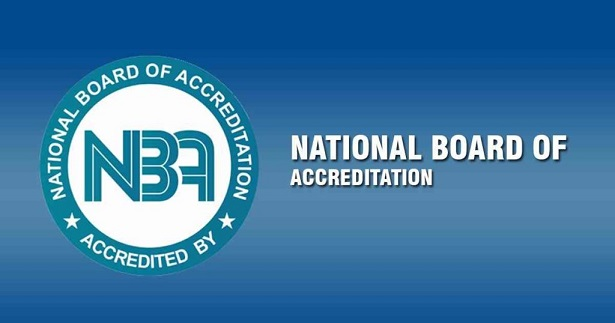
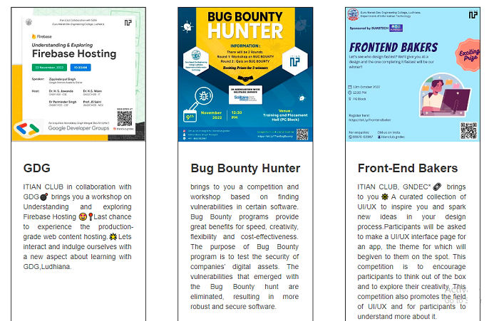
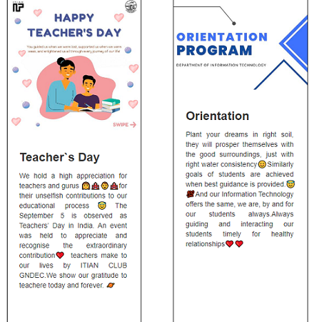

# Department of Information Technology

## Message from HoD's Desk

The Department of Information Technology (DIT) imposes impact on both the urban and rural area students. It helps to create groomed, technically competent and skilled students, so that they can compete with the current computing industry. Our department also provides technical solutions for the problems related to the local society. Department provides ample opportunities and tools to the students for grooming them as a productive and participating global citizens. In the end, I can say we incorporate the good communication and technical skills as well as moral and ethical values for the overall development of the individual.

## Department at Glimpse

  IT department is NBA Accrediated since 2008. This year again **It department got the NBA Accrediation till June, 2025**.

  

## Faculty Achievements  

-  Dr. Pankaj Bhambri, Assistant professor(IT), got Indian Society for Technical Education(ISTE) bEST Teacher award.

-  Dr. Amit Kamra, Assistant professor(IT), translated the Swayam course "Chemical Reaction Engineering-1" in Punjabi language.

-  Pf. Sachin Bagga, Assistant professor(IT), got	badge as a AWS Academy Educator.
 
  
  

## Publications  

- S. Jain and K. Malik,“Bone Age Estimation using Machine Learning Algorithms: A Review and Open Research Challenges,” 9th International Conference on Advance Research and Innovation - 2022, Mar. 2022.

- S. Jain and K. Malik, “Pre-Processing Methods of Bone Age Estimation: A Review and Open Research Challenges,” 5th International Conference on Current trends in Engineering Sciences and Management, May 2022. 

- S. Kumar Singla, “MDA and MDG Importance Measures of Random Forest for the selection of optimal parameters to predict the crop yield,” International Conference on Advance Trends in Computational Mathematics and Operations Research (ICCMSO-2022), Apr. 2022. 

- R.  Kaur, R. Kumar, and S. Rani , “Piezoelectric materials in sensors: Bibliometric and visualization analysis,” Internal Conference on Material science and Sustainable Manufacturing Technology, May 2022. 

- M. Kaur Kang, “Bibliographic Survey of Wheat Research in India,” 9TH INTERNATIONAL CONFERENCE ON ADVANCE RESEARCH AND INNOVATION, Mar. 2022. 

- Bhambri, P., ritu. (2022). A CAD System for Software Effort Estimation.  2022 2nd International Conference on Technological Advancements in Computational Sciences (ICTACS). 

- BHAMBRI, P., SINGH, M., SINGH DHANOA, I; KUMAR, M. (2022). Deployment of ROBOT for HVAC Duct and Disaster Management. Oriental Journal of Computer Science and Technology. 

## Events Attended (FDPs/Conferences/STCs/SDTs/Workshops/Webinars etc.)  

| Sr. No. | Name of Faculty  | Name of Event          | Duration |Date(s)     | Organizing Institute    |
|:--------|:-------------------------------------------------------------------------------------------------------------------------------|:-------------------------------------------------------------------------------------------------------------|:---------|:---------------------------------|:----------------------------------------------------------------------------------------|
| 1 | Sandeep Kumar Singla | OBE and NBA Accreditation     | One week   | May 23, 2022 to May 27, 2022 |NITTTR, Chandigarh|
| 2 | Jagdeep Singh | Cloud, Fog and Edge Computing     | One week   | May 23, 2022 to May 27, 2022 | NITTTR, Chandigarh|
| 3 | Kamaljit kaur | Free Software and resources for technical education through ICT     | One week   | March 21, 2022 to March 25 , 2022| Guru Nanak Dev Engineering College, Ludhiana|
| 4 | Sandeep Kumar Singla | Free Software and resources for technical education through ICT     | One week   | March 21, 2022 to March 25 , 2022| Guru Nanak Dev Engineering College, Ludhiana|
| 5 | Rupinder Kaur | Free Software and resources for technical education through ICT     | One week   | March 21, 2022 to March 25 , 2022| Guru Nanak Dev Engineering College, Ludhiana|
| 6 | Kulvinder Singh Mann | Free Software and resources for technical education through ICT     | One week   | March 21, 2022 to March 25 , 2022| Guru Nanak Dev Engineering College, Ludhiana|
| 7 | Sidharath Jain | Free Software and resources for technical education through ICT     | One week   | March 21, 2022 to March 25 , 2022| Guru Nanak Dev Engineering College, Ludhiana|
| 8 | Sachin Bagga | Free Software and resources for technical education through ICT     | One week   | March 21, 2022 to March 25 , 2022| Guru Nanak Dev Engineering College, Ludhiana|
| 9 | Pradeep Kumar | Free Software and resources for technical education through ICT     | One week   | March 21, 2022 to March 25 , 2022| Guru Nanak Dev Engineering College, Ludhiana|
| 10 | Navdeep Kaur | Capacity Building Training        | 1 day   |  Jan 20, 2022 | ITI, Ludhiana |
| 11 | Manjot Kaur | Capacity Building Training      | 1 day  | Jan 20, 2022 | ITI, Ludhiana |
| 12 |  Sandeep Kumar Singla | EMERGING TRENDS IN TEACHING & RESEARCH (ETTR)      | One Week  | Feb 7, 2022 to Feb 12, 2022 | PIT, Rajpura|
| 13 | Dr.Pankaj Bhambri | Free and Open-Source ICT Tools for Effective Teaching-Learning and Research   | One Week  | Jan 3, 2022 to Jan 8, 2022| NITTTR, Chandigarh |
| 14 |  Sandeep Kumar Singla | MACHINE LEARNING FOR INTERNET OF THINGS   | One Week | Jan 3, 2022 to Jan 8, 2022 | Guru Jambheshwar University Of Science & Technology, Hisar |
| 15 | Jagdeep Singh  | NPIU Faculty Training for Internet of Things - Specialized Skills Training   | 10 days  |  June 11, 2022 to June 20, 2022  | IIT, Bombay |

## Student's Corner  

**ITIAN Club**

The ITIAN Club is a technology based club created in 2021. The club is open to all students who are interested in technology and its application in the real world. The club provides a platform for students to learn about various aspects of technology and its application. The club also organizes various events and workshops related to technology.

 
 

 **ACM**

The Association for Computing Machinery (ACM) is a US-based international learned society for computing. It was founded in 1947 and is the world's largest scientific and educational computing society. The ACM is a non-profit professional membership group,claiming nearly 100,000 student and professional members as of 2019. Its headquarters are in New York City.

 
 

 ## Placements

| Sr. No. | Name of Student     | Company      | Package |
|:--------|:-----------------|:---------|:---------|
| 1 | Tanuj Sharma | Infosys(SE)   | 3.6 lacs   |
| 2 | Divya Juhi | Argusoft India Ltd.    | 7.12 lacs |
| 3 | Lokesh Dhingra | Argusoft India Ltd.    | 7.12 lacs |
| 4 | Subham Kumar | Argusoft India Ltd.    | 7.12 lacs |
| 5 | Abhay Tiwari | TCS Digital   | 7.6 lacs |
| 6 | TCS Digital | TCS Digital  | 7.6 lacs |
| 7 | Deepak Kumar | Yatra  | 6 lacs |
| 8 | Guriqbal Singh | Yatra  | 6 lacs |
| 9 | Harkirat Kaur  | Brillio  | 6 lacs |
| 10 | Sakshi Bhumbla | Brillio | 6 lacs |
| 11| Shubham Savarn | Brillio  | 6 lacs |
| 12 | Dalip Kumar| Cognizant  | 4 lacs |
| 13 | Ankush Bansal | Cognizant  | 4 lacs |
| 14 | Banipreet Singh | Cognizant  | 4 lacs |
| 15 | Daksh Goyal | Cognizant  | 4 lacs |
| 16 | Darshdeep Singh | Cognizant  | 4 lacs |
| 17 | Dilpreet kaur | Cognizant  | 4 lacs |
| 18 | Harkirat Kaur | Cognizant  | 4 lacs |
| 19 | Harshit Garg | Cognizant  | 4 lacs |
| 20 | Jasjot Singh Bagga | Cognizant  | 4 lacs |
| 21 | Jasleen kaur | Cognizant  | 4 lacs |
| 22 | Kanishka Sharma  | Cognizant  | 4 lacs |
| 23 | Karneet Kaur | Cognizant  | 4 lacs |
| 24 | Kushal Singla | Cognizant  | 4 lacs |
| 25 | Mehak Gupta | Cognizant  | 4 lacs |
| 26 | Muskan Kaur Channa | Cognizant  | 4 lacs |
| 27 | Rajnish kumar | Cognizant  | 4 lacs |
| 28 | Ridhim Chugh | Cognizant  | 4 lacs |
| 29 | Rishabh Kumar | Cognizant  | 4 lacs |
| 30 | Satinder Kumar | Cognizant  | 4 lacs |
| 31 |Shivay Bhandari | Cognizant  | 4 lacs |
| 32 | Simranpreet Kaur | Cognizant  | 4 lacs |
| 33 | Tej Karan Singh | Cognizant  | 4 lacs |
| 34 | Upneet Kaur | Cognizant  | 4 lacs |
| 35 | Vanshika | Cognizant  | 4 lacs |
| 36 | Vanshika chaudhary| Cognizant  | 4 lacs |
| 37 | Mayank Mishra | Venture Pact  | 3.65 lacs|
| 38 | Vinay Kumar | Venture Pact | 3.65 lacs |
| 39 | Adarsh Kumar | Venture Pact  | 3.65 lacs |
| 40 | Davinder Kumar | Venture Pact | 3.65 lacs |
| 35 | Jasnoor Kaur Jassal | Venture Pact | 3.57 lacs |
| 36 | Nikhil Sood | Venture Pact   | 3.57 lacs |
| 37 | Rohit Kumar | Venture Pact   | 3.57 lacs |
| 38 | Vivek Dhiman | Venture Pact | 3.57 lacs|

