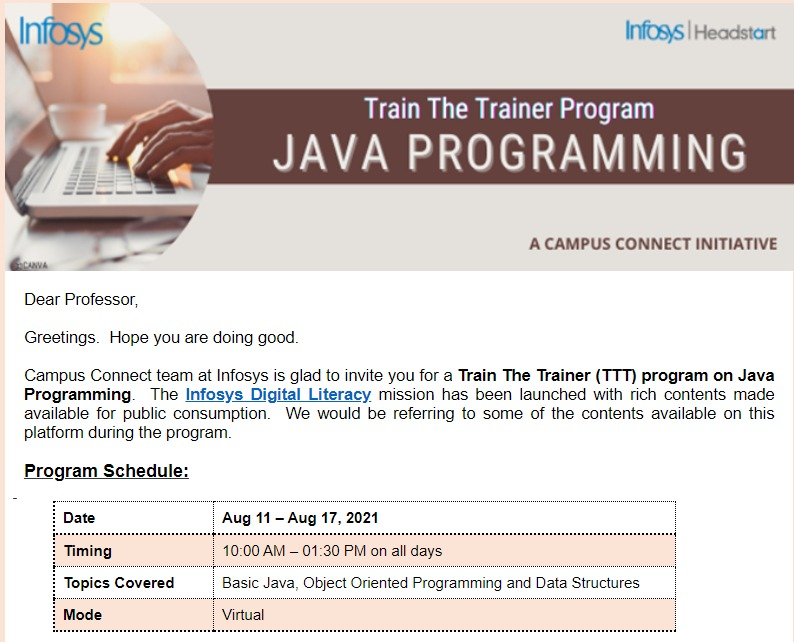

# Department of Information Technology

## Message from HoD's Desk

The Department of Information Technology (DIT) imposes impact on both the urban and rural area students. It helps to create groomed, technically competent and skilled students, so that they can compete with the current computing industry. Our department also provides technical solutions for the problems related to the local society. Department provides ample opportunities and tools to the students for grooming them as a productive and participating global citizens. In the end, I can say we incorporate the good communication and technical skills as well as moral and ethical values for the overall development of the individual.

## Department at Glimpse

- **Workshop on “DevOPs: Software Architecture (DSA-2021)**  

 
 

 The Department of IT, Guru Nanak Dev Engineering College, Ludhiana organized a four-day workshop on “DevOPs: Software Architecture” (DSA-2021) on 25th, 27th to 29th January, 2021. Dr. Kamaljit Kaur (Assistant Prof., IT) and Er. Parminder Kaur Wadhwa (Assistant Prof., IT) were the Coordinator and Co-Coordinator of the workshop respectively.
 On 25th January, 2021 (first day), the faculty members of IT department gathered in HPC lab at 10:00 am. The online google meet was started. Dr. Kamaljit Kaur introduced the expert of the workshop, Mr. Vipin Gupta. He is BE, Red Hat Certified Security Specialist (RHCSS), Red Hat Certified Engineer (RHCE), Certified Ethical Hacker (CEH), Cisco Certified (CCNA), Microsoft Certified (MCSE, MCSA). He is running his own companies in Punjab entitled as U-Net Solutions and U-Net Labs Pvt. Ltd. and is specialized in DevOps. Dr.Kiran Jyoti (HOD, IT) welcomed the expert and all the participants. The 20 faculty members and 25 students(UG)  from the various departments of Guru Nanak Dev Engineering College participated in the workshop.
 The students and the faculty members gained the insight and had hands-on practice of the latest technique “DevOps” through this workshop.
 

 

 - **SDP on "Students' Learning & Skill Enhancement through Interdisciplinary Interventions"**  

 

  The Department of IT, GNDEC, Ludhiana conducted one week Student Development Programme (SDP) on Students' Learning & Skill Enhancement through Interdisciplinary Interventions, from 1st March to 6th March, 2021in blended mode. Er. Hanit Karwal (IT) and Er. Goldendeep Kaur (CSE), were the coordinators of the programme. The main aim of the program was to involve the students of different disciplines like Mechanical Engineering, Electrical, Computer sciences and Management Programs etc. and enhancing their employability skills. Various topics like  How to develop as a employable professional and lay strong foundations of professional life, Approach to Participate and Win in Hackathons, CV Building & Interview Strategies, LinkedIn Guide for Jobs, Internships and Career Guidance, Creating the Winning Edge through Soft Skills and  Nurturing student capacity through interdisciplinary learning were discussed in detail. 280 students from various disciplines participated and gained a lot of insights with a positive feedback
  

- **Train The Trainer (TTT) program on Creating Microsites on Infosys Springboard**  

 A microsite is a one-stop destination that educational institutions can use to their benefit to host internal content with access exclusively for their faculty and students. The objective of the workshop was to guide on creating and publishing a microsite for educational institution.
 

 

- **Satellite based navigation system: A journey from GPS to Mobile Phone Platform**  
 

 Today large amount of geo-spatial data acquired from various sources and processed for various earth resources studies. These geo-spatial datasets for processing require secondary data in the form of geo-tagged samples, GCPs and ground based large scale maps. Now a days geotagged samples, GCPs and ground based large scale maps
 scenario GNSS have various measurement and positioning techniques which can be applied as per requirement in different applications. Apart from its applications in precise positioning GNSS has applications in various areas like TEC estimation & Earth quake studies, Atmospheric studies and Mobile GIS etc. The course was designed in such a way that first week lectures were dedicated to the basic information about
 the GNSS leading to studies carried out in  different areas in second week
 

  

- **STTP on Data Science and Analytics**  

Content Coverage
What, Why, where used, Scope, Components, Sub-classes,  various tools
Principles, applications, trends, and pertinent issues of Artificial Intelligence, Machine Learning, and Data Science.
Data Visualization and Analytics.
Machine Learning and Data Science to a diverse range of operations
Hands-on sessions using
MATLAB
Tableau
Google: Neural Network Playground

   

- **Train The Trainer (TTT) program on  JAVA programming**  

   

## Faculty Achievements  

- Manjot Kaur, Assistant professor(IT), got Best Researcher Award at ICTAI,Tashkent.

  

- Sachin Bagga, Assistant professor(IT), got	recognition from Infosys for actively managing Infosys Campus Connect Activities. He also got recognition from Internshala/AICTE for building a meaningful internship culture among students.

 

## Publications  

- K. Jyoti, Shabnam Sharma, Sahil Verma, Published 2021, A Novel Variant of Bat Algorithm Inspired from CATD-Pursuit Strategy & Its Performance Evaluations,Computer Science, International Journal of Advanced Intelligence Paradigms, DOI:10.1504/ijaip.2021.10030248
- Singh, Jagdeep, and Parminder Singh. "A Sustainable Resource Allocation Techniques for Fog Computing." In Sustainable Development Through Engineering Innovations: Select Proceedings of SDEI 2020, pp. 143-151. Springer Singapore, 2021. DOI: 10.1007/978-981-15-9554-7_13
- Singh, Jagdeep, Parminder Singh, and Sukhpal Singh Gill. "Fog computing: A taxonomy, systematic review, current trends and research challenges." Journal of Parallel and Distributed Computing (2021). DOI : 10.1016/j.jpdc.2021.06.005
- Singh, Jagdeep, Parminder Singh and Jatinder Warraich. ""A Survey on Load Balancing Techniques in Fog Computing "", Presented in ICCS 2021  Confrence at LPU, 2021
- Avinash Kaur, Pooja Gupta, Parminder Singh and Manpreet Singh (2020) “Data Placement Oriented Scheduling Algorithm for Scheduling Scientific Workflow in Cloud: A Budget-Aware Approach”, Recent Advances in Computer Science and Communications, Vol 13, Issue 5, November 2020, ISSN (Print): 2666-2558, ISSN (Online): 2666-2566, pp. 871 – 883, DOI: 10.2174/2666255813666190925141324
- Manpreet Singh, Pankaj Bhambri, Inderjit Singh, Amit Jain, Kirandeep Kaur (2021) “Data Mining Classifier for Predicting Diabetics” Annals of R.S.C.B., ISSN:1583-6258, Vol. 25, Issue 4, April 2021, Pages. 6702 – 6712
- Singh, Amrit Pal, Aggarwal, Manuj, Singh, Harpuneet and Bhambri, Pankaj. "Sketching of EV Network: A Complete Roadmap." In Sustainable Development Through Engineering Innovations: Select Proceedings of SDEI 2020, pp. 431-442. Springer Singapore, 2021. DOI: 10.1007/978-981-15-9554-7_37
- Kulvinder Kaur, I.S. Dhanoa and Pakaj Bhambri, "Optimized PSO-EFA Algorithm for Energy Efficient Virtual Machine Migrations," 2020 5th IEEE International Conference on Recent Advances and Innovations in Engineering (ICRAIE), 2020, pp. 1-5, doi: 10.1109/ICRAIE51050.2020.9358305.
- Amit Jain, Manpreet Singh and Pankaj Bhambri. "Performance evaluation of {IPv}4-{IPv}6 tunneling procedure using IoT." IoP Publishing, Journal of Physics: Conference Series, August 2021. Vol. 1950, No.1 . DOI: 10.1088/1742-6596/1950/1/012010
- Manpreet Singh, Pankaj Bhambri, Inderjit Singh, Amit Jain, Kirandeep Kaur (2021) “Data Mining Classifier for Predicting Diabetics” Annals of R.S.C.B., ISSN:1583-6258, Vol. 25, Issue 4, April 2021, Pages. 6702 – 6712
- Amit Jain, Manpreet Singh and Pankaj Bhambri. "Performance evaluation of {IPv}4-{IPv}6 tunneling procedure using IoT." IoP Publishing, Journal of Physics: Conference Series, August 2021. Vol. 1950, No.1 . DOI: 10.1088/1742-6596/1950/1/012010
- Purnima Bakshi, Pankaj Bhambri, and Vivek Thapar (2021) “A Review Paper on Wireless Sensor Network Techniques in Internet of Things (IoT)” Wesleyan Journal of Research (vol.14, no.7, pp. 147-160)
- Kamal Nain, A Hybrid Model for Mammogram Images Classification Using Transfer Learning, Turkish journal of CSE and EE, SCI-IF: 0.6
- Manjot KaurDetection of retinal abnormalities in fundus image using transfer learning networks”, Soft Computing; Springer,2021 (SCIE-Impact Factor-3.643) DOI-10.1007/s00500-021-06088-3
- Novel Approach for Detection, Localization, and Mitigation of Malicious Node in NoC based SoC IEEE Conference
- Divya Sharma, Dr. Amandeep Kaur Sohal, Stock Market Prediction Using ARIMA, ANN and SVR, Lecture Notes in Electrical Engineering, Vol 698, 2021. Springer Singapore
- Manjot Kaur “A Robust Morphological Deep Net Method for Image Segmentation Using Clustering”, International Journal of Current Research and Review,13(8):127-131;2021 (Scopus-Impact Factor-1.84)
- Manjot Kaur “Segmentation of Retinal Blood Vessels via Novel Mechanism”. Proceedings of 2nd IEEE International Conference on Advances in Computing, Communication Control and Networking, Greater Noida, India.18-19 Dec,2020,pp: 997-1001. (Scopus Indexed)
- Manjot Kaur "Enhancement of Retinal Image by Hybrid Approach”. Proceedings of IEEE International Conference on Computation, Automation and Knowledge Management, Dubai.19-21 Jan, 2021, pp:374-378(Scopus Indexed)
- Manjot Kaur “A Robust Morphological Deep Net Method for Image Segmentation Using Clustering”, International Journal of Current Research and Review,13(8):127-131;2021 (Scopus-Impact Factor-1.84)
- Manjot Kaur “Segmentation of Retinal Blood Vessels via Novel Mechanism”. Proceedings of 2nd IEEE International Conference on Advances in Computing, Communication Control and Networking, Greater Noida, India.18-19 Dec,2020,pp: 997-1001. (Scopus Indexed)
- Manjot Kaur "Enhancement of Retinal Image by Hybrid Approach”. Proceedings of IEEE International Conference on Computation, Automation and Knowledge Management, Dubai.19-21 Jan, 2021, pp:374-378(Scopus Indexed)
- Manjot Kaur Detection of retinal abnormalities in fundus image using transfer learning networks”, Soft Computing; Springer,2021 (SCIE-Impact Factor-3.643) DOI-10.1007/s00500-021-06088-3
- Transfer Learning Approach for the Diagnosis of Pneumonia in Chest X-Rays." In Proceedings of the International Conference on Paradigms of Computing, Communication and Data Sciences, pp. 821-832. Springer, Singapore, 2021.

## Events Organized (FDPs/Conferences/STCs/SDTs/Workshops/Webinars etc.)  

| Sr. No. | Name of Event            | Faculty Coordinator                                           | Duration | Date(s)                | Sponsor(s)                                     |
|:--------|:------------------------------------------------------------------------------------------------------------------------------|:--------------------------------------------------------------|:---------|:-----------------------|:-----------------------------------------------|
| 1       | SDP on Students' Learning and Skill Enhancement Through Interdisciplinary Interventions.  | Hanit Karwal |One Week | 1 March - 6 March 2021  | TEQIP-III |
| 2       | Workshop on "DevOps: Software Architecture"  | Dr. Kamaljit Kaur and  Er. Parminder Kaur Wadhwa |One Week | 25th, 27th to 29th January, 2021  | TEQIP-III |
| 3       | Online training course on “Satellite based Navigation: A Journey from GPS to Mobile Phone Platform” conducted by this institute during       | Sachin Bagga |Two Week | March 01, 2021 to March 12,”2021,  | IIRS-ISRO |
| 4      | Data Science and Analytics  | Sachin Bagga | Two Week |8-19 March 2021 | TEQIP-III |
| 5       | Train The Trainer (TTT) program on Java Programming | Sachin Bagga | 3 Days | Aug 11 – Aug 17, 2021  |Infosys |
| 6       | TTT Program on Creating Microsite on Infosys Springboard | Sachin Bagga | 3 Days | September 21 - September 23, 2021 |Infosys |

## Events Attended (FDPs/Conferences/STCs/SDTs/Workshops/Webinars etc.)  

| Sr. No. | Name of Faculty  | Name of Event          | Duration |Date(s)     | Organizing Institute    |
|:--------|:-------------------------------------------------------------------------------------------------------------------------------|:-------------------------------------------------------------------------------------------------------------|:---------|:---------------------------------|:----------------------------------------------------------------------------------------|
| 1 | Sidharath Jain | TEQIP-III sponsored Workshop on "DevOps: Software Architecture"     | One week   | 25th, 27th to 29th January, 2021 |Department of Information Technology, Guru Nanak Dev Engineering College, Ludhiana|
| 2 | Harpreet Kaur | TEQIP-III sponsored Workshop on "DevOps: Software Architecture"     | One week   | 25th, 27th to 29th January, 2021 |Department of Information Technology, Guru Nanak Dev Engineering College, Ludhiana|
| 3 | Hanit Karwal | TEQIP-III sponsored Workshop on "DevOps: Software Architecture"     | One week   | 25th, 27th to 29th January, 2021 |Department of Information Technology, Guru Nanak Dev Engineering College, Ludhiana|
| 4 | Parminder Kaur Wadhwa | TEQIP-III sponsored Workshop on "DevOps: Software Architecture"     | One week   | 25th, 27th to 29th January, 2021 |Department of Information Technology, Guru Nanak Dev Engineering College, Ludhiana|
| 5 | Dr. Kamaljit Kaur | TEQIP-III sponsored Workshop on "DevOps: Software Architecture"     | One week   | 25th, 27th to 29th January, 2021 |Department of Information Technology, Guru Nanak Dev Engineering College, Ludhiana|
| 6 | Dr. Manpreet Singh | NPTEL course (AICTE Approved FDP) on “Effective Writing”     | Four weeks   |Jan 18, 2021 to Feb 12, 2021 | IIT Roorkee |
| 7 | Dr. Pankaj Bhambri | NPTEL course (AICTE Approved FDP) on “Effective Writing”     | Four weeks   |Jan 18, 2021 to Feb 12, 2021 | IIT Roorkee |
| 8 | Hanit Karwal | Professional Development Training   | 3 days   | 17-19 March 2021 | IIM Jammu |
| 9 | Dr. Pankaj Bhambri | NPTEL course (AICTE Approved FDP) on “Effective Writing”     | Four weeks    | Jan 18, 2021 to Feb 12, 2021 |IIT Roorkee |
| 10 | Rupinder Kaur | ICT Initiatives in Technical Education”      | 1 week   | Feb 8,2021 to 13 Feb 2021 | SWAYAM NPTEL|
| 11 |  Dr. Kamaljit Kaur | ICT Initiatives in Technical Education”      | 1 week   | Feb 8,2021 to 13 Feb 2021 | SWAYAM NPTEL|
| 12 |  Dr. Kiran Jyoti | Effective Teaching Methodologies Through Optimistic Teaching Aids      | One Week  | 17-05-2021 to 22-05-2021 | Department of Master of Computer Applications , KLN College of Engineering Tamil Nadu, India |
| 13 | Dr.Pankaj Bhambri | AICTE Recognized Faculty Development Programme on “NBA Accreditation and Examination Reforms”     | One Week  | 17-05-2021 to 21-05-2021 | National Institute of Technical Teachers Training and Research, Chandigarh |
| 14 |  Dr. Kamaljit Kaur | Recent Trends In Big Data, Data Science And Its Applications (RTBDA-2021)   | One Week | June 05 - 09, 2021 | Department of Computer Science & Engineering of GMR Institute of Technology, Rajam |
| 15 | Er. Parminder Kaur Wadhwa  | "NAAC/NBA Accreditation Awareness Workshop"   | Two days  | 15th and 16th July, 2021 | Department of College Development, I.K. Gujral Punjab Technical University, Jalandhar |
| 16 | Rupinder Kaur | Webinar on Insight in Block Chain Technology     | 1 day   | 29 July 2021 | Punjabi University Patiala|

## Student's Corner  

 **Placements**

| Sr. No. | Name of Student     | Company      | Package |
|:--------|:-----------------|:---------|:---------|
| 1 | Jaskaran Singh | Infosys Limited    | 3.6 lacs   |
| 2 | Anand Kumar | HCL Technologies Ltd.    | 4.75 lacs |
| 3  | Muskan Arora | HCL Technologies Ltd.    | 4.75 lacs |
| 4 | Gourav Khera | BizMerlin HR.    | 3.3 lacs |
| 5 | Madvi | Brillio   | 4.5 lacs |
| 6 | Nikita Negi | Brisk Logic Pvt. Ltd.  | 3 lacs |
| 7 | Rohit Sharma | BYJU's  | 10 lacs |
| 8 | Manmeet Kaur | Capgemini  | 4 lacs |
| 9 | Sahil Sharma | Capgemini  | 4 lacs |
| 10 | Ujjwal Khanna | Capgemini  | 4 lacs |
| 11| Mehak | Capgemini  | 4 lacs |
| 12 | Abhishek Yadav | Cognizant  | 4.5 lacs |
| 13 | Piyush Gupta | Cognizant  | 4.5 lacs |
| 14 | Sahil Sharma | Cognizant  | 4.5 lacs |
| 15 | Yogita Sahni | Cognizant  | 6.75 lacs |
| 16 | Sehaj chawla | Cognizant  | 4 lacs |
| 17 | Kanishka Malhotra | Cognizant  | 4 lacs |
| 18 | Lovish Rajpal | Cognizant  | 4 lacs |
| 19 | Bhavya Garg | Cognizant  | 4 lacs |
| 20 | Madvi | Cognizant  | 4 lacs |
| 21 | Amritpal Kaur | Cognizant  | 4 lacs |
| 22 | Priyanshi Singla | Cognizant  | 4 lacs |
| 23 | Nivedan Sharma | Cognizant  | 4 lacs |
| 24 | Mehak | Cognizant  | 4 lacs |
| 25 | Piyush Mehta | Cognizant  | 4 lacs |
| 26 | Gauri Bawa | Cognizant  | 4 lacs |
| 27 | Arshpreet Singh | Cognizant  | 4 lacs |
| 28 | Simrath Kaur | Cognizant  | 4 lacs |
| 29 | Sanjam Preet Singh | Cognizant  | 4 lacs |
| 30 | Rahul Ranjan | Cognizant  | 4.5 lacs |
| 31 | Arshpreet Singh | HCL Technologies Ltd.  | 3.65 lacs|
| 32 | Piyush Gupta | HCL Technologies Ltd.   | 3.65 lacs |
| 33 | Tanvi |HCL Technologies Ltd.   | 3.65 lacs |
| 34 | Vritti Gupta | HCL Technologies Ltd.   | 3.65 lacs |
| 35 | Bhavya Garg | HCL Technologies Ltd.   | 3.57 lacs |
| 36 | Mehak | HCL Technologies Ltd.   | 3.57 lacs |
| 37 | Nivedan Sharma | HCL Technologies Ltd.   | 3.57 lacs |
| 38 | Sanjam Preet Singh |HCL Technologies Ltd. | 3.57 lacs|
| 39 | Shashi Gupta | HCL Technologies Ltd.   | 3.57 lacs |
| 40 | Yogita Sahni | Infosys Limited  | 3.6 lacs |
| 41 | Madvi | Infosys Limited  | 3.6 lacs |
| 42 | Vritti | Infosys Limited  | 3.6 lacs |
| 43 | Manmeet Kaur | Infosys Limited  | 5 lacs |
| 44 | Suryansh Chopra | Infosys Limited  | 5 lacs |
| 45 | Lovish Rajpal | Orion eSolutions Pvt. Ltd.  | 3.75 lacs |
| 46 | Vishal Singla | Pure Software Pvt. Ltd.  | 6 lacs |
| 47 | Gaurav Chauhan |Orion eSolutions Pvt. Ltd.  | 4 lacs |
| 48 | Rahul Ranjan |  Pure Software Pvt. Ltd.  | 6 lacs |
| 49 | Ikrar Khan | Sapient  | 6.5 lacs |
| 50 | Abhishek kumar Choudhary | Step2gen  | 2.6 lacs |
| 51 | Kanishka Malhotra | TCS (Ninja)  | 3.36 lacs |
| 52 | Asees Khurana | TCS (Ninja)  | 3.36 lacs |
| 53 | Aditya Sharma | TCS (Ninja) | 3.36 lacs |
| 54 | Lovish Rajpal | TCS (Ninja)  | 3.36 lacs |
| 55 | Piyush Gupta | TCS (Ninja)  | 3.36 lacs |
| 56 | Vishal Singla | TCS (Ninja)  | 3.36 lacs |
| 57 | Gurwinder Singh | Venture Pact, LLC  | 4.62 lacs |
| 58 | Japesh Bagga | Venture Pact, LLC  | 4.62 lacs |
| 59 | Nivedan Sharma | Samsung  | 14.5 lacs |
| 60 | Gurwinder Singh | Samsung  | 14.5 lacs |
| 61 | Kulvir Singh | Xenonstack  | 5 lacs |
| 62 | Sidique Chaudhary | Xenonstack | 5 lacs |
| 63 | Madvi | Wipro  | 3.5 lacs |
| 64 | Anant Shree | Wipro  | 3.5 lacs |
| 65 | Mokshi | Wipro  | 3.5 lacs |
| 66 | Sanjam Preet Singh | Wipro | 3.5 lacs |
