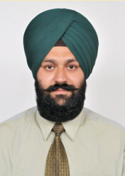
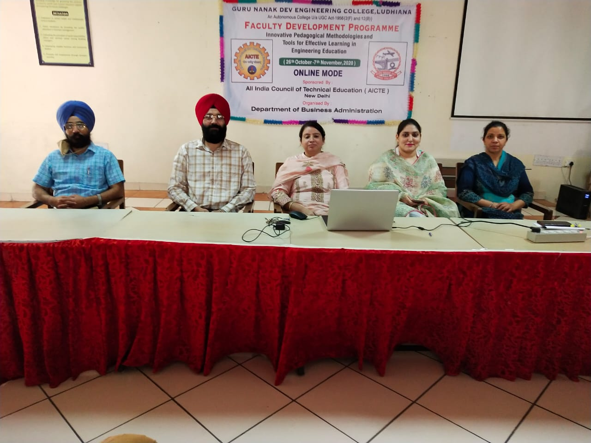
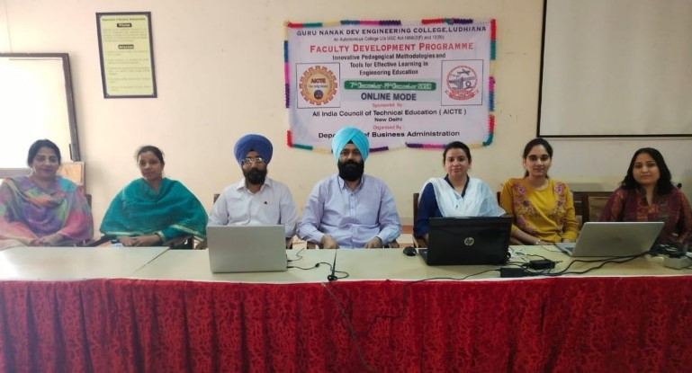
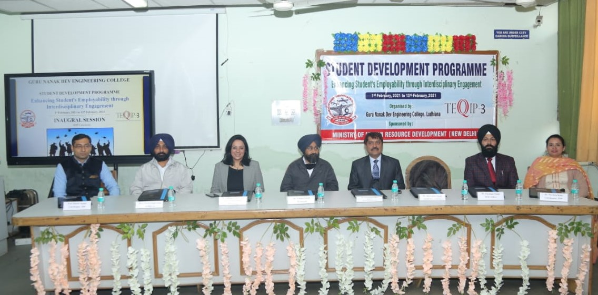
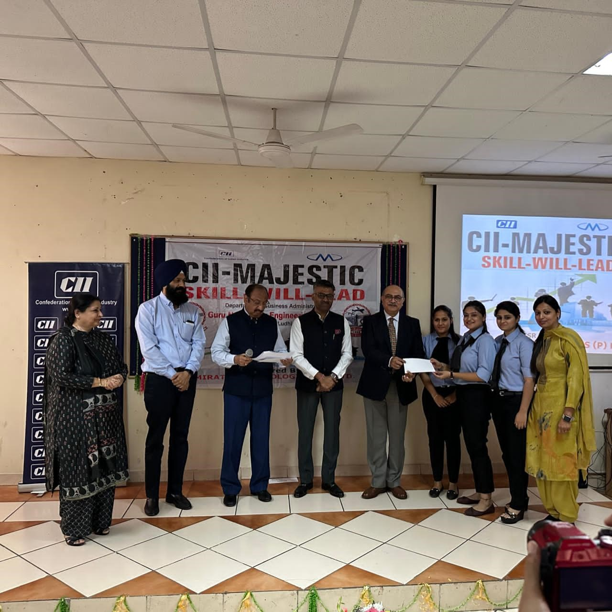
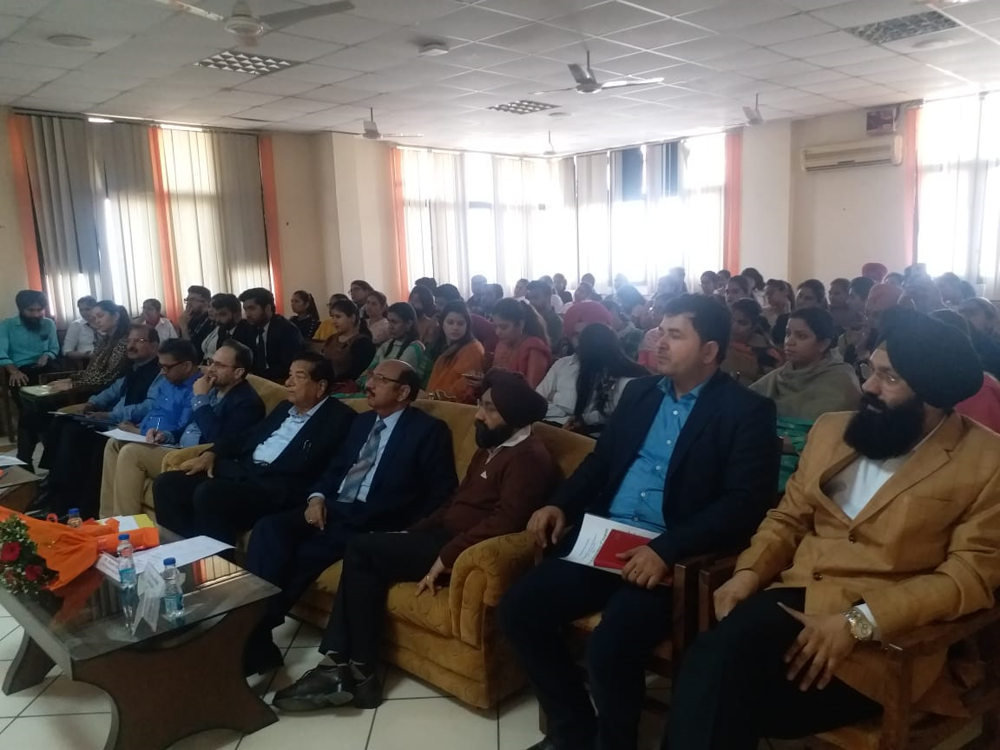
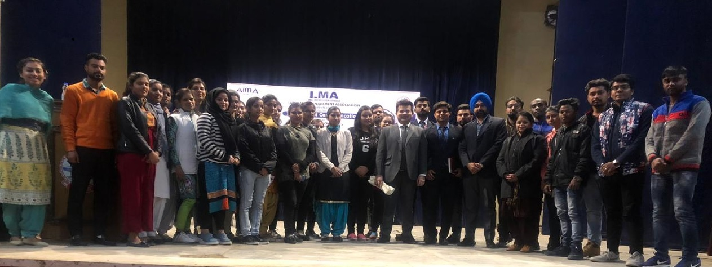
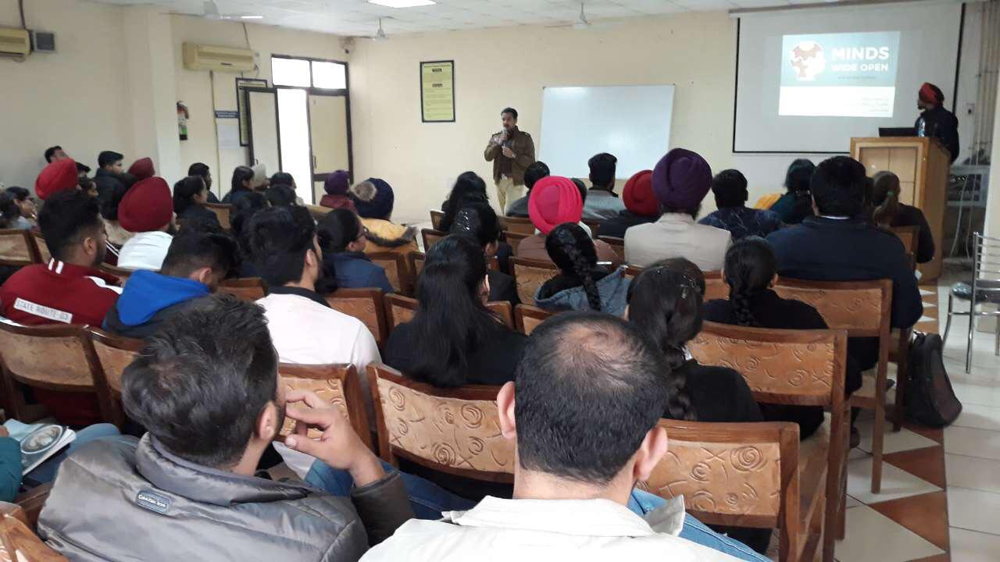
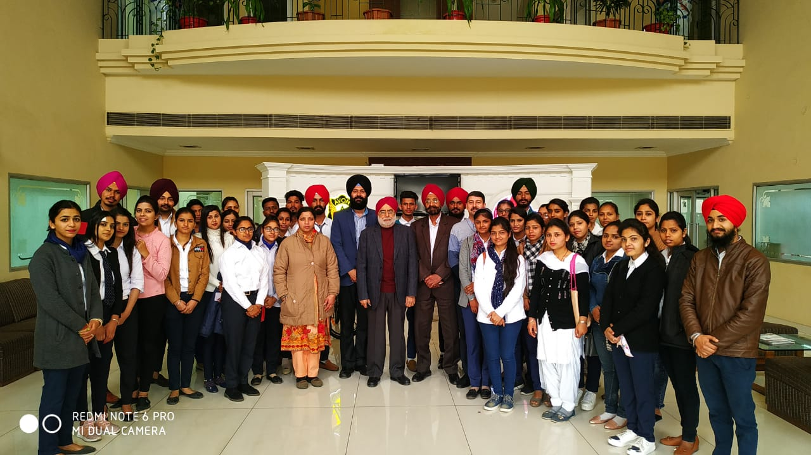
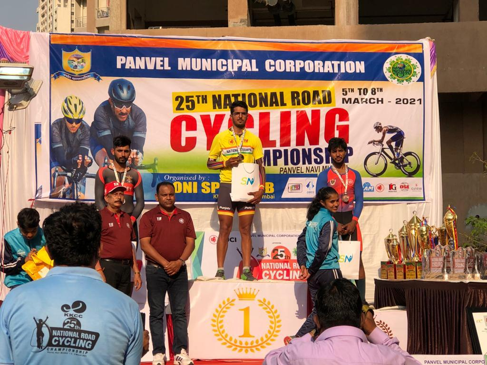

# Department of Business Administration

## Message from HoD's Desk

The Department of Business Administration was established in the year 2007 to impart world class education in the field of Management at the Post-Graduate level. The Department is currently running a two year full time MBA programme affiliated to (IKGPTU), Jalandhar and duly approved by AICTE. This programme provides a foundation in general management functions and a range of specialist options to cater to the ever increasing demand of managerial talent in the industry. The MBA Programme aims to generate groomed, technically competent and skilled intellectual professionals to meet the current challenges of the modern Business world.
The Department of Business Administration has experienced and competent faculty to impart quality education to the budding managers. Besides department faculty, the college provides faculty from the other departments to teach specialized subjects like Information Technology for Management, Applied Operations Research and Research Methodology etc. In addition to MBA Programme, the eligible faculty of the department is engaged in guiding the Ph.D. students of the Punjab Technical University, Kapurthala-Jalandhar Highway Kapurthala. The department has requisite and state of the art infrastructure like Wi-Fi facilities, rich library, e-resources (EBSCO, J-gate and e-books), class rooms with LCD Projectors, seminar room, computers installed with software etc. Being the department of autonomous institution, the department revises curriculum to cater to the changing business environment and expectations of the industry. The alumni of the department are serving in eminent companies like Honda, Volkswagen, Kracher, Sonalika Tractors, ICICI, Muthoot Finance, HDFC Bank, AXIS Bank, Life Style, Coca-Cola, Think gas,  and Nahar Spinning etc.

## Department at Glimpse

- **AICTE Sponsored under(AQIS) Scheme Two Weeks FDP on "Innovative Pedagogical Methodologies and Tools for Effective Learning in Engineering Education from 26th October to 7th November,2020 through online mode.”**

***Organising Team -AICTE Sponsored Ist FDP***

AICTE (New Delhi), AICTE Quality improvement scheme (AQIS) sponsored Faculty Development Program organized by Department of Business Administration Guru Nanak Dev Engineering College, Ludhiana on “Innovative Pedagogical Methodologies and Tools for Effective Learning in Engineering Education” from 26th October, 2020 to 7th November, 2020 through online mode. Go to meeting app has been purchased for this faculty development program and 150 participants PAN India were participated in this program.  

**[Click Here to View Inaugural Session](https://youtu.be/uMKn29iBRlQ)**  
**[Click Here to View Valedictory Session](https://youtu.be/ZDI1Tff4LLE)**

- **AICTE Sponsored under(AQIS) Scheme Two Weeks FDP on "Innovative Pedagogical Methodologies and Tools for Effective Learning in Engineering Education from 07th December,2020 to 21st December,2020” through Online mode."**

***Organising Team -AICTE Sponsored 2nd FDP***

AICTE (New Delhi), AICTE Quality Improvement Scheme (AQIS) sponsored Faculty Development Program organized by Department of Business Administration, Guru Nanak Dev Engineering College, Ludhiana on “Innovative Pedagogical Methodologies and Tools for Effective Learning in Engineering Education” from 07th December, 2020 to 21st December, 2020 through online mode. Go to meeting app has been purchased for this Faculty Development Program and 80 participants from PAN India participated in this Faculty Development Program (FDP).

First day i.e., on 07th December, 2020, Inaugural session has been taken by Dr. K. Srinivas Head ICT & Project Management Unit, National Institute of Educational Planning and Administration (NIEPA), Deemed to be University, Ministry of Education, Govt. of India. He opened his session with a quote from Alvin Toffler and  highlighting the ways in which the lockdown period can be utilized by the faculties and students to the optimum level in enhancing their technology and digital capabilities. He laid ample stress on building the competencies of Teachers for the online teaching by encouraging them to adapt to the new technological pedagogies as well as by releasing control of learning to the students. Dr.Srinivas concluding remarks emphasized on the necessity that instructor must take the role of facilitator of information while giving the solutions.

**[Click Here to View Inaugural Session](https://youtu.be/hbua5XdQi9U)**

**[Click Here to View Valedictory Session](https://youtu.be/NYSlHHW4UFM)**  

- **Technical Education Quality Improvement Programme (TEQIP)-III) Guru Nanak Dev Engineering College, Ludhiana sponsored Two Weeks Student Development Programme on "Enhancing Students' Employability through Interdisciplinary Engagement” from 1st February - 13th February,2021 ”**

***Chief Guest SDP Ms.Sandeep Riat, MD Akal Spring Ltd., Mr.G.S.Sidhu,Head IT,Cremica Food Industries & Principal Dr.Sehijpal Singh,GNDEC Ludhiana***

TEQIP-III sponsored Student Development Program organized by Department of Business Administration & Department of Computer Applications, Guru Nanak Dev Engineering College, Ludhiana on “Enhancing Students' Employability through Interdisciplinary Engagement” from 1st February, 2021 to 15th February,2021 through offline mode. The program was held at Campus in Testing and Consultancy Cell at GNDEC Campus. Nearly 80 students of Final year of B.Tech (All Branches)/MBA/MCA has been participated in this program.

**[Click Here to View SDP](https://youtu.be/28bUjZCYyGw)**

## Publications  

- [**Ripudaman Kaur**, **Parampal Singh**. (2020) Emotional Intelligence and its impact on the Job Performance among frontline bank employees.In: Suraj Punj Journal For Multidisciplinary Research  ISSN NO: 2394-28860.](https://drive.google.com/file/d/1YEz5ui25GiGyXKXQGnIWLNDBR7c5vwUJ/view)

## Events Organized (FDPs/Conferences/STCs/SDTs/Workshops/Webinars etc.)  

| Sr. No. | Name of Event                                                                                          | Faculty Coordinator                  | Duration  | Date(s)                                  | Sponsor(s)        |
|:------- |:------------------------------------------------------------------------------------------------------ |:------------------------------------ |:--------- |:---------------------------------------- |:----------------- |
| 1       | FDP on Innovative Pedagogical Methodologies and Tools for Effective Learning in Engineering Education” | Dr. Navdeep Kaur                     | Two Weeks | 26th October, 2020 to 7th November, 2020 | AICTE, New Delhi. |
| 2       | FDP on Innovative Pedagogical Methodologies and Tools for Effective Learning in Engineering Education” | Dr. Navdeep Kaur                     | Two Weeks | 07th December-21st December,2020.        | AICTE, New Delhi. |
| 3       | SDP on Enhancing Students' Employability through Interdisciplinary Engagement                         | Dr.Navdeep Kaur & Prof. Dinesh Anand | Two Weeks | 1st February, 2021 to 15th February, 2021 | TEQIP-III         |

## Events Attended (FDPs/Conferences/STCs/SDTs/Workshops/Webinars etc.)  

| Sr. No. | Name of Faculty   | Name of Event                                                                                                                                                             | Duration        | Date(s)              | Organizing Institute           |
|:------- |:----------------- |:------------------------------------------------------------------------------------------------------------------------------------------------------------------------- |:--------------- |:-------------------- |:------------------------------ |
| 1       | Amanjot Kaur Gill | Professional Development Training Programme for Faculty & Administrators of Project Institutions of Technical Education Quality Improvement Programme – III (TEQIP – III) | 3 Days          | 7-9 Dec 2020         | NPIU-IIMV                      |
| 2       | Amanjot Kaur Gill | Curriculum Implementation                                                                                                                                                 | 4 Days          | 20-24 April 2020     | NITTTR CHD                     |
| 3       | Amanjot Kaur Gill | Teaching and Learning for Accreditation in Technical Education                                                                                                            | 5 Days          | 27 April- 1 May 2020 | NITTTR CHD                     |
| 4       | Amanjot Kaur Gill | Academic Leadership Enhancement in Technical Institutions                                                                                                                 | 5 Days          | 4-8 May 2020         | NITTTR CHD                     |
| 5       | Amanjot Kaur Gill | Modes of Teaching and Learning in Lockdown                                                                                                                                | One Day           | 11 May 2020          | NPTEL                          |
| 6       | Dr. Navdeep Kaur  | How to conduct evidence-based research                                                                                                                                    | One Module      | 17 April,2020        | Elsevier Research Academy      |
| 7       | Dr. Navdeep Kaur  | Discover how metrics can boost funding and networking opportunities                                                                                                       | One Module      | 11 May,2020          | Elsevier Research Academy      |
| 8       | Dr. Navdeep Kaur  | Funding Hacks for Researchers                                                                                                                                             | One Module      | 11 May,2020          | Elsevier Research Academy      |
| 9       | Dr. Navdeep Kaur  | The key to successful academic collaborations                                                                                                                             | One Module      | 14 May,2020          | Elsevier Research Academy      |
| 10      | Dr. Navdeep Kaur  | How to manage and publish your research data                                                                                                                              | One Module      | 17 April,2020        | Elsevier Research Academy      |
| 11      | Dr. Navdeep Kaur  | How to produce highly visible research: Useful tips for researchers                                                                                                       | One Module      | 14 May,2020          | Elsevier Research Academy      |
| 12      | Dr. Navdeep Kaur  | Research collaborations                                                                                                                                                   | One Module      | 14 May,2020          | Elsevier Research Academy      |
| 13      | Dr. Navdeep Kaur  | How researchers store, share and use data                                                                                                                                 | One Module      | 17 April,2020        | Elsevier Research Academy      |
| 14      | Dr. Navdeep Kaur  | How to secure funding - ECR edition                                                                                                                                       | One Module      | 11 May,2020          | Elsevier Research Academy      |
| 15      | Dr. Navdeep Kaur  | The Fundamentals of Digital Marketing                                                                                                                                     | One Module      | 10 May,2020          | Google Digital Garage          |
| 16      | Dr. Navdeep Kaur  | Industry 4.0                                                                                                                                                              | 36 hours course | 5 July,2020          | Globsyn Business School Online |
| 17      | Dr. Navdeep Kaur  | Assertiveness Skills for Professional Development.                                                                                                                        | One Module      | 09 June,2020         | St. Xavier's P.G. College      |
| 18  |Prof.Amarpreet Kaur    |Building Your Research Acumen                                                                                                                                                                           | One Week                | 30 May,2020-11 July,2020 (on every consecutive Saturday)                     | GNSU, Jamuhar, Bihar                               |
| 19 | Prof.Amarpreet Kaur                  |Research Methodology                                                                                                                                                |  One Day               |  11 June,2020                    |  Bhaktavatsalam Memorial College for Women, Chennai                              |
| 20  |Prof.Amarpreet Kaur |  Academic Enhancement on Research Methodology                                                                                                               | 4 Days                 |26-29 June,2020                      |  IRA, Jaipur                              |
| 21 | Prof.Amarpreet Kaur                  | Supply Chain Management:Challanges & Strategies                                                                                                            | One Week                | 13-17July,2020                    |Dr.B.R.AmbedkarNational Institute of Technology,Jalandhar                                |

## Miscellaneous (Lab Upgradation, Infrastructure augmentation etc.)  

- All class rooms are wi-fi enabled and Latest ICT Techniques.
-Replacement of convention CRT Monitors WITH LED ones.
 (You can add any miscellaneous details related to your department here which you feel should be added in Newsletter)

## Student's Corner  

**Participating MBA Team in CII-Majestic Skill-Will-Lead at GNDEC, Ludhiana.**

***Chief Guest Mr.Mahesh Munjal CEO Majestic Autos Ltd. along with Industry Experts & Principal Dr.Sehijpal Singh GNDEC, Ludhiana.***

***LMA-Student Form-Interactive Expert Talk held in GNDEC,Ludhiana.***

***Interactive Expert Talk by Dr.Kamal K.Jain  Professor, IIM Indore held in GNDEC,Ludhiana.***

***31st Road Safety Week Interactive Expert Talk by Sh.Rajan Sharma ACP Traffic Zone II Ludhiana held in GNDEC,Ludhiana.***

***Industrial Visit at Avon Cycles Pvt.Ltd, Ludhiana.***

#### Student's Achievements

***MBA student Harshveer Singh Sekhon  Roll No.2028024 won two (2) Gold and one (1) Bronze Medal in 25th National Road Cycling Championship.***
