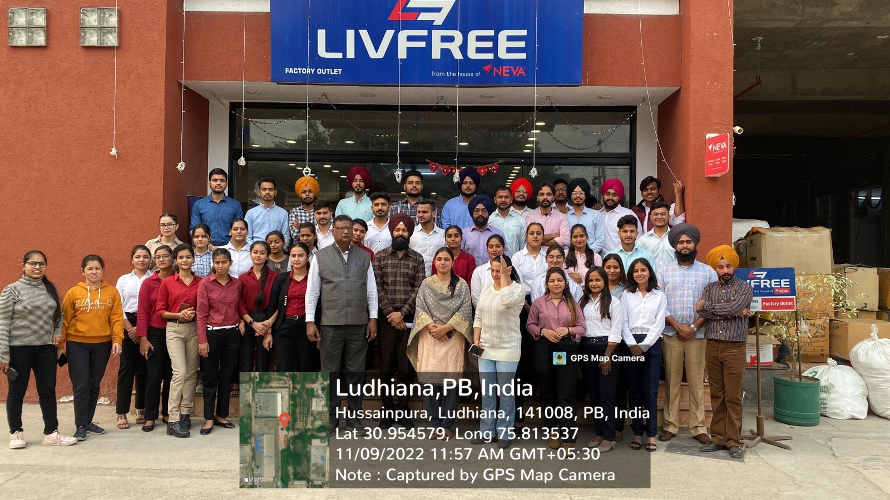

# Department of Business Administration

## Message from HoD's Desk

The Department of Business Administration was established in the year 2007 to impart world class education in the field of Management at the Post-Graduate level. The Department is currently running a two year full time MBA programme affiliated to (IKGPTU), Jalandhar and duly approved by AICTE. This programme provides a foundation in general management functions and a range of specialist options to cater to the ever increasing demand of managerial talent in the industry. The MBA Programme aims to generate groomed, technically competent and skilled intellectual professionals to meet the current challenges of the modern Business world.
The Department of Business Administration has experienced and competent faculty to impart quality education to the budding managers. Besides department faculty, the college provides faculty from the other departments to teach specialized subjects like Information Technology for Management, Applied Operations Research and Research Methodology etc. In addition to MBA Programme, the eligible faculty of the department is engaged in guiding the Ph.D. students of the Punjab Technical University, Kapurthala-Jalandhar Highway Kapurthala. The department has requisite and state of the art infrastructure like Wi-Fi facilities, rich library, e-resources (EBSCO, J-gate and e-books), class rooms with LCD Projectors, seminar room, computers installed with software etc. Being the department of autonomous institution, the department revises curriculum to cater to the changing business environment and expectations of the industry. The alumni of the department are serving in eminent companies like Honda, Volkswagen, Kracher, Sonalika Tractors, ICICI, Muthoot Finance, HDFC Bank, AXIS Bank, Life Style, Coca-Cola, Think gas,  and Nahar Spinning etc.

## Publications  

- [**Dr.Parampal Singh**.] (Feb2023) Published paper in YMER, titled,"Perception of Consumers towards Fixed line Broadband Services Adoption: A Study of Indian Consumers".Vol 22,Issue 02,Feb 2023, ISSN-0044-0477,Scopus Indexed.

## Events Organized (FDPs/Conferences/STCs/SDTs/Workshops/Webinars etc.)  

| Sr. No. | Name of Event                                                                                          | Faculty Coordinator                  | Duration  | Date(s)                                  | Sponsor(s)        |
|:------- |:------------------------------------------------------------------------------------------------------ |:------------------------------------ |:--------- |:---------------------------------------- |:----------------- |
| 1       | Presented Series on "Time Management"                                                                  | Dr. Parampal Singh                    | Three Days | 10th October, 2022 to 12th November, 2022 | Center For Multi-Faceted Learning,GNDEC,Ludhiana. |
|                                                                                                                                                                                                                                           

# Professional Activities

|Activities:  | Speakers:                                                                                    | Dates:                  |
|:------- |:------------------------------------------------------------------------------------------------------ |:------------------------------------ |:--------- |:---------------------------------------- |:----------------- |
|Entrepreneurship Cell & Department of Business Administartion organized a session on Business StartUp Program| Mr.Bernard Curren(Programme Director)and Mr.S.K. Rai(Vice Chairman Hero Cycle)| 2nd June,2022    |
| Guest lecture on World Investor’s week	|CS Pooja Kohli, SEBI, India	|11 October,2022             |
|Industrial visit |Avon Cycles Ltd , Ludhiana|	27 October,2022|
|Industrial Visit  |	Neva Garments Ltd, Phagwara Road.     |	09 November,2022                |
|CII SKILL -WILL- LEAD 2ND EDITION	|   Held in Department of Business Administration, Guru Nanak Dev Engineering College, Ludhiana.     |	10,11,12 November,2022

# Cultural and Sports Activities

Activities: |  Department:                                                                                     |  dates:                 |
|:---------| :----------------------------------------------------------------------------------------------------|                                 |
Mehndi Competition	|Held in Department of Business Administration, Guru Nanak Dev Engineering College, Ludhiana    | 	09 October,2022   |
|Deepawali DIVA competition	|Held in Department of Business Administration, Guru Nanak Dev Engineering College, Ludhiana     |	20 October,2022     |
|Volley ball& Tug of war Competition for  MBA &BBA	|Held in Sports Complex , Guru Nanak Dev Engineering College, Ludhiana	| 31 October,2022       |

The students of Department of Business Administration organized the langar on November7,2022 in connection with the worth of Jagat Guru, "Guru Nanak Dev Ji's". The motive was to instill the principles of Vand Shako among the students.

## Events Attended (FDPs/Conferences/STCs/SDTs/Workshops/Webinars etc.)  

| Sr. No. | Name of Faculty   | Name of Event                                                                                                                                                             | Duration        | Date(s)              | Organizing Institute           |
|:------- |:----------------- |:------------------------------------------------------------------------------------------------------------------------------------------------------------------------- |:--------------- |:-------------------- |:------------------------------ |
  1       | Dr.H.S Dhall       | Attended International Conference and Presented Paper on ,"Comaprison of Financial Performance of selected Mutual Funds of Private Sector sponsored AMC's and Public Sector sponsored AMC's|2 days           | 11th and 12th Novemver,2022 | Bhai Gurdas Institute of Engineering & Technology,Sangrur|                                                                                                | 3 Days          | 7-9 Dec 2020         | NPIU-IIMV                      |
| 2       | Dr. H.S Dhall      | Presented Paper on , "How to create effective Power Point Presentation"                                                                                                                    | One Day         | 29th November, 2022         | Government Senior Secondary School, Koom Kalan|                    |
| 3       | Prof. Mandeep      | Attended National Level Workshop on, "Insights on Publishing Multidisciplinary Edited & Authored Books with International Publishers"2                                                     | 5 Days          | 30 th - 31st July 2022      | Research Culture Society |                   
| 4       | Prof. Mandeep      | Online attended International FDP at , "Igniting Young Researchers mind"                                                                                                                   | 7 Days          | 12th -18 Sept. 2020         | CT Group of Institutions, Shahpur Campus, Jalandhar                     |
| 5       | Prof. Mandeep      | Presented Paper in International Conference titled , "National Strategy and Reforms for Digital financial inclusions                                                                       | One Day           | 10th March 2023         | CT University , Ludhiana.                         |
| 6       | Dr. Kshma Kaushal  | Paper presented in National Seminar, titled ,"Features and Significance of National Education Policy 2020"                                                                                  | 1 day          |  24th September,2022            |   PG Dept. of Commerce and Managemnet , Guru Nanak Khalsa College for Women, Ludhiana.    |         
| 7       | Dr. Prabhpreet Kaur|  Guest Lecture delivered on, "Emerging retail formats and strategies"                                                                                                       |  One day   |           |       Government School, Habowalbet                                     |
|        |                   |                                                                                                                                            

## Miscellaneous (Lab Upgradation, Infrastructure augmentation etc.)  

- All class rooms are wi-fi enabled and Latest ICT Techniques.
-Replacement of convention CRT Monitors WITH LED ones.
 (You can add any miscellaneous details related to your department here which you feel should be added in Newsletter)

## Student's Corner  

**Business Start Up Programme organized by Department of Business Administration, Guru nanak Dev Engineering College, Ludhiana, for MBA students.**

**Industrial Visit to Avon Cycles , Ludhiana on 27th October,2022 organized by Department of Business Administration for BBA Semester I**

**Industrial Visit to Neva Garmnets Ltd. Phagwara Road on November9, 2022organised by Department of Business Administration for MBA Semester I**

**Participants of other colleges and students of department of Business Administration MBA Team in CII Majestic Skill-Will-Lead at 2nd Edition at GNDEC, Ludhiana on 10-12 November ,2022**

**Deepawali Diya Competition held in Department of Business Administration on October 20, 2022**

**The students of Department of Business Administration organised the langar on November 7, 2022**

