# Department of Computer Applications  

## Message from HoD's Desk

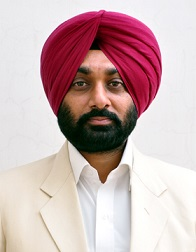

The Department of Computer Applications is dedicated for ensuring great careers for its students. For us, this means forging deeper industry linkages than ever before, creating a research culture from day one and ensuring seamless education using the best technology available anywhere. The excellent infrastructure, teaching faculty of the best kind of the Department ensuring quality education such as interaction among students, parents and staff, along with a Training and Placement Cell ensures a bright future to its students. We strongly encourage innovation in research, in teaching and in service to the profession, the local community and industry. Our faculty and students are constantly striving to excel and to advance the state of the art in Computer Applications. I invite you to be part of our efforts as we propel the department of Computer Applications to ever-greater heights. In closing, I wish all the students and faculty a good academic career.

Sincerely, and with best wishes,

Prof. Jasbir Singh Saini     
Associate Professor and H.O.D.    
(Department of Computer Applications)

## Department at Glimpse

 The Master of Computer Application Program was started in the year 2009. The M.C.A. is bestowed with an experienced team of members with excellent academic records and proficiency. Excellent infrastructure, state-of-the-art computers with the latest advances in technology and comprehensive study material make a class apart.

The M.C.A. helps in providing the I.T. and Computer Industry with world-class talent and creating some of the finest software professionals year after year. By providing concept-oriented subject knowledge through a high quality teaching that is supplemented with practical training, the aims to bring out some of the brightest minds into the world of computers and technology.

The success of the M.C.A. is attributed to its motivating and inspiring faculty members who handle subjects like Artificial Intelligence, Software Quality Management, Computer Networks, Mobile Computing, Distributed Computing and much more.

## Faculty Achievements

-	Prof. Jasbir Singh Saini is Life Member of Indian Society for Technical Education, New Delhi- LM-38794.
-	Prof. Jasbir Singh Saini is Fellow of Institution of Engineers (I), Kolkata- F-1215525.
-	Prof. Jasbir Singh Saini is Life Member of Computer Society of India, Navi Mumbai.
-	Prof. Jasbir Singh Saini is Charted Engineer of Institution of Engineers (I), Kolkata- F-1215525.
-   Prof. Jasbir Singh Saini has served as Member of Organizing Committee in Workshop on 'Virtual Labs' conducted by IIT Roorkee and Organized by GNDEC.

## Publications

- [ **Sohal, M.**, Bharany, S., Sharma, S., Maashi, M. S., & Aljebreen, M. (2022). A Hybrid Multi-Cloud Framework Using the IBBE Key Management System for Securing Data Storage. Sustainability, 14(20), 13561.](https://www.mdpi.com/2071-1050/14/20/13561)
- **Saini, S.S. et al**, "Prediction of Smart Building and Smart City Resources using AI-techniques." Sustainability,2023 2nd International Conference for Innovation,Bengaluru,India,2023.  

## Events Organized

| Sr. No. | Name of Event                                                                                                                 | Faculty Coordinator                                           | Duration | Date(s)                | Sponsor(s)                                     |
|:--------|:------------------------------------------------------------------------------------------------------------------------------|:--------------------------------------------------------------|:---------|:-----------------------|:-----------------------------------------------|
| 1       |  A One-day seminar on Drug De-addiction            | Prof. Jasbir Singh Saini and Prof. Dinesh Anand | 1 day | 09 December, 2022   | GNDEC |

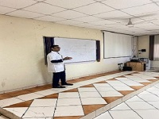	 
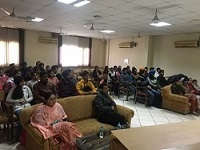**
Faculty and students attending the Seminar 
**

## FDPs/Seminars Attended

| Sr. No. | Name of Faculty   | Name of Event                                                                                     | Duration | Date(s)               | Organizing Institute                                        |
|:------- |:----------------- |:------------------------------------------------------------------------------------------------- |:-------- |:--------------------- |:----------------------------------------------------------- |
| 1       | Prof. Dinesh Anand |Free Software and Resources for Technical Education through ICT      | 1 week | 21-25 March,2022   | NITTTR, Chandigarh |
|2|Prof. Jasbir Singh Saini|Virtual Labs| 3 days| 1-3 December, 2021| GNDEC & IIT ROORKEE|

## Students' Corner

### Industrial Trip

Department of Computer Applications, GNDEC Ludhiana had organized an Industrial visit on 21 April,2022 to Nebero systems private limited located in Mohali, SAS nagar, Chandigarh. The visit was organized by HOD of Computer Applications, Prof. Jasbir Singh Saini and Programme coordinator Prof. Dinesh Anand.

Prof. Kamalpreet Kaur and Prof. Gurjiwan Singh were the coordinator faculty of Industrial visit. Students of BCA 1st year, 2nd year and MCA 1st year along with two coordinators faculty were in the Journey.

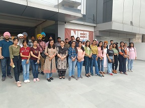
**
Industrial Trip to Nebero Systems, Mohali
**

### Rangoli Competition

A rangoli competition in lieu of Diwali celebration was organized by the department of Computer Applications on 21/10/2022 for the students of BCA and MCA. Prof. Birpal Kaur and Prof. Amanpreet Kaur were the coordinator faculty for the event.

Following are the Winners of the Competition:

- 1st  Prize- Ritu and Pooja Rani (BCA 2nd year)
- 2nd Prize- Jai Kaundal (BCA 3rd  year) and Mittali makkar(BCA 1st year)
- 3rd Prize- Sukhpreet Kaur and Arshpreet Singh (MCA 1st year)

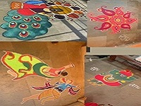 
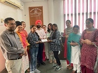
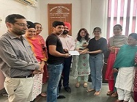 
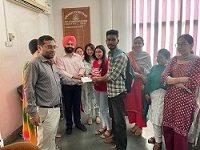

**
Dr. Parminder Singh (Head, CSE) along with the faculty of Computer Applications giving away the prizes to the winners 
**

### Students' achievements

#### **Sports Day 2022- Held on 8-9 March,2022**

***List of winners:***

| Sr. No. | Name      | Roll No.   | Class | Event    | Prize    |
|:--------|:----------|:-----------|:------|:---------|:---------|
| 1       | Satleen Singh  | 2191050 |BCA 1st  | Discuss throw  | 1st  |
|2        | Satleen Singh |2191050|BCA 1st| Shot put throw| 2nd|
|3|Arbaaz Khan|2004371|BCA 2nd|10 km race|2nd |
|4|Ashutosh|2004374|BCA 2nd |Discuss throw|3rd |
|5|Devinder Kumar|2191001|	BCA 1st	|1500 m race|	3rd| 
|6|Girls	|	|	BCA & MCA |Tug of war	|1st|

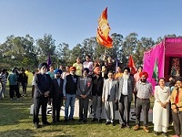 
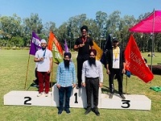
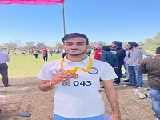
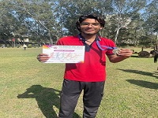
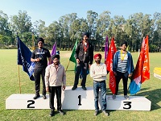
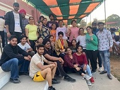

**
 Winners from Sports meet 2022 
**

#### **Sports Day 2023- Held on 2-3 March,2023**

***List of winners:***

|S.No.|	Name                      |	Roll No.	|Class	|Event 	|Prize|
|:--------|:----------|:-----------|:------|:---------|:---------|
|1.	|Satleen Singh|	2191050	|BCA 2nd|	Shot put Throw | 2nd|
|2.	|Satleen Singh|	2191050|	BCA 2nd |	Discuss Throw|	1st|
|3.	|Devinder Kumar|	2191001|	BCA 2nd|	10 km Race	|2nd|
|4.	|Devinder Kumar|	2191001 |	BCA 2nd	|1500 m Race|	2nd|
|5.	|Girls|	|BCA 1st	|4 X 400 Relay Race|	2nd|
|6.	|Girls |			|BCA & MCA|Tug Of War	|1st|

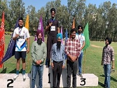
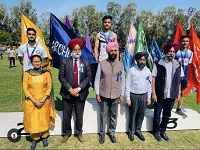
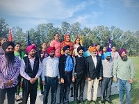 
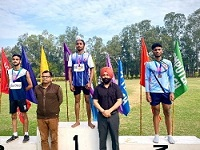
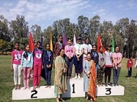
**
 Winners from Sports meet 2023 
**

### **Youth Festival**

***Positions held by students:***

|S.No.|	Name                      |Class	|Event 	|Prize|
|:--------|:----------      |:-----------|:------|:---------|
|1| Amritpreet Kaur	      |MCA 2nd	|Punjabi Folk Dance Giddha (Inter Zonal)|	1st|
|2.|Gurbhej Singh|	MCA 1st	|Punjabi Folk Dance Bhangra (Inter Zonal)|	1st|
|3.|Jagjot Singh	|BCA 2nd	|Indian Group Song (Inter Zonal)|	2nd|
|4.|Jagjot Singh|BCA 2nd|Non Percussion Solo (Inter Zonal)|	3rd|
|5.|Minaz|	BCA 1st|	One Act Play (Inter Zonal)|	1st|
|6.|Minaz	|BCA 1st	|Skit (Zonal) & Mimicry (Zonal)|	2nd|
|7.|Vikas Pal|	BCA 1st|	Mime (Zonal)|	1st|

### Technical Events/Cultral Events
|S.No.|Name of students |Class|Event|Organized by|Date|Prize|
|---|----|---|-----|------|---|--|
|1.|Surya Dev & Vishal|MCA 1st|Java Maestros(Coding using JAVA)|Tech Disha,Arya College, Ludhiana|16-02-23|2nd|
|2.|Simranjeet Kaur & Rajan|MCA 1st|Photography|Tech Disha,Arya College, Ludhiana|16-02-23|2nd|
|3.|Chetan Kashyap|BCA 1st| Bug Bounty Hunter| Iitian Club, GNDEC Ludhiana| 9-11-22|2nd|

### Placements  

-	Khushi Singla student of MCA placed in Cognizant and TCS. (2022)
-	Prabhjot Kaur and Nidhi Jha students of MCA placed in Seasia Infotech. (2022)
-	Himanshi Rani student of MCA placed in Cognizant. (2023)
-	Aprajita Kumari student of MCA placed in Education Pvt Ltd. (2023) 

