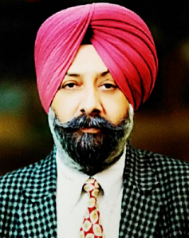
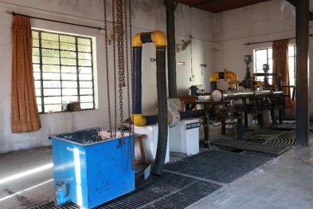

# Department of Mechanical Engineering  

## Message from HoD's Desk

  

It is great that institute is publishing the information regarding the academic and non-academic achievements and activities in the form of Newsletter every year. This yearly Newsletter reflect the significant outcome of the faculty, staff and students despite the pandemic COVID-19 situation. In these crucial moment, our primary goal is to go for safe and protective operation of the institute. I personally and on the behalf of the department congratulate the Newsletter team for their appreciable efforts in compiling and publishing the important outcomes of the department.

***Dr. Jasmaninder Singh Grewal***  
 *HOD, Mechanical and Production Engineering Department*

## Department at Glimpse

## Faculty Achievements  

- **Dr. Raman Sehgal** received best teacher award from Institute of Engineers
- **Dr. Harwinder Singh** received best teacher award from AICTE, New Delhi
- **Er. Sukhjeet Singh** received IEOM Society service award during first Indian Conference on Industrial Engineering and Operations Management by Industrial Engineering and Operations Management Society, USA

## Ph.D. Awarded
- **Dr. Ramandeep Singh Sidhu** has completed his Ph.D. in Mechanical Engineering from Guru Kashi University, Talwandi Sabo.
- **Dr. Harnam Singh Farwaha** has  completed his Ph.D. in Mechanical Engineering from Punjabi University Patiala
- **Dr. Deepinder Singh** has completed his Ph.D. in Mechanical Engineering from IKGPTU, Kapurthala

## Publications  

- **Grewal JS.**, Kumar N., Singh T.  ,“Mechanical and thermal properties of chemical treated hemp natural fiber reinforced polymer composites. International Journal of Mechanical and Production Engineering Research and Development  Vol.10(5), pp.879-888  [SCOPUS].
- Kumar N., **Grewal J S.**, Kumar S. ,“Mechanical and Thermal Properties of NaoH treated Sisal natural fiber reinforced polymer composites: Barium uses as filler, Material Today Proceeding 2021Accepted [SCOPUS]
- Kumar  N., **Grewal J S.**, Singh T. ,“ Mechanical and thermal properties of chemically treated Kenaf natural fiber reinforced polymer composites”, Material Today proceeding 2021 Accepted [SCOPUS].
- Kumar, N., Singh, T., **Grewal JS.**,“Natural Fiber Reinforced brake friction composites:  Optimization using hybrid AHP- Moora Approach  AIP Web of Science & SCOPUS.
- Kumar Naresh, **Grewal J.S.**, Singh Avtar & Mehta Vikas, “A comparative study of alkali treated date palm fiber based brake friction composites and standard kevlar based brake friction composites” Polymer Composites Nov. 03 ,2021, https://doi.org/10.1002/Pc.26370
- Kumar Naresh, **Grewal J.S.**, Kumar Sushil, Ali Sarafat & Kumar Nitin, “A novel Himachal’s Begar(Sabai) grass fiber used as a brake friction material in brake polymer composites and compared to standard brake friction material”, Polymer Composites Nov. 09, 2021.
- Kumar Naresh, **Grewal Jamaninder Singh**, Kumar Nitin, Kumar Sushil & Ali Sarafat, “A novel Pinus roxburghii natural leaves fiber used as reinforcement polymer composite: As asbestos free brake friction material”, Polymer Composites Nov. 18 ,2021, https://doi.org/10.1002/Pc.26399
-  **Satjot Singh Dhillon**,  Vikas Chawla, Gurbhinder Singh Analysis of solid particle erosion in plasma sprayed alumina based coatings on SAE-347H steel ;2021(Materials Today: Proceedings) Article is in press Scopus indexed
- **Pannu, A.S.**, **Singh, S**. and Dhawan, V., 2021. Effect of alkaline treatment on mechanical properties of biodegradable composite (BF/PLA) rod. Materials Today: Proceedings, 46, pp.9367-9371.
- **Satwant Singh, Raman Kumar**, Pankaj Goel, **Harmeet Singh**, “Analysis of wear and hardness during surface hardfacing of alloy steel by thermal spraying, electric arc and TIG welding”  Materials Today Procedeings (In press)
- **Raman Kumar, Sehijpal Singh, Ardamanbir Singh Sidhu,** Catalin I. Pruncu “Bibliometric Analysis of Specific Energy Consumption (SEC) in Machining Operations: A Sustainable Response” in SCI and Scopus Indexed journal “Sustainability” by MDPI with impact factor 2.576 and cite score 3.2 Scopus in May 2021.
- **Ardamanbir Singh Sidhu, Raman Kumar, Sehijpal Singh,** Khaled Giasin, Danil Yurievich Pimenoiv “Prioritizing Energy-Intensive Machining Operations and Gauging the Influence of Electric Parameters: An Industrial Case Study” in SCI and Scopus indexed journal “Energies 2021, Volume 14, Issue 16, 4761” an open access journal by MDPI with impact factor 3.004 and cite score 4.7 scopus in August 2021.
- **Raman Kumar,** Rohit Dubey, **Sehijpal Singh,** Sunpreet Singh, Chander Prakash, Yadaiah Nirsanametla, Grzegorz Królczyk,  Roman Chudy  “Bibliometric analysis of entropy weights method for multi-objective optimization in machining operations” In  Elsevier journal “Materials Today: Proceedings Aug 2021 .https://doi.org/10.1016/j.matpr.2021.08.132
- **Ardamanbir Singh Sidhu, Raman Kumar, Sehijpal Singh,** “Optimization and Modelling of Active Power Consumption of 	ST52.3 Alloy Steel during a Drilling Operation.” In Elsevier journal “Material today:Proceedings” in Oct 2021.https://doi.org/10.1016/j.matpr.2021.09.340
- **D. Dhand,** P. Kumar, and **J.S. Grewal,** A Review of Thermal Spray Coatings for Protection of Steels from Degradation in Coal Fired Power Plants, Corros. Rev., 2021, 39(3), p 243–268.
- **D. Dhand, J.S. Grewal,** and P. Kumar, Study and Comparison of Wear Behaviour of Ni-Al2O3 Coatings Deposited by Hot and Cold Spray, Surf. Topogr. Metrol. Prop., 2021, 9(4), p 1–12,
- Hitesh Vasudev, Lalit Thakur, **Harmeet Singh,** Amit Bansal, “Effect of addition of Al2O3 on the high-temperature solid particle erosion behaviour of HVOF sprayed Inconel-718 coatings”, Material Today Communications (Elsevier), 2021.
- **Satwant Singh, Raman Kumar,** Panakj Goel, **Harmeet Singh,** “Analysis of wear and hardness during surface hardfacing of alloy steel by thermal spraying, electric arc and TIG welding”, Materials Today: Proceedings,2021
- Hitesh Vasudev, Lalit Thakur, **Harmeet Singh,** Amit Bansal, “Erosion behaviour of HVOF sprayed Alloy718-nano Al2O3 composite coatings on grey cast iron at elevated temperature conditions”, Surface Topography: Metrology and Properties (IOP Publishing), Aug 2021
- Kulwant Singh, Gurbhinder Singh, **Harmeet Singh,** “Influence of post welding heat treatment on the microstructure and mechanical properties of friction stir welding joint of AZ31 Mg alloy”. Proceedings of the Institution of Mechanical Engineers, Part E: Journal of Process Mechanical Engineering (SAGE Publications), Feb.2021
- **Harmeet Singh,** R.P.Saini, J.S.Saini, “Thermohydraulic Performance of a Packed Bed Solar Energy Storage System”, Sustainable Development Through Engineering Innovations (Springer), pp 451-456, 2021
- Arora, R., **Kapoor, J.,** Sharma, R.C., “Development of microwave hybrid heating welded joints of inconel-600 superalloys using grey relational analysis” International Journal of Vehicle Structures and Systems 2021, 13(1), pp. 53–59
- Singh, H., Kumar, V., **Kapoor, J.,** “Optimization of WEDM process parameters in machining Nimonic 75 alloy using brass wire” Multidiscipline Modeling in Materials and Structures 2020, 16(5), pp. 1189–1202

## Book Chapters
- Singh, J.I.P., Singh, S., Dhawan, V., **Pannu, A.S.,** Bahl, A., Gulati, P., Kumar, R. and Singh, M., 2021. Kenaf-Fiber-Based Bio-materials: A Review on Processing and Mechanical Properties. Recent Trends in Engineering Design, pp.87-94.
- **Pannu, A.S., Singh, S.,** Dhawan, V. and Singh, J.I.P., 2021. Sustainable Use of Agri-Waste in the Production of Green Hybrid Composites. In Sustainable Development Through Engineering Innovations: Select Proceedings of SDEI 2020 (pp. 125-132). Springer Singapore.
- **Gulraj Singh,** Rupinder Singh, GS Brar. 2021 On instigating the acrylonitrile butadiene styrene melamine formaldehyde composite matrix for 4D applications in Materials Science aand Materials Engineering (In press)
- Singh, L. P., and **Singh, H.** (2021), “Engineering Drawing: Principles and Application”, Cambridge University Press, UK, ISBN 9781108707725.
- Singh, J., **Singh, H.** and Gandhi, S. K., “Effect of Training and Development Based Strategy on Productivity of Employees-An Empirical Investigation	“Journal of Advanced Research In HR and Organizational Management
- Kaur, A., **Singh, H.**, Virdi, S.S. and Kumar, R., “Job stress and its impact on health of employees: A study among officers and supervisors” Journal of Management Development
- Singh, P., Madan, J. and **Singh, H.**, “Composite performance metric for product flow configuration selection for reconfigurable manufacturing system (RMS)” International Journal of Production Research, Vol. 59, No. 13, 2021
- Singh, J., **Singh, H.** and Singh, P., “The Impact of 5S Practices on the Performance of Manufacturing Industry: An Empirical Investigation” IUP Journal of Operations Management, Vol. 20, No. 2, 2021, pp. 35-49

## Conference attended
- Kumar, N., **Grewal, J. S.** & Kumar S., “Mechanical and Thermal Properties of NaOH treated Sisal natural fiber reinforced polymer composites: Barium uses as filler”,       ICAMSE 2021, PU Chandigarh 5-6 March 2021.
- **Deepak Dhand**, Parlad Kumar & **Jasmaninder Singh Grewal**, “The microstructural characterization and wear behavior of HVOF sprayed nickel- alumina coatings on boiler grade steel” Internatioal conference on materials,energy and mechanical engineering(ICME2-2021) at Madanapalle Institute of Technology & Science, Madanapalle on 17-18 December 2021.
- **Ardamanbir Singh,** “Bibliometric analysis of entropy weights method for multi-objective optimization in machining operations” 2nd International conference on Functional Materials,manufacturing and Performance(ICFMMP-2021) held on 17THto 18TH September 2021,organized by school of Mechanical Engineering in Lovely Professional University, Punjab.
- **Ardamanbir Singh,** “Optimization and Modelling of Active Power Consumption of ST52.3 Alloy Steel during a Drilling Operation.” 2nd International conference on Functional Materials, manufacturing and Performance(ICFMMP-2021) held on 17THto 18TH September 2021,organized by school of Mechanical Engineering in Lovely Professional University,Punjab

## Events Attended (FDPs/Conferences/STCs/SDTs/Workshops/Webinars etc.)  

| Sr. No. | Name of Faculty          | Name of Event                                                                       | Date(s)                | Organizing Institute                                                           |
|:--------|:-------------------------|:------------------------------------------------------------------------------------|:-----------------------|:-------------------------------------------------------------------------------|
| 1       | Satjot Singh Dhillon     | Professional Development training                                                   | February 8-10, 2021    | IIM, Raipur                                                                    |
| 2       | Pushpinder Singh Sidhu   | Professional Development training                                                   | February 8-10, 2021    | IIM, Raipur                                                                    |
| 3       | Prem Singh               | ICT initiatives in Technical Education                                              | February 8-13, 2021    | Swayam-NPTEL local chapter, GNDEC                                              |
| 4       | Harnam Singh Farwaha     | ICT initiatives in Technical Education                                              | February 8-13, 2021    | Swayam-NPTEL local chapter, GNDEC                                              |
| 5       | Chatwant Singh Pandher   | ICT initiatives in Technical Education                                              | February 8-13, 2021    | Swayam-NPTEL local chapter, GNDEC                                              |
| 6       | Satwant Singh            | ICT initiatives in Technical Education                                              | February 8-13, 2021    | Swayam-NPTEL local chapter, GNDEC                                              |
| 7       | Prem Singh               | Professional Development Training Programme                                         | January 11-13, 2021    | IIM Visakhapatnam                                                              |
| 8       | Gurmeet Kaur             | Professional Development Training Programme                                         | January 11-13, 2021    | IIM Visakhapatnam                                                              |
| 9       | Gulraj Singh             | Training on Professional Development                                                | March 1-3, 2021        | IIM Tiruchirappalli                                                            |
| 10      | Gulraj Singh             | Digital Manufacturing evolutions for smart industries                               | August 16-20, 2021     | oornima College of Engineering, Jaipur                                         |
| 11      | Amrinder Singh Pannu     | CT Initiatives in Technical Education                                               | February 8 to 13, 2021 | SWAYAM-NPTEL Local Chapter, GNDEC                                              |
| 12      | Amrinder Singh Pannu     | 3D Printing                                                                         | September 20-24 2021   | GZS Campus CET MRSPTU, Bathinda                                                |
| 13      | Harmeet Singh            | ICT Initiatives in Technical Education                                              | February 8 - 13, 2021  | GNDEC, Ludhiana                                                                |
| 14      | Harmeet Singh            | International workshop on solar thermal energy storage                              | December 13-14 2021    | IIT Roorkee                                                                    |
| 15      | Jasmaninder Singh Grewal | LABORATORY QUALITY MANAGEMENT SYSTEM & INTERNAL AUDIT AS PER IS/ISO/IEC 17025:2017” | December 7-10, 2021    | National Institute of Training for Standardization, Bureau of Indian Standards |

## Events Organized

| Sr. No. | Name of Faculty      | Name of Event          | Date(s)                     | Organizing Institute     |
|:--------|:---------------------|:-----------------------|:----------------------------|:-------------------------|
| 1       | Amrinder Singh Pannu | 3D Printing and Design | August 2-24 2021 (80 hours) | TEQIP III GNDEC Ludhiana |

## NPTEL courses done by Faculty

| Sr. No. | Name of Faculty      | Course Name                                         |
|:--------|:---------------------|:----------------------------------------------------|
| 1       | Satjot singh Dhillon | Mechanical Measurement systems                      |
| 2       | Gulraj Singh         | Electronic Waste Management – Issues and Challenges |
| 3       | Gulraj Singh         | Polymer Assisted Abrasive Finishing Processes       |

## NABL & BIS Accredited Pump Testing facility

The pump testing lab of the department has been re-accredited by *National Accreditation Board for Testing and Calibration Laboratories* (NABL) under **ISO/IEC 17025**. The pump testing Lab has facility to test Submersible pumps under IS-8034:2018.

  
