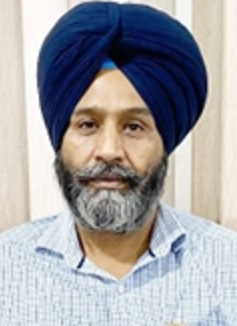

# Message from President's Desk

  

 

 I am delighted to see the latest version of our college newsletter, which is a true testament to the constantly growing vibrancy and ever-evolving diversity of our college. Witnessing this exceptional growth fills me with immense pride and honor.
I heartily congratulate all the students and the faculty members of GNDEC on their accomplishments in various fields. I also extend my warmest congratulations to all the editorial team whose dedication and creativity have helped to showcase the outstanding achievements of all the contributors through this newsletter. May you keep on progressing by leaps and bounds and bring more and more laurels to GNDEC!
 

**S. Harjinder Singh Dhami**  
(President, SGPC and NSET, Ludhiana)

# Message from Secretary's Desk

  

  It gives me an immense pleasure to extend my heartiest greetings to the students, faculty and staff of GNDEC on the launch of our college newsletter 2023 (Vol 11) which showcases the diverse experiences and accomplishments of the members of GNDEC family. From students’ success stories to faculty research updates, the newsletter is packed with valuable insights and information.
I congratulate the editorial team and all the contributors who worked diligently and dedicatedly to bring this newsletter to fruition.  I am sure you all will keep on working hard to bring glory to the name of GNDEC.
 

**Er. Sukhminder Singh**  
(Secretary, Nankana Sahib Education Trust)

# Message from Director's Desk

  

  I am delighted to announce the release of college Newsletter 2023 (Vol 11), which provides an overview of the accomplishments and achievements of students and faculty members of GNDEC. From academic achievements to extracurricular accomplishments, the newsletter highlights the hard work and dedication of the team “GNDEC”.
I extend my gratitude and best wishes to all the bestowers who have contributed to the successful creation of this newsletter.
   

**S. Inderpal Singh**   
(Director, Nankana Sahib Education Trust)

# Message from Principal's Desk

  

  “Creative activity could be described as a type of learning process where teacher and pupil are located in the same individual”- Arther Koester.
  

  

  As the next year unfolds, I would like to pause and reflect on a number of important and exciting developments of our college. The college has made tremendous progress in all areas-academic, non-academics, capacity building relevant to staff and students. It is a matter of great pride and satisfaction for Guru Nanak Dev Engineering College to bring out the Newsletter 2023 (volume11). It showcases how GNDEC is on continuous journey of knowledge enrichment and career growth. It is a reflection of our achievement in hitting the right notes for the multifaceted growth of our learning partners. The events that are organized in the departments concentrate on molding the caliber of the students. We also work on creating young active citizens who feels highly responsible towards society. The way to access this key is by participating actively. I am confident that the issue of Newsletter 2023 will send a positive signal to the faculty, staff and the students who are interested in the Technical education and Technology based activities. I congratulate the Editorial Board of Newsletter 2023 who have played wonderful role in accomplishing the task in record time. The multi-partner involvement of each and every one has shown a great result.
  With these words, I wish you all would enjoy reading the Newsletter 2023 of GNDEC family!!

**Dr. Sehijpal Singh**  
(Principal, GNDEC)
