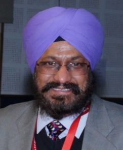
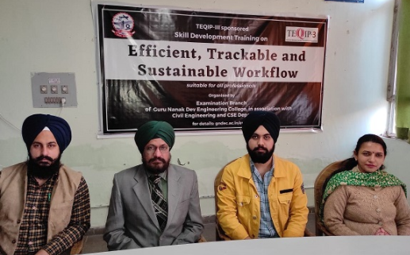

# Department of Civil Engineering  

## Message from HoD's Desk

## Department at Glimpse

 - (You may add details of events conducted in your department along with photographs of the event under this heading. An example is given below for your reference)

- **SDT on "Efficient, Trackable and Sustainable Workflow"**

To address the issues associated with poor workflow, and making sure that the computer resources are used efficiently and with the provision to track changes, TEQIP-III sponsored skill development training on "Efficient, Trackable and Sustainable Workflow" was organised by Examination Branch of Guru Nanak Dev Engineering College (GNDEC) in association with Departments of Civil Engineering and Computer Science Engineering from December 02-08, 2020.  

***The organising team of SDT during the event***

This one week training suitable for all professionals commenced from December 02, 2020 onwards on a self-paced mode. The skill development training concluded successfully with a valedictory function. Course Co-ordinator, Dr H S Rai while briefing the proceedings of the training program which focussed on Version Control System (VCS) mentioned the diverse range of participants from the Principal of the institution, faculty members, students to non-teaching staff. In order to deliver the course content effectively and efficiently, an excellent learning platform and content management system called Moodle was used. This platform enabled the participants to learn and attain hands on experience at their own pace. The training program also encouraged peer learning by discussing doubts among participants at the dedicated forum. Furthermore, keeping in view the changing scenario, Dr Rai emphasized on paper-less and thus a sustainable approach towards documentation by using available open-source powerful tools. Adding to this, he also talked about importance of version control of these documents which was the core of this training program.

During the valedictory function, feedback from participants was taken. The participants expressed their joy in learning new skills during the training program. One of the participants, Dr K D Singh said that if implemented, such a version control system can prove to be a revolutionary step for the organisation to address issues related to effective management of documentation. Dr Sehijpal Singh, Principal, GNDEC, while addressing the audience said that efficient workflow is the need of every organisation as poor documentation often leads to mismanagement and wastage of lot of resources. He expressed his views on importance of this much needed course for addressing the said issues. Furthermore, he, as a course participant too, said that the training program was an enjoyble and a great learning experience. He congratulated the organising team for this wonderful effort and dedicated approach during the training program.

## Faculty Achievements  

- Er. Heena Malhotra completed her PhD in ...

## Publications  

- [**Yuvraj Singh**, **Harvinder Singh**. (2021) Applications of Fiber Reinforced Polymer Laminates in Strengthening of Structures.
In: Ashish D.K., de Brito J., Sharma S.K. (eds) 3rd International Conference on Innovative Technologies for Clean and Sustainable Development. ITCSD 2020.
RILEM Bookseries, vol 29. Springer, Cham. https://doi.org/10.1007/978-3-030-51485-3_17](https://link.springer.com/chapter/10.1007/978-3-030-51485-3_17)

- [**Yuvraj Singh**, Sukhwant Singh, **Harvinder Singh**. (2021) Effect of Steel Fibers on the Sorptivity of Concrete. In: Seetharamu S., Jagadish T., Malagi R.R. (eds)
Fatigue, Durability, and Fracture Mechanics. Lecture Notes in Mechanical Engineering. Springer, Singapore.
https://doi.org/10.1007/978-981-15-4779-9_32](https://link.springer.com/chapter/10.1007/978-981-15-4779-9_32)

- [Harpuneet Singh,**Yuvraj Singh** (2019) Applications of Recycled and Waste Materials in Infrastructure Projects. In: Singh H., Garg P., Kaur I. (eds)
Proceedings of the 1st International Conference on Sustainable Waste Management through Design. ICSWMD 2018. Lecture Notes in Civil Engineering,
vol 21. Springer, Cham. https://doi.org/10.1007/978-3-030-02707-0_65](https://link.springer.com/chapter/10.1007/978-3-030-02707-0_65)

## Events Organized (FDPs/Conferences/STCs/SDTs/Workshops/Webinars etc.)  

| Sr. No. | Name of Event                                                  | Faculty Coordinator           | Duration | Date(s)               | Sponsor(s) |
|:--------|:---------------------------------------------------------------|:------------------------------|:---------|:----------------------|:-----------|
| 1       | SDT on "Efficient, Trackable and Sustainable Workflow" (Run-1) | Dr H S Rai & Er. Yuvraj Singh | One Week | 02-08 December, 2020  | TEQIP-III  |
| 2       | SDT on "Efficient, Trackable and Sustainable Workflow" (Run-2) | Dr H S Rai & Er. Yuvraj Singh | One Week | 30 Dec - 05 Jan, 2020 | TEQIP-III  |
|         |                                                                |                               |          |                       |            |

## Events Attended (FDPs/Conferences/STCs/SDTs/Workshops/Webinars etc.)  

| Sr. No. | Name of Faculty | Name of Event | Duration | Date(s) | Organizing Institute |
|:--------|:----------------|:--------------|:---------|:--------|:---------------------|
| 1       |                 |               |          |         |                      |
| 2       |                 |               |          |         |                      |
|         |                 |               |          |         |                      |

## Miscellaneous (Lab Upgradation, Infrastructure augmentation etc.)  

- (You can add any miscellaneous details related to your department here which you feel should be added in Newsletter)

## Student's Corner  

#### - Student's Achievements

## Association of Civil Engineering students (ACES)

- (Here you can add news/details of events conducted etc., related to your departmental Society). *DO NOT forget to replace the title with the name of your departmental Society*

**NOTE:** Feel free to add any other information in the form of paragraph, bulleted list, numbered list, etc. For any queries or help, post in Whatsapp group. **And do not forget to delete this note. ;-)**
