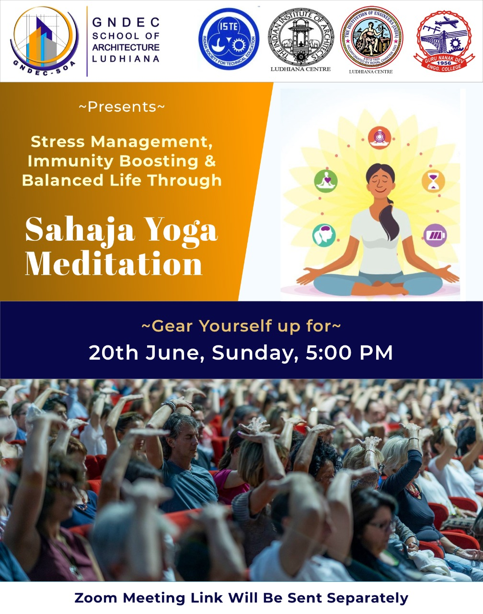
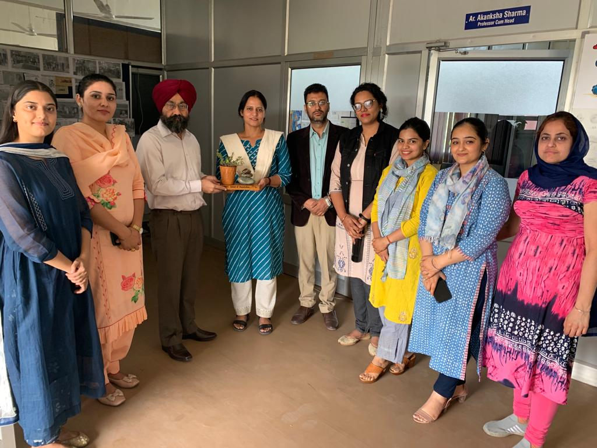

# GNDEC_School of Architecture_NewsLetter

The School of Architecture, GNDEC announces an annual newsletter. Newsletter intent is to communicate the larger idea - 'Work done by students and faculty at SoA, Guru Nanak Dev Engineering college'. Hope you enjoy reading this!!

## Online expert lecture - Design Thinking on 11th January, 2021

Speaker – Ar. Rahul Saini, Architect & Author
GNDEC School of Architecture, Ludhiana organized a thought-provoking online lecture on the topic Design Thinking. The event provided faculty and students, a space for learning and strengthening the virtual engagement towards the topic.

## Material exploration at Canadian wood & Kajaria tiles on 2nd February, 2021
  

A material visit was conducted, to pique an interest in the student to understand the importance of the knowledge about material and how do they realise their concepts and how their designs can see the light of the day.

## Site Visit to Qila Raipur on 15th February, 2021
  

The intent of visit was to introduce students to the varied flavour of small town and architecture. In the interest of broadening the framework and scope of architectural inquiry, students are encouraged to connect their investigations to larger ideas and cultural themes in areas such as philosophy, art, literature and popular culture.

## Women’s Day celebration with Online Expert Lecture on Women in Architecture on 8th March,2021
  

Speaker – Ar. Vidhu Malik, Principal Designer – BOTTEGA 9 Work+Shop & Design Mentor – Planners Group, Chandigarh.
SoA, GNDEC hosted a webinar along with discuss about the Women in Architecture. Positioning the approach and thought process of a women in the architectural realm. The webinar aimed to support women in their professional development, provide career counselling and offer key insights into their professions in a post COVID world.

## ONE DAY HANDS-ON WORKSHOP ON CONCRETE on 19th March, 2021
  

GNDEC School of Architecture, Ludhiana conducted one-day hands-on workshop on concrete in collaboration with Ultratech Cement at their plant in Focal point, Ludhiana. Students worked on different proportions of materials to prepare on various grades of concrete. Concrete tests like slump test, cone test, setting time test, etc were also conducted by the students. Resource persons at Ultratech enlightened the students with knowledge of various kinds of high performance concrete. Er.Krishan Kumar, Territory Technical Services Manager, Ultra Tech Cement Limited coordinated with the faculty for smooth conduct of the workshop. Prof.Akanksha Sharma, Head- GNDEC School of Architecture stressed on the significance of material knowledge for the students. Dr. Sehijpal Singh, Principal GNDEC congratulated Team GNDEC-SOA and Ultra Tech Cement Limited for collaborating and creating awareness about concrete as a material. He encouraged the Students and teachers for compiling such episodes of Knowledge and realization.

## Architects Premier Cricket League on 4th April, 2021
  

Architects from Ludhiana, Jalandhar, Amritsar and Patiala visited GNDEC School of Architecture for IIA-Punjab chapter’s annual cricket tournament (APCL-3) where Amritsar team won. Architects interacted with the students and admired their work exhibited in the college. They praised the quality, knowledge and awareness of students about the field of Architecture. Ar.Harinder Boparai, Chairman IIA-Ludhiana Centre graced the occasion with his presence. Prof.Akanksha Sharma, Head-GNDEC School of Architecture was regarded with guest of honour award by Ar.Niranjan Kumar, Sports chairman IIA Punjab Chapter. Dr.Sehijpal Singh, Principal-Guru Nanak Dev Engineering college congratulated the team for organizing the event and highlighted the importance of sports as an integral part of today’s life style.

## Three-day Design and BIM Tools Exploration Workshop on 8th April, 2021
  

The workshop provided understanding of Modelling and visualization, Reality Modelling, Civil Design, Bridge Analysis, Structural Analysis and Design, Hydraulics and Hydrology and Project Delivery and Infrastructure Asset Performance. Architecture, Engineering and Construction (AEC) industry across the globe has been embracing the lean philosophy as well as digital technologies like Building Information Modelling (BIM), Virtual Reality, Machine Learning and so on. Indian construction industry is as well treading along this path. Lean philosophy has made remarkable improvements in the manufacturing sector with focus on minimization of waste and value addition to the client or end user. The thought leaders in the construction sector in global arena decided to draw the lessons from application of lean in manufacturing sector and reinvent them in the context of construction industry.

## Online expert lecture on Green Buildings – The GRIHA Way on 14th April, 2021
  

Speaker - Akash Deep, B. Arch. (Hons.), M. Arch. in Sustainable Urban Design and Creative Urban Practices (Glasgow University), has been working as Senior Program Manager with GRIHA Council since 2011.
The session was focused on - GRIHA is an acronym for Green Rating for Integrated Habitat Assessment. GRIHA is a Sanskrit word meaning – ‘Abode’. Human Habitats (buildings) interact with the environment in various ways. Throughout their life cycles, from construction to operation and then demolition, they consume resources in the form of energy, water, materials, etc. and emit wastes either directly in the form of municipal wastes or indirectly as emissions from electricity generation. GRIHA attempts to minimize a building’s resource consumption, waste generation, and overall ecological impact to within certain nationally acceptable limits / benchmarks.

## Online Expert Lecture on Heritage – Complex Pasts & Diverse Futures on 17TH April, 2021
  

Speaker - Ar. Gurmeet S. Rai set up the CULTURAL RESOURCE CONSERVATION INITIATIVE (CRCI), a conservation consultancy firm to enhance and strengthen creative approach to otherwise routine practices.
Some of the noted projects of CRCI have been preparation of conservation and management plans for the world heritage sites of Red Fort, New Delhi; Ellora Cave, Maharashtra, urban conservation plans for historic settlements of Amritsar and Puri, sustainable strategies for development of cultural tourism in Jammu and Kashmir, integrated conservation and development of tangible and intangible heritage; for governments, private, bilateral and multi-lateral agencies. CRCI has provided expertise in South Asia in the countries of Nepal, Myanmar and in India in the states of Punjab, Rajasthan, Odisha, Madhya Pradesh, Gujarat, Delhi, Jammu and Kashmir and others. She was awarded ‘Award of Distinction’ for two projects by UNESCO under Asia Pacific Architectural Heritage Awards in the year 2002 and 2004 for demonstrating community inclusive conservation programs. She has been a specialist consultant to several UNESCO workshops Asia- Pacific. She is the only Indian who has been invited to be on the jury for the UNESCO Asia- Pacific heritage awards for culture heritage conservation every time from 2005 onwards and till date. She is currently the Vice President of ICOMOS India and an expert voting member on the International Scientific Committee on Cultural Tourism. She is involved in urban conservation in the recently launched program of Ministry of Urban Development called HRIDAY. She has been appointed as the HRIDAY city anchor for the two historic cities of Amritsar in Punjab and Puri in Odisha.

## Online Expert Lecture on Energy Efficiency in Buildings on 13th MAY, 2021
  

Speaker - Money Khanna is BEE Certified ECBC Master Trainer, Green Rating for Integrated Habitat Assessment Certified Professional (GRIHA CP), Indian Green Building Council Accredited Professional (IGBC AP) and Green & Eco-Friendly Movement Certified Professional (GEM CP) & Solar PV TOT Certified Trainer.

## Online expert Lecture on Art, Architecture and Design on 6th June, 2021
  

Online Expert Lecture on Ecosystem Restoration
Speaker - Dr.Anil Prakash Joshi, Founder- Himalayan Environmental Studies and Conservation Organization (HESCO). We also acknowledge the presence of Ar.Sanjay Goel, Chairman-IIA Punjab Chapter & Director-Ludhiana Smart City Limited, Ar.Yogesh Singla-Treasurer-IIA Punjab Chapter, Ar.Harinder Boparai, Chairman-IIA Ludhiana Centre, Ar.Balbir Bagga, Vice Chairman-IIA Ludhiana Centre, Ar.Rajan Tangri, Treasurer-IIA Ludhiana Centre, Ar.Bimaldeep Singh- Honorary Secretary IIA Ludhiana Centre, Er RL Mahajan, Chairman- Institution of Engineers Ludhiana Centre, Er Surjit Singh, Honorary Secretary IoE Ludhiana Centre and other members of IIA & IoE.

## Online expert lecture on The Profession of Architecture on 16TH June, 2021
  

Speaker – Jit Kumar Gupta, has experience spanning over 45 years in Urban Planning, Development, Management, Planning legislation, Policy Planning and Architectural Education.

## Stress management, Immunity boosting & Balancing life through Sahaja Yoga Meditation on 20th June, 2021
  

GNDEC School of Architecture, Ludhiana celebrated International Day of Yoga by organizing an online Yoga session in collaboration with The Indian Institute of Architects-Ludhiana Centre, The Institution of Engineers-Ludhiana Centre and Indian Society for Technical Education. Online session was conducted by Sahaja Yoga Meditation and Mr.Nitin Jindal was the resource person of the day. The theme for talk was ‘Stress Management and Immunity Boosting through Meditation and Yoga’.

## Independence Day Celebration on 15th August, 2021
  

Celebrated archi dependence , by documenting a few public/institutional / offices buildings of independent delhi since 1947 to end of 20th Century in the form of sketches.

## Fun and lively Caricature Workshop on 16th August, 2021

## Eco-Resort Site Visit on 9th September, 2021

## Hands-on Workshop on Architectural Photography on 15th September, 2021
  

GNDEC School of Architecture, Ludhiana organized hands-on workshop on Architectural photography for students of B.Architecture. Session was conducted in blended mode by very famous Author, Photographer Mr.Janmeja Singh Johal. Mr.Johal said that Architectural photography is as important as any well designed building that has to be presented and good photography skills can enhance the aesthetical value of the buildings. He gave various tips to students about skill development and hardware requirement about photography. Further, two softwares were also demonstrated by him to correct various errors in already clicked photographs. He also talked about significance of time lapse and drone photography in documentation of architectural projects.

## Online Expert lecture on The Idea of Architecture on 4th October, 2021
  

Speaker - AR.SATHYA PRAKASH VARANASHI
GNDEC School of Architecture, Ludhiana marked World Architecture Day and UN World Habitat day by conducting an online expert lectures on 4th October, 2021. Expert  from Bengaluru, Ar.Sathya Prakash Varanashi, Principal Architect, Sathya Consultants presented his maestro panorama on the topic. Architect Sathya Prakash said that creativity in Architecture doesn’t mean that we should design something new; which has not been done earlier, but it is to be Original and associated with origin of Architecture. He added that the most  Ar.Akanksha Sharma, Head- GNDEC School of Architecture not only conceived the idea of conducting the webinar but also underpinned the entire session with her support and continuous guidance to her team which lead to the whooping out-turn. Dr. Sehijpal Singh, Principal GNDEC congratulated Team GNDEC-SOA and prestigious guest for collaborating on such cardinal occasions and creating awareness about sensitive issues concerning environment, Architecture and our habitat. He encouraged the Students and teachers for compiling such episodes of Knowledge and realization.

## Ar. Vivek Sehgal was live on Climate Responsive Architecture at 100.1 FM studio on 5th October, 2021

## Online webinar on Reminiscing the Journey, Charles-Edouard Jeanneret on 6th October, 2021
  

Speaker - Prof Supriya Kukreja
GNDEC School of Architecture, Ludhiana celebrated 134th birth anniversary of Le Corbusier by organizing an online expert lecture on 6th October, 2021. Expert  from Ahmedabad, Ar.Supriya Kukreja, Associate Professor-Nirma University & Visiting Professor-CEPT university was the resource person of the day.  Prof Supriya Kukreja Spoke about the importance of reading, travelling and sketching in the making of an architect from his early days of education. She added that Corbusier’s life is an inspiration to challenge your own self and trying to get better each day. Ar.Akanksha Sharma, Head- GNDEC School of Architecture stayed determined  from conception of idea, to development of the substance till the completion of the event. Her firm efforts and hard work contributed to this successful online event. Dr.Sehijpal Singh, Principal - GNDEC congratulated School of Architecture and prestigious guest for collaborating on this day. He encouraged the Students and faculty to follow the professional footsteps of Master Architects like Le Corbusier.

## Student Induction Program on 26th October, 2021
  

Events conducted:Lamp Lighting, Shabad/Saraswati Vandana, Speech and Presentation, Vasturang, Kagji Gaganchumbi Imarat, Kalakriti, Andhadhundh, Veshbhusha, Khinchatani

## Diwali Celebration & Reimagining Architectural studio – Halloween celebration exhibition on 2nd November, 2021

## The Brick Store – Site Visit on 8th November, 2021

## Jung-e-azadi Memorial - A case study on 18th November, 2021

## IPS Dr. Pragya Jain at SOA on International Day of the Elimination of Violence against Women on 24th November, 2021
  

GNDEC School of Architecture conducted awareness program on Elimination of violence against women.     Dr. Pragya Jain IPS, ADCP Ludhiana was the Chief guest of the event. She sensitized one and all about Gender Neutrality & and made all aware about different crimes related to women & punishment pertaining to those. She advised all women to be educated & independent so that they should know about their rights. ‘Sanjh’ team from Punjab police was also present during the event & they demonstrated the Shakti Application developed by them. Col.Naresh Kumar, Commanding Officer 3, Punjab Battalion & his team along with NCC cadets were also present in the event. Ar. Sanjay Goel, one of the Directors- Ludhiana Smart City Limited, S. Inderpal Singh, Director Nankana Sahib Education Trust were also present as distinguished guests. Dr.Arvind Dhingra thanked all guests for being part of this event. Prof. Akanksha Sharma, Head- GNDEC School of Architecture motivated all to treat men & women with equality.        Dr.Sehijpal Singh, Principal-GNDEC said that women play equally important role in our society & also praised School of Architecture for organizing this very meaningful event.

## Sun View School – Site visit on 30th November, 2021

## International Day of persons with Disabilities on 3rd December, 2021

## World energy Conservation Day on 14th December, 2021

# AESTHETIC CORNER – School of Architecture

## Ar. Gazal Soni, Architect and Artist
  

Faculty of School of Architecture, Ar. Gazal Soni is working exceptionally on Surface Narrative painting and selling her paintings all across India. Surface Narrative art are those crafts which are essentially “two-dimensional” in nature and are applied to the surface of Architecture elements and components. This art has been developed by communities to express their imagination and culture, and represent a specific message. Along with that she has the expertise in modern painting, abstract art, Portrait making, acrylic pouring and raisin art.

## Gungeet Kaur, Photographer
  

Gungeet Kaur, undergraduate student from School of Architecture GNDEC has captured fantastic moments in various events. She has explored her vision through architecture photography, interior photography, portrait photography, wildlife photography and macro photography. Apart from this, she also uses various camera techniques like light trails, panning, multiple exposure, panorama, star trails and cloning of subjects.

## Jaismeen Kaur, Sports Woman
  

Shield and cash prize was awarded to Jaismeen Kaur, Student of School of Architecture as PTU best cyclist as she participated in all India Interversity Cycling Championships.

# Khushpreet, Cake Maker
  

Student of School of Architecture, Khushpreet Kaur is skilled in handcrafting edible flowers and petals that are incredibly lifelike. Along with learning architecture, she is expertise in the ombré effect of the tiered masterpiece cakes.

## Sunidhi, Portrait Artist
  

Of all the art styles, there is one genre that often gets the double-take. “Realism” has been prominent since the 1970s, and the talent we have curated represents some of the best Portrait Artists in India today. Sunidhi, student od School of Architecture, has explored her skill of making portraits at a very young age.

# Publications, Conference and Awards

- **Ar. Vivek Sehgal**, Urban Heritage Conservation for Sustainable Development: A Case of Kapurthala. Proceedings of International Conference on Sustainable Development Through Engineering Innovations. ISSN 2366-2557 & ISBN 978-981-15-9553-0. Published by Springer.
- **Ar. Vivek Sehgal**, Ageing-Friendly Neighbourhoods: A Study of Mobility and Out-of-Home Activity. Proceedings of International Conference on Sustainable Development Through Engineering Innovations. ISSN 2366-2557 & ISBN 978-981-15-9553-0. Published by Springer.
- **Ar. Samriti Singh**, Charting the Identity of Shimla. The Journal of Heritage Management and SAGE Publication. ISSN: 24559296 and link - (https://journals.sagepub.com/doi/10.1177/24559296211047953)
- **Ar. Samriti Singh**, Positioning Place- making in Urban Conservation, Presented research paper at Multidisciplinary International Conference on "Cultural, Urban & Environmental Landscapes: Geographical Perspectives".
- **Ar. Samriti Singh**, Awarded Best Digital Innovation in Teaching on Teachers Day – 2021, at Chandigarh University, Gharuan.
