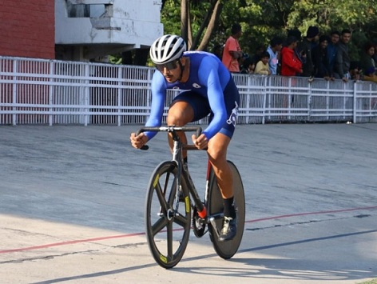
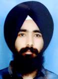
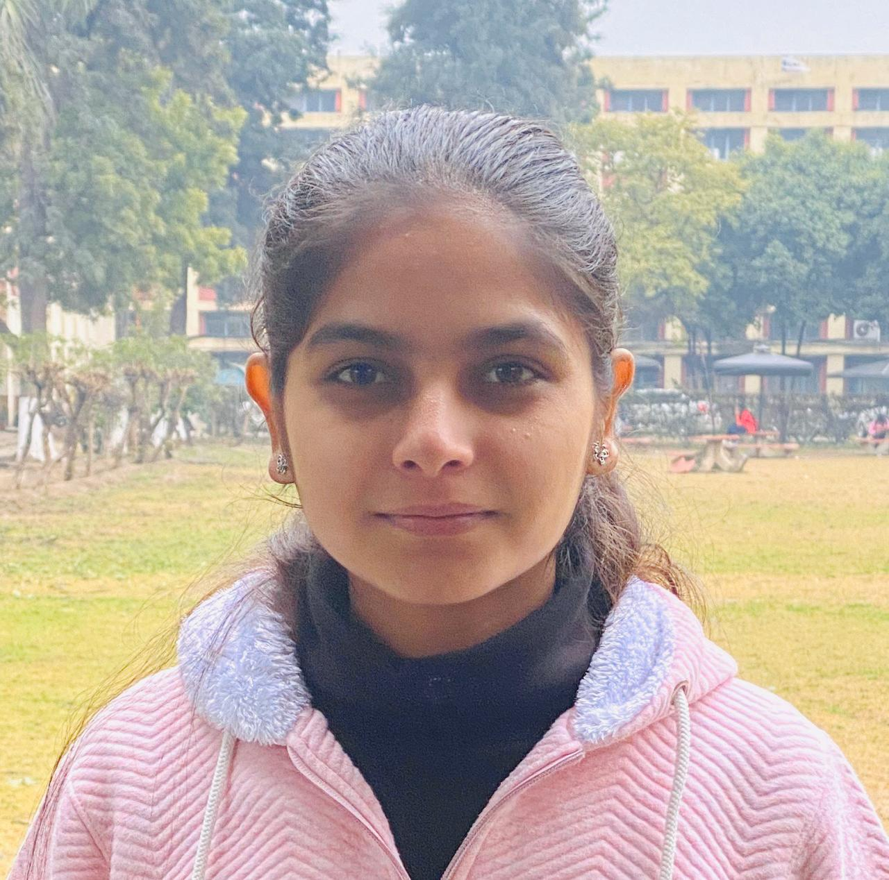

# Extramural Activities
## National Achievers  

  

**Harhveer Singh Sekhon of MBA-2005187 (Silver Medalist in 30Km Point Race in All India Inter-varsity Track Cycling Championship Held at Punjabi University, Patiala from 5th-9th December 2021**    

 

**Jaaspinder Singh of B.Tech 3rd year(2004774) became GOLD Medalist in Long Jump in Khalsa Sports Festival Held at Mata Gujri College,Fatehgarh Sahib  from 17th-18th November 2021**  

  

**IKGPTU Inter-varsity Participation**

| Sr. No. | Name | Roll No. | Branch | Game | Venue | Dates | Photograph |
| - | -- | - | - |-| - | - | - |
| 1. | Jaismeen Kaur | 1917587 | B.Arch. |Cycling |Punjabi University,Patiala |5th-9th December 2021 |  |
| 2. | Ayush Jindal|2005172 | M.Tech(Str.Engg.) |Table tennis |Chitkara University,Baddi |30th December2021 to 2nd Januray2022 |  |
| 3. | Divyanshu | 1905095 | B.Tech.3rdyrEE |Football |Punjabi University,Patiala |23rd-30th December 2021 |  |
| 4. | Tamanpreet Singh|2104577| B.Tech1st yr(IT) |Table tennis |Chitkara University,Baddi |30th December2021 to 2nd Januray2022 |  |
| 5. | Rishav Sharma|2004466| B.Tech2nd yr(CE) |Basketball |JMI,New Delhi|15th to 20th December2021  |  |
