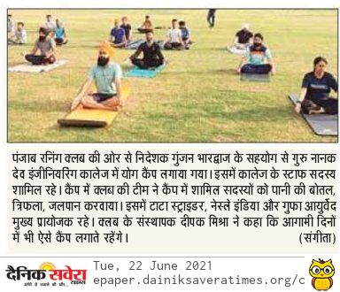

# Department of Physical Education & Sports

## Message from HoD's Desk

The Sports department works on promotion of personal and professional development of students through designing and implementing programs that support healthy lifestyles and inculcate moral,ethical and spiritual values among them through intra-mural and extra-mural activities.Thus,all students must actively take part in sports activities offered by the college within the campus.

**"Stay Active Stay Fit"**

## Sport's Committee

## Sport's Department at Glimpse

- [Infrastructure](Infra.md)
- [Intra-murals](Intra.md)
- [Extra-murals](Extra.md)

## News

## Events Organized   

| Sr. No. | Name of Event                                             | Faculty Coordinator           | Duration | Date(s)               | Sponsor(s) |
|:--------|:---------------------------------------------------------------|:------------------------------|:---------|:----------------------|:-----------|
| 1.       | GNE Female Staff Cricket Tournament| Dr Gunjan Bhardwaj & S.Suminder Singh | 1day | 30th March, 2021  | Sports Fund |
| 2.       | GNE Teaching Male Staff Cricket Tournament | Dr Gunjan Bhardwaj & S.Suminder Singh |1 day  | 31th March, 2021  | Sports fund |
|3.         | GNE Teaching Male Staff Cricket Tournament|  S.Suminder Singh | One Day |1st April, 2021  |Sports Fund |
|4.        | 15Km Cycling From GNE to KAIND PUll and back | Dr Gunjan Bhardwaj & S.Suminder Singh | One Day |7th April, 2021  | Sports Fund|
|4.        | International Yoga Day | Dr Gunjan Bhardwaj & S.Suminder Singh | One Day |21th June, 2021  | Punjab Runners |
|5.         |GNE Inter-year Football League Tournament  | Dr Gunjan Bhardwaj & S.Suminder Singh | Three Day |28th to 30th September, 2021  |Sports Fund|
|6.         |GNE Inter-year Basketball League Tournament | Dr Gunjan Bhardwaj & S.Suminder Singh | Three Day |4th to 6th October, 2021  | Sports Fund |
|7.         |GNE Inter-year Badminton League | Dr Gunjan Bhardwaj | Two Day |10th to 11th November, 2021  |Sports fund |
|8.         |GNE Faculty V/S TIET, Patiala Cricket Match | Dr Gunjan Bhardwaj & S.Suminder Singh | One Day |14th November, 2021  |Sports fund |
|9.         |"GPL"GNE PREMIER CRICKET LEAGUE| Dr Gunjan Bhardwaj & S.Suminder Singh | Three Day |19th to 21th November, 2021  |Sports fund |
|10.         |GNE Inter-year Football Knockout Tournament | Dr Gunjan Bhardwaj & S.Suminder Singh | Three Day |23rd to 25th November, 2021  |Sports fund |
|11.         |GNE Inter-year Volleyball League |  S.Suminder Singh | Three Day |30th to 2th December, 2021  |Sports fund |
|12.         |GNE Inter-year Basketball League Tournament | Dr Gunjan Bhardwaj | Two Day |1st to 2nd December, 2021  |Sports fund |

## Infrastructure Upgradation

-  New Boys Gymnasium on ground floor of Sports Complex  

- Purchase of 1.5 Ton Tandem Cricket Pitch Roller
