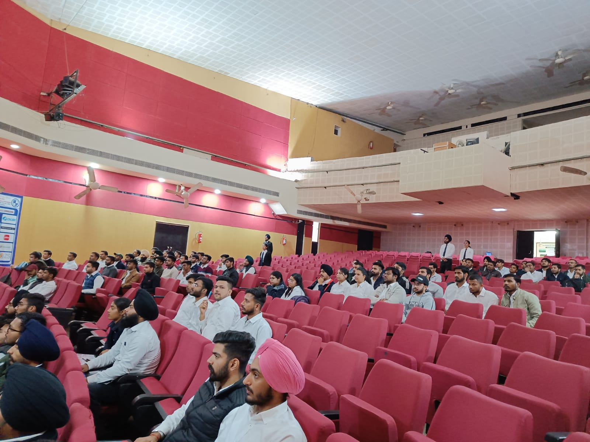

## Events held in collaboration with AXIS BANK

 

## ARISE 2.0

---

An interactive guiding session was conducted by the Training and Placement Cell with the officials of Axis bank regarding the ARISE 2.0 program on the 11th of March 2023. Miss Mandeep Kaur and Mr. Jaideep Singh mentored the students on the step by step procedure of clearing the tests. The session was initiated by Miss Mandeep covering up the perks and benefits of working as an employee in Axis bank along with the pathway to achieve those perks. In addition to this Mr. Jaideep continued the session and explained the various departments and roles the students can get into after the ARISE 2.0 program. The conclusion of the event was hit by some nostalgic moments of both the mentors and they cherished their days of college and their enrollment in the emergent program. A note of thanks from the college’s side was expressed for their presence and guidance to end the online session on a grateful note.

\

