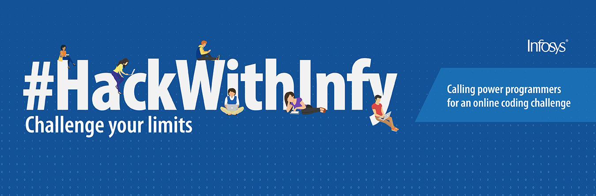
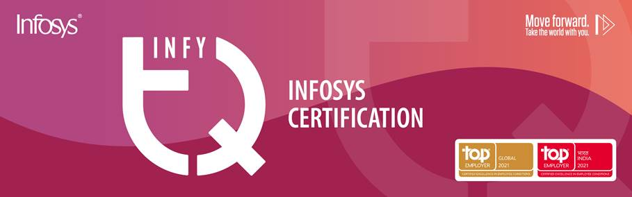
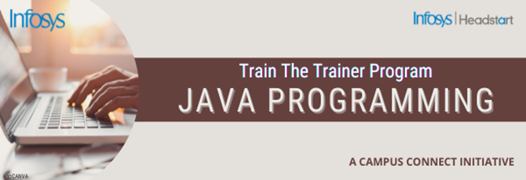

# Events held in collaboration with Infosys

 

## HackWithInfy
---

HackWithInfy is India-wide coding competition for final year engineering students. ... Top performers in the competition not only win exciting prizes, but also earn a chance to work with Infosys in niche technical roles.

 

## InfyTQ (for 2022 and 2023 passout batch)
---

InfyTQ is a free platform open to all engineering students in their third and fourth year across India. The platform encourages holistic development by imparting technical as well as professional skills and help them become industry ready.

 

## Wintership
---

Winternship is Infosys holistic training and internship program designed to facilitate learning among our selected candidates. The organization is giving students 13 - 15 weeks of training in online mode with included stipend of INR 10,000 per month.

 

## Train the Trainer Programme “Creating Microsites on Infosys Springboard ”
---

A microsite is a one-stop destination that educational institutions can use to their benefit to host internal content with access exclusively for their faculty and students.The objective of the workshop is to guide you on creating and publishing a microsite for your educational institution.

\

 