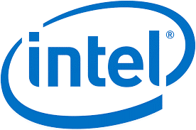

## Events held in collaboration with TCS
---
 

Intel® Student Campus Ambassador, created to work collaboratively with students at innovative schools and universities doing great work in the Deep Learning and Artificial Intelligence space. As part of this program we also announced the Intel® Student Ambassador Program for AI, an exciting new program for university students to engage with Intel around their work in Machine Learning, Deep Learning and Artificial Intelligence.

\

