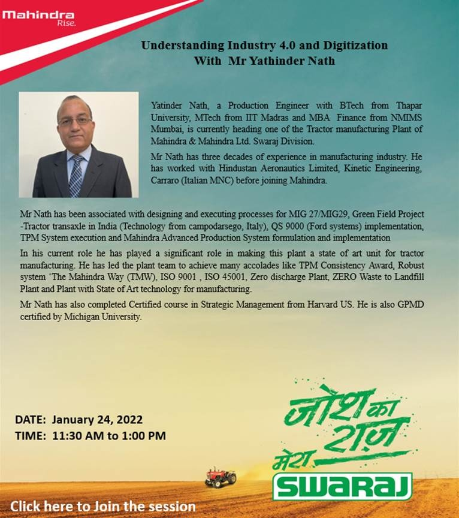

## Mera Swaraj Education Program

### About the program -

This education program is being introduced to enrich the bond that the company has created over the years by providing the right platform to the bright talent from our esteemed institution. This program offers financial support to the selected students along with industrial exposure to co-creating Farm Tech prosperity and making them better equipped for meeting future challenges. This will also help them to chase career aspirations while taking care of their holistic development. Through this initiative, the company supports meritorious and deserving students, enrolled in the second year of B. Tech. program.

### Program Offerings -

1. Support for Tuition Fees- Rs.15000 per Year ( Approx)
2. Books - Technical and Leadership – Rs.5000 per Year (Approx)
3. Study Tour Assistance- Rs.15000 (if it is part of the curriculum)
4. Internship and Live Projects in Swaraj.
5. Assignment of Mentors.
   Total scholarship up to Rs.95000/- per student will be offered to the qualified students in addition to internship/ live projects, mentorship over the duration of their course.

## Understanding Industry 4.0 And Digitization

---

An interactive guiding session was held by Mr. Yatinder Nath, a production engineer with BTech from Thapar University, Mtech from IIT Madras and MBA Finance from NMIMS Mumbai, is currently heading one of the tractor Manufacturing Plant of Mahindra & Mahindra Ltd. Swaraj Division.

The session covered topics such as what is the Digital Revolution, how it can impact manufacturing companies, what are the implications for business leaders, etc. He expressed that the digital transformation offered by Industry 4.0 has allowed manufacturers to create digital twins that are virtual replicas of processes, production lines, factories and supply chains.A digital twin is created by pulling data from IoT sensors, devices, PLCs and other objects connected to the internet. The program aims to provide insights into the “Digital Revolution”, it is currently underway, which will impact most manufacturing companies. Next generation digital technologies around Smart/Connected Products, Cloud, Mobility, IoT, Big Data and Analytics have started impacting conventional business models and this trend is likely to accelerate in the coming years. It aims to facilitate understanding of related concepts to help participants work on a roadmap to become the digital enterprise of tomorrow.

\

