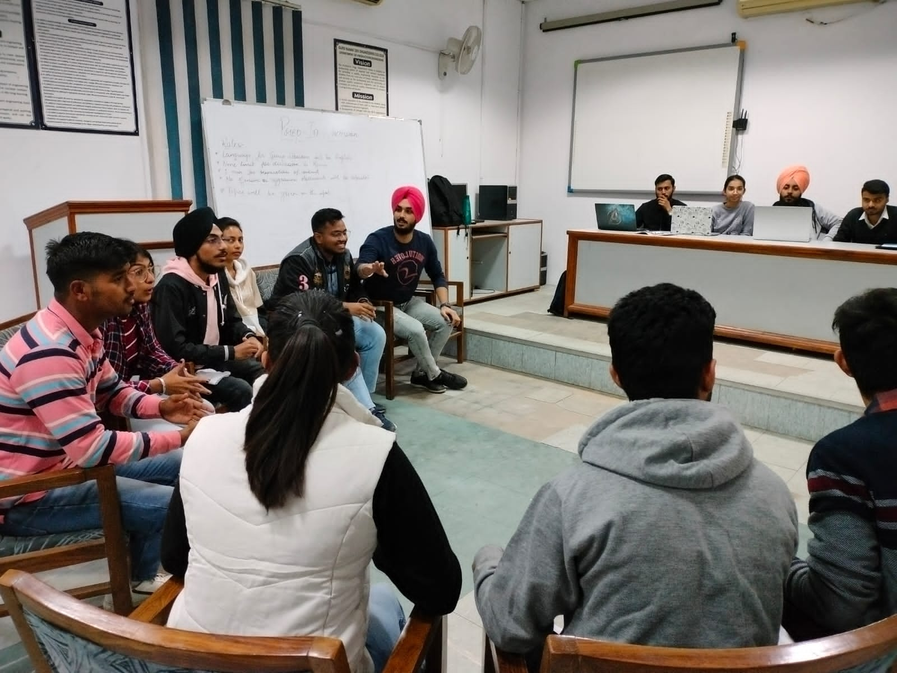
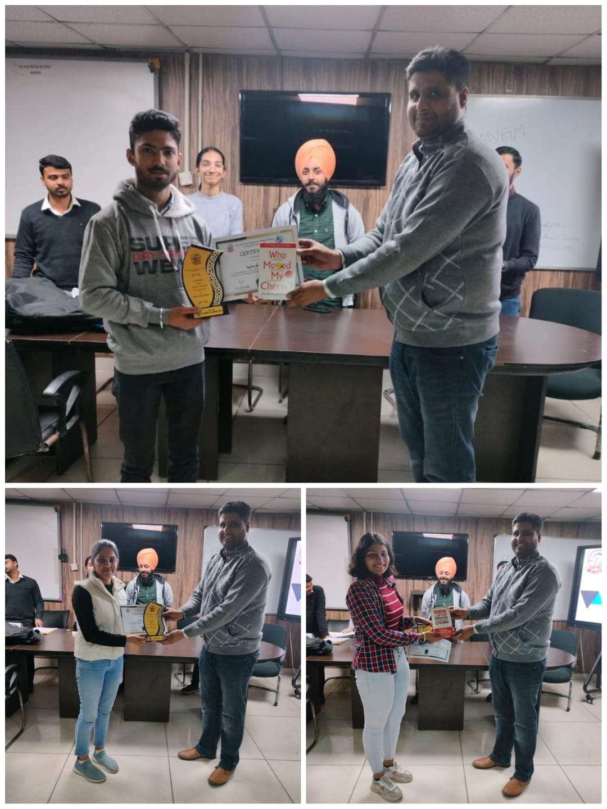
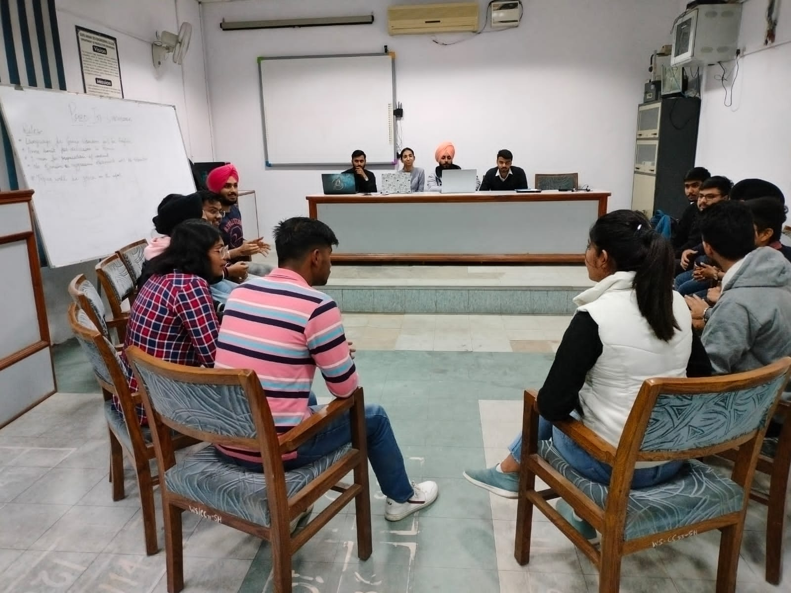

## Events held by the Training and Placement Cell

 

## Prep-in Discussion

---

Prep-in Discussion, a group discussion event was conducted by the training and placement cell with the aim of enhancing the conversation skills of the students, to help them to eradicate their stage fear and to prepare them for placement interviews. The event took place on 30th November 2022. Event was conducted in two rounds. Round being the Group Discussion round and the second round being a debate. There was a handful amount of participation of students in both the rounds and the event turned out to be a huge success with the three winners being awarded for their good speaking and debating skills. Training and Placement cell looks forward to conduct more of such events to boost the morale of the students.

 
