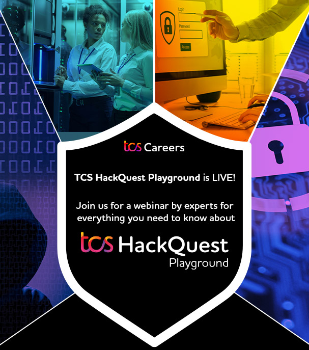
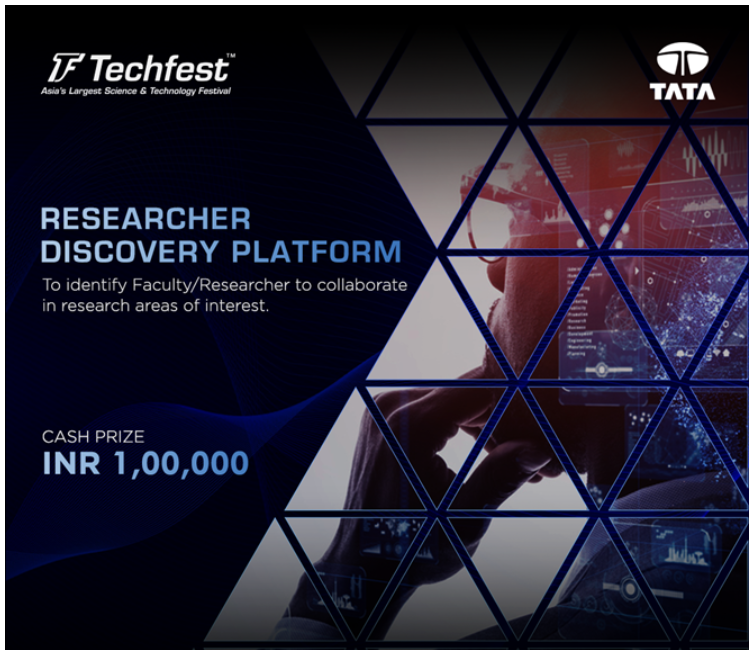
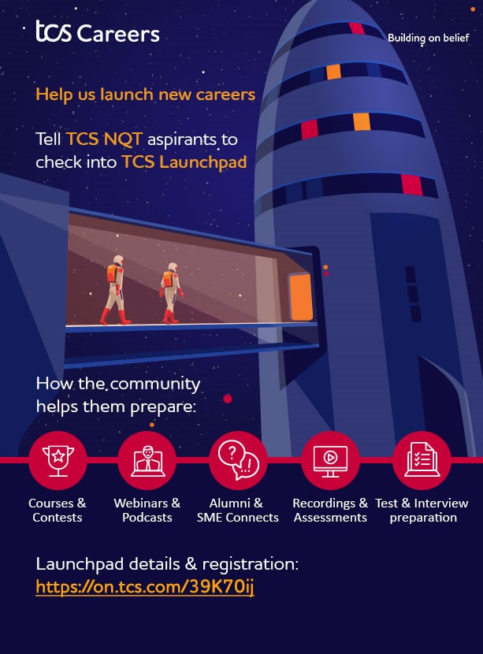
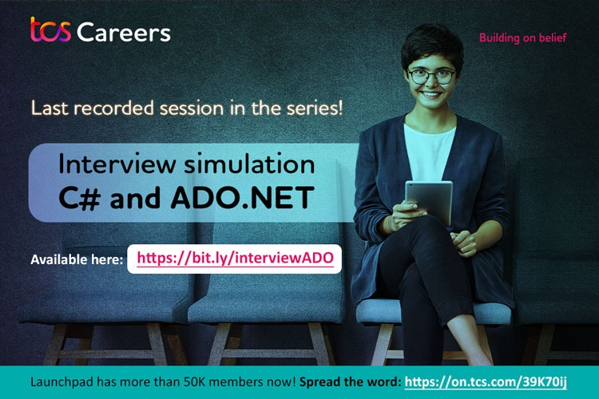
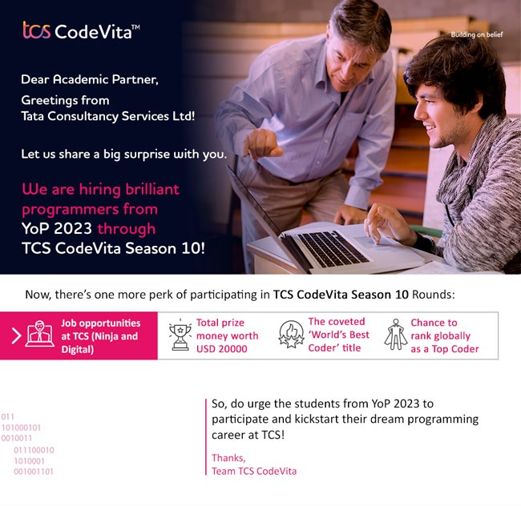

## TCS HackQuest

---

TCS HackQuest season 6 organized by TCS, the competition presents a series of challenges to be completed in 6 hours. Each challenge assesses participant skills in ethical hacking and their particular skill in finding vulnerabilities. TCS Cyber ​​Security Practice is seeking students and enthusiasts who are passionate about ethical hacking and, in general, securing the digital future of organizations engaged in the transaction of millions of data points around the world.

\

 

## Techfest

---

Techfest, Researcher Discovery Platform competition to help accelerate the culture of academic-industry collaborations. 

\

 

## TCS SKILL-DEVELOPMENT FOR TCS NATIONAL QUALIFIER TEST (NQT)

---

Launchpad is their exclusive shared skill-development space that features a comprehensive collection of resources to help campus students prepare for their professional debut. It is a community of thousands of talented youngsters aspiring to begin their career at TCS. Students get the opportunity to work on not just various technologies but also their communication skills and they get to connect with experts. TCS has invested a lot of their sincere effort in conceptualizing Launchpad just to ensure that the students find themselves ready when it is time for them to make the big move from Campus to Corporate, via a promising career at TCS! To be more specific, Launchpad prepares young aspirants to do well when they take the TCS National Qualifier Test (NQT) which is the single most crucial step towards scoring a TCS career. TCS has, in fact, already started accepting TCS NQT registrations and will continue doing so till 29th July 2022. 

\

 

## TCS CodeVita

---

TCS CodeVita, is a contest for engineering and science students to experience the joy of coding and to sharpen their programming skills through real-life computing practices. The contest also aims at identifying the talent, besides providing the student community, an opportunity to earn peer recognition.

It is an annual Hackathon conducted by TCS Cognitive Business Operations (CBO) who is a global leader in providing Datacenter, Cloud, and Digital Workplace Transformation Solutions. Through this contest, the participants will experience some of these cutting-edge technologies and will be mentored by the key SME Team who would be guiding the participants through each stage of the contest.

\

