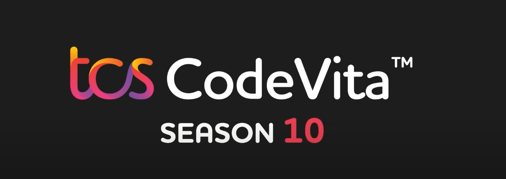

## TCS HackQuest
---

TCS HackQuest season 6 organized by TCS, the competition presents a series of challenges to be completed in 6 hours. Each challenge assesses participant skills in ethical hacking and their particular skill in finding vulnerabilities. TCS Cyber ​​Security Practice is seeking students and enthusiasts who are passionate about ethical hacking and, in general, securing the digital future of organizations engaged in the transaction of millions of data points around the world.

\

 

## Techfest
---

Techfest, Researcher Discovery Platform competition to help accelerate the culture of academic-industry collaborations. 

\

 

## TCS Ninja Hiring
---

TCS offers recruitment oppurtunities to the college passouts as a part of Ninja profile. 

\

 

## TCS EngiNX
---

EngiNx is an Engineering Innovation Contest conducted by TCS - Engineering & Industrial Services Unit every year. It is primarily an IOT based competition which requires the contestants to develop products by consolidating their core engineering knowledge and IOT concepts.

\

 

## TCS CodeVita 
---

TCS CodeVita, is a contest for engineering and science students to experience the joy of coding and to sharpen their programming skills through real-life computing practices. The contest also aims at identifying the talent, besides providing the student community, an opportunity to earn peer recognition.

It is an annual Hackathon conducted by TCS Cognitive Business Operations (CBO) who is a global leader in providing Datacenter, Cloud, and Digital Workplace Transformation Solutions. Through this contest, the participants will experience some of these cutting-edge technologies and will be mentored by the key SME Team who would be guiding the participants through each stage of the contest.

\
