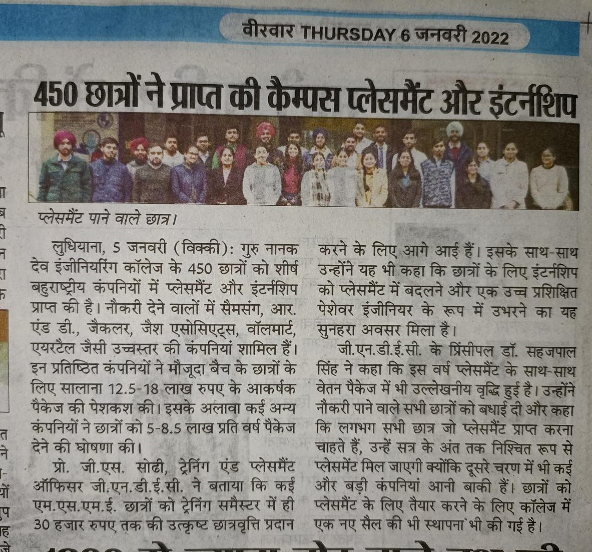
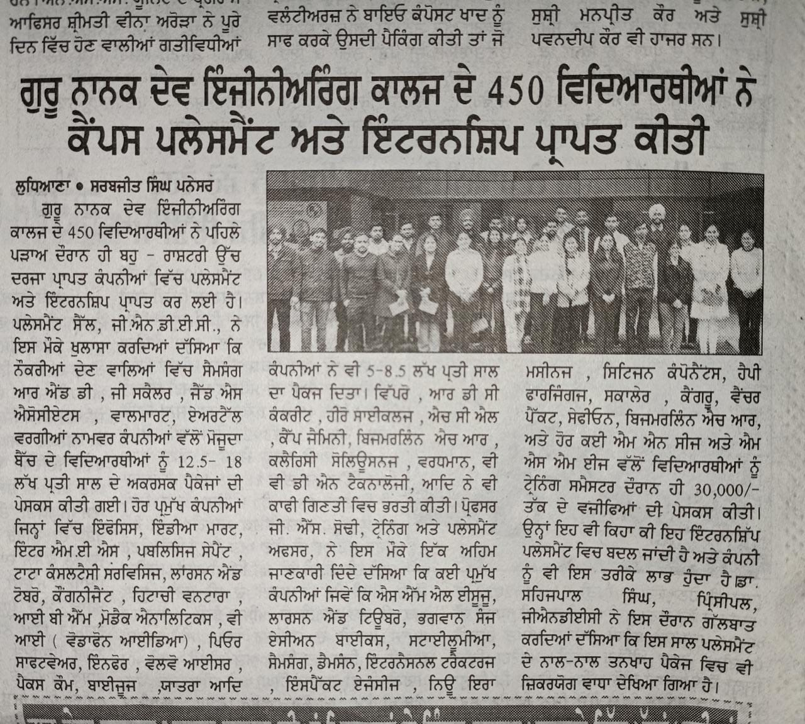

# Placement Highlights 2022
 

Nearly 450 students of current batch of Guru Nanak Dev Engineering college (GNDEC) are hired by multinational companies for placement and internships in phase-1 of Campus Recruitments. The Training and Placement Cell disclosed that recruiters including Samsung R&D, Zscaler, ZS Associates, Walmart Inc., Airtel offered a huge package of 12.5-18.0 LPA to the engineering graduates of the final year.

Other major recruiters like Infosys, IndiaMART InterMESH Ltd., Publicis Sapient, Tata Consultancy Services (TCS), Larsen & Toubro(L&T), Cognizant, Hitachi Vantara, IBM, Modak Analytics, VI(Vodafone Idea), Pure Software, Infor, Volvo-Eicher (VE) Commercial Vehicles Ltd, Paxcom, Byjus, Yatra Freight, Brillio, Jindal South West Limited (JSW) and Acxiom Consulting offered a package of 5.0-8.5 LPA.

Recruiters like Wipro, XenonStack, RDC Concrete, Hero Cycles, HCL, Capgemini, Bizmerlin HR, Clerisy Solutions, Vardhaman, VVDN Technologies and many others provided good jobs offers. Prof. G.S. Sodhi, Training and Placement officer shared about one promising trend for the engineering students that various MNCs, MSMEs & leading industries like SML ISUZU, Larsen & Toubro, Bhagwansons Centerless Grinders, Asian Bikes, Stylumia, Damsun, International Tractors Ltd(Sonalika), Impact Agencies, New Era Machines, Citizen Components, Happy Forgings, Zscaler, Kangaro KGOC, Venture Pact, SafeAeon Inc., Bizmerlin HR and many more have come forward to offer internships to students with handsome stipends up to 30000/- . “All the internships are virtually converted to the placement in the same company. The companies have one full semester time to convert these interns into trained professionals”. He added

Principal Dr. Sehijpal Singh disclosed that this year a noticeable rise has been observed in number of placements as well as in the salary packages. While congratulating the placed students he said that almost all students who wish to get placement will definitely get it by the session end as more recruiting companies are yet to come in the second phase. 

\

\

\

\

\

\

\

