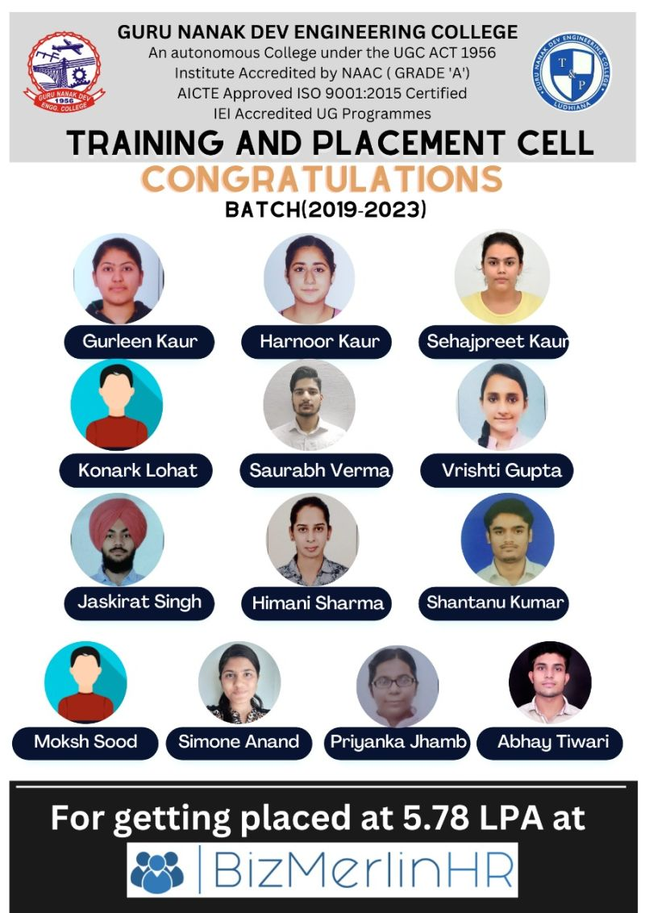

# Placement Highlights 2023

 

The Training and Placement Cell of Guru Nanak Dev Engineering College has unveiled that nearly 300+ students of this batch have been hired by multinational companies for placements and internships in the first phase. The students have grabbed the opportunities to get placed in some big bulls like Cognizant, Amazon, Samsung, Inofsys, TCS, Larson & Toubro at a good and decent package ranging from 6.0 LPA to 8.0 LPA.

Other major recruiters like Stylumia, Grappus, Propgrad, Alert Enterprises, Bizmerlin HR, Venture Pact, Safeaeon, Nucleus Software, Incture Technologies, Brilio, Chicmic and many others have put forward good satisfactory job offers.

Many big core recruiting companies like Shapoorji Pallonji, RDC concrete, Denso Haryana, Kangaro Group, Vardhman Special Steels, Tata International were also pleased by the students’ knowledge and skills with respect to their courses.  
This year’s batch has also managed to bag placement in many renowned companies like ICICI Bank, India Mart InterMESH, Vardhman, TCS via MBA. Prof. G.S. Sodhi, Training and Placement Officer congratulated the placed students and shared about one promising trend for the engineering students that the various MNC’s, MSME’s & leading industries have come forward to offer internships with handsome amount of stipend. “All the internships are virtually converted to the placement in the same company”. He added.

Principal, Dr. Sehijpal Singh assured placements to other students who wish to get placed as more recruiting companies are yet to come in the second phase as well.

\

\

\

\

\

\

\

\

\

\

\

\

\

\

\

\

