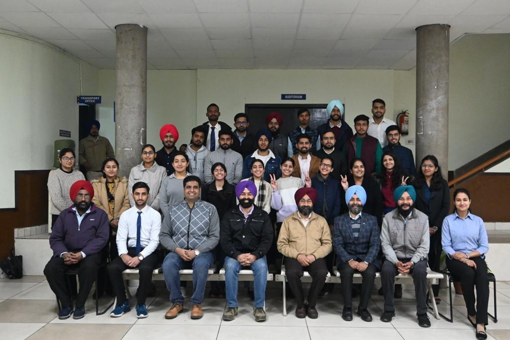
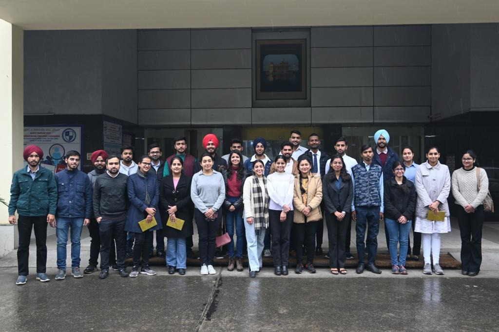
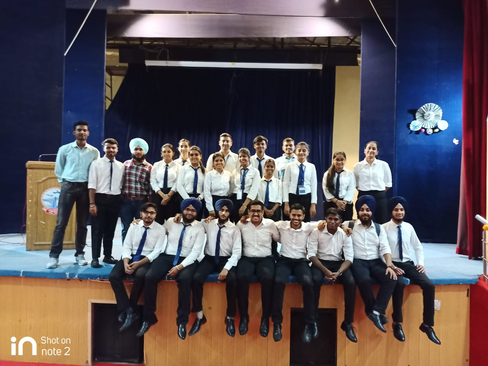
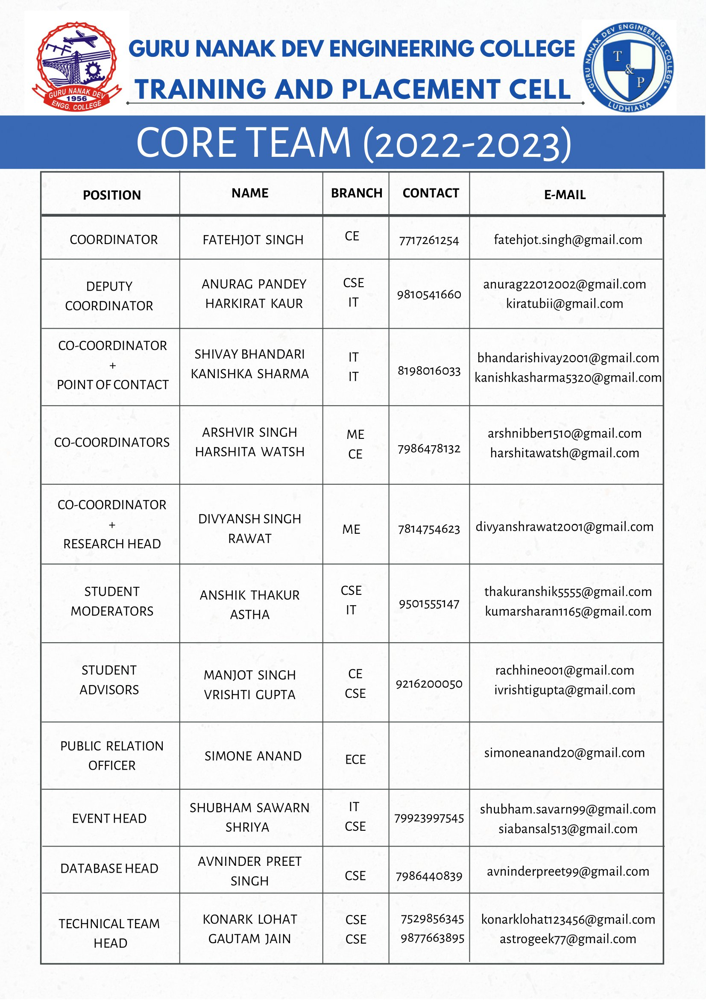

# Training And Placement Cell

The Training and Placement cell aims to provide students with an environment where they can use their potential to extreme along with gaining valuable experience of working in the industry, it is a network of communication between various companies seeking talented young graduates and post graduates in various disciplines. The cell is complete in terms of infrastructure having Testing halls, Consultancy Hall, Conference room for Pre Placement Talk, Presentations etc.  The cell also has video conference facility available for the students.

### Training

The cell contrives to provide training in industries for 6 weeks at the end of 4th semester and for 6 months in 7th or 8th semester. Every Engineering Department student goes through a minimum of 12 weeks of industrial training and minimum 6 weeks of software training within the 6 months training. Many students of the cell got the chance of getting trained from reputed companies like TCS, Mahindra & Mahindra, Delhi Metro Rail Corporation, Maruti Udyog Ltd, Havells, DRDO, CISCO, Ericsson, Siemens, Reliance Group, HCL, Samsung, LG, EICHE, Volkswagen etc.

### Placements

Many National and Multinational companies visit the college for recruitments. The Cell is a link that provides students with all the information they require at the fastest rate possible. A common placement brochure gets published annually covering all aspects. The Training & Placement Cell works day and night in order to develop 'Industry-Institute Interaction'. Along with Developing relations with the industries, the cell organizes technical talks and national seminars to provide a platform for budding engineers to interact with professionals from various industries, it encourages college students to visit the industries. 

---

## Message from TPO's Desk

I gladly bring a warm welcome to you on the behalf of Training & Placement Cell of Guru Nanak Dev Engineering College, Ludhiana.

Globally accepted as a source of academically and professionally excellent students, Guru Nanak Dev Engineering College, Ludhiana, is known for its professional approach, cultural activities and academic rigour. Our college showcases its rich heritage and knowledge through the hands of its highly-rated faculty all over Punjab and provides students with an opportunity to carve a new path in their life. It is a moment of great pride to state that Guru Nanak Dev Engineering College is being awarded as the “Best College for Placements” under PTU every year since 2013. Further achievement being, the accreditation of Autonomous College by UGC in the year 2012.

The Training and Placement Cell, GNDEC along with giving an outstanding placement record, also serves as a platform for students to gain a market exposure and groom their personalities as well. The prime focus is not to just create engineers rather leaders which may lay the foundation for the future development of our nation. The Training & Placement Cell is an interface that looks after the students and the recruiting organizations, taking care of the interests of both.
Students of the previous batches have further assured the solid foundation of our institution by taking placements in companies with top global reputation. The bonds developed with the industries ultimately lead to a great future ahead, providing an environment for research and education. Thus,  I invite the recruiting organizations and graduating students to find the best match between their needs and capabilities and look forward to have your active participation.

 

---

## Major Recruiters

\

 

---

## Training And Placement team

\

Guru Nanak Dev Engineering College also has an active training and placement cell in order to assist our students in identifying their ambitions and life goals in the trending competitive placement market. T&P provides the infrastructural facilities to conduct group discussions, tests and interviews besides catering to other logistics.

The Training & Placement Cell was applauded for its efforts and achievements by a national daily.

We have a training placement team which includes Student Coordinators, Deputy Coordinators, Co-coordinators, Student moderators, Student Advisor, Database head Administrator, Public relation officer, Media Head, Executive Team, Who perform their duties well and efficiently.

---

## Placement Insights

| Company Name                                     | Package(LPA) |
| ------------------------------------------------ | ------------ |
| Microsoft                                        | 51           |
| Samsung                                          | 14.5         |
| Microsoft                                        | 14           |
| Hashedin                                         | 8.1          |
| Honda Motorcycle & Scooter India Private Limited | 8            |
| India Mart                                       | 8            |
| TCS(Digital)                                     | 7            |
| SML ISUZU LTD.                                   | 6.6          |
| CDK Global India Private Limited                 | 6.5          |
| Infor                                            | 6.5          |
| Sapient                                          | 6.5          |
| Wipro Turbo                                      | 6.5          |
| Paxcom                                           | 6            |
| Surya Software                                   | 6            |
| Modak Analystics LLP                             | 6            |
| CONTENT & MEDIA(Byjus)                           | 6            |
| eNest Technologies Private Limited               | 6            |
| Larsen & Toubro Limited                          | 6            |
| Pure Software                                    | 6            |
| Jaro                                             | 6            |
| Argusoft                                         | 5.62         |
| JSW                                              | 5.5          |
| Saint-Gobain                                     | 5.16         |
| Accolite Digital India Private Limited           | 5            |
| Oriental Outsourcing                             | 5            |
| HCL                                              | 4.75         |
| Venture Pact                                     | 4.62         |
| ChicMic                                          | 4.5          |
| Clerisy Solutions Pvt Ltd.                       | 4.5          |
| Brillio                                          | 4.5          |
| Xenonstack                                       | 4.5          |
| HCL Technologies                                 | 4.25         |
| Denso Haryana Pvt. Ltd.                          | 4.24         |
| ICS                                              | 4.2          |
| Academic Specialist (Byjus)                      | 4            |
| KPIT                                             | 4            |
| Capgemini                                        | 4            |
| Cloud Analogy Softech Pvt. Ltd.                  | 4            |
| Cognizant                                        | 4            |
| Frontrow                                         | 4            |
| Anmol India Ltd                                  | 4            |
| MWIDM India Private Limited                      | 4            |
| Schneider Electric                               | 3.75         |
| Orion eSolutions Pvt. Ltd.                       | 3.75         |
| Tata International Limited                       | 3.7          |
| SafeAeon Inc.                                    | 3.6          |
| Infosys Limited                                  | 3.6          |
| TCS                                              | 3.53         |
| ACC Limited                                      | 3.5          |
| Bebo Technologies                                | 3.5          |
| Tata Elxsi                                       | 3.5          |
| UpGrad                                           | 3.5          |
| Wipro                                            | 3.5          |
| Arora Iron & Steel Rolling Mills Pvt. Ltd.       | 3.36         |
| BYJU's                                           | 3.36         |
| TCS (Ninja)                                      | 3.36         |
| BizMerlin HR.                                    | 3.3          |
| Vardhman                                         | 3.3          |
| Indo MIM                                         | 3.12         |
| Kangaroo IndistriesLtd.                          | 3.1          |
| Auxiliobits Technologies Pvt Ltd.                | 3            |
| CrossML Pvt.Ltd.                                 | 3            |
| Brisk Logic Pvt. Ltd.                            | 3            |
| Manikaran Power Limited                          | 3            |
| Binary Semantics                                 | 3            |
| Frick India Limited                              | 3            |
| Mahindra & Mahindra Ltd.                         | 3            |
| RDC Concrete (India) Pvt. Ltd.                   | 2.76         |
| GNA Auto Enterprises Ltd.                        | 2.64         |
| Step2gen                                         | 2.6          |
| JayaswalNeco Industries Ltd                      | 2.4          |
| Things Go Social                                 | 2.4          |
| ITL-Sonalika                                     | 2.14         |
| Damsun Group                                     | 2.1          |
| Impact Bajaj                                     | 1.92         |
| Eco Laboratories &Consultants Pvt. Ltd.          | 1.8          |
| Saguna Consulting Services                       | 1.68         |

## Internship Insights

| Companies providing Internship             | Stipend Per month |
| ------------------------------------------ | ----------------- |
| Samsung                                    | 30000             |
| Zscaler                                    | 30000             |
| Stylumia Intelligence Technology Pvt. Ltd. | 25000             |
| Argusoft                                   | 21000             |
| Accolite Digital India Private Limited     | 20000             |
| Pure Software Pvt. Ltd.                    | 20000             |
| Venture Pact, LLC                          | 20000             |
| Xenonstack                                 | 20000             |
| Alert Enterprise                           | 20000             |
| Clerisy Solutions Pvt Ltd.                 | 15000             |
| BizMerlin Hr.                              | 15000             |
| Orion eSolutions Pvt. Ltd.                 | 15000             |
| Cloud Analogy Softech Pvt. Ltd.            | 15000             |
| SafeAeon Inc.                              | 15000             |
| Step2gen                                   | 15000             |
| Oceana Tech..                              | 12000             |
| Damsun Group                               | 10000             |
| ChicMic                                    | 10000             |
| Dr. D Project & Resource Management        | 10000             |
| Seasia Infotech                            | 10000             |
| TCIL-IT                                    | 10000             |
| Kangaro Tools                              | 7500              |

---

## [Placement Highlights 2023](Placement_highlights_2023.md)

---

## [Glimpses](Glimpses.md)

---

## Events

- [Events held in collaboration with TCS](Events_TCS.md)

- [Events held in collaboration with Mahindra & Mahindra](Events_MM.md)

- [Events held in collaboration with Axis Bank](Events_Axis_Bank.md)

- [Events held by the Training and Placement Cell](Events_T&P.md)

- [Recent Placement Activities](https://www.tnpgndec.com)
